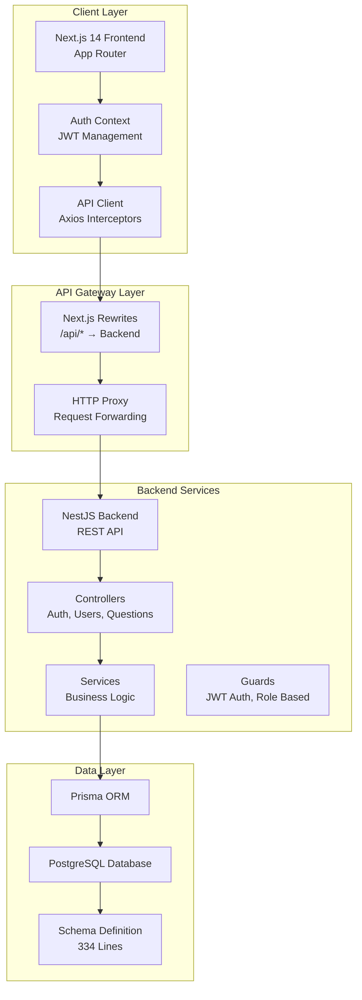
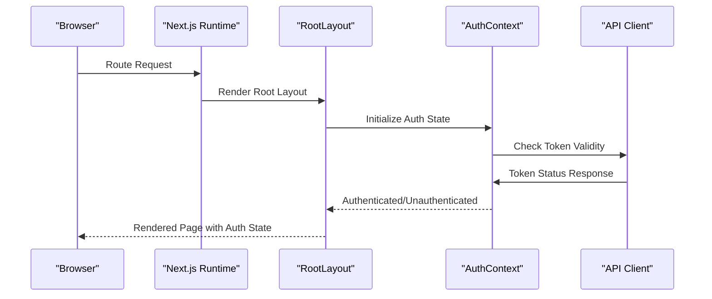
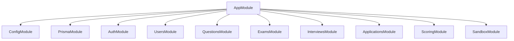
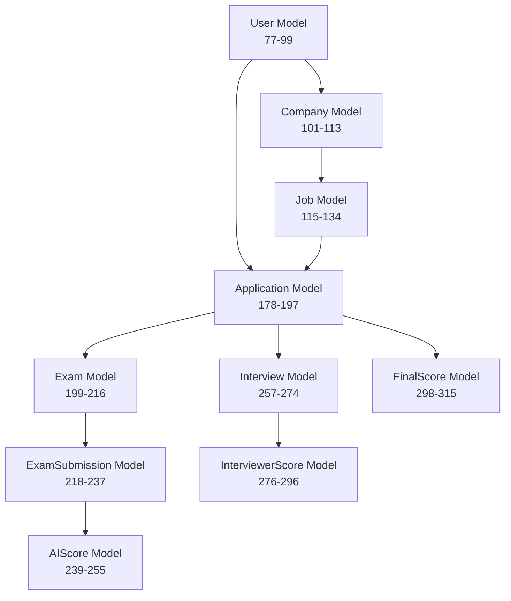
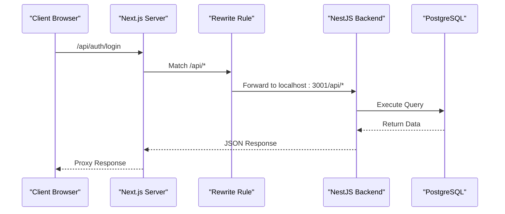
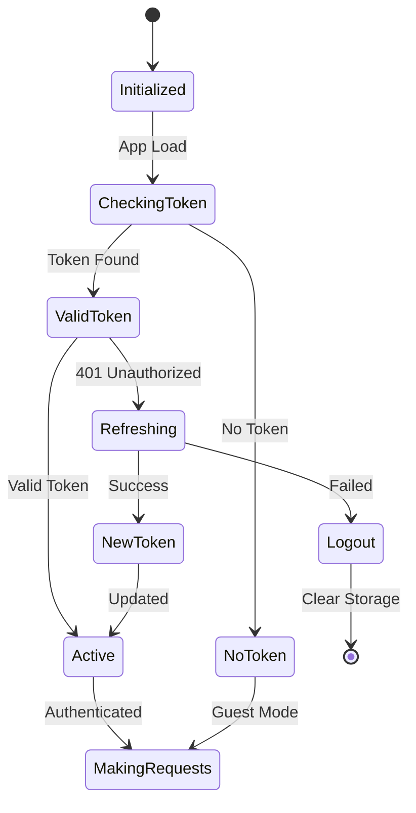
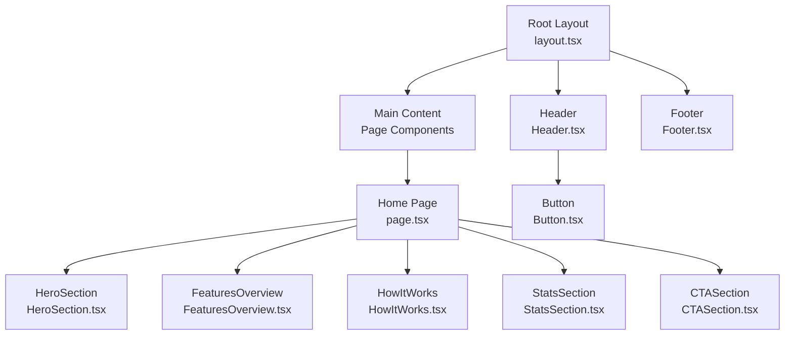
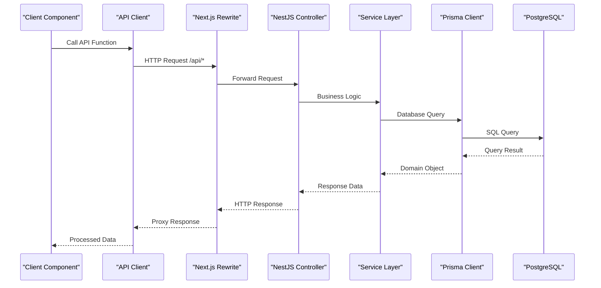
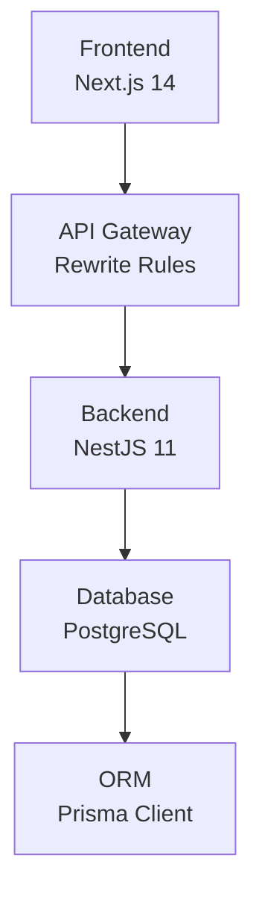

# Architecture Overview

<cite>
**Referenced Files in This Document**
- [layout.tsx](file://smartview-portal/src/app/layout.tsx)
- [page.tsx](file://smartview-portal/src/app/page.tsx)
- [api.ts](file://smartview-portal/src/lib/api.ts)
- [AuthContext.tsx](file://smartview-portal/src/contexts/AuthContext.tsx)
- [login/page.tsx](file://smartview-portal/src/app/login/page.tsx)
- [package.json](file://smartview-portal/package.json)
- [next.config.mjs](file://smartview-portal/next.config.mjs)
- [tailwind.config.ts](file://smartview-portal/tailwind.config.ts)
- [Header.tsx](file://smartview-portal/src/components/layout/Header.tsx)
- [Footer.tsx](file://smartview-portal/src/components/layout/Footer.tsx)
- [Button.tsx](file://smartview-portal/src/components/ui/Button.tsx)
- [constants.ts](file://smartview-portal/src/lib/constants.ts)
- [utils.ts](file://smartview-portal/src/lib/utils.ts)
- [HeroSection.tsx](file://smartview-portal/src/components/home/HeroSection.tsx)
- [FeaturesOverview.tsx](file://smartview-portal/src/components/home/FeaturesOverview.tsx)
- [about/page.tsx](file://smartview-portal/src/app/about/page.tsx)
- [features/page.tsx](file://smartview-portal/src/app/features/page.tsx)
- [pricing/page.tsx](file://smartview-portal/src/app/pricing/page.tsx)
- [main.ts](file://smartview-server/src/main.ts)
- [app.module.ts](file://smartview-server/src/app.module.ts)
- [auth.controller.ts](file://smartview-server/src/auth/auth.controller.ts)
- [response.interceptor.ts](file://smartview-server/src/common/interceptors/response.interceptor.ts)
- [http-exception.filter.ts](file://smartview-server/src/common/filters/http-exception.filter.ts)
- [schema.prisma](file://smartview-server/prisma/schema.prisma)
</cite>

## Update Summary
**Changes Made**
- Added comprehensive microservices architecture documentation covering Next.js 14 frontend and NestJS backend
- Documented API gateway pattern using Next.js rewrites for proxying requests
- Added authentication flow with JWT tokens and token refresh mechanisms
- Documented database schema with Prisma ORM and PostgreSQL
- Added system boundaries and data flow patterns between frontend and backend services
- Updated architectural diagrams to show microservices communication

## Table of Contents
1. [Introduction](#introduction)
2. [Microservices Architecture Overview](#microservices-architecture-overview)
3. [Frontend Layer - Next.js 14 App Router](#frontend-layer---nextjs-14-app-router)
4. [Backend Layer - NestJS REST API](#backend-layer---nestjs-rest-api)
5. [Database Layer - Prisma PostgreSQL](#database-layer---prisma-postgresql)
6. [API Gateway and Communication Patterns](#api-gateway-and-communication-patterns)
7. [Authentication and Authorization Flow](#authentication-and-authorization-flow)
8. [Component Architecture](#component-architecture)
9. [Data Flow Patterns](#data-flow-patterns)
10. [System Boundaries and Integration Points](#system-boundaries-and-integration-points)
11. [Performance and Scalability Considerations](#performance-and-scalability-considerations)
12. [Troubleshooting Guide](#troubleshooting-guide)
13. [Conclusion](#conclusion)

## Introduction
This document describes the SmartView Portal's microservices architecture featuring a Next.js 14 frontend with App Router and a NestJS backend REST API, connected through a PostgreSQL database managed by Prisma ORM. The system implements modern authentication patterns with JWT tokens, provides comprehensive API endpoints for recruitment processes, and demonstrates scalable microservices communication patterns.

## Microservices Architecture Overview
SmartView Portal operates as a distributed microservices system with clear separation between frontend and backend services:

**Diagram sources**
- [next.config.mjs:1-14](file://smartview-portal/next.config.mjs#L1-L14)
- [api.ts:1-410](file://smartview-portal/src/lib/api.ts#L1-L410)
- [AuthContext.tsx:1-215](file://smartview-portal/src/contexts/AuthContext.tsx#L1-L215)
- [main.ts:1-38](file://smartview-server/src/main.ts#L1-L38)
- [app.module.ts:1-34](file://smartview-server/src/app.module.ts#L1-L34)
- [schema.prisma:1-334](file://smartview-server/prisma/schema.prisma#L1-L334)

**Section sources**
- [next.config.mjs:1-14](file://smartview-portal/next.config.mjs#L1-L14)
- [api.ts:1-410](file://smartview-portal/src/lib/api.ts#L1-L410)
- [AuthContext.tsx:1-215](file://smartview-portal/src/contexts/AuthContext.tsx#L1-L215)
- [main.ts:1-38](file://smartview-server/src/main.ts#L1-L38)
- [app.module.ts:1-34](file://smartview-server/src/app.module.ts#L1-L34)

## Frontend Layer - Next.js 14 App Router
The frontend implements Next.js 14's App Router with modern React patterns:

### Core Architecture
- **Root Layout**: Manages global metadata, fonts, and wraps all pages with AuthProvider
- **File-based Routing**: Automatic route generation from file structure under src/app
- **Server Components**: Default React Server Components for optimal performance
- **Client Components**: Explicit client components for interactivity (e.g., Header, Login)

### Authentication Context
The AuthContext provides comprehensive authentication state management:
- JWT token storage and refresh handling
- User profile management
- Role-based routing (Candidate, Interviewer, HR/Admin)
- Error handling and loading states

**Diagram sources**
- [layout.tsx:1-36](file://smartview-portal/src/app/layout.tsx#L1-L36)
- [AuthContext.tsx:52-96](file://smartview-portal/src/contexts/AuthContext.tsx#L52-L96)
- [api.ts:131-148](file://smartview-portal/src/lib/api.ts#L131-L148)

**Section sources**
- [layout.tsx:1-36](file://smartview-portal/src/app/layout.tsx#L1-L36)
- [AuthContext.tsx:1-215](file://smartview-portal/src/contexts/AuthContext.tsx#L1-L215)
- [login/page.tsx:1-222](file://smartview-portal/src/app/login/page.tsx#L1-L222)

## Backend Layer - NestJS REST API
The backend implements a modular NestJS architecture with comprehensive service layers:

### Application Structure
- **Module-based Organization**: Separate modules for Auth, Users, Questions, Exams, Interviews, Applications, Scoring
- **Global Middleware**: CORS configuration, validation pipes, exception filters, response interceptors
- **Security**: JWT authentication, role-based authorization, passport integration
- **Validation**: Class-validator DTOs with transformation and whitelisting

### Core Modules

**Diagram sources**
- [app.module.ts:15-32](file://smartview-server/src/app.module.ts#L15-L32)

**Section sources**
- [app.module.ts:1-34](file://smartview-server/src/app.module.ts#L1-L34)
- [main.ts:1-38](file://smartview-server/src/main.ts#L1-L38)

## Database Layer - Prisma PostgreSQL
The system uses Prisma ORM with PostgreSQL for data persistence:

### Database Schema
The schema defines 17 core models with comprehensive relationships:
- **User Management**: Users, Companies, Roles (CANDIDATE, INTERVIEWER, HR, ADMIN)
- **Recruitment Pipeline**: Jobs, Applications, Exams, Interviews
- **Assessment Engine**: Questions, ExamSubmissions, AIScores
- **Evaluation System**: InterviewerScores, FinalScores, Notifications

### Key Relationships

**Diagram sources**
- [schema.prisma:77-334](file://smartview-server/prisma/schema.prisma#L77-L334)

**Section sources**
- [schema.prisma:1-334](file://smartview-server/prisma/schema.prisma#L1-L334)

## API Gateway and Communication Patterns
The frontend uses Next.js rewrites to implement an API gateway pattern:

### Request Flow

**Diagram sources**
- [next.config.mjs:3-10](file://smartview-portal/next.config.mjs#L3-L10)
- [api.ts:29-35](file://smartview-portal/src/lib/api.ts#L29-L35)

### API Endpoints
The backend exposes comprehensive REST endpoints:
- **Authentication**: `/auth/register`, `/auth/login`, `/auth/refresh`, `/auth/me`, `/auth/logout`
- **Users**: `/users/profile`, `/users`, `/users/:id`
- **Questions**: `/questions`, `/questions/:id`
- **Exams**: `/exams/:id`, `/exams/:id/start`, `/exams/:id/submit`
- **Interviews**: `/interviews`, `/interviews/:id`, `/interviews/:id/score`
- **Applications**: `/applications/:id/report`, `/applications/:id/finalize`
- **Scoring**: `/scoring/:submissionId`, `/scoring/exam/:examId`

**Section sources**
- [next.config.mjs:1-14](file://smartview-portal/next.config.mjs#L1-L14)
- [api.ts:131-409](file://smartview-portal/src/lib/api.ts#L131-L409)
- [auth.controller.ts:18-52](file://smartview-server/src/auth/auth.controller.ts#L18-L52)

## Authentication and Authorization Flow
The system implements a robust JWT-based authentication mechanism:

### Token Management

### Authentication Flow
1. **Login Process**: Email/password → JWT tokens → LocalStorage storage
2. **Token Refresh**: Automatic refresh on 401 errors using refresh token
3. **Role-based Routing**: Redirect to appropriate dashboard based on user role
4. **Session Management**: Persistent sessions with automatic cleanup on failure

**Diagram sources**
- [AuthContext.tsx:98-131](file://smartview-portal/src/contexts/AuthContext.tsx#L98-L131)
- [api.ts:69-128](file://smartview-portal/src/lib/api.ts#L69-L128)

**Section sources**
- [AuthContext.tsx:1-215](file://smartview-portal/src/contexts/AuthContext.tsx#L1-L215)
- [api.ts:1-410](file://smartview-portal/src/lib/api.ts#L1-L410)
- [auth.controller.ts:18-52](file://smartview-server/src/auth/auth.controller.ts#L18-L52)

## Component Architecture
The frontend maintains a layered component architecture:

### Design System
- **UI Primitives**: Button component with variant system using class-variance-authority
- **Layout Components**: Header with navigation, Footer with links
- **Page Components**: Marketing sections (Hero, Features, HowItWorks, Stats, CTA)
- **Context Providers**: AuthContext for state management

### Component Composition

**Diagram sources**
- [layout.tsx:19-35](file://smartview-portal/src/app/layout.tsx#L19-L35)
- [page.tsx:7-17](file://smartview-portal/src/app/page.tsx#L7-L17)
- [Header.tsx:1-131](file://smartview-portal/src/components/layout/Header.tsx#L1-L131)
- [Footer.tsx:1-127](file://smartview-portal/src/components/layout/Footer.tsx#L1-L127)
- [Button.tsx:1-54](file://smartview-portal/src/components/ui/Button.tsx#L1-L54)

**Section sources**
- [layout.tsx:1-36](file://smartview-portal/src/app/layout.tsx#L1-L36)
- [page.tsx:1-18](file://smartview-portal/src/app/page.tsx#L1-L18)
- [Header.tsx:1-131](file://smartview-portal/src/components/layout/Header.tsx#L1-L131)
- [Footer.tsx:1-127](file://smartview-portal/src/components/layout/Footer.tsx#L1-L127)
- [Button.tsx:1-54](file://smartview-portal/src/components/ui/Button.tsx#L1-L54)

## Data Flow Patterns
The system implements consistent data flow patterns across the microservices:

### Request-Response Cycle

### Error Handling
- **Frontend**: Axios interceptors handle 401 errors and automatic token refresh
- **Backend**: Global exception filter standardizes error responses
- **Consistent Format**: All responses follow `{statusCode, message, data}` structure

**Diagram sources**
- [api.ts:69-128](file://smartview-portal/src/lib/api.ts#L69-L128)
- [response.interceptor.ts:17-29](file://smartview-server/src/common/interceptors/response.interceptor.ts#L17-L29)
- [http-exception.filter.ts:12-61](file://smartview-server/src/common/filters/http-exception.filter.ts#L12-L61)

**Section sources**
- [api.ts:1-410](file://smartview-portal/src/lib/api.ts#L1-L410)
- [response.interceptor.ts:1-31](file://smartview-server/src/common/interceptors/response.interceptor.ts#L1-L31)
- [http-exception.filter.ts:1-62](file://smartview-server/src/common/filters/http-exception.filter.ts#L1-L62)

## System Boundaries and Integration Points
The microservices architecture establishes clear system boundaries:

### External Dependencies
- **Frontend**: Next.js 14, React 18, Tailwind CSS, Axios, TypeScript
- **Backend**: NestJS 11, Prisma 7.6, PostgreSQL, Passport, JWT
- **Development**: ESLint, Jest, Docker Compose, Prisma Studio

### Integration Points
- **API Gateway**: Next.js rewrite rules forwarding `/api/*` requests
- **Authentication**: JWT tokens with refresh mechanism
- **Database**: Prisma ORM with PostgreSQL adapter
- **CORS**: Configured for development environment

**Diagram sources**
- [package.json:11-22](file://smartview-portal/package.json#L11-L22)
- [package.json:22-40](file://smartview-server/package.json#L22-L40)

**Section sources**
- [package.json:1-34](file://smartview-portal/package.json#L1-L34)
- [package.json:1-92](file://smartview-server/package.json#L1-L92)

## Performance and Scalability Considerations
### Frontend Optimization
- **Static Generation**: Next.js App Router enables static generation where possible
- **Component Splitting**: Automatic code splitting with React Server Components
- **Asset Optimization**: Built-in image optimization and font optimization
- **Caching Strategy**: HTTP caching headers and efficient API response formats

### Backend Scalability
- **Horizontal Scaling**: Stateless NestJS services can scale independently
- **Connection Pooling**: Prisma connection pooling for database efficiency
- **CORS Configuration**: Optimized for development and production environments
- **Middleware Pipeline**: Efficient request processing with validation and filtering

### Database Performance
- **Indexing Strategy**: Strategic indexes on frequently queried fields
- **Query Optimization**: Prisma's type-safe queries with efficient SQL generation
- **Connection Management**: Connection pooling and transaction optimization

## Troubleshooting Guide
### Common Issues and Solutions

#### Authentication Problems
- **Token Not Found**: Check localStorage keys (access_token, refresh_token, user)
- **401 Errors**: Verify token refresh mechanism and backend connectivity
- **Role-based Redirects**: Ensure user role is correctly stored and processed

#### API Communication Issues
- **Proxy Failures**: Verify Next.js rewrite rules and backend service availability
- **CORS Errors**: Check backend CORS configuration and origin settings
- **Response Format**: Ensure API responses follow the standardized format

#### Database Connectivity
- **Connection Issues**: Verify PostgreSQL service availability and Prisma configuration
- **Migration Problems**: Check Prisma schema and migration status
- **Query Performance**: Monitor slow queries and optimize indexing

**Section sources**
- [AuthContext.tsx:32-50](file://smartview-portal/src/contexts/AuthContext.tsx#L32-L50)
- [next.config.mjs:3-10](file://smartview-portal/next.config.mjs#L3-L10)
- [main.ts:12-17](file://smartview-server/src/main.ts#L12-L17)

## Conclusion
SmartView Portal demonstrates a modern microservices architecture combining Next.js 14's App Router with NestJS backend services and Prisma ORM. The system provides comprehensive authentication, scalable API design, and efficient data management. The clear separation between frontend and backend services, combined with robust error handling and performance optimizations, creates a solid foundation for future growth and feature expansion. The architecture supports horizontal scaling, maintains security through JWT authentication, and provides a consistent developer experience through TypeScript and modular design patterns.