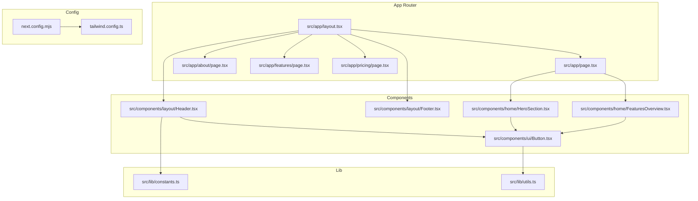
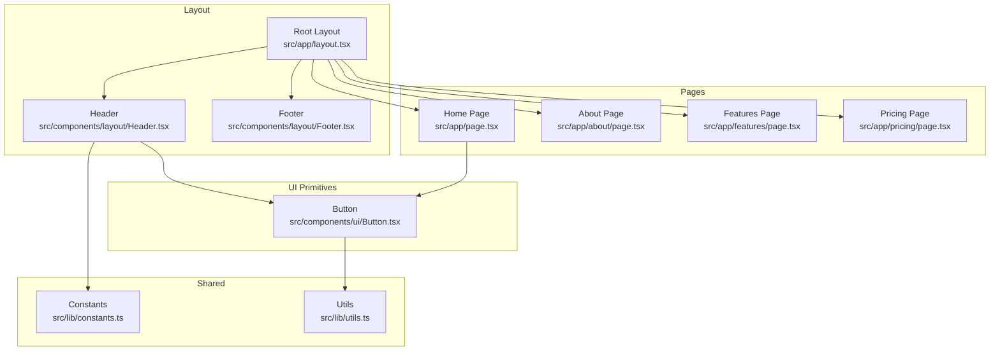
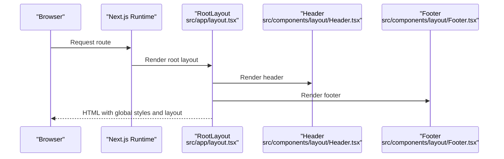
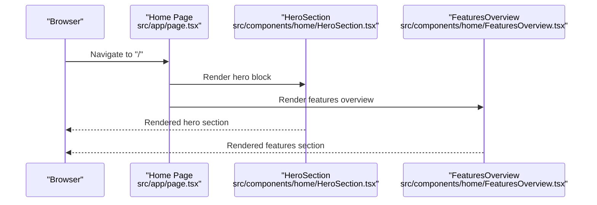
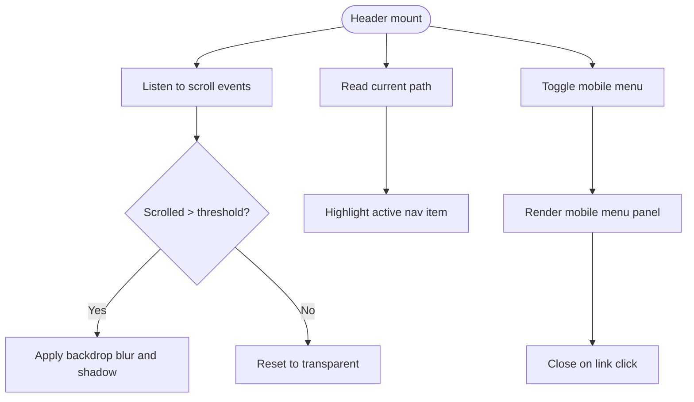
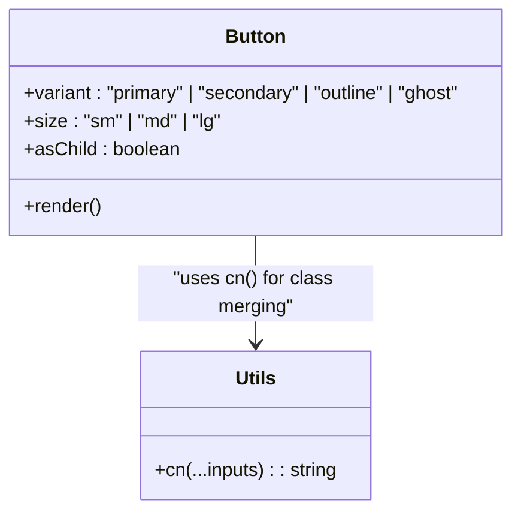
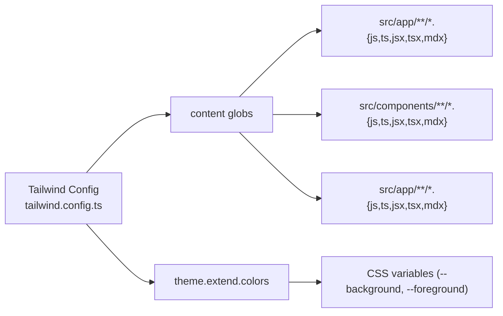
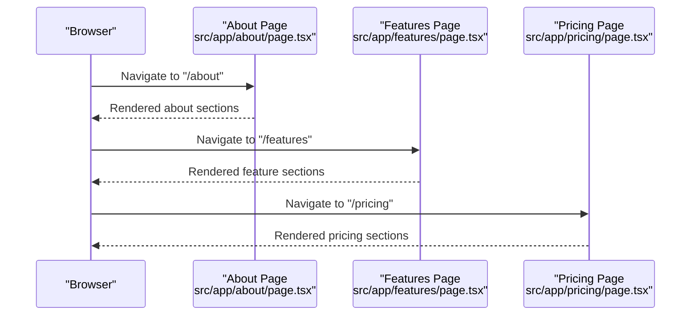
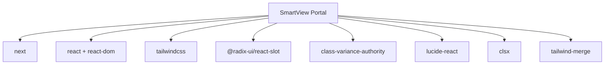

# Architecture Overview

<cite>
**Referenced Files in This Document**
- [layout.tsx](file://smartview-portal/src/app/layout.tsx)
- [page.tsx](file://smartview-portal/src/app/page.tsx)
- [package.json](file://smartview-portal/package.json)
- [next.config.mjs](file://smartview-portal/next.config.mjs)
- [tailwind.config.ts](file://smartview-portal/tailwind.config.ts)
- [Header.tsx](file://smartview-portal/src/components/layout/Header.tsx)
- [Footer.tsx](file://smartview-portal/src/components/layout/Footer.tsx)
- [Button.tsx](file://smartview-portal/src/components/ui/Button.tsx)
- [constants.ts](file://smartview-portal/src/lib/constants.ts)
- [utils.ts](file://smartview-portal/src/lib/utils.ts)
- [HeroSection.tsx](file://smartview-portal/src/components/home/HeroSection.tsx)
- [FeaturesOverview.tsx](file://smartview-portal/src/components/home/FeaturesOverview.tsx)
- [about/page.tsx](file://smartview-portal/src/app/about/page.tsx)
- [features/page.tsx](file://smartview-portal/src/app/features/page.tsx)
- [pricing/page.tsx](file://smartview-portal/src/app/pricing/page.tsx)
</cite>

## Table of Contents
1. [Introduction](#introduction)
2. [Project Structure](#project-structure)
3. [Core Components](#core-components)
4. [Architecture Overview](#architecture-overview)
5. [Detailed Component Analysis](#detailed-component-analysis)
6. [Dependency Analysis](#dependency-analysis)
7. [Performance Considerations](#performance-considerations)
8. [Troubleshooting Guide](#troubleshooting-guide)
9. [Conclusion](#conclusion)

## Introduction
This document describes the architecture of the SmartView Portal Next.js application. It focuses on the Next.js 14 App Router design, file-based routing, layered architecture (pages, components, utilities, configuration), and the design system built with Tailwind CSS, Radix UI, and TypeScript. It also outlines system boundaries, component interactions, and data flow patterns, along with architectural decisions, constraints, and scalability considerations.

## Project Structure
SmartView Portal follows Next.js 14’s App Router conventions:
- Pages are defined under src/app with route segments (e.g., /, /about, /features, /pricing).
- Shared layouts are defined in src/app/layout.tsx and composed per-route.
- UI primitives and reusable components live under src/components.
- Design system utilities and shared constants live under src/lib.
- Build-time configuration is centralized in next.config.mjs and Tailwind configuration in tailwind.config.ts.

**Diagram sources**
- [layout.tsx:1-33](file://smartview-portal/src/app/layout.tsx#L1-L33)
- [page.tsx:1-18](file://smartview-portal/src/app/page.tsx#L1-L18)
- [Header.tsx:1-131](file://smartview-portal/src/components/layout/Header.tsx#L1-L131)
- [Footer.tsx:1-127](file://smartview-portal/src/components/layout/Footer.tsx#L1-L127)
- [Button.tsx:1-54](file://smartview-portal/src/components/ui/Button.tsx#L1-L54)
- [HeroSection.tsx:1-125](file://smartview-portal/src/components/home/HeroSection.tsx#L1-L125)
- [FeaturesOverview.tsx:1-74](file://smartview-portal/src/components/home/FeaturesOverview.tsx#L1-L74)
- [constants.ts:1-11](file://smartview-portal/src/lib/constants.ts#L1-L11)
- [utils.ts:1-7](file://smartview-portal/src/lib/utils.ts#L1-L7)
- [next.config.mjs:1-5](file://smartview-portal/next.config.mjs#L1-L5)
- [tailwind.config.ts:1-20](file://smartview-portal/tailwind.config.ts#L1-L20)

**Section sources**
- [layout.tsx:1-33](file://smartview-portal/src/app/layout.tsx#L1-L33)
- [page.tsx:1-18](file://smartview-portal/src/app/page.tsx#L1-L18)
- [package.json:1-32](file://smartview-portal/package.json#L1-L32)
- [next.config.mjs:1-5](file://smartview-portal/next.config.mjs#L1-L5)
- [tailwind.config.ts:1-20](file://smartview-portal/tailwind.config.ts#L1-L20)

## Core Components
- Root layout composes global styles, fonts, and shared header/footer around page content.
- Home page composes marketing sections (hero, features overview, how-it-works, stats, CTA).
- Layout components (Header, Footer) coordinate navigation, branding, and responsive behavior.
- UI primitive (Button) encapsulates variant and size variants with composition via Radix Slot.
- Shared utilities (constants, cn) centralize site metadata, navigation links, and class merging.

Key responsibilities:
- Root layout: global metadata, typography, and page scaffolding.
- Home page: orchestrates marketing sections.
- Header: navigation, scroll-aware styling, mobile menu, and responsive breakpoints.
- Footer: multi-column links and contact info.
- Button: consistent styling and semantic composition.
- Constants: site identity and nav links.
- Utils: cross-cutting class merging and composition helpers.

**Section sources**
- [layout.tsx:1-33](file://smartview-portal/src/app/layout.tsx#L1-L33)
- [page.tsx:1-18](file://smartview-portal/src/app/page.tsx#L1-L18)
- [Header.tsx:1-131](file://smartview-portal/src/components/layout/Header.tsx#L1-L131)
- [Footer.tsx:1-127](file://smartview-portal/src/components/layout/Footer.tsx#L1-L127)
- [Button.tsx:1-54](file://smartview-portal/src/components/ui/Button.tsx#L1-L54)
- [constants.ts:1-11](file://smartview-portal/src/lib/constants.ts#L1-L11)
- [utils.ts:1-7](file://smartview-portal/src/lib/utils.ts#L1-L7)

## Architecture Overview
SmartView Portal uses a layered architecture:
- Pages layer: route handlers under src/app implementing page components.
- Components layer: reusable UI and layout components under src/components.
- Utilities layer: constants and shared utilities under src/lib.
- Configuration layer: Next.js and Tailwind configurations.

System boundaries:
- App Router boundary: route segment resolution and page rendering.
- Component boundary: props contracts and composition patterns.
- Utility boundary: shared logic for styling and constants.
- Config boundary: build-time and design system configuration.

**Diagram sources**
- [layout.tsx:1-33](file://smartview-portal/src/app/layout.tsx#L1-L33)
- [page.tsx:1-18](file://smartview-portal/src/app/page.tsx#L1-L18)
- [about/page.tsx:1-303](file://smartview-portal/src/app/about/page.tsx#L1-L303)
- [features/page.tsx:1-564](file://smartview-portal/src/app/features/page.tsx#L1-L564)
- [pricing/page.tsx:1-246](file://smartview-portal/src/app/pricing/page.tsx#L1-L246)
- [Header.tsx:1-131](file://smartview-portal/src/components/layout/Header.tsx#L1-L131)
- [Footer.tsx:1-127](file://smartview-portal/src/components/layout/Footer.tsx#L1-L127)
- [Button.tsx:1-54](file://smartview-portal/src/components/ui/Button.tsx#L1-L54)
- [constants.ts:1-11](file://smartview-portal/src/lib/constants.ts#L1-L11)
- [utils.ts:1-7](file://smartview-portal/src/lib/utils.ts#L1-L7)

## Detailed Component Analysis

### Root Layout and Global Composition
Root layout defines metadata, font loading, global CSS, and wraps all pages with a consistent header and footer. It sets up the main content area and ensures consistent typography and spacing.

**Diagram sources**
- [layout.tsx:1-33](file://smartview-portal/src/app/layout.tsx#L1-L33)
- [Header.tsx:1-131](file://smartview-portal/src/components/layout/Header.tsx#L1-L131)
- [Footer.tsx:1-127](file://smartview-portal/src/components/layout/Footer.tsx#L1-L127)

**Section sources**
- [layout.tsx:1-33](file://smartview-portal/src/app/layout.tsx#L1-L33)

### Home Page Composition
The home page composes multiple marketing sections. Each section is a self-contained component that renders specific UI blocks.

**Diagram sources**
- [page.tsx:1-18](file://smartview-portal/src/app/page.tsx#L1-L18)
- [HeroSection.tsx:1-125](file://smartview-portal/src/components/home/HeroSection.tsx#L1-L125)
- [FeaturesOverview.tsx:1-74](file://smartview-portal/src/components/home/FeaturesOverview.tsx#L1-L74)

**Section sources**
- [page.tsx:1-18](file://smartview-portal/src/app/page.tsx#L1-L18)

### Header Component Interaction
Header manages scroll-aware styling, mobile menu toggling, and navigation highlighting based on current path. It consumes constants for navigation and uses the shared Button primitive.

**Diagram sources**
- [Header.tsx:1-131](file://smartview-portal/src/components/layout/Header.tsx#L1-L131)
- [constants.ts:1-11](file://smartview-portal/src/lib/constants.ts#L1-L11)
- [Button.tsx:1-54](file://smartview-portal/src/components/ui/Button.tsx#L1-L54)

**Section sources**
- [Header.tsx:1-131](file://smartview-portal/src/components/layout/Header.tsx#L1-L131)

### Button Primitive and Variants
Button implements a variant system using class-variance-authority and composition via Radix Slot. It merges classes using the shared cn utility.

**Diagram sources**
- [Button.tsx:1-54](file://smartview-portal/src/components/ui/Button.tsx#L1-L54)
- [utils.ts:1-7](file://smartview-portal/src/lib/utils.ts#L1-L7)

**Section sources**
- [Button.tsx:1-54](file://smartview-portal/src/components/ui/Button.tsx#L1-L54)
- [utils.ts:1-7](file://smartview-portal/src/lib/utils.ts#L1-L7)

### Design System and Tailwind Integration
Tailwind is configured to scan pages, components, and app directories. The design system relies on:
- Tailwind utilities for layout and colors.
- CSS variables for theme tokens.
- Utility function cn for safe class merging.

**Diagram sources**
- [tailwind.config.ts:1-20](file://smartview-portal/tailwind.config.ts#L1-L20)

**Section sources**
- [tailwind.config.ts:1-20](file://smartview-portal/tailwind.config.ts#L1-L20)
- [utils.ts:1-7](file://smartview-portal/src/lib/utils.ts#L1-L7)

### Additional Pages: About, Features, Pricing
These pages demonstrate consistent composition patterns:
- About page: structured sections for vision, mission, problems solved, team, tech advantages, and CTA.
- Features page: detailed feature showcases with interactive elements and visual mockups.
- Pricing page: plan cards, feature lists, and FAQ sections.

**Diagram sources**
- [about/page.tsx:1-303](file://smartview-portal/src/app/about/page.tsx#L1-L303)
- [features/page.tsx:1-564](file://smartview-portal/src/app/features/page.tsx#L1-L564)
- [pricing/page.tsx:1-246](file://smartview-portal/src/app/pricing/page.tsx#L1-L246)

**Section sources**
- [about/page.tsx:1-303](file://smartview-portal/src/app/about/page.tsx#L1-L303)
- [features/page.tsx:1-564](file://smartview-portal/src/app/features/page.tsx#L1-L564)
- [pricing/page.tsx:1-246](file://smartview-portal/src/app/pricing/page.tsx#L1-L246)

## Dependency Analysis
External dependencies and their roles:
- Next.js runtime and App Router for file-based routing and SSR/SSG.
- React and React DOM for UI rendering.
- Tailwind CSS for utility-first styling.
- Radix UI Slot for component composition.
- class-variance-authority for variant systems.
- lucide-react for icons.
- clsx and tailwind-merge for class merging.

**Diagram sources**
- [package.json:1-32](file://smartview-portal/package.json#L1-L32)

**Section sources**
- [package.json:1-32](file://smartview-portal/package.json#L1-L32)

## Performance Considerations
- File-based routing minimizes dynamic routing overhead and enables static generation where applicable.
- Component composition reduces duplication and improves maintainability.
- Tailwind scanning scope can be optimized to reduce build times; current globs cover pages, components, and app directories.
- Using CSS variables for theme tokens avoids unnecessary re-renders.
- Prefer client components only when necessary (e.g., Header uses client directives for interactivity).

## Troubleshooting Guide
Common areas to check:
- Routing issues: Verify route segment names match file paths under src/app.
- Layout problems: Confirm RootLayout wraps children and includes global styles.
- Styling inconsistencies: Ensure cn is used for class merging and Tailwind content globs include new components.
- Navigation highlights: Confirm usePathname matches NAV_LINKS href values.

**Section sources**
- [layout.tsx:1-33](file://smartview-portal/src/app/layout.tsx#L1-L33)
- [Header.tsx:1-131](file://smartview-portal/src/components/layout/Header.tsx#L1-L131)
- [constants.ts:1-11](file://smartview-portal/src/lib/constants.ts#L1-L11)
- [utils.ts:1-7](file://smartview-portal/src/lib/utils.ts#L1-L7)
- [tailwind.config.ts:1-20](file://smartview-portal/tailwind.config.ts#L1-L20)

## Conclusion
SmartView Portal leverages Next.js 14 App Router to deliver a modular, scalable frontend. The design system centers on Tailwind CSS, a composable Button primitive, and shared constants/utilities. The layered architecture promotes separation of concerns, while file-based routing simplifies navigation and improves performance. The approach supports future growth through consistent component composition and configurable design tokens.