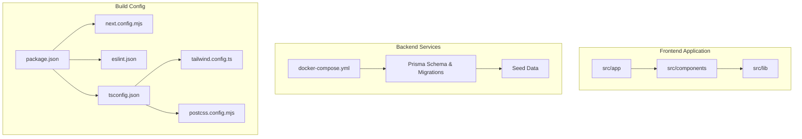
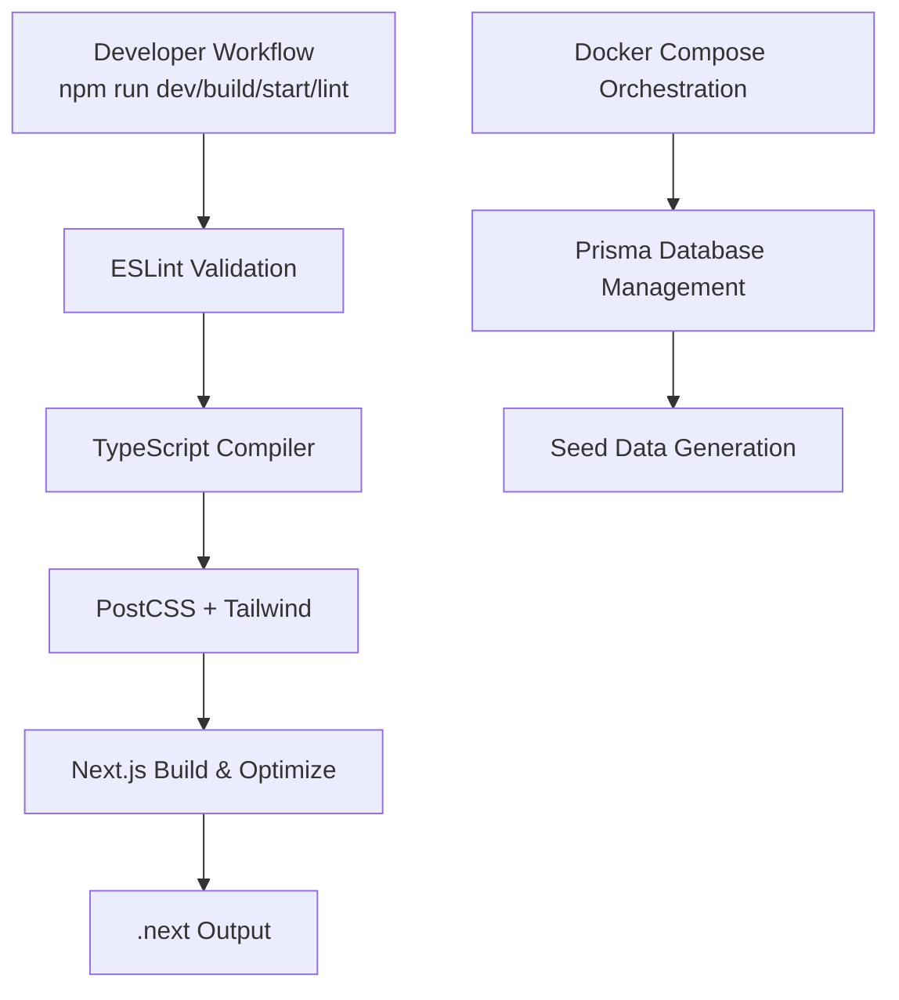
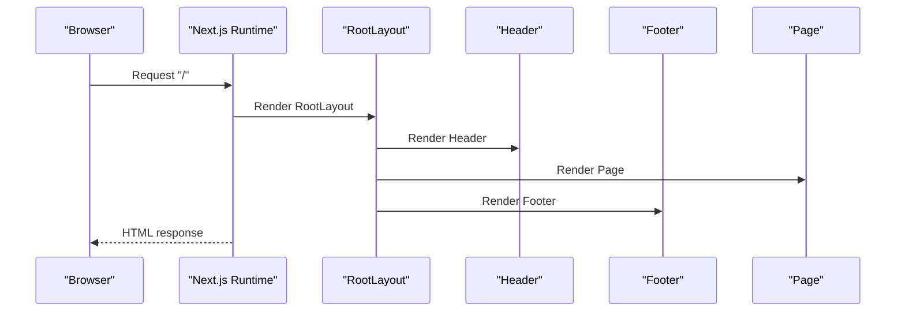
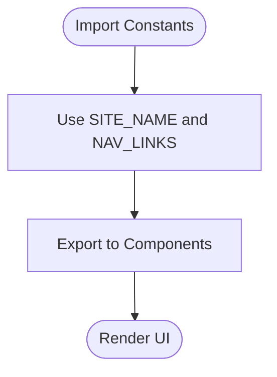
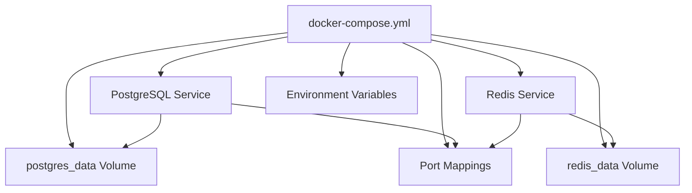
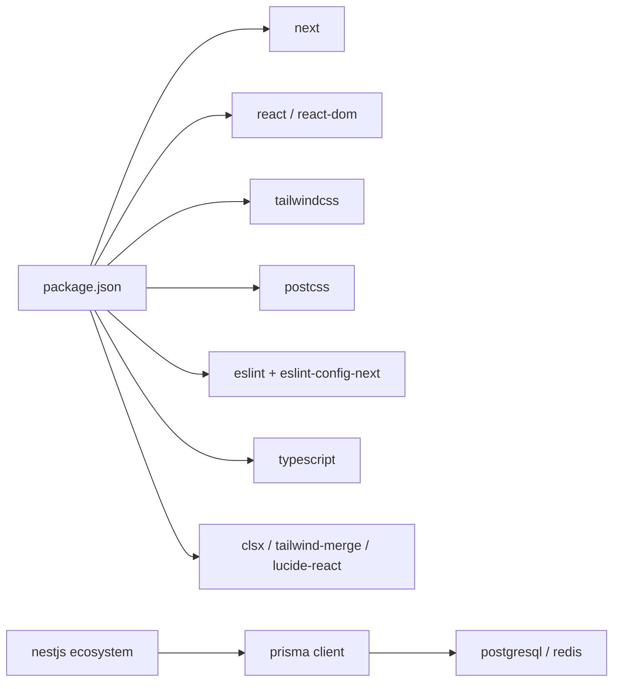

# Build and Deployment

<cite>
**Referenced Files in This Document**
- [package.json](file://smartview-portal/package.json)
- [next.config.mjs](file://smartview-portal/next.config.mjs)
- [.eslintrc.json](file://smartview-portal/.eslintrc.json)
- [tailwind.config.ts](file://smartview-portal/tailwind.config.ts)
- [postcss.config.mjs](file://smartview-portal/postcss.config.mjs)
- [tsconfig.json](file://smartview-portal/tsconfig.json)
- [layout.tsx](file://smartview-portal/src/app/layout.tsx)
- [page.tsx](file://smartview-portal/src/app/page.tsx)
- [Header.tsx](file://smartview-portal/src/components/layout/Header.tsx)
- [Footer.tsx](file://smartview-portal/src/components/layout/Footer.tsx)
- [constants.ts](file://smartview-portal/src/lib/constants.ts)
- [utils.ts](file://smartview-portal/src/lib/utils.ts)
- [README.md](file://smartview-portal/README.md)
- [docker-compose.yml](file://smartview-server/docker-compose.yml)
- [schema.prisma](file://smartview-server/prisma/schema.prisma)
- [migration.sql](file://smartview-server/prisma/migrations/20260328065314_init/migration.sql)
- [prisma.config.ts](file://smartview-server/prisma.config.ts)
- [package.json](file://smartview-server/package.json)
- [main.ts](file://smartview-server/src/main.ts)
- [app.module.ts](file://smartview-server/src/app.module.ts)
- [seed.ts](file://smartview-server/prisma/seed.ts)
</cite>

## Update Summary
**Changes Made**
- Added comprehensive Docker Compose orchestration documentation for PostgreSQL and Redis services
- Documented Prisma database schema, migrations, and seeding processes
- Updated development workflow to include modern NestJS tooling and Prisma integration
- Enhanced deployment considerations with database service orchestration
- Added Prisma CLI configuration and migration management procedures

## Table of Contents
1. [Introduction](#introduction)
2. [Project Structure](#project-structure)
3. [Core Components](#core-components)
4. [Architecture Overview](#architecture-overview)
5. [Detailed Component Analysis](#detailed-component-analysis)
6. [Dependency Analysis](#dependency-analysis)
7. [Performance Considerations](#performance-considerations)
8. [Troubleshooting Guide](#troubleshooting-guide)
9. [Conclusion](#conclusion)
10. [Appendices](#appendices)

## Introduction
This document explains the SmartView Portal build and deployment process, focusing on Next.js configuration, environment variable setup, build optimization strategies, development workflow via npm scripts, ESLint configuration, production builds, deployment considerations, performance optimization, monitoring setup, CI/CD integration, environment-specific configurations, troubleshooting, security, asset optimization, and scalability planning for production environments. The document now includes comprehensive coverage of Docker Compose orchestration for backend services, Prisma database management, and modern development tooling integration.

## Project Structure
SmartView Portal follows a Next.js App Router project layout with a clear separation of concerns, complemented by a NestJS backend with integrated Prisma database management and Docker orchestration:

- Application pages under src/app
- Shared components under src/components
- Utilities and constants under src/lib
- Build-time configuration files at the repository root
- Backend services with Docker Compose orchestration
- Database schema and migrations under prisma/

**Diagram sources**
- [package.json:1-32](file://smartview-portal/package.json#L1-L32)
- [next.config.mjs:1-5](file://smartview-portal/next.config.mjs#L1-L5)
- [tsconfig.json:1-27](file://smartview-portal/tsconfig.json#L1-L27)
- [.eslintrc.json:1-4](file://smartview-portal/.eslintrc.json#L1-L4)
- [tailwind.config.ts:1-20](file://smartview-portal/tailwind.config.ts#L1-L20)
- [postcss.config.mjs:1-9](file://smartview-portal/postcss.config.mjs#L1-L9)
- [docker-compose.yml:1-26](file://smartview-server/docker-compose.yml#L1-L26)
- [schema.prisma:1-334](file://smartview-server/prisma/schema.prisma#L1-L334)

**Section sources**
- [package.json:1-32](file://smartview-portal/package.json#L1-L32)
- [tsconfig.json:1-27](file://smartview-portal/tsconfig.json#L1-L27)
- [tailwind.config.ts:1-20](file://smartview-portal/tailwind.config.ts#L1-L20)
- [postcss.config.mjs:1-9](file://smartview-portal/postcss.config.mjs#L1-L9)
- [next.config.mjs:1-5](file://smartview-portal/next.config.mjs#L1-L5)
- [docker-compose.yml:1-26](file://smartview-server/docker-compose.yml#L1-L26)
- [schema.prisma:1-334](file://smartview-server/prisma/schema.prisma#L1-L334)

## Core Components
- Next.js configuration: Minimal default configuration allows Next.js to manage bundling, optimization, and runtime behavior.
- TypeScript configuration: Strict mode, esmodule bundler resolution, incremental builds, and path aliases enable fast type-aware builds.
- Tailwind CSS: Content scanning configured to include app, components, and pages directories; CSS variables support theme customization.
- PostCSS: Tailwind plugin enabled for CSS processing.
- ESLint: Extends Next.js recommended rules for web vitals and TypeScript.
- Package scripts: Standard Next.js commands for development, building, starting, and linting.
- **Updated** Docker Compose orchestration: PostgreSQL and Redis services for local development and testing.
- **Updated** Prisma database management: Schema definition, automatic migrations, and data seeding capabilities.
- **Updated** Modern NestJS tooling: Comprehensive backend service architecture with dependency injection and modular design.

Key build and runtime behaviors:
- Incremental TypeScript compilation and isolated modules improve rebuild speed.
- Bundler module resolution aligns with Next.js App Router expectations.
- Path alias @/* simplifies imports from src/.
- **Updated** Database service orchestration through Docker Compose for consistent local development.
- **Updated** Prisma client generation and migration management for database schema evolution.
- **Updated** Seed data automation for initial database population.

**Section sources**
- [next.config.mjs:1-5](file://smartview-portal/next.config.mjs#L1-L5)
- [tsconfig.json:1-27](file://smartview-portal/tsconfig.json#L1-L27)
- [tailwind.config.ts:1-20](file://smartview-portal/tailwind.config.ts#L1-L20)
- [postcss.config.mjs:1-9](file://smartview-portal/postcss.config.mjs#L1-L9)
- [.eslintrc.json:1-4](file://smartview-portal/.eslintrc.json#L1-L4)
- [package.json:5-10](file://smartview-portal/package.json#L5-L10)
- [docker-compose.yml:1-26](file://smartview-server/docker-compose.yml#L1-L26)
- [schema.prisma:1-334](file://smartview-server/prisma/schema.prisma#L1-L334)
- [package.json:8-21](file://smartview-server/package.json#L8-L21)

## Architecture Overview
The build pipeline integrates TypeScript compilation, PostCSS/Tailwind processing, Next.js App Router routing, and asset optimization. The runtime layout composes shared components and pages into a cohesive UI, while the backend architecture includes Docker orchestration for database services and Prisma for database management.

**Diagram sources**
- [package.json:5-10](file://smartview-portal/package.json#L5-L10)
- [.eslintrc.json:1-4](file://smartview-portal/.eslintrc.json#L1-L4)
- [tsconfig.json:1-27](file://smartview-portal/tsconfig.json#L1-L27)
- [postcss.config.mjs:1-9](file://smartview-portal/postcss.config.mjs#L1-L9)
- [next.config.mjs:1-5](file://smartview-portal/next.config.mjs#L1-L5)
- [docker-compose.yml:1-26](file://smartview-server/docker-compose.yml#L1-L26)
- [schema.prisma:1-334](file://smartview-server/prisma/schema.prisma#L1-L334)

## Detailed Component Analysis

### Next.js Configuration and Environment Variables
- next.config.mjs defines the base Next.js configuration. No custom webpack/bundling overrides are present, enabling Next.js defaults for optimal performance and compatibility.
- Environment variables are not defined in the repository. For production deployments, define environment variables via platform-specific mechanisms (e.g., Vercel Environment Variables, Docker env, or CI secrets). Sensitive values should be injected at build/runtime and referenced through Next.js environment helpers.

Recommended environment variables for production:
- Runtime configuration keys (e.g., API_BASE_URL, NEXT_PUBLIC_APP_ENV)
- Feature flags and toggles
- Analytics and monitoring tokens

**Section sources**
- [next.config.mjs:1-5](file://smartview-portal/next.config.mjs#L1-L5)
- [README.md:32-37](file://smartview-portal/README.md#L32-L37)

### TypeScript and Type-Safe Builds
- Strict type checking and incremental compilation reduce build times and catch errors early.
- Bundler module resolution ensures compatibility with Next.js App Router.
- Path alias @/* improves import readability and maintainability.

Optimization tips:
- Keep strict mode enabled for correctness.
- Use incremental builds to accelerate local iteration.
- Avoid unnecessary type assertions; prefer precise types.

**Section sources**
- [tsconfig.json:1-27](file://smartview-portal/tsconfig.json#L1-L27)

### Tailwind CSS and PostCSS Pipeline
- Tailwind content globs scan app, components, and pages directories to purge unused styles.
- Theme extension supports CSS variables for dynamic color theming.
- PostCSS applies Tailwind directives during build.

Best practices:
- Keep content globs accurate to minimize CSS size.
- Centralize color tokens in theme.extend for consistency.
- Use utility-first patterns to reduce custom CSS.

**Section sources**
- [tailwind.config.ts:1-20](file://smartview-portal/tailwind.config.ts#L1-L20)
- [postcss.config.mjs:1-9](file://smartview-portal/postcss.config.mjs#L1-L9)

### ESLint Configuration and Code Quality
- Extends Next.js core-web-vitals and TypeScript presets for modern React/Next.js projects.
- Enforces performance, accessibility, and TypeScript best practices.

Workflow:
- Run lint checks locally before committing.
- Integrate linting in pre-commit hooks or CI.

**Section sources**
- [.eslintrc.json:1-4](file://smartview-portal/.eslintrc.json#L1-L4)

### Application Layout and Routing
- Root layout sets metadata, font loading, global CSS, and composes header/footer.
- Page components render domain-specific sections and compose reusable UI parts.

**Diagram sources**
- [layout.tsx:1-33](file://smartview-portal/src/app/layout.tsx#L1-L33)
- [page.tsx:1-18](file://smartview-portal/src/app/page.tsx#L1-L18)
- [Header.tsx:1-131](file://smartview-portal/src/components/layout/Header.tsx#L1-L131)
- [Footer.tsx:1-127](file://smartview-portal/src/components/layout/Footer.tsx#L1-L127)

**Section sources**
- [layout.tsx:1-33](file://smartview-portal/src/app/layout.tsx#L1-L33)
- [page.tsx:1-18](file://smartview-portal/src/app/page.tsx#L1-L18)
- [Header.tsx:1-131](file://smartview-portal/src/components/layout/Header.tsx#L1-L131)
- [Footer.tsx:1-127](file://smartview-portal/src/components/layout/Footer.tsx#L1-L127)

### Utility Modules and Constants
- Constants centralize site metadata and navigation links.
- Utility functions consolidate class merging for Tailwind usage.

**Diagram sources**
- [constants.ts:1-11](file://smartview-portal/src/lib/constants.ts#L1-L11)
- [utils.ts:1-7](file://smartview-portal/src/lib/utils.ts#L1-L7)

**Section sources**
- [constants.ts:1-11](file://smartview-portal/src/lib/constants.ts#L1-L11)
- [utils.ts:1-7](file://smartview-portal/src/lib/utils.ts#L1-L7)

### Docker Compose Orchestration
**Updated** The project includes comprehensive Docker Compose orchestration for local development and testing environments:

- PostgreSQL 16 service with persistent volume storage
- Redis 7 service for caching and session management
- Port mappings for easy local access (PostgreSQL: 5433, Redis: 6379)
- Environment variables for database authentication
- Volume definitions for data persistence across container restarts

**Diagram sources**
- [docker-compose.yml:1-26](file://smartview-server/docker-compose.yml#L1-L26)

**Section sources**
- [docker-compose.yml:1-26](file://smartview-server/docker-compose.yml#L1-L26)

### Prisma Database Management
**Updated** The backend includes comprehensive Prisma database management capabilities:

- Complete database schema definition with enums, models, and relations
- Automatic migration generation and execution
- Seed data functionality for initial database population
- TypeScript client generation with type safety
- Environment-based datasource configuration

Key Prisma features:
- Enum definitions for application roles, statuses, and types
- Model relationships with foreign key constraints
- Index optimization for query performance
- JSON field support for flexible data structures
- Automatic client generation with proper TypeScript types

**Section sources**
- [schema.prisma:1-334](file://smartview-server/prisma/schema.prisma#L1-L334)
- [migration.sql:1-361](file://smartview-server/prisma/migrations/20260328065314_init/migration.sql#L1-L361)
- [prisma.config.ts:1-16](file://smartview-server/prisma.config.ts#L1-L16)
- [seed.ts:1-432](file://smartview-server/prisma/seed.ts#L1-L432)

### NestJS Backend Architecture
**Updated** The backend follows modern NestJS architecture patterns:

- Modular design with dedicated modules for different business domains
- Dependency injection for service management
- Global validation pipes and exception filters
- CORS configuration for frontend integration
- Config service for environment variable management

Core backend components:
- Authentication and authorization modules
- User management with role-based access control
- Question bank management with multiple question types
- Exam and interview scheduling systems
- AI-powered code evaluation and scoring
- Real-time notification system

**Section sources**
- [main.ts:1-38](file://smartview-server/src/main.ts#L1-L38)
- [app.module.ts:1-34](file://smartview-server/src/app.module.ts#L1-L34)
- [package.json:22-40](file://smartview-server/package.json#L22-L40)

## Dependency Analysis
The project relies on Next.js 14, React 18, Tailwind CSS, and related tooling for the frontend, while the backend uses NestJS with Prisma for database management and Docker for service orchestration.

**Diagram sources**
- [package.json:11-30](file://smartview-portal/package.json#L11-L30)
- [package.json:22-40](file://smartview-server/package.json#L22-L40)

**Section sources**
- [package.json:11-30](file://smartview-portal/package.json#L11-L30)
- [package.json:22-40](file://smartview-server/package.json#L22-L40)

## Performance Considerations
- Font optimization: next/font is used for optimized font delivery; keep font subsets minimal.
- CSS optimization: Tailwind purges unused styles; ensure content globs are accurate.
- Image optimization: Next.js image optimization is available; leverage it for responsive images.
- Bundle size: Prefer tree-shaking and avoid large vendor dependencies; split code with dynamic imports when appropriate.
- Incremental builds: Keep TypeScript incremental and isolated modules enabled.
- Static generation: Use static generation for content-heavy pages where feasible.
- **Updated** Database connection pooling: Configure Prisma client with appropriate connection limits.
- **Updated** Service orchestration: Use Docker Compose for consistent resource allocation.
- **Updated** Caching strategy: Implement Redis caching for frequently accessed data.

## Troubleshooting Guide
Common build and runtime issues:
- Type errors: Enable strict mode and fix type mismatches; use incremental builds to track regressions.
- Tailwind utilities missing: Verify content globs in Tailwind config include all relevant directories.
- Lint failures: Run lint checks locally and resolve violations; integrate with pre-commit hooks.
- Missing environment variables: Define variables in your deployment platform; ensure they are prefixed appropriately for client/server access.
- Font rendering issues: Confirm font subsets and variable names match usage in layout.
- **Updated** Database connection errors: Verify Docker Compose services are running and ports are accessible.
- **Updated** Prisma migration failures: Check migration SQL syntax and database permissions.
- **Updated** Seed data issues: Ensure DATABASE_URL environment variable is properly configured.
- **Updated** CORS configuration problems: Verify frontend and backend port configurations match.

**Section sources**
- [tsconfig.json:1-27](file://smartview-portal/tsconfig.json#L1-L27)
- [tailwind.config.ts:1-20](file://smartview-portal/tailwind.config.ts#L1-L20)
- [.eslintrc.json:1-4](file://smartview-portal/.eslintrc.json#L1-L4)
- [README.md:32-37](file://smartview-portal/README.md#L32-L37)
- [docker-compose.yml:1-26](file://smartview-server/docker-compose.yml#L1-L26)
- [schema.prisma:1-334](file://smartview-server/prisma/schema.prisma#L1-L334)
- [seed.ts:1-432](file://smartview-server/prisma/seed.ts#L1-L432)

## Conclusion
SmartView Portal leverages Next.js App Router with a clean configuration set for efficient builds and runtime performance, complemented by a modern NestJS backend with comprehensive Prisma database management and Docker orchestration. The integration of Docker Compose for service management, Prisma for database schema evolution, and automated seed data generation creates a robust development and deployment foundation. Production readiness requires environment variable management, CI/CD integration, database migration strategies, and continuous performance monitoring across both frontend and backend services.

## Appendices

### Development Workflow Using npm Scripts
- Development: Start the Next.js dev server with hot reload.
- Build: Produce optimized static/SSR assets for production.
- Start: Serve the built application.
- Lint: Run ESLint checks against the codebase.
- **Updated** Backend development: Use NestJS CLI commands for backend development and testing.
- **Updated** Database management: Use Prisma CLI for schema management and migrations.
- **Updated** Service orchestration: Use Docker Compose for local service management.

**Section sources**
- [package.json:5-10](file://smartview-portal/package.json#L5-L10)
- [package.json:8-21](file://smartview-server/package.json#L8-L21)

### Production Build Processes
- Build command compiles TypeScript, processes CSS, optimizes assets, and generates route-specific artifacts.
- The .next directory contains generated manifests, static assets, and server code.
- **Updated** Backend build: NestJS compilation with TypeScript transpilation.
- **Updated** Database preparation: Prisma client generation and migration execution.
- **Updated** Service deployment: Docker Compose for containerized service orchestration.

**Section sources**
- [package.json:7](file://smartview-portal/package.json#L7)
- [package.json:9](file://smartview-server/package.json#L9)
- [README.md:32-37](file://smartview-portal/README.md#L32-L37)

### Deployment Considerations
- Platform choice: The project README recommends deploying to Vercel; configure environment variables and build outputs accordingly.
- Asset optimization: Ensure images and fonts are optimized; leverage Next.js image optimization and font loading strategies.
- Monitoring: Integrate analytics and error reporting; monitor bundle sizes and runtime metrics.
- **Updated** Database deployment: Configure production database connections and migration strategies.
- **Updated** Service scaling: Use Docker Swarm or Kubernetes for container orchestration.
- **Updated** Environment management: Implement proper environment variable management for different deployment stages.

**Section sources**
- [README.md:32-37](file://smartview-portal/README.md#L32-L37)
- [docker-compose.yml:1-26](file://smartview-server/docker-compose.yml#L1-L26)
- [prisma.config.ts:1-16](file://smartview-server/prisma.config.ts#L1-L16)

### CI/CD Pipeline Integration
- Trigger builds on pull requests and main branch pushes.
- Run lint and type checks before building.
- Cache node_modules and Next.js build cache to speed up pipelines.
- Deploy artifacts to production after successful tests and reviews.
- **Updated** Database migration automation: Include Prisma migration steps in CI pipeline.
- **Updated** Service health checks: Implement database connectivity verification.
- **Updated** Multi-stage builds: Separate frontend and backend build processes.

### Environment-Specific Configurations
- Local development: Use .env.local for local variables.
- Staging: Use staging environment variables and separate domains.
- Production: Use production variables and secure secret management.
- **Updated** Database environments: Configure separate database connections for each environment.
- **Updated** Service configurations: Use Docker Compose override files for environment-specific settings.

### Security Considerations
- Never commit secrets; use environment variables managed by your platform.
- Sanitize inputs and outputs; enforce HTTPS and secure cookies.
- Keep dependencies updated; audit for vulnerabilities regularly.
- **Updated** Database security: Implement proper database connection encryption and access controls.
- **Updated** Service isolation: Use Docker network isolation for development services.

### Asset Optimization
- Fonts: Use next/font with minimal subsets.
- Images: Use Next.js Image component and appropriate formats.
- CSS: Purge unused styles; minimize custom CSS.
- **Updated** Database optimization: Implement proper indexing and query optimization.
- **Updated** Caching strategy: Configure Redis caching for improved performance.

### Scalability Planning for Production
- Horizontal scaling: Stateless Next.js applications scale horizontally behind load balancers.
- CDN: Serve static assets via CDN; leverage ISR for dynamic content refresh.
- Observability: Add logging, tracing, and performance monitoring.
- **Updated** Database scaling: Implement read replicas and connection pooling.
- **Updated** Service scaling: Use container orchestration platforms for automatic scaling.
- **Updated** Microservices architecture: Consider splitting monolithic backend into smaller services as traffic grows.