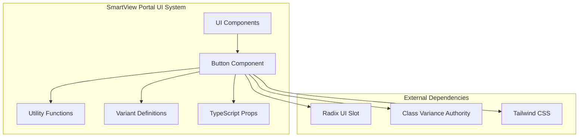
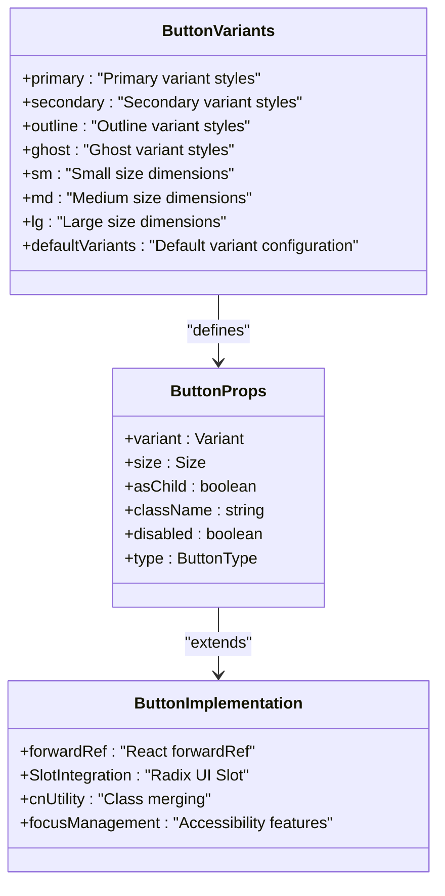
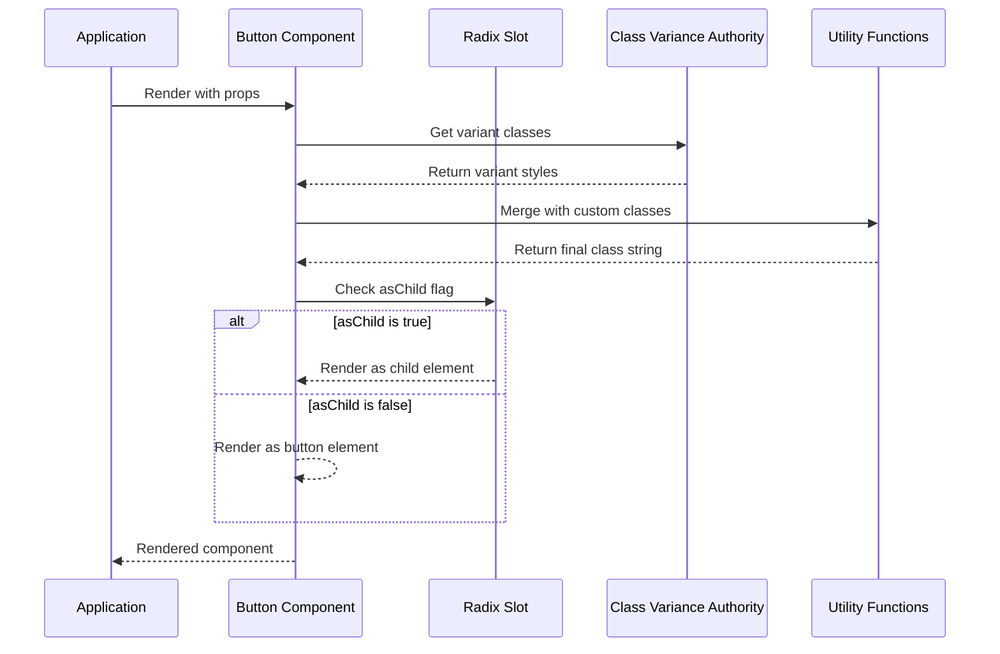
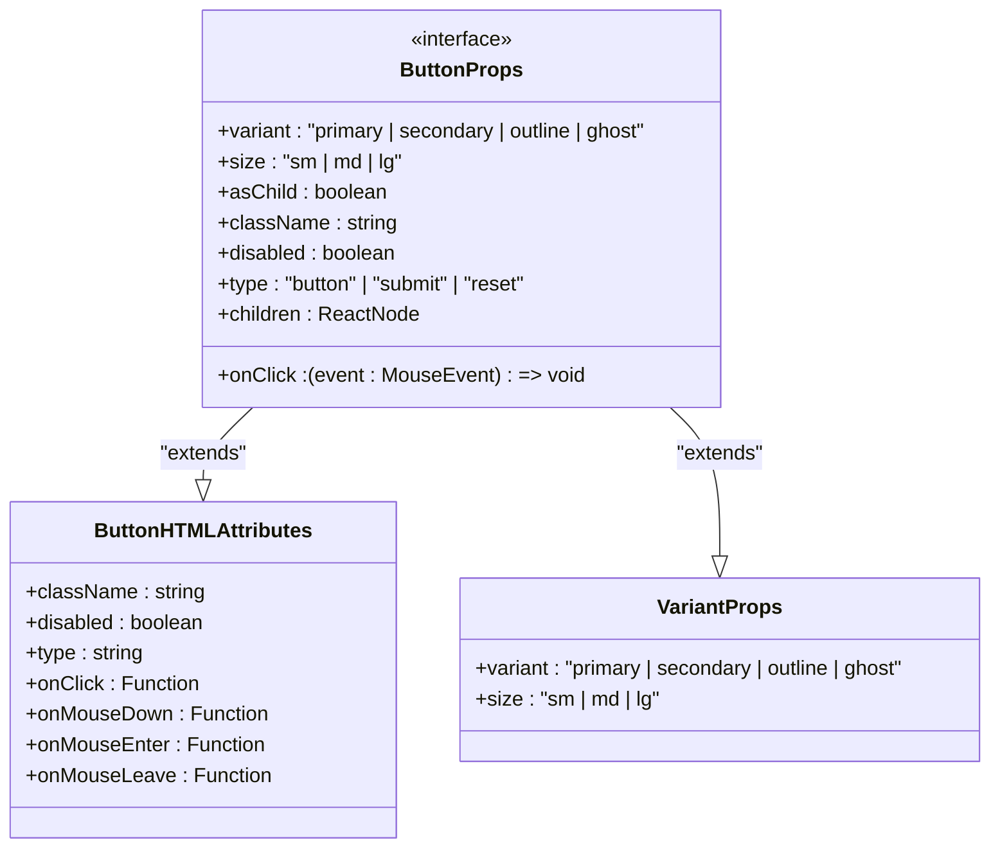
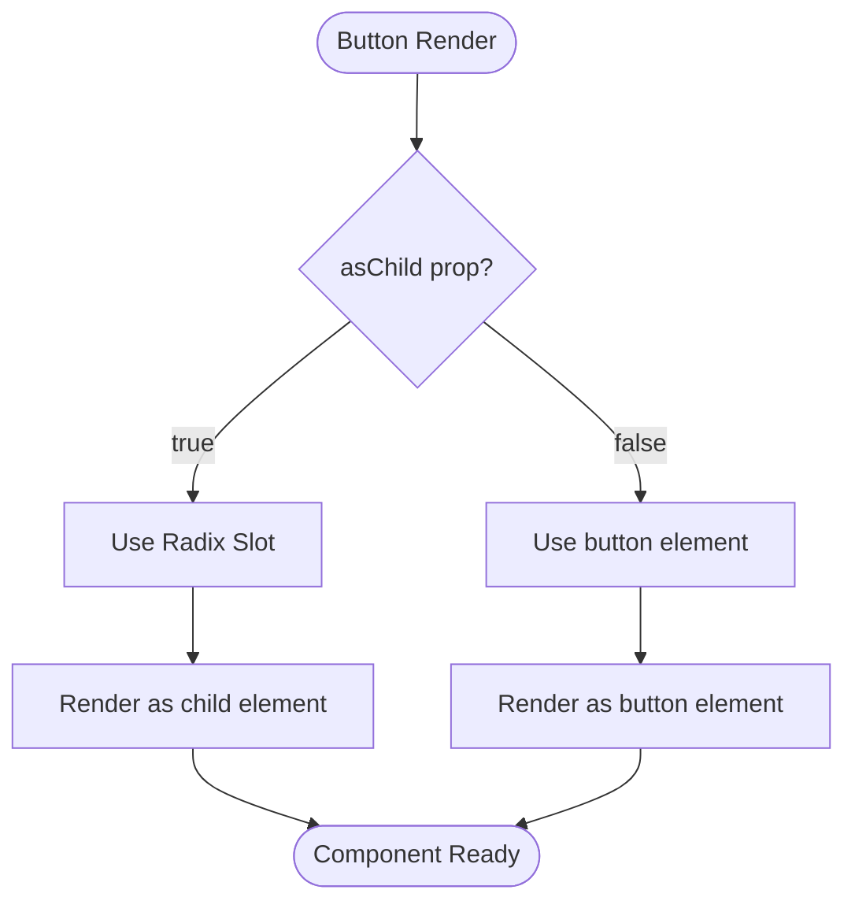
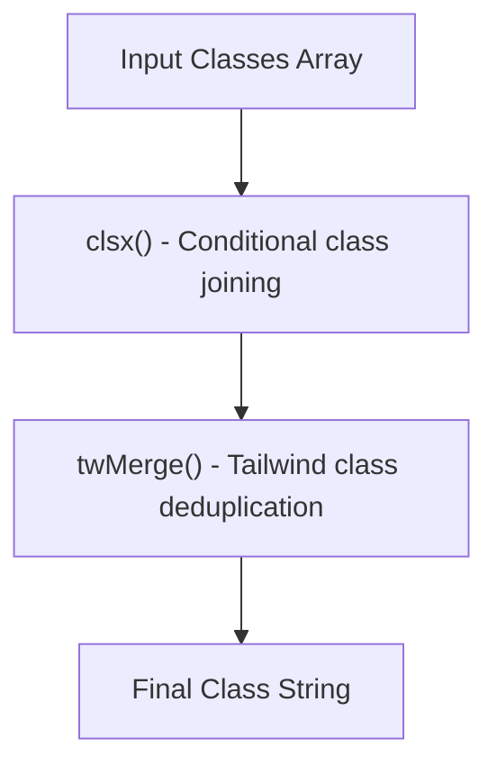
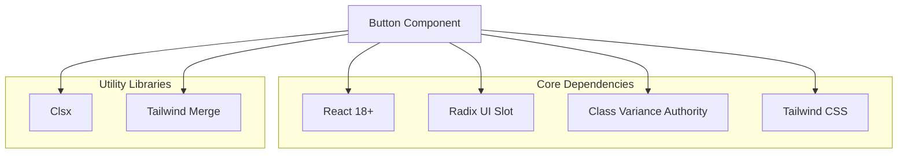

# Button Component

<cite>
**Referenced Files in This Document**
- [Button.tsx](file://smartview-portal/src/components/ui/Button.tsx)
- [utils.ts](file://smartview-portal/src/lib/utils.ts)
- [package.json](file://smartview-portal/package.json)
- [tailwind.config.ts](file://smartview-portal/tailwind.config.ts)
- [globals.css](file://smartview-portal/src/app/globals.css)
- [Header.tsx](file://smartview-portal/src/components/layout/Header.tsx)
- [CTASection.tsx](file://smartview-portal/src/components/home/CTASection.tsx)
- [features/page.tsx](file://smartview-portal/src/app/features/page.tsx)
- [pricing/page.tsx](file://smartview-portal/src/app/pricing/page.tsx)
- [about/page.tsx](file://smartview-portal/src/app/about/page.tsx)
</cite>

## Table of Contents
1. [Introduction](#introduction)
2. [Project Structure](#project-structure)
3. [Core Components](#core-components)
4. [Architecture Overview](#architecture-overview)
5. [Detailed Component Analysis](#detailed-component-analysis)
6. [Dependency Analysis](#dependency-analysis)
7. [Performance Considerations](#performance-considerations)
8. [Troubleshooting Guide](#troubleshooting-guide)
9. [Conclusion](#conclusion)

## Introduction
The Button component is the cornerstone of SmartView Portal's UI system, providing a consistent, accessible, and highly customizable foundation for interactive elements. Built with modern React patterns and integrated with Radix UI's Slot component, it offers semantic HTML rendering while maintaining design flexibility through a robust variant system.

The component serves as the primary interaction point across the application, appearing in navigation bars, call-to-action sections, forms, and various UI contexts. Its design philosophy emphasizes accessibility-first development, responsive sizing, and seamless integration with Next.js applications.

## Project Structure
The Button component is organized within the UI components system alongside other foundational elements. It follows a modular architecture that promotes reusability and maintainability across the application.

**Diagram sources**
- [Button.tsx:1-54](file://smartview-portal/src/components/ui/Button.tsx#L1-L54)
- [utils.ts:1-7](file://smartview-portal/src/lib/utils.ts#L1-L7)

**Section sources**
- [Button.tsx:1-54](file://smartview-portal/src/components/ui/Button.tsx#L1-L54)
- [package.json:11-20](file://smartview-portal/package.json#L11-L20)

## Core Components
The Button component consists of several key architectural elements that work together to provide a robust and flexible solution:

### Variant System Architecture
The component implements a sophisticated variant system using class-variance-authority (CVA) that defines distinct visual styles for different interaction contexts:

**Diagram sources**
- [Button.tsx:6-31](file://smartview-portal/src/components/ui/Button.tsx#L6-L31)
- [Button.tsx:33-37](file://smartview-portal/src/components/ui/Button.tsx#L33-L37)

### Variant Definitions and Visual Styles
The component provides four distinct variants, each designed for specific use cases and visual contexts:

| Variant | Primary | Secondary | Outline | Ghost |
|---------|---------|-----------|---------|-------|
| Purpose | Primary actions, main CTAs | Secondary actions, less prominent | Outlined buttons for emphasis | Minimal impact, subtle interactions |
| Background | Blue-600 (#1f75fe) | Gray-100 (#f3f4f6) | Transparent | Transparent |
| Text Color | White | Gray-900 | Blue-600 | Gray-700 |
| Hover Effect | Darker blue | Lighter gray | Blue-50 | Gray-100 |
| Active State | Darkest blue | Gray-300 | Blue-100 | Gray-200 |
| Border | None | None | 2px blue-600 | None |

### Size Options and Dimensions
The component offers three standardized size options with consistent spacing and typography:

| Size | Height | Horizontal Padding | Vertical Padding | Font Size |
|------|--------|-------------------|------------------|-----------|
| sm | 36px | 12px | - | xs (12px) |
| md | 40px | 16px | 8px | sm (14px) |
| lg | 48px | 24px | - | base (16px) |

**Section sources**
- [Button.tsx:6-31](file://smartview-portal/src/components/ui/Button.tsx#L6-L31)
- [Button.tsx:20-24](file://smartview-portal/src/components/ui/Button.tsx#L20-L24)

## Architecture Overview
The Button component follows a layered architecture that separates concerns between styling, behavior, and accessibility:

**Diagram sources**
- [Button.tsx:39-50](file://smartview-portal/src/components/ui/Button.tsx#L39-L50)
- [Button.tsx:40-47](file://smartview-portal/src/components/ui/Button.tsx#L40-L47)

The architecture ensures that the component remains flexible while maintaining consistent behavior across different usage scenarios.

## Detailed Component Analysis

### TypeScript Interface Documentation
The Button component exposes a comprehensive TypeScript interface that extends native HTML button attributes while adding UI-specific properties:

**Diagram sources**
- [Button.tsx:33-37](file://smartview-portal/src/components/ui/Button.tsx#L33-L37)

### Accessibility Features
The component implements comprehensive accessibility features following WCAG guidelines:

#### Focus Management
- **Focus Visible**: Implements focus-visible outline with blue ring (focus-visible:outline-none focus-visible:ring-2 focus-visible:ring-blue-500 focus-visible:ring-offset-2)
- **Keyboard Navigation**: Full keyboard accessibility with Tab navigation and Enter/Space activation
- **Focus Trapping**: Maintains focus within interactive elements during modal contexts

#### Screen Reader Support
- **ARIA Attributes**: Proper role assignment and aria-label support
- **Semantic Markup**: Uses appropriate HTML semantics based on asChild prop
- **Screen Reader Announcements**: Clear labeling for assistive technologies

#### Color Contrast and Visual Design
- **Contrast Ratios**: Ensures minimum 4.5:1 contrast ratio for text elements
- **Color Blindness**: Provides sufficient color differentiation for color-deficient users
- **Visual Feedback**: Clear hover, focus, and active states

### asChild Prop Functionality
The asChild prop enables semantic HTML rendering through Radix UI's Slot component:

**Diagram sources**
- [Button.tsx:40-47](file://smartview-portal/src/components/ui/Button.tsx#L40-L47)

The asChild functionality allows the Button to render as different semantic elements (like anchor tags) while maintaining all button behavior and styling.

### Styling Approach and Utility Functions
The component employs a sophisticated styling approach combining Tailwind CSS utilities with custom utility functions:

#### Class Variance Authority Integration
- **Variant Definition**: Centralized variant definitions using cva()
- **Dynamic Class Generation**: Runtime class composition based on props
- **Type Safety**: Compile-time type checking for variant values

#### Custom Utility Functions
The cn utility function provides intelligent class merging:

**Diagram sources**
- [utils.ts:4-6](file://smartview-portal/src/lib/utils.ts#L4-L6)

**Section sources**
- [Button.tsx:1-54](file://smartview-portal/src/components/ui/Button.tsx#L1-L54)
- [utils.ts:1-7](file://smartview-portal/src/lib/utils.ts#L1-L7)

## Dependency Analysis

### External Dependencies
The Button component relies on several key external libraries:

**Diagram sources**
- [package.json:11-20](file://smartview-portal/package.json#L11-L20)

### Internal Dependencies
The component integrates with the application's utility system:

| Dependency | Purpose | Implementation |
|------------|---------|----------------|
| utils.ts | Class merging and utility functions | cn() function for intelligent class combination |
| globals.css | Global styling foundation | Tailwind directives and CSS variables |
| tailwind.config.ts | Tailwind configuration | Content paths and theme extensions |

**Section sources**
- [package.json:11-20](file://smartview-portal/package.json#L11-L20)
- [globals.css:1-31](file://smartview-portal/src/app/globals.css#L1-L31)
- [tailwind.config.ts:1-20](file://smartview-portal/tailwind.config.ts#L1-L20)

## Performance Considerations
The Button component is optimized for performance through several architectural decisions:

### Rendering Optimizations
- **Forward Ref**: Uses React.forwardRef to avoid unnecessary re-renders
- **Memoization**: Variant classes are computed once and cached
- **Minimal DOM**: Renders minimal DOM structure with efficient class composition

### Bundle Size Impact
- **Tree Shaking**: All dependencies are tree-shakeable
- **Lazy Loading**: No runtime dependency loading required
- **CSS Optimization**: Tailwind utilities are purged during build process

### Memory Management
- **Event Handlers**: Efficient event handler binding
- **Reference Cleanup**: Proper ref cleanup in unmounted components
- **State Management**: Minimal internal state requirements

## Troubleshooting Guide

### Common Issues and Solutions

#### Variant Not Applying Correctly
**Problem**: Button variant styles not appearing as expected
**Solution**: Verify variant prop matches exactly: "primary", "secondary", "outline", or "ghost"

#### asChild Prop Not Working
**Problem**: asChild prop ignored or not rendering as expected
**Solution**: Ensure the child element is a valid React element and the asChild prop is set to true

#### Styling Conflicts
**Problem**: Custom styles overriding Button styles unexpectedly
**Solution**: Use the className prop to append additional classes rather than override existing ones

#### Accessibility Issues
**Problem**: Screen reader or keyboard navigation problems
**Solution**: Ensure proper aria-label attributes and maintain focus order in complex layouts

### Debugging Tips
- Use browser developer tools to inspect generated class names
- Verify Tailwind CSS is properly configured and building
- Check for console errors related to missing dependencies
- Test component behavior across different browsers and devices

**Section sources**
- [Button.tsx:39-50](file://smartview-portal/src/components/ui/Button.tsx#L39-L50)

## Conclusion
The Button component represents a mature, production-ready solution for interactive elements in the SmartView Portal ecosystem. Its architecture balances flexibility with consistency, providing developers with powerful customization options while maintaining accessibility standards and performance requirements.

The component's design demonstrates best practices in modern React development, including proper TypeScript integration, accessibility-first design, and efficient rendering patterns. Its integration with Radix UI and Tailwind CSS creates a cohesive design system that scales effectively across the application.

Future enhancements could include additional variant options, expanded accessibility features, and integration with form validation systems. However, the current implementation provides a solid foundation that meets the needs of the SmartView Portal application while remaining extensible for future requirements.