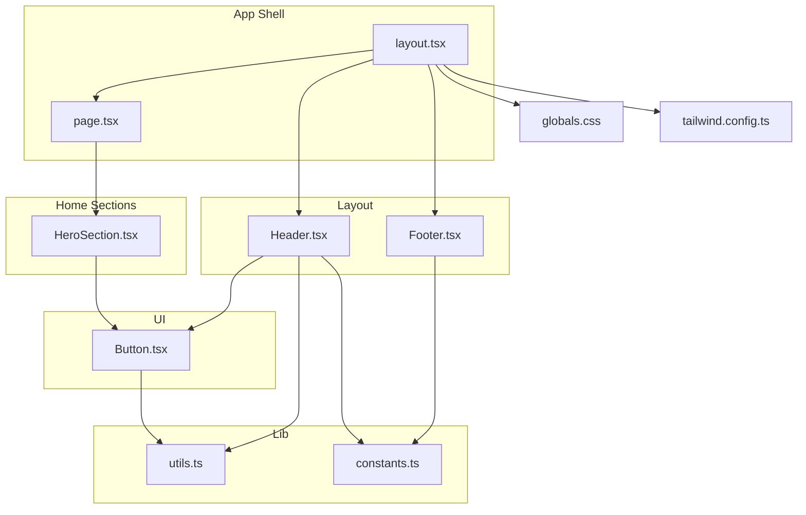
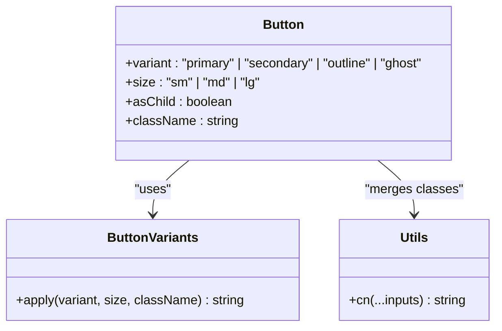
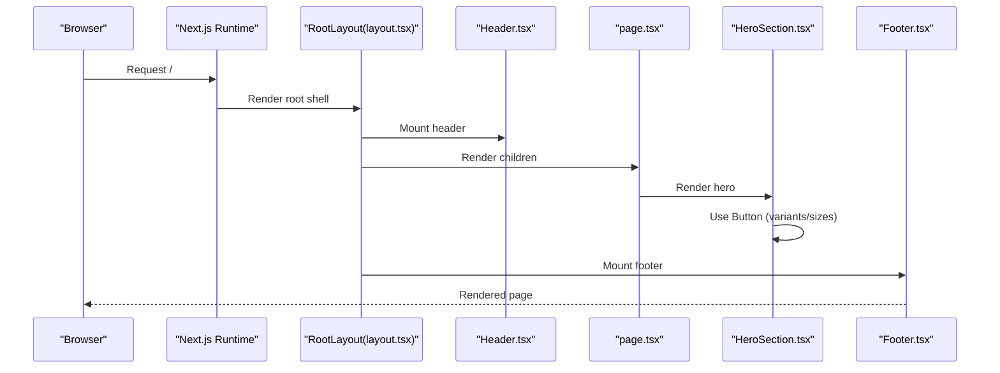
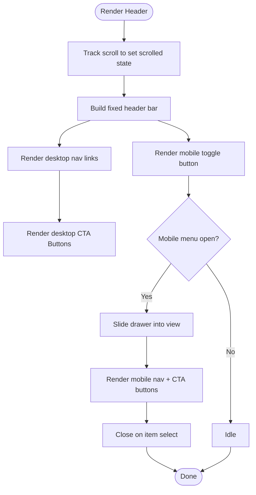
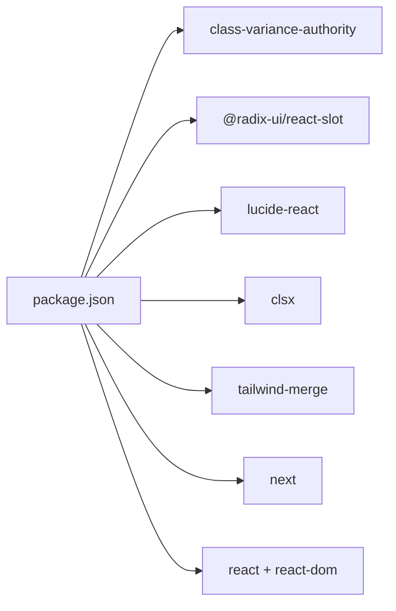

# Component Library

<cite>
**Referenced Files in This Document**
- [Button.tsx](file://smartview-portal/src/components/ui/Button.tsx)
- [Header.tsx](file://smartview-portal/src/components/layout/Header.tsx)
- [Footer.tsx](file://smartview-portal/src/components/layout/Footer.tsx)
- [layout.tsx](file://smartview-portal/src/app/layout.tsx)
- [page.tsx](file://smartview-portal/src/app/page.tsx)
- [HeroSection.tsx](file://smartview-portal/src/components/home/HeroSection.tsx)
- [utils.ts](file://smartview-portal/src/lib/utils.ts)
- [constants.ts](file://smartview-portal/src/lib/constants.ts)
- [globals.css](file://smartview-portal/src/app/globals.css)
- [tailwind.config.ts](file://smartview-portal/tailwind.config.ts)
- [package.json](file://smartview-portal/package.json)
</cite>

## Table of Contents
1. [Introduction](#introduction)
2. [Project Structure](#project-structure)
3. [Core Components](#core-components)
4. [Architecture Overview](#architecture-overview)
5. [Detailed Component Analysis](#detailed-component-analysis)
6. [Dependency Analysis](#dependency-analysis)
7. [Performance Considerations](#performance-considerations)
8. [Troubleshooting Guide](#troubleshooting-guide)
9. [Conclusion](#conclusion)
10. [Appendices](#appendices)

## Introduction
This document describes the SmartView Portal component library, focusing on reusable UI components and layout scaffolding. It explains the Button component’s variant and size system, accessibility features, and composition patterns. It also documents the Header and Footer layout components, including responsive behavior and integration points. The guide covers design system principles, component hierarchy, customization options, testing strategies, and maintenance considerations to help teams extend and maintain the library effectively.

## Project Structure
SmartView Portal organizes components by domain and reusability:
- UI primitives live under src/components/ui (e.g., Button).
- Layout scaffolding lives under src/components/layout (Header, Footer).
- Page-level sections live under src/components/home (e.g., HeroSection).
- Application shell wiring is handled in src/app/layout.tsx.
- Shared utilities and constants are under src/lib (utils, constants).
- Global styles and Tailwind configuration define the design system foundation.

**Diagram sources**
- [layout.tsx:1-33](file://smartview-portal/src/app/layout.tsx#L1-L33)
- [page.tsx:1-18](file://smartview-portal/src/app/page.tsx#L1-L18)
- [Header.tsx:1-131](file://smartview-portal/src/components/layout/Header.tsx#L1-L131)
- [Footer.tsx:1-127](file://smartview-portal/src/components/layout/Footer.tsx#L1-L127)
- [Button.tsx:1-54](file://smartview-portal/src/components/ui/Button.tsx#L1-L54)
- [HeroSection.tsx:1-125](file://smartview-portal/src/components/home/HeroSection.tsx#L1-L125)
- [utils.ts:1-7](file://smartview-portal/src/lib/utils.ts#L1-L7)
- [constants.ts:1-11](file://smartview-portal/src/lib/constants.ts#L1-L11)
- [globals.css:1-31](file://smartview-portal/src/app/globals.css#L1-L31)
- [tailwind.config.ts:1-20](file://smartview-portal/tailwind.config.ts#L1-L20)

**Section sources**
- [layout.tsx:1-33](file://smartview-portal/src/app/layout.tsx#L1-L33)
- [page.tsx:1-18](file://smartview-portal/src/app/page.tsx#L1-L18)
- [globals.css:1-31](file://smartview-portal/src/app/globals.css#L1-L31)
- [tailwind.config.ts:1-20](file://smartview-portal/tailwind.config.ts#L1-L20)

## Core Components
This section focuses on the reusable UI building blocks and their design system integration.

### Button Component
The Button component encapsulates a variant-driven design system with size options and accessibility-first behavior. It leverages a variant engine to compose base styles, variants, and sizes, while supporting semantic composition via a slot pattern.

Key characteristics:
- Variants: primary, secondary, outline, ghost.
- Sizes: sm, md, lg.
- Accessibility: focus-visible ring, disabled state handling, keyboard operable.
- Composition: supports asChild to render semantic anchors or other components.

**Diagram sources**
- [Button.tsx:6-31](file://smartview-portal/src/components/ui/Button.tsx#L6-L31)
- [Button.tsx:33-37](file://smartview-portal/src/components/ui/Button.tsx#L33-L37)
- [utils.ts:4-6](file://smartview-portal/src/lib/utils.ts#L4-L6)

Prop interface highlights:
- Inherits native HTML button attributes.
- Extends variant and size props from the variant engine.
- asChild enables rendering a child element (e.g., Link) instead of a button tag.

Accessibility features:
- Focus ring via focus-visible utilities.
- Disabled state prevents interactions and reduces opacity.
- Semantic composition allows anchor-based buttons without losing semantics.

Usage patterns:
- Primary call-to-action buttons.
- Secondary actions and ghost links.
- Outline buttons for less prominent actions.
- Size scaling for compact and spacious layouts.

Customization:
- Extend variants and sizes by adding new entries to the variant engine.
- Merge additional classes via className while preserving variant styles.
- Compose with Links using asChild to preserve routing semantics.

Integration examples:
- Header desktop CTAs.
- HeroSection primary and secondary actions.
- Footer mobile CTAs inside the mobile menu.

**Section sources**
- [Button.tsx:1-54](file://smartview-portal/src/components/ui/Button.tsx#L1-L54)
- [Header.tsx:63-70](file://smartview-portal/src/components/layout/Header.tsx#L63-L70)
- [Header.tsx:111-125](file://smartview-portal/src/components/layout/Header.tsx#L111-L125)
- [HeroSection.tsx:35-46](file://smartview-portal/src/components/home/HeroSection.tsx#L35-L46)
- [utils.ts:1-7](file://smartview-portal/src/lib/utils.ts#L1-L7)

## Architecture Overview
The application composes layout scaffolding around page-specific sections. The layout.tsx wires the Header and Footer into the app shell, while pages import home sections that use the Button primitive.

**Diagram sources**
- [layout.tsx:18-32](file://smartview-portal/src/app/layout.tsx#L18-L32)
- [page.tsx:7-17](file://smartview-portal/src/app/page.tsx#L7-L17)
- [Header.tsx:11-131](file://smartview-portal/src/components/layout/Header.tsx#L11-L131)
- [Footer.tsx:19-127](file://smartview-portal/src/components/layout/Footer.tsx#L19-L127)
- [HeroSection.tsx:4-46](file://smartview-portal/src/components/home/HeroSection.tsx#L4-L46)

## Detailed Component Analysis

### Header Component
Responsibilities:
- Fixed-position top bar with scroll-aware background and blur.
- Responsive navigation: desktop links, mobile hamburger menu.
- Mobile drawer with animated slide-in/out.
- Active link highlighting based on current route.
- Integrated Button usage for desktop and mobile CTAs.

Responsive behavior:
- Desktop: horizontal nav + CTAs.
- Mobile: hamburger toggles a full-screen drawer below the header.

Accessibility:
- Toggle button includes aria-label reflecting open/close state.
- Keyboard navigable menu items.

Composition patterns:
- Uses Button with asChild to render Link elements.
- Uses constants for site name and navigation links.
- Uses shared cn utility for conditional class merging.

**Diagram sources**
- [Header.tsx:16-23](file://smartview-portal/src/components/layout/Header.tsx#L16-L23)
- [Header.tsx:25-131](file://smartview-portal/src/components/layout/Header.tsx#L25-L131)
- [constants.ts:4-10](file://smartview-portal/src/lib/constants.ts#L4-L10)
- [utils.ts:4-6](file://smartview-portal/src/lib/utils.ts#L4-L6)

**Section sources**
- [Header.tsx:1-131](file://smartview-portal/src/components/layout/Header.tsx#L1-L131)
- [constants.ts:1-11](file://smartview-portal/src/lib/constants.ts#L1-L11)
- [utils.ts:1-7](file://smartview-portal/src/lib/utils.ts#L1-L7)

### Footer Component
Responsibilities:
- Multi-column layout (logo/description, products, company, contact).
- Copyright and legal links.
- Consistent spacing and typography using Tailwind utilities.

Structure:
- Top section: four-column grid adapting to breakpoints.
- Bottom section: copyright and legal links aligned responsively.

Styling approach:
- Uses Tailwind utilities for grid, spacing, and typography.
- Icons integrated via Lucide React.

**Section sources**
- [Footer.tsx:1-127](file://smartview-portal/src/components/layout/Footer.tsx#L1-L127)

### Home Sections and Button Integration
- HeroSection demonstrates primary and outline Button variants with lg sizing and custom overrides.
- Composition with Links preserves semantic anchor behavior while leveraging Button styles.

**Section sources**
- [HeroSection.tsx:35-46](file://smartview-portal/src/components/home/HeroSection.tsx#L35-L46)

## Dependency Analysis
External libraries and their roles:
- class-variance-authority: variant engine for Button.
- @radix-ui/react-slot: slot pattern for asChild composition.
- lucide-react: UI icons.
- clsx + tailwind-merge: safe class merging and deduplication.
- next, react, react-dom: framework/runtime.
- tailwindcss: utility-first styling.

**Diagram sources**
- [package.json:11-20](file://smartview-portal/package.json#L11-L20)

**Section sources**
- [package.json:1-32](file://smartview-portal/package.json#L1-L32)

## Performance Considerations
- Variant engine: Keep variant sets minimal and focused to avoid bloated CSS.
- Class merging: Prefer cn for conditional classes to reduce specificity conflicts.
- Icons: Import only used icons to limit bundle size.
- Layout: Avoid heavy animations on scroll; Header uses lightweight backdrop blur.
- Rendering: Use asChild to avoid unnecessary DOM wrappers when composing with Links.

## Troubleshooting Guide
Common issues and resolutions:
- Missing focus ring: Ensure focus-visible utilities are present in the design system.
- Disabled button still clickable: Verify disabled prop is passed and not overridden by className.
- asChild not working: Confirm asChild is true and the child supports forwarding refs and props.
- Mobile menu not closing: Check click handlers inside the mobile drawer call setIsMobileMenuOpen(false).
- Link styling mismatch: Use Button with asChild to inherit Button styles while keeping anchor semantics.

**Section sources**
- [Button.tsx:39-51](file://smartview-portal/src/components/ui/Button.tsx#L39-L51)
- [Header.tsx:73-83](file://smartview-portal/src/components/layout/Header.tsx#L73-L83)
- [Header.tsx:94-127](file://smartview-portal/src/components/layout/Header.tsx#L94-L127)

## Conclusion
The SmartView Portal component library establishes a clear design system with a robust Button primitive, a responsive Header, and a structured Footer. The variant-driven approach, combined with composition patterns and accessibility defaults, enables consistent UI development. By following the outlined extension strategies, testing practices, and maintenance guidelines, teams can reliably grow the library while preserving design integrity and developer ergonomics.

## Appendices

### Design System Principles
- Primitive-first: Start with small, composable primitives (Button).
- Variant-driven: Encapsulate style variations in a single variant engine.
- Composition over inheritance: Use asChild to wrap semantic elements.
- Accessibility-first: Defaults for focus, disabled states, and ARIA labels.
- Utility-first styling: Leverage Tailwind for rapid iteration and consistency.

### Component Hierarchy
- App shell: RootLayout wraps Header, page content, and Footer.
- Layout: Header and Footer provide global scaffolding.
- Pages: Compose home sections.
- Sections: Use Button and other primitives.

**Section sources**
- [layout.tsx:18-32](file://smartview-portal/src/app/layout.tsx#L18-L32)
- [page.tsx:7-17](file://smartview-portal/src/app/page.tsx#L7-L17)

### Extension Guidelines
- Adding a new Button variant:
  - Define variant tokens in the variant engine.
  - Add default and hover/active states.
  - Test with asChild and semantic anchors.
- Adding a new size:
  - Add size tokens and spacing rules.
  - Update default size and ensure consistent padding/height ratios.
- New layout component:
  - Place under src/components/layout.
  - Reuse cn and constants.
  - Integrate via RootLayout.

### Testing Strategies
- Unit tests for Button:
  - Verify variant classes apply correctly.
  - Verify size classes apply correctly.
  - Verify disabled state and focus ring presence.
  - Verify asChild renders the child element with forwarded props.
- Integration tests for Header/Footer:
  - Verify responsive behavior across breakpoints.
  - Verify mobile drawer toggling and close-on-select.
  - Verify active link highlighting based on pathname.
- Accessibility tests:
  - Use automated tools to check focus order and ARIA labels.
  - Manual checks for keyboard navigation and screen reader compatibility.

### Maintenance Considerations
- Keep variant engine centralized and documented.
- Avoid ad-hoc overrides; prefer extending variants/sizes.
- Regularly audit unused icons and remove them.
- Monitor Tailwind purge to prevent missing utilities.
- Update dependencies incrementally and test Button and layout rendering after updates.