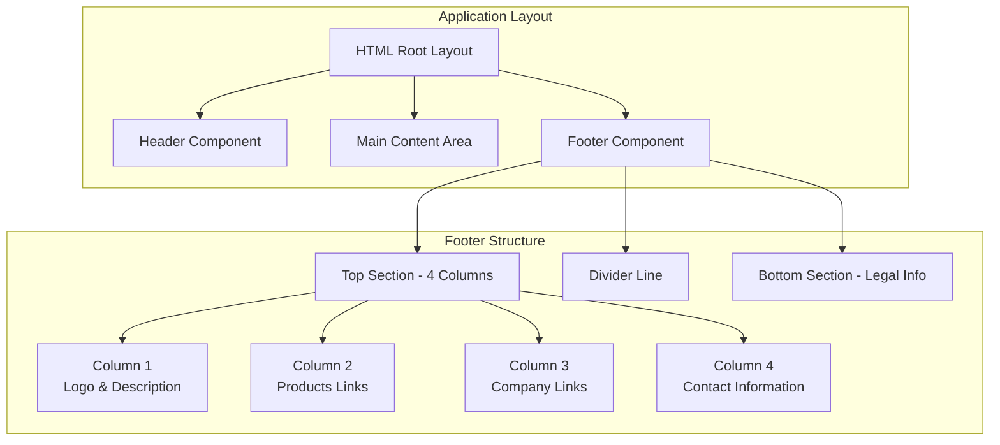
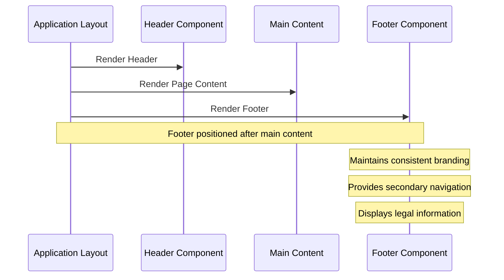
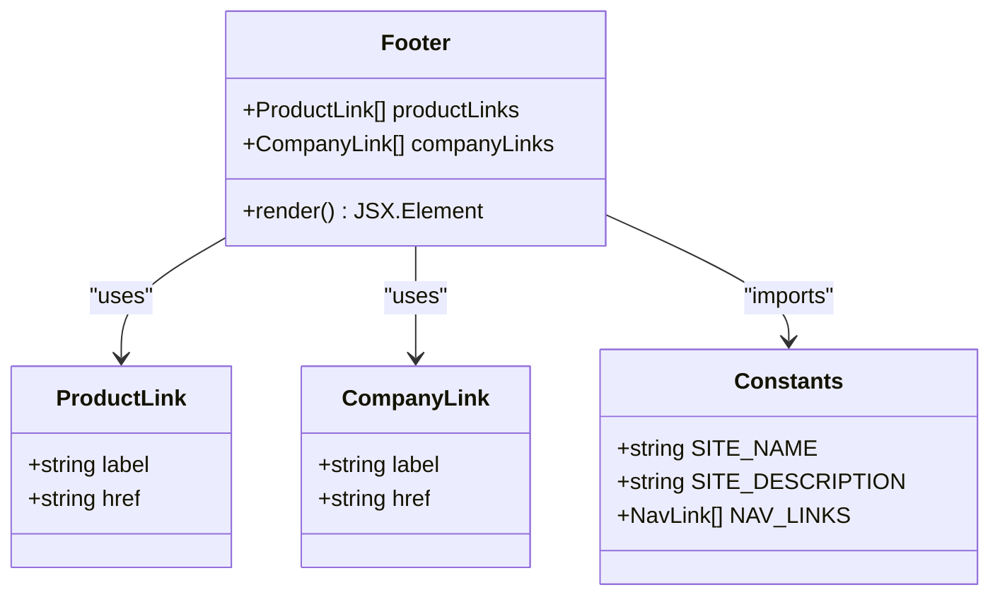
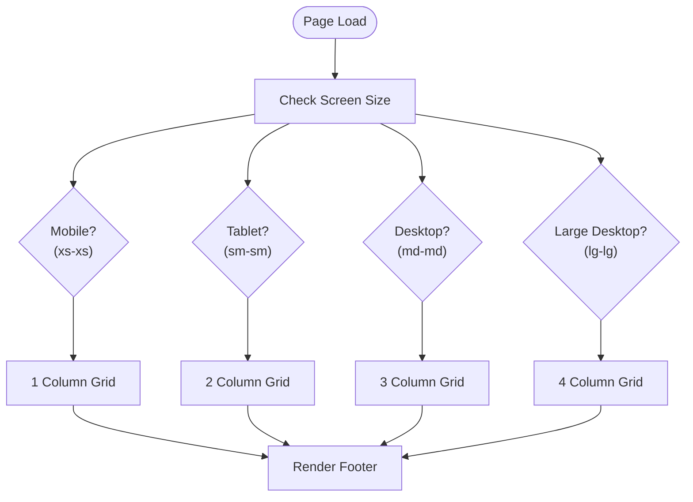
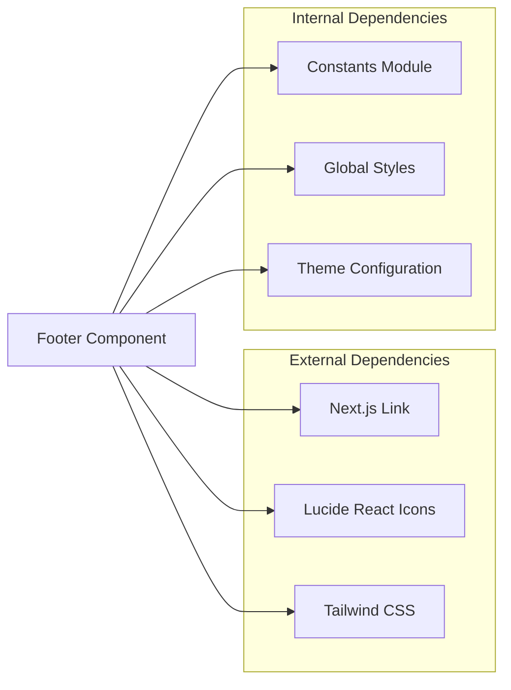

# Footer Component

<cite>
**Referenced Files in This Document**
- [Footer.tsx](file://smartview-portal/src/components/layout/Footer.tsx)
- [layout.tsx](file://smartview-portal/src/app/layout.tsx)
- [constants.ts](file://smartview-portal/src/lib/constants.ts)
- [globals.css](file://smartview-portal/src/app/globals.css)
- [tailwind.config.ts](file://smartview-portal/tailwind.config.ts)
- [package.json](file://smartview-portal/package.json)
</cite>

## Table of Contents
1. [Introduction](#introduction)
2. [Project Structure](#project-structure)
3. [Core Components](#core-components)
4. [Architecture Overview](#architecture-overview)
5. [Detailed Component Analysis](#detailed-component-analysis)
6. [Dependency Analysis](#dependency-analysis)
7. [Performance Considerations](#performance-considerations)
8. [Accessibility Considerations](#accessibility-considerations)
9. [Customization Guide](#customization-guide)
10. [Troubleshooting Guide](#troubleshooting-guide)
11. [Conclusion](#conclusion)

## Introduction

The Footer component serves as the primary secondary navigation and informational hub for the SmartView Portal application. It provides essential navigation links, company information, contact details, and legal compliance information while maintaining consistent branding across all pages of the application. Built with Next.js and Tailwind CSS, the footer implements a responsive grid layout that adapts seamlessly from mobile devices to desktop screens.

## Project Structure

The footer component is strategically positioned within the application's layout architecture, ensuring consistent presentation across all pages while providing essential navigation and informational content.



**Diagram sources**
- [layout.tsx:18-32](file://smartview-portal/src/app/layout.tsx#L18-L32)
- [Footer.tsx:19-126](file://smartview-portal/src/components/layout/Footer.tsx#L19-L126)

**Section sources**
- [layout.tsx:18-32](file://smartview-portal/src/app/layout.tsx#L18-L32)
- [Footer.tsx:19-126](file://smartview-portal/src/components/layout/Footer.tsx#L19-L126)

## Core Components

The Footer component consists of three primary structural elements that work together to provide comprehensive information and navigation:

### Structural Organization

The footer implements a four-column grid layout in the top section, each column serving a specific informational purpose:

1. **Logo and Site Description Column**: Contains the SmartView branding with logo and site description
2. **Products Navigation Column**: Provides access to core product offerings
3. **Company Information Column**: Links to corporate information pages
4. **Contact Information Column**: Displays contact details with visual icons

### Responsive Layout Implementation

The footer employs a sophisticated responsive design system that adapts to different screen sizes:

- **Mobile (xs-xs):** Single column layout with stacked content
- **Tablet (sm-sm):** Two-column layout for optimal readability
- **Desktop (md-md):** Three-column layout balancing information density
- **Large Desktop (lg-lg):** Four-column grid for maximum information display

### Content Organization

Content is organized using semantic HTML elements with clear visual hierarchy:
- **Typography:** Consistent font sizing with emphasis on headings and navigation links
- **Color Scheme:** Dark theme with blue accents for brand consistency
- **Spacing:** Strategic padding and margins for visual breathing room
- **Icons:** Lucide React icons integrated for visual enhancement

**Section sources**
- [Footer.tsx:24-99](file://smartview-portal/src/components/layout/Footer.tsx#L24-L99)

## Architecture Overview

The footer integrates seamlessly with the overall application architecture, positioned as the final major component in the layout hierarchy.



**Diagram sources**
- [layout.tsx:26-28](file://smartview-portal/src/app/layout.tsx#L26-L28)
- [Footer.tsx:19-126](file://smartview-portal/src/components/layout/Footer.tsx#L19-L126)

The footer's architectural position ensures it remains visible across all pages while maintaining separation from the main content area. This design choice enhances user experience by providing consistent navigation and information access regardless of the current page context.

**Section sources**
- [layout.tsx:26-28](file://smartview-portal/src/app/layout.tsx#L26-L28)

## Detailed Component Analysis

### Footer Structure and Implementation

The footer component demonstrates excellent separation of concerns through its modular design:



**Diagram sources**
- [Footer.tsx:5-17](file://smartview-portal/src/components/layout/Footer.tsx#L5-L17)
- [constants.ts:1-10](file://smartview-portal/src/lib/constants.ts#L1-L10)

### Grid Layout System

The footer implements a responsive grid system that transforms based on screen size:



**Diagram sources**
- [Footer.tsx:24](file://smartview-portal/src/components/layout/Footer.tsx#L24)

### Content Sections Breakdown

Each content section serves a distinct purpose in the user experience:

#### Top Section - Informational Grid

The top section utilizes a four-column layout for maximum information density:

| Column | Purpose | Content Type | Responsive Behavior |
|--------|---------|--------------|-------------------|
| Column 1 | Brand Identity | Logo + Site Description | Always visible |
| Column 2 | Product Navigation | Feature links | Visible on all devices |
| Column 3 | Company Information | Corporate links | Visible on all devices |
| Column 4 | Contact Details | Email + Location | Visible on all devices |

#### Bottom Section - Legal Compliance

The bottom section focuses on legal and compliance information:

- **Copyright Notice:** Dynamic year with site name
- **Legal Links:** Terms of Service and Privacy Policy
- **Responsive Alignment:** Flexbox layout for proper spacing

**Section sources**
- [Footer.tsx:19-126](file://smartview-portal/src/components/layout/Footer.tsx#L19-L126)

## Dependency Analysis

The footer component maintains minimal external dependencies while leveraging the application's established infrastructure:



**Diagram sources**
- [Footer.tsx:1-3](file://smartview-portal/src/components/layout/Footer.tsx#L1-L3)
- [constants.ts:1-2](file://smartview-portal/src/lib/constants.ts#L1-L2)

### External Library Dependencies

The footer relies on three primary external libraries:

1. **Next.js Link Component:** Provides client-side navigation without page reloads
2. **Lucide React Icons:** Delivers consistent iconography across the application
3. **Tailwind CSS:** Enables rapid responsive design implementation

### Internal Integration Points

The footer integrates with several internal systems:

- **Constants Module:** Centralized configuration for site-wide information
- **Global Styles:** Consistent typography and spacing standards
- **Theme Configuration:** Responsive breakpoint management

**Section sources**
- [Footer.tsx:1-3](file://smartview-portal/src/components/layout/Footer.tsx#L1-L3)
- [constants.ts:1-10](file://smartview-portal/src/lib/constants.ts#L1-L10)

## Performance Considerations

The footer component is designed with performance optimization in mind:

### Rendering Efficiency

- **Static Content:** All footer content is static, eliminating unnecessary re-renders
- **Minimal State:** No local state management reduces computational overhead
- **Pure Component:** Stateless functional component maximizes React performance benefits

### Bundle Size Impact

- **Icon Loading:** Lucide icons are tree-shaken, loading only used icons
- **CSS Optimization:** Tailwind utility classes are purged during build process
- **Dependency Management:** Minimal external dependencies reduce bundle size

### Accessibility Performance

- **Semantic HTML:** Proper heading hierarchy improves SEO and accessibility
- **Keyboard Navigation:** Full keyboard support for all interactive elements
- **Screen Reader Compatibility:** ARIA labels and semantic markup

## Accessibility Considerations

The footer component implements comprehensive accessibility features:

### Semantic Structure

- **Proper Headings:** Logical heading hierarchy (H3 for section titles)
- **Landmark Roles:** Semantic footer element with clear content organization
- **List Structure:** Unordered lists for navigation items improve screen reader navigation

### Color Contrast and Visual Design

- **High Contrast Text:** Sufficient contrast ratios for text and backgrounds
- **Color Blind Friendly:** Color choices suitable for color-blind users
- **Focus Indicators:** Clear visual focus states for keyboard navigation

### Interactive Elements

- **Hover States:** Sufficient color changes for interactive elements
- **Touch Targets:** Adequate size for mobile touch interaction
- **Keyboard Accessible:** Full navigation support via keyboard

### Screen Reader Optimization

- **Descriptive Links:** Meaningful link text without generic phrases
- **Skip Links:** Potential for skip navigation to main content
- **ARIA Labels:** Appropriate ARIA attributes for complex interactions

## Customization Guide

The footer component offers extensive customization options while maintaining its core functionality:

### Content Customization

#### Adding New Navigation Links

To add new product or company links, modify the respective arrays:

```typescript
// Add new product link
const productLinks = [
  // ... existing links
  { label: "New Feature", href: "/new-feature" }
];

// Add new company link  
const companyLinks = [
  // ... existing links
  { label: "Careers", href: "/careers" }
];
```

#### Branding Modifications

Update brand information through the constants module:

```typescript
// Update site name and description
export const SITE_NAME = "Your New Brand Name";
export const SITE_DESCRIPTION = "Your New Brand Description";
```

### Styling Customization

#### Color Scheme Modifications

The footer uses a dark theme by default. Modify colors through Tailwind configuration:

```css
/* In your CSS or Tailwind configuration */
.bg-gray-900 { background-color: #your-dark-color; }
.text-white { color: #your-text-color; }
.text-gray-400 { color: #your-secondary-color; }
```

#### Typography Adjustments

Customize font sizes and weights through Tailwind utilities:

```html
<!-- Example: Larger heading font size -->
<h3 class="text-xl font-bold uppercase tracking-wider text-gray-300 mb-4">
```

### Layout Customization

#### Grid Layout Modifications

Adjust the responsive grid behavior by modifying the grid classes:

```html
<!-- Example: Change from 4 to 3 columns on medium screens -->
<div class="grid grid-cols-1 md:grid-cols-3 lg:grid-cols-4 gap-8 lg:gap-12">
```

#### Spacing and Padding

Modify spacing through Tailwind padding and margin utilities:

```html
<!-- Example: Increase vertical spacing -->
<div class="py-16 lg:py-20">
```

### Integration Best Practices

#### Consistent Branding Across Pages

Ensure footer consistency by:

- Using the same constants module for all pages
- Maintaining identical color schemes and typography
- Keeping navigation links synchronized across the application

#### Mobile Responsiveness

Test footer responsiveness across various devices:

- iPhone SE (3.5"): Ensure single column layout
- iPad (7.9"): Verify two-column grid
- Desktop (1080p+): Confirm four-column grid

**Section sources**
- [Footer.tsx:5-17](file://smartview-portal/src/components/layout/Footer.tsx#L5-L17)
- [constants.ts:1-10](file://smartview-portal/src/lib/constants.ts#L1-L10)

## Troubleshooting Guide

Common issues and their solutions when working with the footer component:

### Layout Issues

#### Grid Layout Problems

**Issue:** Footer columns overlap on smaller screens
**Solution:** Verify responsive grid classes are properly applied
- Ensure `grid-cols-1 md:grid-cols-2 lg:grid-cols-4` classes are present
- Check for conflicting CSS that might override grid behavior

#### Content Overflow

**Issue:** Long text causes layout distortion
**Solution:** Implement text wrapping and overflow handling
- Use `text-wrap: balance` utility for balanced text
- Apply `overflow-hidden` to prevent content overflow

### Styling Problems

#### Color Contrast Issues

**Issue:** Poor readability on certain backgrounds
**Solution:** Adjust color values in Tailwind configuration
- Verify contrast ratios meet WCAG guidelines
- Test color combinations across different themes

#### Icon Display Problems

**Issue:** Icons not rendering correctly
**Solution:** Check Lucide React installation and imports
- Verify `lucide-react` is properly installed
- Ensure correct icon names and sizes are used

### Performance Issues

#### Slow Loading Times

**Issue:** Footer appears slowly or causes layout shifts
**Solution:** Optimize rendering and loading
- Minimize heavy computations in render
- Use CSS transitions instead of JavaScript animations
- Implement lazy loading for non-critical content

### Accessibility Concerns

#### Screen Reader Issues

**Issue:** Screen readers don't announce footer content properly
**Solution:** Enhance semantic structure and labeling
- Add proper ARIA roles and labels
- Ensure logical tab order
- Provide skip links to footer content

**Section sources**
- [Footer.tsx:19-126](file://smartview-portal/src/components/layout/Footer.tsx#L19-L126)

## Conclusion

The Footer component represents a well-architected solution for providing secondary navigation and informational content in the SmartView Portal application. Its responsive design, consistent branding, and accessibility features make it an integral part of the user experience across all pages.

Key strengths of the implementation include:

- **Responsive Design:** Sophisticated grid system that adapts to all screen sizes
- **Consistent Branding:** Unified color scheme and typography throughout
- **Accessibility Compliance:** Comprehensive accessibility features and semantic structure
- **Performance Optimization:** Lightweight implementation with minimal dependencies
- **Extensibility:** Well-structured code that allows for easy customization

The component successfully fulfills its role as a secondary navigation hub while maintaining the overall aesthetic and functional goals of the SmartView Portal application. Its modular design and clear separation of concerns ensure maintainability and future extensibility.