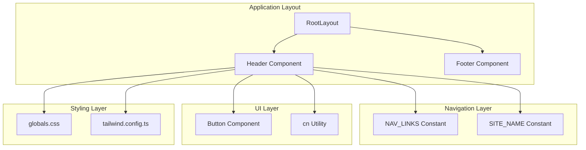
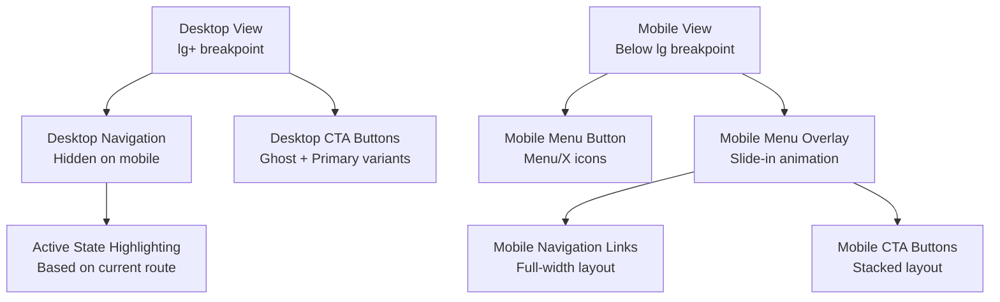
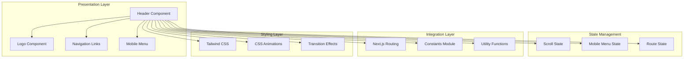
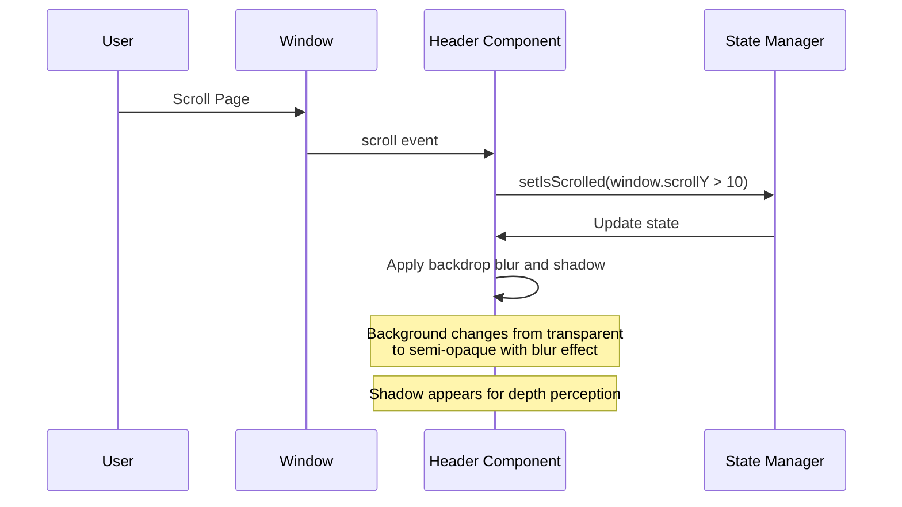
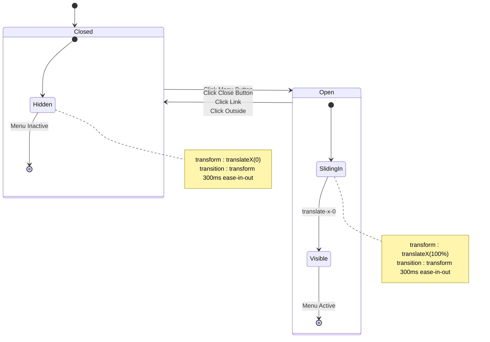
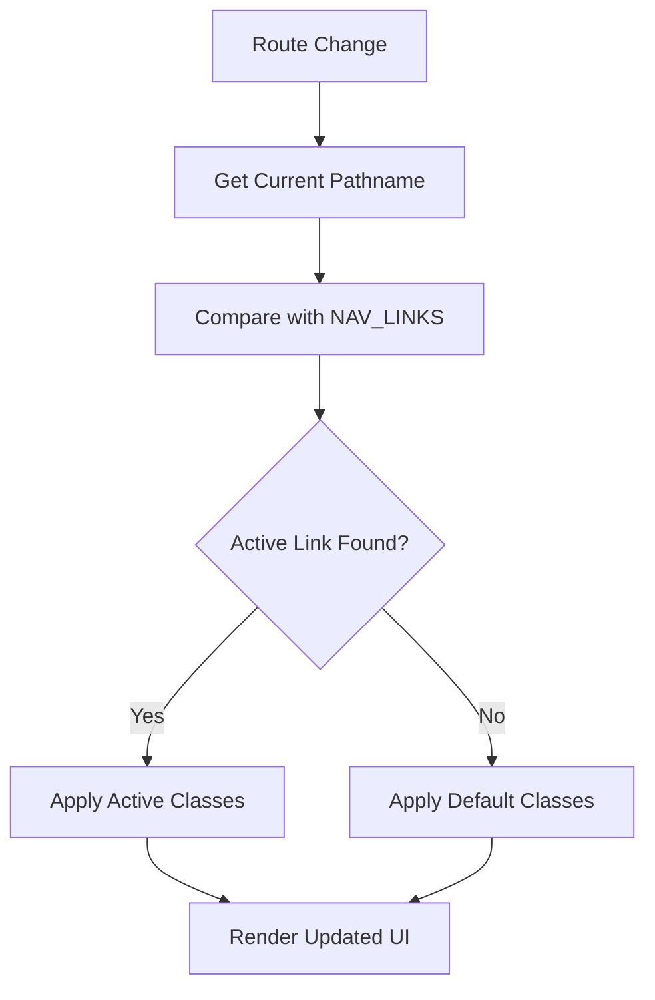
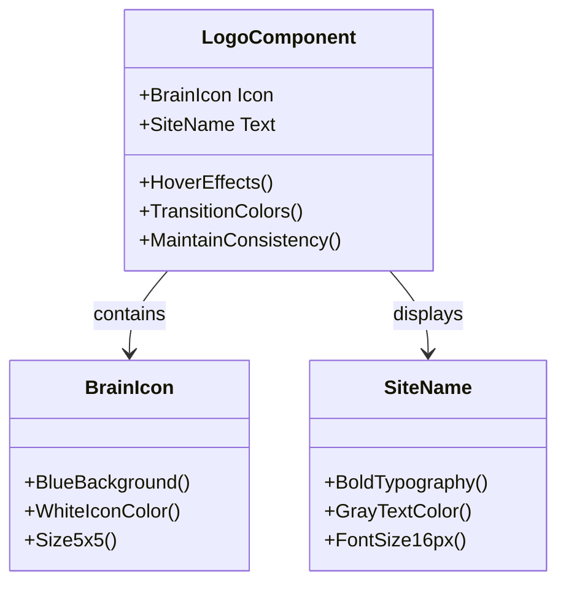
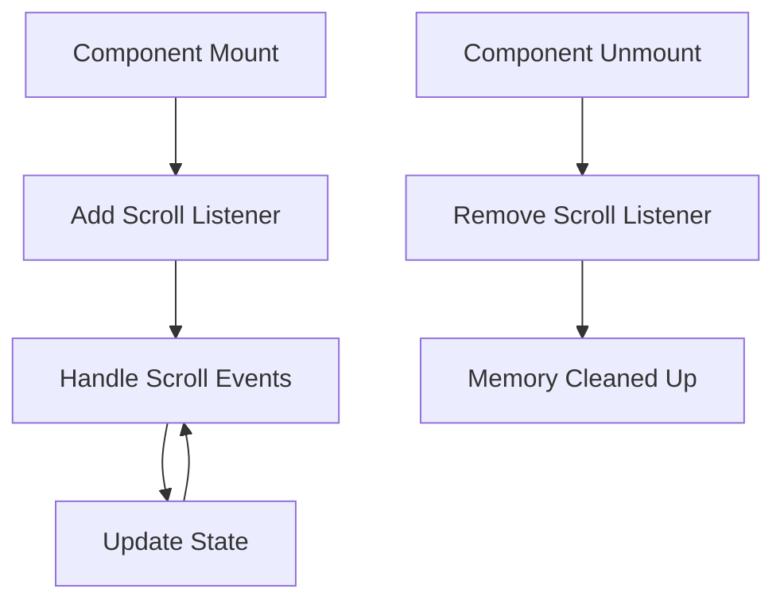

# Header Component

<cite>
**Referenced Files in This Document**
- [Header.tsx](file://smartview-portal/src/components/layout/Header.tsx)
- [constants.ts](file://smartview-portal/src/lib/constants.ts)
- [layout.tsx](file://smartview-portal/src/app/layout.tsx)
- [Button.tsx](file://smartview-portal/src/components/ui/Button.tsx)
- [utils.ts](file://smartview-portal/src/lib/utils.ts)
- [globals.css](file://smartview-portal/src/app/globals.css)
- [tailwind.config.ts](file://smartview-portal/tailwind.config.ts)
- [Footer.tsx](file://smartview-portal/src/components/layout/Footer.tsx)
- [package.json](file://smartview-portal/package.json)
</cite>

## Table of Contents
1. [Introduction](#introduction)
2. [Project Structure](#project-structure)
3. [Core Components](#core-components)
4. [Architecture Overview](#architecture-overview)
5. [Detailed Component Analysis](#detailed-component-analysis)
6. [Dependency Analysis](#dependency-analysis)
7. [Performance Considerations](#performance-considerations)
8. [Troubleshooting Guide](#troubleshooting-guide)
9. [Conclusion](#conclusion)

## Introduction
The Header component serves as the primary navigation element for SmartView Portal, providing responsive navigation across desktop and mobile devices. It implements sophisticated scroll effects with backdrop blur and shadow transitions, offers a comprehensive mobile menu with slide-in animations, and integrates seamlessly with Next.js routing for active state highlighting.

## Project Structure
The Header component is part of a modular component architecture within the SmartView Portal application:



**Diagram sources**
- [layout.tsx:18-32](file://smartview-portal/src/app/layout.tsx#L18-L32)
- [Header.tsx:11-131](file://smartview-portal/src/components/layout/Header.tsx#L11-L131)

**Section sources**
- [layout.tsx:18-32](file://smartview-portal/src/app/layout.tsx#L18-L32)
- [Header.tsx:11-131](file://smartview-portal/src/components/layout/Header.tsx#L11-L131)

## Core Components
The Header component consists of several interconnected elements that work together to provide a cohesive navigation experience:

### Navigation Structure
The component utilizes a centralized navigation system defined in constants:

| Component | Purpose | Implementation |
|-----------|---------|----------------|
| **Logo Area** | Brand identity and site navigation | Brain icon with site name, hover effects |
| **Desktop Navigation** | Primary links for larger screens | Hidden on mobile, visible from lg breakpoint |
| **CTA Buttons** | Call-to-action elements | Ghost and primary variants for login/register |
| **Mobile Menu** | Slide-in navigation for small screens | Full-screen overlay with animated transitions |

### Responsive Design Implementation
The component implements a comprehensive responsive strategy with multiple breakpoints:



**Diagram sources**
- [Header.tsx:34-84](file://smartview-portal/src/components/layout/Header.tsx#L34-L84)
- [Header.tsx:87-127](file://smartview-portal/src/components/layout/Header.tsx#L87-L127)

**Section sources**
- [Header.tsx:34-127](file://smartview-portal/src/components/layout/Header.tsx#L34-L127)

## Architecture Overview
The Header component follows a layered architecture pattern with clear separation of concerns:



**Diagram sources**
- [Header.tsx:11-131](file://smartview-portal/src/components/layout/Header.tsx#L11-L131)
- [constants.ts:1-11](file://smartview-portal/src/lib/constants.ts#L1-L11)

**Section sources**
- [Header.tsx:11-131](file://smartview-portal/src/components/layout/Header.tsx#L11-L131)
- [constants.ts:1-11](file://smartview-portal/src/lib/constants.ts#L1-L11)

## Detailed Component Analysis

### Scroll Effect Implementation
The header implements sophisticated scroll effects that enhance user experience through visual feedback:

#### Scroll Detection Mechanism
The component uses a scroll threshold of 10 pixels to trigger visual changes:



**Diagram sources**
- [Header.tsx:16-23](file://smartview-portal/src/components/layout/Header.tsx#L16-L23)

#### Visual Transformations
The scroll effect applies multiple visual transformations:

| State | Background | Blur Effect | Shadow | Transition Duration |
|-------|------------|-------------|--------|-------------------|
| **Default** | Transparent | None | None | 300ms |
| **Scrolled (>10px)** | Semi-opaque white | Backdrop blur | Soft shadow | 300ms |

**Section sources**
- [Header.tsx:16-32](file://smartview-portal/src/components/layout/Header.tsx#L16-L32)

### Mobile Menu Implementation
The mobile menu provides a comprehensive navigation solution for smaller screens:

#### Animation System
The mobile menu uses a sophisticated slide-in/out animation system:



**Diagram sources**
- [Header.tsx:87-127](file://smartview-portal/src/components/layout/Header.tsx#L87-L127)

#### State Management
The mobile menu implements robust state management:

| State Property | Type | Purpose | Default Value |
|----------------|------|---------|---------------|
| **isMobileMenuOpen** | boolean | Controls menu visibility | false |
| **Menu Trigger** | function | Toggle menu state | useState hook |
| **Accessibility** | string | ARIA labels for screen readers | Dynamic based on state |

**Section sources**
- [Header.tsx:13-131](file://smartview-portal/src/components/layout/Header.tsx#L13-L131)

### Navigation Link Rendering
The component renders navigation links using the centralized NAV_LINKS constant:

#### Link Structure
Each navigation link follows a standardized structure:

| Property | Type | Description | Example |
|----------|------|-------------|---------|
| **label** | string | Display text for the link | "首页" |
| **href** | string | Destination URL | "/" |
| **activeClass** | string | CSS class for active state | "text-blue-600 bg-blue-50" |
| **hoverClass** | string | CSS class for hover state | "text-blue-600 hover:bg-gray-50" |

#### Active State Management
The component integrates with Next.js routing to highlight active links:



**Diagram sources**
- [Header.tsx:46-59](file://smartview-portal/src/components/layout/Header.tsx#L46-L59)
- [Header.tsx:95-109](file://smartview-portal/src/components/layout/Header.tsx#L95-L109)

**Section sources**
- [constants.ts:4-10](file://smartview-portal/src/lib/constants.ts#L4-L10)
- [Header.tsx:46-109](file://smartview-portal/src/components/layout/Header.tsx#L46-L109)

### Logo Component Implementation
The logo component combines branding elements with interactive functionality:

#### Visual Elements
The logo consists of two primary components:

| Element | Component | Styling | Purpose |
|---------|-----------|---------|---------|
| **Icon Container** | Brain icon wrapper | Blue background, rounded corners | Brand recognition |
| **Text Element** | Site name | Bold typography, hover effects | Brand identity |

#### Interactive Features
The logo implements hover effects and maintains consistent styling:



**Diagram sources**
- [Header.tsx:37-42](file://smartview-portal/src/components/layout/Header.tsx#L37-L42)

**Section sources**
- [Header.tsx:37-42](file://smartview-portal/src/components/layout/Header.tsx#L37-L42)
- [constants.ts:1](file://smartview-portal/src/lib/constants.ts#L1)

### CTA Button Placement
The component implements strategic call-to-action placement for optimal conversion:

#### Desktop CTA Strategy
Two distinct button styles serve different user intents:

| Button Type | Variant | Purpose | Location |
|-------------|---------|---------|----------|
| **Ghost Button** | Secondary action | Login access | Left side |
| **Primary Button** | Primary action | Registration | Right side |

#### Mobile CTA Adaptation
Mobile layout adapts CTA buttons for touch interaction:

| Aspect | Desktop | Mobile |
|--------|---------|--------|
| **Layout** | Side-by-side | Stacked vertically |
| **Button Size** | Medium | Large |
| **Spacing** | Compact | Generous padding |
| **Touch Target** | Sufficient | Enhanced accessibility |

**Section sources**
- [Header.tsx:63-70](file://smartview-portal/src/components/layout/Header.tsx#L63-L70)
- [Header.tsx:111-125](file://smartview-portal/src/components/layout/Header.tsx#L111-L125)

## Dependency Analysis
The Header component relies on several external dependencies and internal modules:

```mermaid
graph LR
subgraph "External Dependencies"
NextJS[Next.js 14.2.35]
LucideReact[lucide-react 1.7.0]
RadixUI[@radix-ui/react-slot]
ClassVariants[class-variance-authority]
end
subgraph "Internal Dependencies"
Constants[constants.ts]
Utils[utils.ts]
Button[Button.tsx]
end
subgraph "Styling Dependencies"
Tailwind[Tailwind CSS]
CSS[globals.css]
end
Header --> NextJS
Header --> LucideReact
Header --> RadixUI
Header --> ClassVariants
Header --> Constants
Header --> Utils
Header --> Button
Header --> Tailwind
Header --> CSS
```

**Diagram sources**
- [Header.tsx:4-9](file://smartview-portal/src/components/layout/Header.tsx#L4-L9)
- [package.json:11-20](file://smartview-portal/package.json#L11-L20)

### Key Dependencies Analysis

| Dependency | Version | Purpose | Integration |
|------------|---------|---------|-------------|
| **Next.js** | 14.2.35 | Routing, SSR, Navigation | usePathname, Link component |
| **lucide-react** | 1.7.0 | Icons (Menu, X, Brain) | Visual elements |
| **@radix-ui/react-slot** | ^1.2.4 | Flexible component rendering | Button component |
| **class-variance-authority** | ^0.7.1 | Variant-based styling | Button variants |
| **clsx** | ^2.1.1 | Conditional class merging | Utility function |
| **tailwind-merge** | ^3.5.0 | Tailwind CSS class merging | Optimized styling |

**Section sources**
- [package.json:11-20](file://smartview-portal/package.json#L11-L20)
- [Header.tsx:4-9](file://smartview-portal/src/components/layout/Header.tsx#L4-L9)

## Performance Considerations

### Scroll Handler Optimization
The scroll handler implements efficient memory management:

#### Event Listener Management
The component properly manages scroll event listeners to prevent memory leaks:



**Diagram sources**
- [Header.tsx:16-23](file://smartview-portal/src/components/layout/Header.tsx#L16-L23)

#### Performance Best Practices
| Optimization | Implementation | Benefit |
|------------|----------------|---------|
| **Debounced Scrolling** | Threshold-based updates | Reduced re-renders |
| **Cleanup Functions** | useEffect cleanup | Prevent memory leaks |
| **Conditional Rendering** | Mobile/desktop states | Optimize DOM tree |
| **CSS Transitions** | Hardware-accelerated | Smooth animations |

### Mobile Menu State Management
The mobile menu implements efficient state management:

#### State Optimization
The component uses minimal state updates to maintain performance:

| State Update | Trigger | Optimization |
|--------------|---------|--------------|
| **Menu Toggle** | Button click | Immediate state change |
| **Link Selection** | Mobile link click | Automatic close + state update |
| **Route Changes** | Navigation | No manual state updates needed |

**Section sources**
- [Header.tsx:16-23](file://smartview-portal/src/components/layout/Header.tsx#L16-L23)
- [Header.tsx:73-83](file://smartview-portal/src/components/layout/Header.tsx#L73-L83)

## Troubleshooting Guide

### Common Issues and Solutions

#### Scroll Effect Not Working
**Problem**: Header doesn't change appearance on scroll
**Solution**: Verify scroll threshold and CSS classes are properly applied

#### Mobile Menu Not Responding
**Problem**: Mobile menu doesn't open/close
**Solution**: Check state management and event handlers

#### Active State Not Highlighting
**Problem**: Navigation links don't show active state
**Solution**: Verify pathname comparison and CSS classes

#### Accessibility Issues
**Problem**: Screen reader compatibility problems
**Solution**: Ensure proper ARIA labels and keyboard navigation

### Debugging Checklist
1. **Console Logs**: Check for JavaScript errors in browser console
2. **Network Tab**: Verify all assets load correctly
3. **Elements Panel**: Inspect computed styles and class application
4. **Performance Tab**: Monitor scroll performance and memory usage

**Section sources**
- [Header.tsx:16-23](file://smartview-portal/src/components/layout/Header.tsx#L16-L23)
- [Header.tsx:73-83](file://smartview-portal/src/components/layout/Header.tsx#L73-L83)

## Conclusion
The Header component demonstrates excellent implementation of modern web development practices, combining responsive design principles with advanced state management and performance optimization. Its modular architecture allows for easy customization while maintaining consistency across the application.

Key strengths include:
- **Responsive Design**: Seamless adaptation between desktop and mobile experiences
- **Performance Optimization**: Efficient state management and memory cleanup
- **Accessibility**: Proper ARIA labels and keyboard navigation support
- **Extensibility**: Modular design allowing for easy customization and maintenance

The component serves as a robust foundation for the SmartView Portal's navigation system, providing both functional utility and aesthetic appeal across all device types.