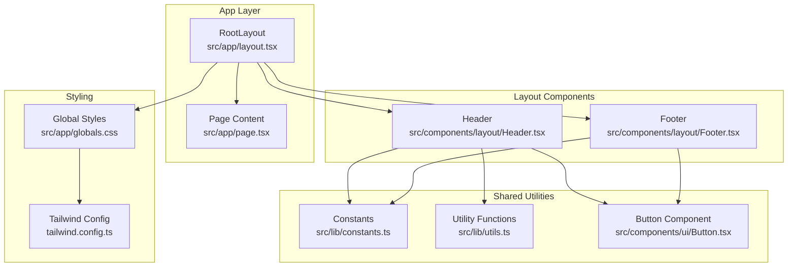
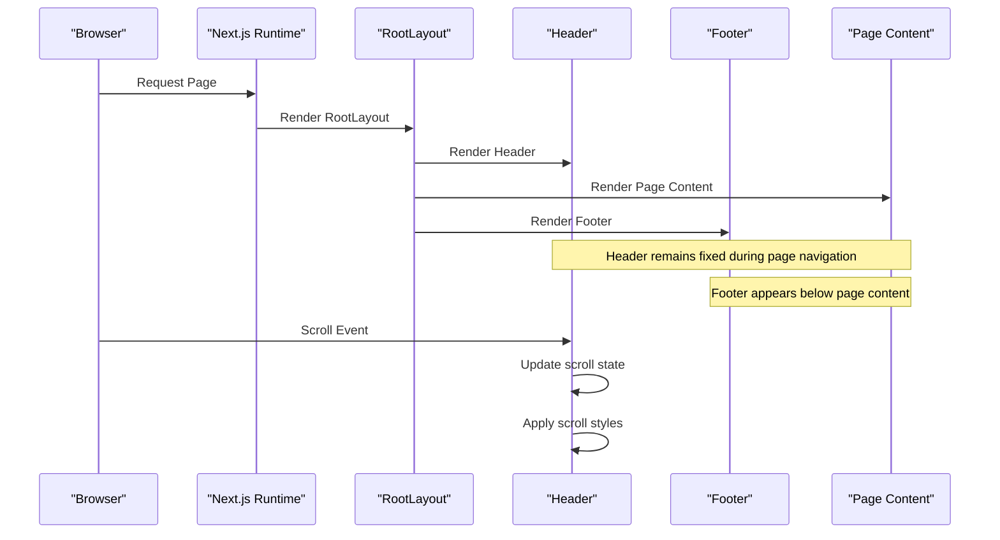
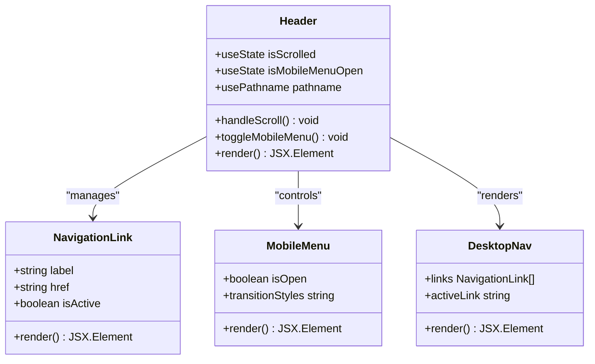
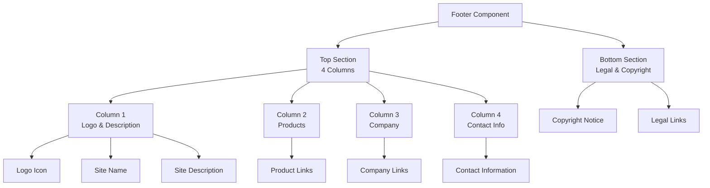
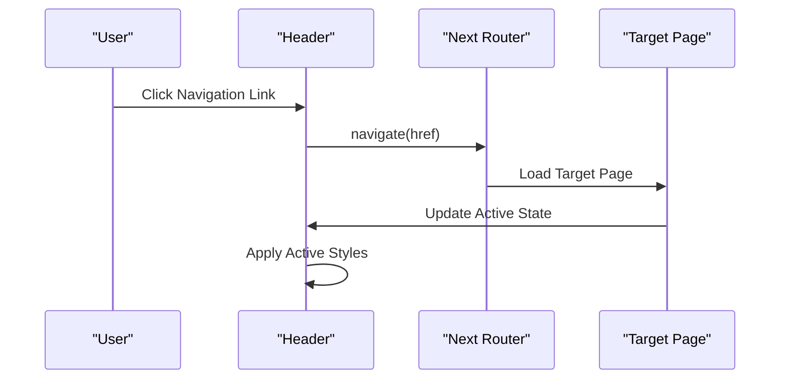
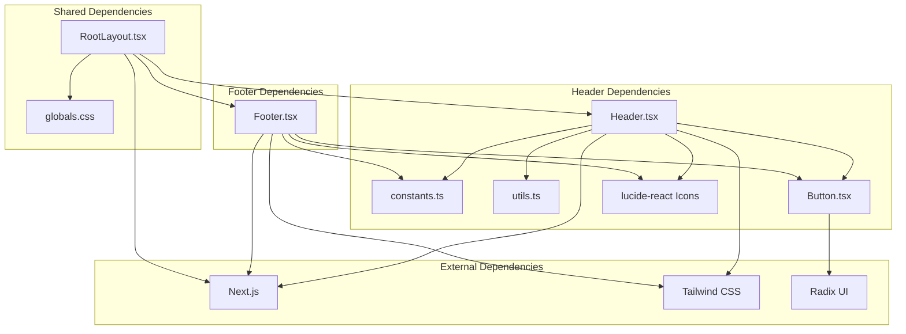

# Layout Components

<cite>
**Referenced Files in This Document**
- [Header.tsx](file://smartview-portal/src/components/layout/Header.tsx)
- [Footer.tsx](file://smartview-portal/src/components/layout/Footer.tsx)
- [layout.tsx](file://smartview-portal/src/app/layout.tsx)
- [constants.ts](file://smartview-portal/src/lib/constants.ts)
- [utils.ts](file://smartview-portal/src/lib/utils.ts)
- [Button.tsx](file://smartview-portal/src/components/ui/Button.tsx)
- [globals.css](file://smartview-portal/src/app/globals.css)
- [tailwind.config.ts](file://smartview-portal/tailwind.config.ts)
- [page.tsx](file://smartview-portal/src/app/page.tsx)
- [package.json](file://smartview-portal/package.json)
</cite>

## Table of Contents
1. [Introduction](#introduction)
2. [Project Structure](#project-structure)
3. [Core Components](#core-components)
4. [Architecture Overview](#architecture-overview)
5. [Detailed Component Analysis](#detailed-component-analysis)
6. [Dependency Analysis](#dependency-analysis)
7. [Performance Considerations](#performance-considerations)
8. [Troubleshooting Guide](#troubleshooting-guide)
9. [Conclusion](#conclusion)
10. [Appendices](#appendices)

## Introduction
This document provides comprehensive documentation for the layout components that form the structural foundation of SmartView Portal. It focuses on the Header and Footer components, detailing their navigation implementation, responsive design patterns, scroll effects, state management, and integration with the overall application structure. It also covers customization options, accessibility considerations, cross-browser compatibility, performance optimization techniques, and maintenance considerations.

## Project Structure
SmartView Portal follows a Next.js App Router structure with a dedicated layout folder for reusable UI components. The layout components are integrated into the root layout and rendered on every page.

**Diagram sources**
- [layout.tsx:18-32](file://smartview-portal/src/app/layout.tsx#L18-L32)
- [Header.tsx:11-131](file://smartview-portal/src/components/layout/Header.tsx#L11-L131)
- [Footer.tsx:19-127](file://smartview-portal/src/components/layout/Footer.tsx#L19-L127)
- [constants.ts:1-11](file://smartview-portal/src/lib/constants.ts#L1-L11)
- [utils.ts:1-7](file://smartview-portal/src/lib/utils.ts#L1-L7)
- [Button.tsx:1-54](file://smartview-portal/src/components/ui/Button.tsx#L1-L54)
- [globals.css:1-31](file://smartview-portal/src/app/globals.css#L1-L31)
- [tailwind.config.ts:1-20](file://smartview-portal/tailwind.config.ts#L1-L20)

**Section sources**
- [layout.tsx:18-32](file://smartview-portal/src/app/layout.tsx#L18-L32)
- [Header.tsx:11-131](file://smartview-portal/src/components/layout/Header.tsx#L11-L131)
- [Footer.tsx:19-127](file://smartview-portal/src/components/layout/Footer.tsx#L19-L127)

## Core Components
This section documents the key layout components and their responsibilities within the application structure.

### Header Component
The Header component provides the primary navigation and branding for the portal. It implements:
- Fixed positioning with scroll-aware styling
- Responsive navigation with desktop and mobile variants
- Active link highlighting based on current route
- Mobile menu functionality with slide-in animation
- Brand logo integration with hover effects

Key implementation patterns:
- Uses React state hooks for scroll detection and mobile menu state
- Implements Next.js navigation with pathname comparison for active links
- Leverages utility functions for conditional class composition
- Integrates with shared constants for site configuration

Responsive behavior:
- Desktop: Horizontal navigation bar with CTA buttons
- Mobile: Slide-out menu triggered by hamburger icon
- Tablet breakpoint at lg (1024px)

Accessibility features:
- Proper ARIA labels for mobile menu toggle
- Semantic HTML structure with nav elements
- Keyboard navigable links
- Focus management for interactive elements

**Section sources**
- [Header.tsx:11-131](file://smartview-portal/src/components/layout/Header.tsx#L11-L131)
- [constants.ts:1-11](file://smartview-portal/src/lib/constants.ts#L1-L11)
- [utils.ts:1-7](file://smartview-portal/src/lib/utils.ts#L1-L7)

### Footer Component
The Footer component organizes site information across four columns with a clean, accessible design. It includes:
- Site branding with logo and description
- Product navigation links
- Company information and links
- Contact information with icons
- Legal links and copyright notice

Structure:
- Four-column layout on larger screens
- Stacked layout on smaller screens
- Consistent spacing and typography hierarchy
- Social and contact information presentation

Content organization:
- Column 1: Brand identity and description
- Column 2: Product-related links
- Column 3: Company information
- Column 4: Contact details with icons

**Section sources**
- [Footer.tsx:19-127](file://smartview-portal/src/components/layout/Footer.tsx#L19-L127)
- [constants.ts:1-11](file://smartview-portal/src/lib/constants.ts#L1-L11)

## Architecture Overview
The layout components integrate seamlessly with the Next.js application structure through the root layout. The architecture ensures consistent navigation and branding across all pages while maintaining responsive behavior.

**Diagram sources**
- [layout.tsx:18-32](file://smartview-portal/src/app/layout.tsx#L18-L32)
- [Header.tsx:16-23](file://smartview-portal/src/components/layout/Header.tsx#L16-L23)

The layout architecture establishes a consistent user experience by:
- Maintaining header position during page transitions
- Providing persistent navigation across all routes
- Ensuring footer visibility for legal and contact information
- Supporting responsive breakpoints for different device sizes

**Section sources**
- [layout.tsx:18-32](file://smartview-portal/src/app/layout.tsx#L18-L32)
- [page.tsx:7-17](file://smartview-portal/src/app/page.tsx#L7-L17)

## Detailed Component Analysis

### Header Component Deep Dive
The Header component demonstrates sophisticated state management and responsive design patterns.

**Diagram sources**
- [Header.tsx:11-131](file://smartview-portal/src/components/layout/Header.tsx#L11-L131)
- [constants.ts:4-10](file://smartview-portal/src/lib/constants.ts#L4-L10)

#### State Management Patterns
The Header implements two primary state management patterns:
1. **Scroll Detection**: Monitors window scroll position to apply visual changes
2. **Mobile Menu Control**: Manages mobile menu visibility with smooth transitions

#### Responsive Design Implementation
The component uses Tailwind CSS breakpoints to adapt to different screen sizes:
- Mobile: Full-width overlay menu with slide animation
- Tablet/Laptop: Horizontal navigation with desktop CTA buttons
- Desktop: Enhanced visual styling with backdrop blur and shadow

#### Navigation Link Management
Navigation links are managed through a centralized constant array, enabling easy modification and consistent styling across all pages.

**Section sources**
- [Header.tsx:11-131](file://smartview-portal/src/components/layout/Header.tsx#L11-L131)
- [constants.ts:4-10](file://smartview-portal/src/lib/constants.ts#L4-L10)

### Footer Component Deep Dive
The Footer component implements a structured four-column layout optimized for information architecture.

**Diagram sources**
- [Footer.tsx:19-127](file://smartview-portal/src/components/layout/Footer.tsx#L19-L127)

#### Content Organization Strategy
The footer employs a hierarchical content organization:
- Primary branding information in column 1
- Functional navigation categories in columns 2-3
- Practical contact information in column 4
- Legal compliance information in the bottom section

#### Sitemap Implementation
The footer serves as a functional sitemap by organizing internal links into logical categories:
- Product navigation for service discovery
- Company information for organizational transparency
- Contact details for customer support
- Legal links for compliance and policy access

**Section sources**
- [Footer.tsx:19-127](file://smartview-portal/src/components/layout/Footer.tsx#L19-L127)

### Integration with Routing System
The layout components integrate deeply with Next.js routing through several mechanisms:

**Diagram sources**
- [Header.tsx:46-59](file://smartview-portal/src/components/layout/Header.tsx#L46-L59)
- [constants.ts:4-10](file://smartview-portal/src/lib/constants.ts#L4-L10)

The integration ensures:
- Active link highlighting based on current route
- Seamless navigation between pages
- Persistent header state during navigation
- Consistent branding across all routes

**Section sources**
- [Header.tsx:46-59](file://smartview-portal/src/components/layout/Header.tsx#L46-L59)
- [layout.tsx:18-32](file://smartview-portal/src/app/layout.tsx#L18-L32)

## Dependency Analysis
The layout components have well-defined dependencies that support maintainability and extensibility.

**Diagram sources**
- [Header.tsx:3-9](file://smartview-portal/src/components/layout/Header.tsx#L3-L9)
- [Footer.tsx:1-3](file://smartview-portal/src/components/layout/Footer.tsx#L1-L3)
- [layout.tsx:4-5](file://smartview-portal/src/app/layout.tsx#L4-L5)
- [package.json:11-20](file://smartview-portal/package.json#L11-L20)

Key dependency characteristics:
- **Internal Dependencies**: Minimal coupling between components
- **External Dependencies**: Modern ecosystem with focused packages
- **Version Compatibility**: Next.js 14.x with compatible UI libraries
- **Build System**: Optimized for production deployment

**Section sources**
- [Header.tsx:3-9](file://smartview-portal/src/components/layout/Header.tsx#L3-L9)
- [Footer.tsx:1-3](file://smartview-portal/src/components/layout/Footer.tsx#L1-L3)
- [layout.tsx:4-5](file://smartview-portal/src/app/layout.tsx#L4-L5)
- [package.json:11-20](file://smartview-portal/package.json#L11-L20)

## Performance Considerations
The layout components implement several performance optimization techniques:

### Rendering Performance
- **Client-side Only**: Header uses "use client" directive for interactive features
- **Minimal Re-renders**: State updates are scoped to specific component boundaries
- **Efficient List Rendering**: Navigation links use stable keys for optimal diffing

### Bundle Size Optimization
- **Icon Library**: lucide-react provides tree-shakeable SVG icons
- **Utility Functions**: Lightweight class composition with clsx and tailwind-merge
- **Component Composition**: Shared Button component reduces code duplication

### Runtime Performance
- **Event Listener Cleanup**: Scroll event listeners are properly cleaned up
- **Transition Performance**: CSS transitions leverage GPU acceleration
- **Memory Management**: Mobile menu state is reset when closed

### Accessibility and Cross-Browser Compatibility
- **Semantic HTML**: Proper use of nav, ul, li elements
- **ARIA Labels**: Descriptive labels for interactive elements
- **Focus Management**: Keyboard navigable components
- **Cross-Browser Testing**: Tailwind CSS provides consistent styling across browsers

**Section sources**
- [Header.tsx:16-23](file://smartview-portal/src/components/layout/Header.tsx#L16-L23)
- [utils.ts:1-7](file://smartview-portal/src/lib/utils.ts#L1-L7)
- [globals.css:17-19](file://smartview-portal/src/app/globals.css#L17-L19)

## Troubleshooting Guide
Common issues and solutions for layout components:

### Header Issues
**Problem**: Mobile menu not closing after link click
- **Solution**: Verify `onClick` handlers call `setIsMobileMenuOpen(false)`
- **Location**: Lines 99, 117, 122 in Header.tsx

**Problem**: Scroll effect not triggering
- **Solution**: Check scroll event listener cleanup and window object availability
- **Location**: Lines 16-23 in Header.tsx

**Problem**: Active link highlighting incorrect
- **Solution**: Verify pathname comparison matches actual route structure
- **Location**: Lines 52-53, 102-103 in Header.tsx

### Footer Issues
**Problem**: Layout breaks on small screens
- **Solution**: Ensure Tailwind grid classes are properly configured
- **Location**: Lines 24, 103 in Footer.tsx

**Problem**: Missing icons or styling
- **Solution**: Verify lucide-react installation and import paths
- **Location**: Lines 6, 83-96 in Footer.tsx

### General Issues
**Problem**: Build errors with Tailwind CSS
- **Solution**: Check content paths in tailwind.config.ts match component locations
- **Location**: Lines 4-8 in tailwind.config.ts

**Problem**: Missing global styles
- **Solution**: Verify globals.css is imported in layout.tsx
- **Location**: Line 3 in layout.tsx

**Section sources**
- [Header.tsx:99-125](file://smartview-portal/src/components/layout/Header.tsx#L99-L125)
- [Header.tsx:16-23](file://smartview-portal/src/components/layout/Header.tsx#L16-L23)
- [Footer.tsx:24, 103](file://smartview-portal/src/components/layout/Footer.tsx#L24, 103)
- [tailwind.config.ts:4-8](file://smartview-portal/tailwind.config.ts#L4-L8)
- [layout.tsx:3](file://smartview-portal/src/app/layout.tsx#L3)

## Conclusion
The layout components in SmartView Portal demonstrate modern React and Next.js best practices for building responsive, accessible, and maintainable user interfaces. The Header and Footer components provide consistent navigation and branding across all pages while implementing sophisticated responsive design patterns and performance optimizations.

Key strengths include:
- Clean separation of concerns with well-defined component boundaries
- Robust state management with proper cleanup and lifecycle handling
- Comprehensive responsive design supporting multiple device types
- Accessible markup with proper semantic structure and ARIA attributes
- Performance-conscious implementation with efficient rendering and bundle optimization

The modular architecture enables easy customization and extension while maintaining consistency across the application.

## Appendices

### Customization Options
The layout components support extensive customization through:

**Navigation Customization**
- Modify `NAV_LINKS` array in constants.ts to change navigation structure
- Adjust button variants and sizes through Button component props
- Customize active link styling through existing conditional classes

**Styling Customization**
- Extend Tailwind configuration in tailwind.config.ts
- Override global styles in globals.css for brand-specific theming
- Modify breakpoint thresholds for responsive behavior

**Content Customization**
- Update site name and description in constants.ts
- Add new footer columns by extending the grid layout
- Customize contact information and social links

**Integration Points**
- Route integration through Next.js navigation system
- State management through React hooks
- Component composition through shared utility functions

### Maintenance Considerations
Recommended maintenance practices:
- Regular dependency updates with compatibility testing
- Performance monitoring of scroll events and transitions
- Accessibility audits using automated and manual testing
- Cross-browser compatibility verification
- Code splitting and lazy loading for large navigation menus