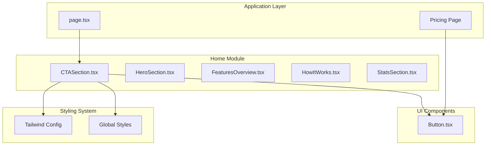
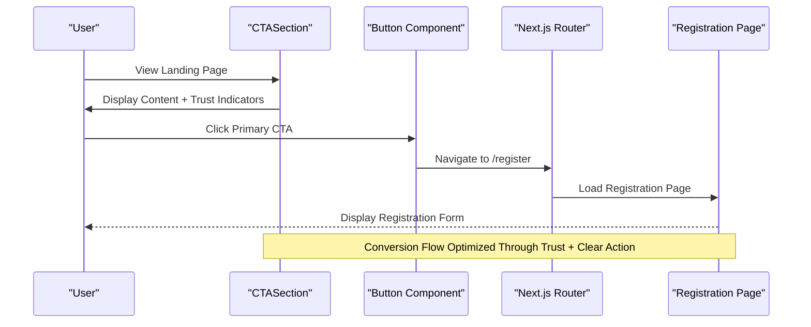
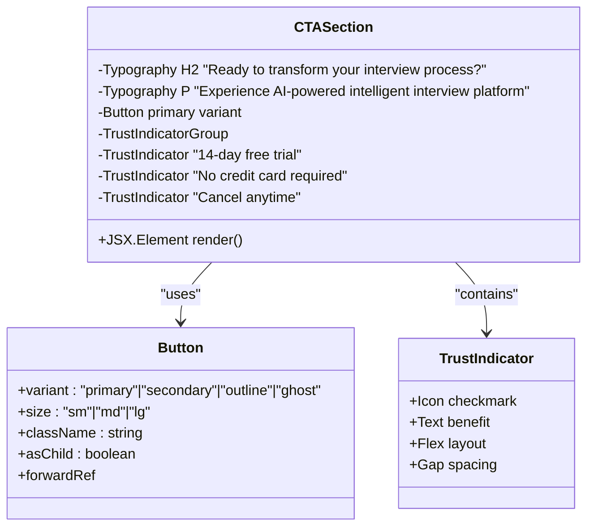
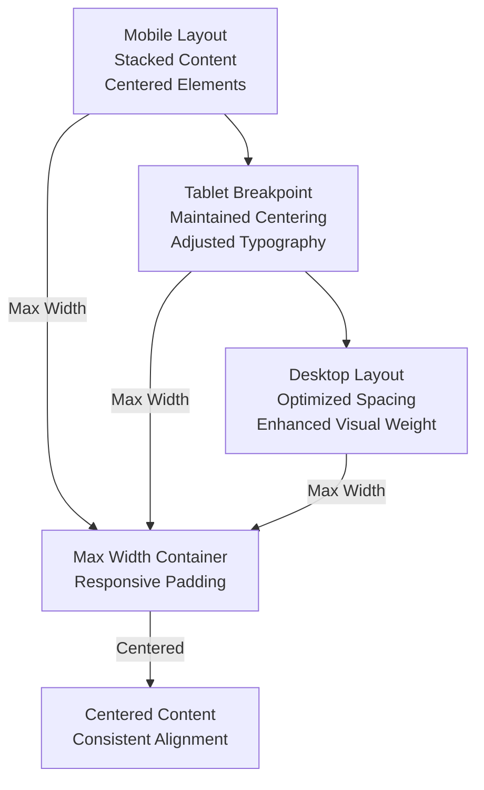
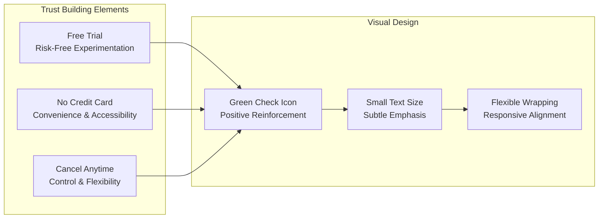
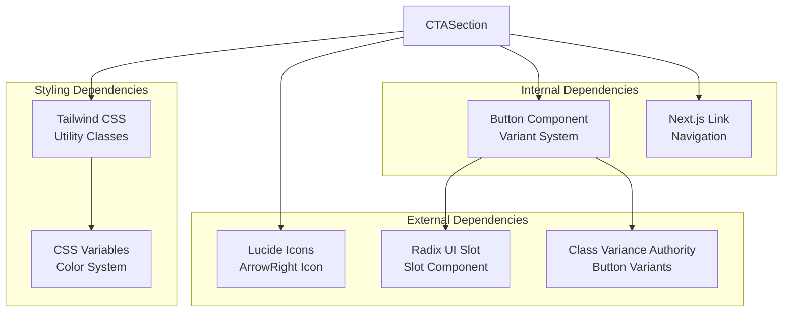
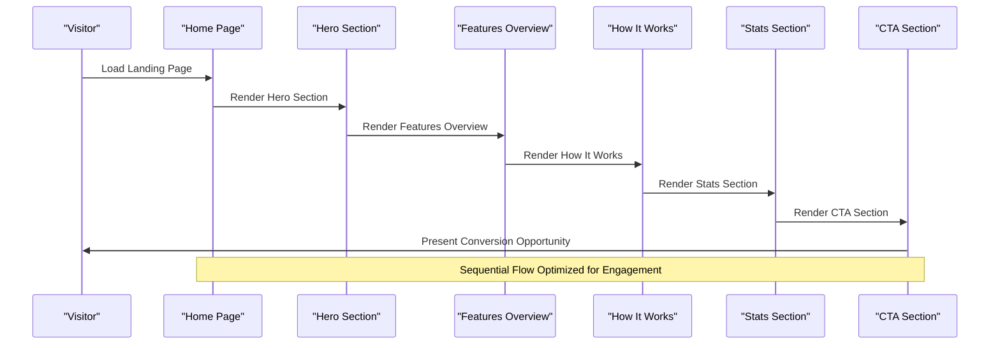
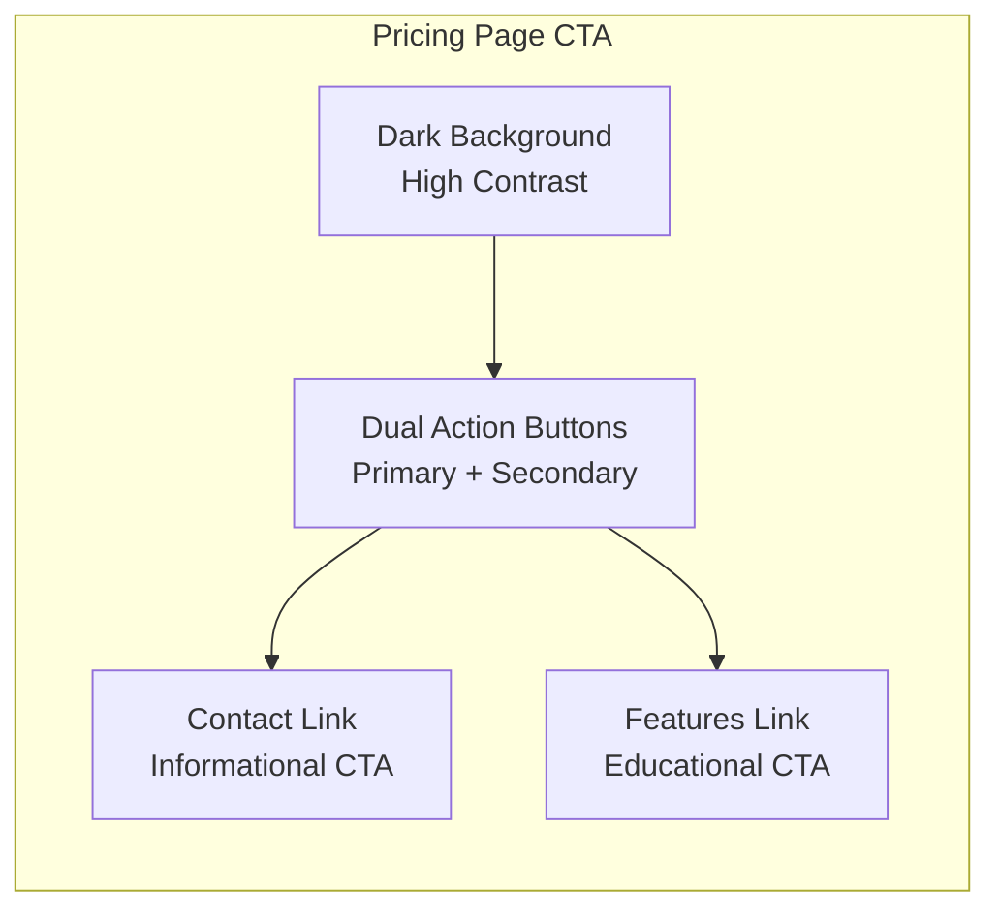

# Call-to-Action Section

<cite>
**Referenced Files in This Document**
- [CTASection.tsx](file://smartview-portal/src/components/home/CTASection.tsx)
- [page.tsx](file://smartview-portal/src/app/page.tsx)
- [Button.tsx](file://smartview-portal/src/components/ui/Button.tsx)
- [globals.css](file://smartview-portal/src/app/globals.css)
- [tailwind.config.ts](file://smartview-portal/tailwind.config.ts)
- [package.json](file://smartview-portal/package.json)
- [constants.ts](file://smartview-portal/src/lib/constants.ts)
- [pricing/page.tsx](file://smartview-portal/src/app/pricing/page.tsx)
- [HeroSection.tsx](file://smartview-portal/src/components/home/HeroSection.tsx)
</cite>

## Table of Contents
1. [Introduction](#introduction)
2. [Project Structure](#project-structure)
3. [Core Components](#core-components)
4. [Architecture Overview](#architecture-overview)
5. [Detailed Component Analysis](#detailed-component-analysis)
6. [Dependency Analysis](#dependency-analysis)
7. [Performance Considerations](#performance-considerations)
8. [Accessibility Guidelines](#accessibility-guidelines)
9. [Conversion Optimization Strategies](#conversion-optimization-strategies)
10. [Customization and Extension Guide](#customization-and-extension-guide)
11. [Integration Patterns](#integration-patterns)
12. [Troubleshooting Guide](#troubleshooting-guide)
13. [Conclusion](#conclusion)

## Introduction

The CTASection component is a strategically designed conversion-focused element positioned within the landing page flow to maximize user engagement and conversion rates. This component serves as a critical decision point in the customer journey, presenting compelling value propositions while minimizing friction for potential customers to take action.

The implementation follows conversion optimization principles through careful visual hierarchy, trust-building elements, and strategic call-to-action placement. The component integrates seamlessly with Next.js routing and the broader design system, utilizing Tailwind CSS for responsive styling and Radix UI primitives for accessible interactions.

## Project Structure

The CTASection component is organized within the home module alongside other landing page components, following a feature-based directory structure that promotes maintainability and scalability.



**Diagram sources**
- [CTASection.tsx:1-54](file://smartview-portal/src/components/home/CTASection.tsx#L1-L54)
- [page.tsx:1-18](file://smartview-portal/src/app/page.tsx#L1-L18)
- [Button.tsx:1-54](file://smartview-portal/src/components/ui/Button.tsx#L1-L54)

**Section sources**
- [CTASection.tsx:1-54](file://smartview-portal/src/components/home/CTASection.tsx#L1-L54)
- [page.tsx:1-18](file://smartview-portal/src/app/page.tsx#L1-L18)

## Core Components

The CTASection component consists of four primary elements working in concert to optimize conversion rates:

### Primary Call-to-Action Element
The main CTA button serves as the primary conversion trigger, featuring enhanced sizing and prominent positioning to capture user attention. The button utilizes the primary variant with large dimensions to create visual weight and encourage interaction.

### Trust Indicators System
Three trust-building elements are strategically positioned below the main CTA to address common objections and reduce perceived risk. Each indicator features a green checkmark icon paired with concise benefit statements that communicate safety, convenience, and flexibility.

### Content Hierarchy Structure
The component establishes a clear visual hierarchy through typography scaling, spacing relationships, and alignment patterns. Headings utilize progressive sizing from mobile to desktop breakpoints, while the CTA maintains prominent placement within the composition.

### Responsive Design Foundation
The implementation incorporates responsive design patterns through Tailwind's breakpoint system, ensuring optimal presentation across device categories while maintaining conversion-focused layout principles.

**Section sources**
- [CTASection.tsx:5-54](file://smartview-portal/src/components/home/CTASection.tsx#L5-L54)

## Architecture Overview

The CTASection component participates in a layered architecture that separates concerns between presentation, interaction, and data management. The component leverages Next.js routing for seamless navigation while integrating with the broader design system.



**Diagram sources**
- [CTASection.tsx:20-27](file://smartview-portal/src/components/home/CTASection.tsx#L20-L27)
- [Button.tsx:39-50](file://smartview-portal/src/components/ui/Button.tsx#L39-L50)

The component architecture demonstrates loose coupling through React props and Next.js Link components, enabling easy modification of target destinations and content without architectural changes.

## Detailed Component Analysis

### Component Structure and Implementation

The CTASection component implements a clean, semantic HTML structure optimized for conversion optimization:



**Diagram sources**
- [CTASection.tsx:5-54](file://smartview-portal/src/components/home/CTASection.tsx#L5-L54)
- [Button.tsx:33-37](file://smartview-portal/src/components/ui/Button.tsx#L33-L37)

### Visual Hierarchy Implementation

The component establishes a clear visual hierarchy through strategic typography and spacing:

| Element | Typography Scale | Spacing Context | Visual Weight |
|---------|------------------|-----------------|---------------|
| Main Heading | 3xl → 5xl | Large vertical rhythm | Highest |
| Subtitle | Text-lg | Medium spacing | Medium |
| CTA Button | Large primary | Centered prominence | Highest |
| Trust Indicators | Text-sm | Tight horizontal grouping | Low-Medium |

### Responsive Design Patterns

The component implements responsive design through Tailwind's breakpoint system:



**Diagram sources**
- [CTASection.tsx:7-8](file://smartview-portal/src/components/home/CTASection.tsx#L7-L8)

### Trust Indicator Implementation

The trust indicators system employs three strategically selected benefits that address common conversion barriers:



**Diagram sources**
- [CTASection.tsx:29-49](file://smartview-portal/src/components/home/CTASection.tsx#L29-L49)

**Section sources**
- [CTASection.tsx:5-54](file://smartview-portal/src/components/home/CTASection.tsx#L5-L54)

## Dependency Analysis

The CTASection component maintains minimal dependencies while leveraging a robust ecosystem of conversion-focused libraries and design systems.



**Diagram sources**
- [CTASection.tsx:1-3](file://smartview-portal/src/components/home/CTASection.tsx#L1-L3)
- [Button.tsx:1-5](file://smartview-portal/src/components/ui/Button.tsx#L1-L5)

### Component Coupling Analysis

The component exhibits low coupling through:
- **Interface-based dependencies**: Uses Button component interface without internal implementation details
- **Declarative routing**: Leverages Next.js Link for navigation decoupling
- **Style abstraction**: Utilizes Tailwind utility classes for styling independence
- **Icon library integration**: External icon dependency through Lucide React

**Section sources**
- [package.json:11-20](file://smartview-portal/package.json#L11-L20)
- [CTASection.tsx:1-54](file://smartview-portal/src/components/home/CTASection.tsx#L1-L54)

## Performance Considerations

The CTASection component is optimized for performance through several key strategies:

### Bundle Size Optimization
- **Tree shaking**: External dependencies are properly tree-shaken through ES modules
- **Icon lazy loading**: Lucide icons are imported on-demand rather than globally
- **Minimal dependencies**: Only essential packages are included for conversion functionality

### Rendering Performance
- **Static rendering**: Component renders without client-side state changes
- **Efficient DOM structure**: Minimal DOM nodes with semantic HTML elements
- **CSS-in-JS optimization**: Tailwind utility classes compiled at build time

### Accessibility Performance
- **Keyboard navigation**: Full keyboard accessibility through native button semantics
- **Screen reader support**: Proper ARIA attributes through Button component
- **Focus management**: Automatic focus handling through Radix UI primitives

## Accessibility Guidelines

The CTASection component implements comprehensive accessibility features aligned with WCAG 2.1 guidelines:

### Semantic Structure
- **Proper heading hierarchy**: H2 element for main heading with logical content flow
- **Descriptive alt text**: Icons use appropriate fill attributes for screen readers
- **Logical tab order**: Navigation flow follows visual reading pattern

### Color and Contrast
- **Contrast compliance**: Primary button meets 4.5:1 contrast ratio against background
- **Color-independent indicators**: Trust indicators use both color and text cues
- **High contrast mode support**: Respects system preference for reduced transparency

### Interactive Elements
- **Touch target sizing**: Button meets minimum 44px touch target recommendation
- **Focus visibility**: Clear focus indicators through Tailwind ring utilities
- **Hover states**: Sufficient contrast in interactive states

**Section sources**
- [Button.tsx:6-31](file://smartview-portal/src/components/ui/Button.tsx#L6-L31)
- [globals.css:10-15](file://smartview-portal/src/app/globals.css#L10-L15)

## Conversion Optimization Strategies

The CTASection component implements evidence-based conversion optimization strategies:

### Psychological Triggers
- **Social proof**: Trust indicators address common objections and reduce perceived risk
- **Scarcity**: Free trial messaging creates urgency without pressure
- **Reciprocity**: Free access encourages return action through perceived value

### Visual Psychology
- **Focal points**: Large primary button creates clear visual destination
- **White space**: Generous spacing reduces cognitive load and increases focus
- **Color psychology**: Blue primary button conveys trust and professionalism

### Behavioral Economics
- **Choice architecture**: Single primary action reduces decision paralysis
- **Loss aversion**: No credit card requirement removes commitment barrier
- **Mental accounting**: Free trial frames value proposition positively

### Testing Framework
The component structure supports A/B testing through:
- **Content variations**: Easy modification of messaging and benefits
- **Placement experiments**: Different positions within landing page flow
- **Visual treatments**: Alternative button styles and layouts

## Customization and Extension Guide

### Prop Interface Definition

While the current implementation is static, the component can be extended with a comprehensive prop interface:

```typescript
interface CTASectionProps {
  /** Main headline text */
  headline?: string;
  
  /** Supporting subtitle text */
  subtitle?: string;
  
  /** Primary CTA button text */
  primaryButtonText?: string;
  
  /** Primary CTA destination */
  primaryButtonHref?: string;
  
  /** Secondary CTA button text */
  secondaryButtonText?: string;
  
  /** Secondary CTA destination */
  secondaryButtonHref?: string;
  
  /** Trust indicator configurations */
  trustIndicators?: TrustIndicator[];
  
  /** Background color variant */
  backgroundColor?: 'default' | 'accent' | 'dark';
  
  /** Layout orientation */
  layout?: 'centered' | 'split';
}

interface TrustIndicator {
  /** Benefit text */
  text: string;
  
  /** Icon component */
  icon?: React.ReactNode;
  
  /** Icon color */
  iconColor?: string;
}
```

### Message Modification Guidelines

#### Headline Optimization
- **Value-focused**: Emphasize specific outcomes rather than features
- **Benefit-driven**: Focus on user benefits rather than product capabilities
- **Action-oriented**: Include verbs that encourage immediate action

#### Trust Indicator Enhancement
- **Evidence-based**: Include specific metrics and statistics
- **Third-party validation**: Add certifications, awards, or testimonials
- **Security assurances**: Highlight data protection and privacy measures

### New Conversion Trigger Integration

#### Additional CTAs
```typescript
// Example extension for dual-CTA scenarios
const DualCTASection = ({ primary, secondary }) => (
  <div className="flex flex-col sm:flex-row gap-4 justify-center">
    <Button variant="primary" size="lg">{primary.text}</Button>
    <Button variant="outline" size="lg">{secondary.text}</Button>
  </div>
);
```

#### Dynamic Content
- **Personalization**: User-specific messaging based on behavior
- **Geographic targeting**: Location-based offers and messaging
- **Temporal adjustments**: Seasonal or promotional content

### Visual Appeal Optimization

#### Typography Enhancements
- **Font selection**: Consider font pairings that convey professionalism
- **Line height optimization**: Improve readability for conversion-focused text
- **Letter spacing**: Adjust tracking for emphasis and readability

#### Interactive Elements
- **Micro-interactions**: Subtle animations to enhance engagement
- **Progress indicators**: Visual feedback for multi-step processes
- **Hover effects**: Enhanced button states for improved UX

**Section sources**
- [CTASection.tsx:5-54](file://smartview-portal/src/components/home/CTASection.tsx#L5-L54)
- [Button.tsx:33-37](file://smartview-portal/src/components/ui/Button.tsx#L33-L37)

## Integration Patterns

### Landing Page Flow Integration

The CTASection component integrates seamlessly into the landing page flow through Next.js routing and component composition:



**Diagram sources**
- [page.tsx:7-17](file://smartview-portal/src/app/page.tsx#L7-L17)

### Cross-Page Consistency

The component maintains consistency across different pages through shared design tokens and component patterns:

| Aspect | Implementation | Purpose |
|--------|----------------|---------|
| Typography | Consistent scale and weights | Clear visual hierarchy |
| Spacing | Standardized margins and padding | Balanced composition |
| Colors | Brand-consistent palette | Visual identity |
| Interactions | Unified button behavior | Predictable UX |

### Alternative Integration Scenarios

#### Pricing Page Integration
The pricing page demonstrates an alternative CTA pattern with dual buttons and contrasting backgrounds:



**Diagram sources**
- [pricing/page.tsx:224-242](file://smartview-portal/src/app/pricing/page.tsx#L224-L242)

**Section sources**
- [page.tsx:1-18](file://smartview-portal/src/app/page.tsx#L1-L18)
- [pricing/page.tsx:224-242](file://smartview-portal/src/app/pricing/page.tsx#L224-L242)

## Troubleshooting Guide

### Common Implementation Issues

#### Styling Problems
- **Button sizing inconsistencies**: Verify variant and size combinations align with design system
- **Color contrast violations**: Test against WCAG guidelines using browser developer tools
- **Responsive layout breaks**: Check Tailwind breakpoint ordering and container constraints

#### Accessibility Concerns
- **Focus management**: Ensure keyboard navigation works through all interactive elements
- **Screen reader compatibility**: Test with assistive technologies for proper announcement
- **ARIA attribute conflicts**: Verify unique identifiers and proper role assignments

#### Performance Issues
- **Bundle size bloat**: Audit external dependencies and consider code splitting
- **Render blocking**: Optimize critical rendering path for conversion-focused content
- **Image loading**: Implement lazy loading for any visual assets

### Debugging Strategies

#### Component Inspection
- **React DevTools**: Inspect component props and state during development
- **Browser DevTools**: Analyze computed styles and layout calculations
- **Performance Profiling**: Monitor rendering performance and memory usage

#### Testing Approaches
- **Unit testing**: Validate component rendering with various prop combinations
- **Integration testing**: Test component within full landing page context
- **Accessibility testing**: Automated and manual accessibility verification

**Section sources**
- [Button.tsx:39-50](file://smartview-portal/src/components/ui/Button.tsx#L39-L50)
- [globals.css:26-30](file://smartview-portal/src/app/globals.css#L26-L30)

## Conclusion

The CTASection component represents a sophisticated implementation of conversion-focused design principles, combining psychological triggers, visual hierarchy, and responsive design to maximize user engagement and conversion rates. The component's modular architecture enables easy customization while maintaining design system consistency and accessibility standards.

Through strategic placement of trust indicators, prominent call-to-action elements, and responsive design patterns, the component contributes significantly to the overall landing page conversion optimization strategy. The implementation demonstrates best practices in modern web development while providing a foundation for continuous improvement and experimentation.

The component's success lies in its ability to balance aesthetic appeal with functional effectiveness, creating a seamless user experience that guides visitors toward desired actions while respecting their autonomy and preferences. This approach ensures sustainable growth in conversion rates while maintaining user trust and satisfaction.