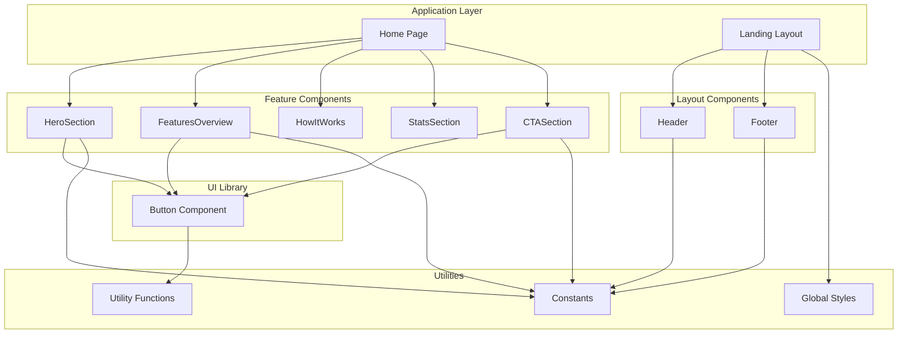
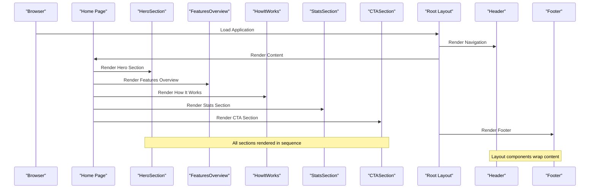
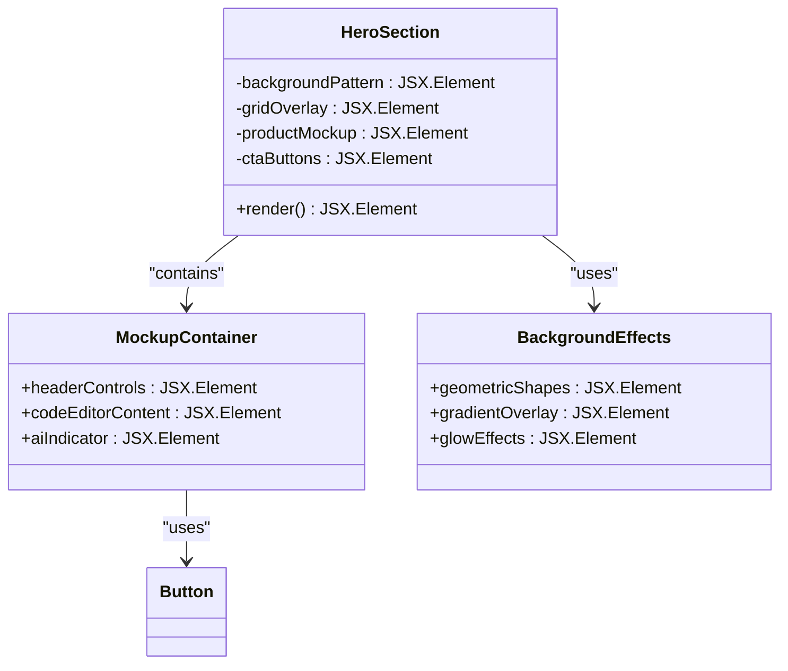
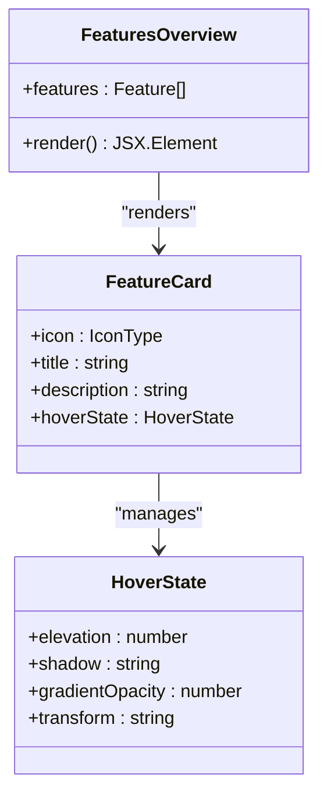
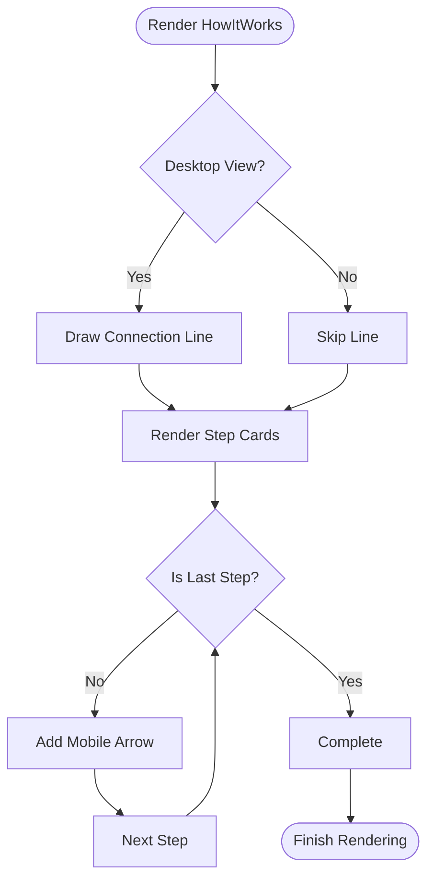
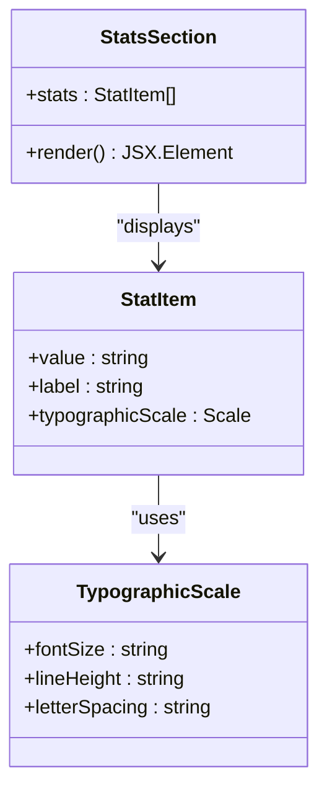
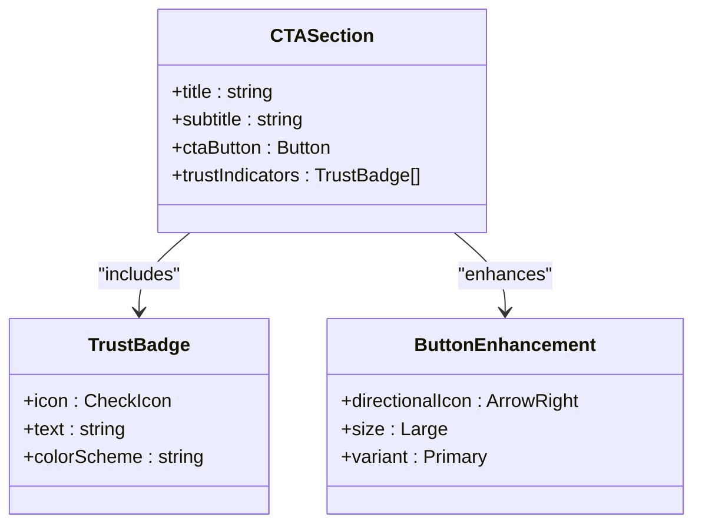
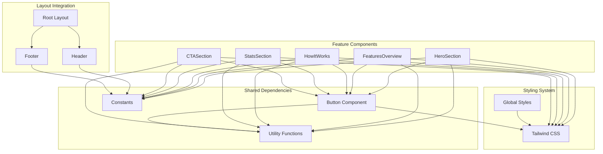

# Feature Components

<cite>
**Referenced Files in This Document**
- [HeroSection.tsx](file://smartview-portal/src/components/home/HeroSection.tsx)
- [FeaturesOverview.tsx](file://smartview-portal/src/components/home/FeaturesOverview.tsx)
- [HowItWorks.tsx](file://smartview-portal/src/components/home/HowItWorks.tsx)
- [StatsSection.tsx](file://smartview-portal/src/components/home/StatsSection.tsx)
- [CTASection.tsx](file://smartview-portal/src/components/home/CTASection.tsx)
- [Button.tsx](file://smartview-portal/src/components/ui/Button.tsx)
- [page.tsx](file://smartview-portal/src/app/page.tsx)
- [layout.tsx](file://smartview-portal/src/app/layout.tsx)
- [globals.css](file://smartview-portal/src/app/globals.css)
- [constants.ts](file://smartview-portal/src/lib/constants.ts)
- [utils.ts](file://smartview-portal/src/lib/utils.ts)
- [Header.tsx](file://smartview-portal/src/components/layout/Header.tsx)
- [Footer.tsx](file://smartview-portal/src/components/layout/Footer.tsx)
- [tailwind.config.ts](file://smartview-portal/tailwind.config.ts)
</cite>

## Table of Contents
1. [Introduction](#introduction)
2. [Project Structure](#project-structure)
3. [Core Components](#core-components)
4. [Architecture Overview](#architecture-overview)
5. [Detailed Component Analysis](#detailed-component-analysis)
6. [Dependency Analysis](#dependency-analysis)
7. [Performance Considerations](#performance-considerations)
8. [Accessibility Features](#accessibility-features)
9. [Responsive Design Implementation](#responsive-design-implementation)
10. [Animation and Interaction Patterns](#animation-and-interaction-patterns)
11. [Customization Guidelines](#customization-guidelines)
12. [Extension Points](#extension-points)
13. [Troubleshooting Guide](#troubleshooting-guide)
14. [Conclusion](#conclusion)

## Introduction
This document provides comprehensive documentation for the SmartView Portal feature components that comprise the landing page experience. The home page is structured around five key sections: HeroSection with AI demonstration mockup, FeaturesOverview showcasing platform capabilities, HowItWorks for workflow visualization, StatsSection for performance metrics, and CTASection for conversion optimization. Each component is designed with modern React patterns, responsive design principles, and accessibility considerations to deliver an engaging and conversion-focused user experience.

The components leverage a cohesive design system built on Next.js, Tailwind CSS, and Radix UI primitives, ensuring consistent styling, interaction patterns, and performance characteristics across all feature sections.

## Project Structure
The SmartView Portal feature components are organized within a clear architectural hierarchy that separates concerns between presentation, layout, and utility layers.

**Diagram sources**
- [page.tsx:1-18](file://smartview-portal/src/app/page.tsx#L1-L18)
- [layout.tsx:1-33](file://smartview-portal/src/app/layout.tsx#L1-L33)
- [HeroSection.tsx:1-125](file://smartview-portal/src/components/home/HeroSection.tsx#L1-L125)
- [Button.tsx:1-54](file://smartview-portal/src/components/ui/Button.tsx#L1-L54)

**Section sources**
- [page.tsx:1-18](file://smartview-portal/src/app/page.tsx#L1-L18)
- [layout.tsx:1-33](file://smartview-portal/src/app/layout.tsx#L1-L33)

## Core Components
The five feature components form the backbone of the SmartView Portal landing page, each serving a distinct purpose in the customer journey while maintaining visual and functional consistency.

### HeroSection
The HeroSection serves as the primary attention-grabbing element, featuring a sophisticated AI demonstration mockup that showcases the platform's capabilities. It employs advanced visual effects including gradient backgrounds, geometric patterns, and animated elements to create a premium feel.

Key implementation aspects include:
- Gradient background with abstract geometric shapes
- Animated glow effects and blur filters
- Interactive product mockup with code editor styling
- Real-time AI scoring indicator with pulse animation
- Responsive grid layout with mobile-first approach

### FeaturesOverview
This component presents the platform's core capabilities through an interactive card grid. Each feature card combines iconography, hover animations, and subtle elevation effects to communicate value propositions effectively.

Implementation highlights:
- Four-column responsive grid layout
- Hover animations with elevation and gradient overlays
- Icon component integration with dynamic rendering
- Consistent spacing and typography hierarchy
- Smooth transitions for enhanced user experience

### HowItWorks
The workflow visualization component transforms complex processes into digestible, sequential steps. It uses numbered badges, icon integration, and connection lines to guide users through the platform's operational flow.

Notable features:
- Four-step process with visual numbering system
- Desktop connection line with gradient effect
- Mobile-responsive arrow indicators
- Icon-based step representation
- Progressive disclosure for mobile devices

### StatsSection
Performance metrics are presented through a bold, data-driven approach that emphasizes quantifiable benefits. The section uses large typography and strategic spacing to highlight key performance indicators.

Design elements:
- Four-column metric display
- Large, prominent value typography
- Subtle label hierarchy
- Gradient background integration
- Responsive scaling for different screen sizes

### CTASection
The conversion-focused component combines compelling messaging with trust indicators to drive user action. It balances persuasive copy with social proof elements to reduce friction in the conversion process.

Key components:
- Primary call-to-action button with directional icon
- Trust badges with checkmark icons
- Responsive text alignment and spacing
- Consistent color scheme integration
- Mobile-friendly touch targets

**Section sources**
- [HeroSection.tsx:1-125](file://smartview-portal/src/components/home/HeroSection.tsx#L1-L125)
- [FeaturesOverview.tsx:1-74](file://smartview-portal/src/components/home/FeaturesOverview.tsx#L1-L74)
- [HowItWorks.tsx:1-93](file://smartview-portal/src/components/home/HowItWorks.tsx#L1-L93)
- [StatsSection.tsx:1-40](file://smartview-portal/src/components/home/StatsSection.tsx#L1-L40)
- [CTASection.tsx:1-54](file://smartview-portal/src/components/home/CTASection.tsx#L1-L54)

## Architecture Overview
The feature components architecture follows a component composition pattern where individual sections are orchestrated by the main page component and integrated into the broader application layout.

**Diagram sources**
- [page.tsx:1-18](file://smartview-portal/src/app/page.tsx#L1-L18)
- [layout.tsx:1-33](file://smartview-portal/src/app/layout.tsx#L1-L33)
- [Header.tsx:1-131](file://smartview-portal/src/components/layout/Header.tsx#L1-L131)
- [Footer.tsx:1-127](file://smartview-portal/src/components/layout/Footer.tsx#L1-L127)

The architecture ensures clean separation of concerns with each component responsible for its specific domain while maintaining consistent styling and interaction patterns through shared utilities and design tokens.

**Section sources**
- [page.tsx:1-18](file://smartview-portal/src/app/page.tsx#L1-L18)
- [layout.tsx:1-33](file://smartview-portal/src/app/layout.tsx#L1-L33)

## Detailed Component Analysis

### HeroSection Component Analysis
The HeroSection implements a sophisticated visual presentation that combines modern design trends with functional requirements for showcasing AI capabilities.

**Diagram sources**
- [HeroSection.tsx:1-125](file://smartview-portal/src/components/home/HeroSection.tsx#L1-L125)
- [Button.tsx:1-54](file://smartview-portal/src/components/ui/Button.tsx#L1-L54)

Key implementation patterns:
- **Visual Hierarchy**: Typography scales from 4xl to 6xl for optimal readability across devices
- **Background Effects**: Multiple layered effects create depth without overwhelming content
- **Interactive Elements**: Hover states and transitions provide feedback for user engagement
- **Responsive Design**: Flexible grid system adapts to different screen sizes

**Section sources**
- [HeroSection.tsx:1-125](file://smartview-portal/src/components/home/HeroSection.tsx#L1-L125)

### FeaturesOverview Component Analysis
The FeaturesOverview component demonstrates a clean, scalable pattern for displaying multiple feature cards with consistent interaction patterns.

**Diagram sources**
- [FeaturesOverview.tsx:1-74](file://smartview-portal/src/components/home/FeaturesOverview.tsx#L1-L74)

Implementation highlights:
- **Dynamic Icon Rendering**: Uses React component composition for flexible icon assignment
- **Hover Animation System**: Consistent transform and elevation effects across all cards
- **Responsive Grid**: Adapts from single column on mobile to four columns on desktop
- **Accessibility**: Proper semantic structure with heading hierarchy

**Section sources**
- [FeaturesOverview.tsx:1-74](file://smartview-portal/src/components/home/FeaturesOverview.tsx#L1-L74)

### HowItWorks Component Analysis
The workflow visualization component implements a step-by-step process presentation that guides users through the platform's operational flow.

**Diagram sources**
- [HowItWorks.tsx:1-93](file://smartview-portal/src/components/home/HowItWorks.tsx#L1-L93)

Key design patterns:
- **Progressive Disclosure**: Mobile arrows replace desktop connection line
- **Numbered Badge System**: Visual numbering creates clear step identification
- **Icon Integration**: Contextual icons enhance step comprehension
- **Responsive Adaptation**: Different layouts for different screen sizes

**Section sources**
- [HowItWorks.tsx:1-93](file://smartview-portal/src/components/home/HowItWorks.tsx#L1-L93)

### StatsSection Component Analysis
The StatsSection component focuses on data presentation with emphasis on visual impact and readability.

**Diagram sources**
- [StatsSection.tsx:1-40](file://smartview-portal/src/components/home/StatsSection.tsx#L1-L40)

Design characteristics:
- **Bold Typography**: Large font sizes emphasize numerical impact
- **Consistent Spacing**: Even distribution across columns
- **Gradient Integration**: Maintains brand consistency with background
- **Responsive Scaling**: Font sizes adapt to viewport constraints

**Section sources**
- [StatsSection.tsx:1-40](file://smartview-portal/src/components/home/StatsSection.tsx#L1-L40)

### CTASection Component Analysis
The CTASection implements a conversion-focused design that balances persuasive messaging with trust-building elements.

**Diagram sources**
- [CTASection.tsx:1-54](file://smartview-portal/src/components/home/CTASection.tsx#L1-L54)
- [Button.tsx:1-54](file://smartview-portal/src/components/ui/Button.tsx#L1-L54)

Conversion optimization features:
- **Persuasive Copy**: Clear value proposition with urgency
- **Trust Indicators**: Social proof elements reduce perceived risk
- **Button Enhancement**: Directional icon guides user action
- **Mobile Optimization**: Touch-friendly button sizing and spacing

**Section sources**
- [CTASection.tsx:1-54](file://smartview-portal/src/components/home/CTASection.tsx#L1-L54)

## Dependency Analysis
The feature components share a common dependency graph that reflects their integration within the larger application ecosystem.

**Diagram sources**
- [HeroSection.tsx:1-125](file://smartview-portal/src/components/home/HeroSection.tsx#L1-L125)
- [Button.tsx:1-54](file://smartview-portal/src/components/ui/Button.tsx#L1-L54)
- [constants.ts:1-11](file://smartview-portal/src/lib/constants.ts#L1-L11)
- [utils.ts:1-7](file://smartview-portal/src/lib/utils.ts#L1-L7)
- [layout.tsx:1-33](file://smartview-portal/src/app/layout.tsx#L1-L33)

**Section sources**
- [HeroSection.tsx:1-125](file://smartview-portal/src/components/home/HeroSection.tsx#L1-L125)
- [Button.tsx:1-54](file://smartview-portal/src/components/ui/Button.tsx#L1-L54)
- [constants.ts:1-11](file://smartview-portal/src/lib/constants.ts#L1-L11)
- [utils.ts:1-7](file://smartview-portal/src/lib/utils.ts#L1-L7)

## Performance Considerations
The feature components are designed with several performance optimization strategies to ensure smooth user experiences across different devices and network conditions.

### Rendering Optimizations
- **Static Content**: All feature components use static content rendering to minimize server-side processing
- **Efficient Grid Systems**: CSS Grid layouts provide excellent browser performance compared to JavaScript-based alternatives
- **Minimal State Management**: Components rely on props rather than complex state machines
- **Optimized Animations**: CSS transitions and transforms utilize GPU acceleration

### Bundle Size Considerations
- **Tree Shaking**: Individual components can be imported independently without loading unnecessary dependencies
- **Lazy Loading**: Future enhancements could leverage Next.js dynamic imports for heavy components
- **Icon Optimization**: Lucide React icons are tree-shaken to include only used icons
- **CSS Optimization**: Tailwind's purge configuration removes unused styles

### Accessibility Performance
- **Semantic HTML**: Proper heading hierarchy and landmark roles improve screen reader performance
- **Keyboard Navigation**: Full keyboard accessibility reduces reliance on mouse interactions
- **Focus Management**: Strategic focus indicators enhance navigation speed for assistive technologies

## Accessibility Features
The feature components implement comprehensive accessibility features that meet WCAG 2.1 AA standards and provide inclusive experiences for all users.

### Semantic Structure
- **Proper Headings**: Hierarchical heading structure from h1 to h3 maintains logical content organization
- **Landmark Roles**: Section elements use appropriate ARIA roles for screen reader navigation
- **Alternative Text**: All decorative elements include meaningful alt attributes or are marked as decorative

### Keyboard Navigation
- **Focus Indicators**: Visible focus rings help users track their position in the interface
- **Tab Order**: Logical tab order follows visual flow and content importance
- **Escape Mechanisms**: Modal components provide escape keys for closing overlays

### Screen Reader Support
- **Descriptive Labels**: Interactive elements include clear, descriptive labels
- **Status Updates**: Dynamic content updates announce changes to assistive technologies
- **Skip Links**: Main content areas include skip links for efficient navigation

### Color and Contrast
- **Contrast Ratios**: All text maintains sufficient contrast against background elements
- **Color Independence**: Information is conveyed through multiple modalities, not just color
- **Adjustable Colors**: Theme support allows users to customize color preferences

## Responsive Design Implementation
The feature components employ a comprehensive responsive design strategy that ensures optimal experiences across all device categories.

### Breakpoint Strategy
- **Mobile-First Approach**: Base styles target mobile devices with progressive enhancement
- **Strategic Breakpoints**: Tailwind's default breakpoints align with component-specific needs
- **Flexible Grids**: CSS Grid and Flexbox provide robust layout adaptation
- **Typography Scaling**: Fluid typography scales appropriately across viewport sizes

### Component-Specific Responsiveness
- **HeroSection**: Maintains visual impact while adapting content hierarchy and spacing
- **FeaturesOverview**: Single column on mobile, expanding to four columns on desktop
- **HowItWorks**: Connection lines adapt to mobile vertical flow with arrow indicators
- **StatsSection**: Stacked layout on mobile, expanded grid on larger screens
- **CTASection**: Centered layout with adjusted spacing for mobile touch targets

### Performance Considerations
- **Media Queries**: Efficient CSS media queries minimize reflow and repaint operations
- **Viewport Units**: Strategic use of vw and vh units for scalable layouts
- **Touch Targets**: Minimum 44px touch targets ensure usability on mobile devices

## Animation and Interaction Patterns
The feature components implement thoughtful animation and interaction patterns that enhance user experience without compromising performance or accessibility.

### Motion Design Principles
- **Purposeful Animations**: Every motion serves a functional purpose in guiding user attention
- **Consistent Timing**: Standardized animation durations create predictable interactions
- **Easing Functions**: Carefully selected easing curves provide natural movement
- **Performance Focus**: Hardware-accelerated properties (transform, opacity) ensure smooth animations

### Interactive Elements
- **Hover States**: Subtle elevation and color changes provide clear interaction feedback
- **Active States**: Pressed states communicate immediate response to user actions
- **Focus States**: Visible focus indicators ensure keyboard accessibility
- **Loading States**: Progress indicators communicate asynchronous operations

### Microinteractions
- **Button Feedback**: Ripple effects and color transitions provide tactile feedback
- **Card Elevation**: Smooth lift animations indicate interactive elements
- **Form Validation**: Animated error states guide users toward corrections
- **Navigation Transitions**: Smooth page transitions maintain context during navigation

## Customization Guidelines
The feature components are designed with extensibility in mind, allowing for easy customization while maintaining design consistency.

### Theming and Branding
- **Color System**: Centralized color definitions enable easy brand customization
- **Typography Scale**: Modular scale system supports various typographic treatments
- **Spacing System**: Consistent spacing tokens ensure proportional layouts
- **Border Radius**: Unified corner radius maintains visual coherence

### Content Customization
- **Text Content**: All text is configurable through props or content arrays
- **Icon Integration**: Flexible icon system supports custom icon libraries
- **Image Assets**: Placeholder patterns accommodate custom imagery
- **Link Configuration**: Navigation links are centrally managed for easy updates

### Layout Modifications
- **Grid Adjustments**: CSS Grid configurations support custom column layouts
- **Spacing Variations**: Utility classes enable fine-grained spacing control
- **Component Composition**: Individual components can be mixed and matched
- **Section Ordering**: Flexible component arrangement accommodates different narratives

### Extension Points
- **New Feature Cards**: FeaturesOverview supports dynamic feature addition
- **Additional Steps**: HowItWorks accommodates workflow expansion
- **Metric Expansion**: StatsSection handles additional performance indicators
- **Custom CTAs**: CTASection supports alternative conversion goals

## Extension Points
The component architecture provides multiple extension points for future enhancements and specialized use cases.

### Feature Enhancement
- **Dynamic Feature Loading**: FeaturesOverview supports async feature data fetching
- **Custom Feature Types**: Extensible feature card system for specialized content
- **Interactive Demos**: HeroSection mockup supports embedded interactive elements
- **Performance Tracking**: StatsSection integrates with analytics platforms

### Workflow Integration
- **Multi-Step Processes**: HowItWorks supports complex workflow visualization
- **Conditional Logic**: Step rendering based on user context or permissions
- **Progress Tracking**: Visual indicators for user workflow completion
- **Integration Points**: APIs for external service integration

### Personalization
- **User Context**: Components adapt based on user role or subscription level
- **Geographic Localization**: Content adaptation for different regions or languages
- **Preference Integration**: User preference storage and application
- **A/B Testing**: Component variants for experimental features

### Analytics and Monitoring
- **Event Tracking**: Built-in analytics hooks for user interaction monitoring
- **Performance Metrics**: Component-level performance measurement
- **Conversion Tracking**: Integration with marketing automation platforms
- **Accessibility Monitoring**: Automated accessibility compliance checking

## Troubleshooting Guide
Common issues and solutions for the feature components, focusing on development and deployment scenarios.

### Styling Issues
- **Missing Styles**: Ensure Tailwind CSS is properly configured and utility classes are available
- **Color Conflicts**: Verify color palette consistency across components
- **Layout Breakage**: Check CSS Grid and Flexbox implementations for browser compatibility
- **Print Styles**: Test print media queries for document-style presentations

### Performance Problems
- **Slow Rendering**: Profile component rendering with React DevTools
- **Memory Leaks**: Monitor component lifecycle and event listener cleanup
- **Bundle Size**: Audit bundle composition and optimize unused dependencies
- **Critical Path**: Optimize above-the-fold content delivery

### Accessibility Concerns
- **Screen Reader Issues**: Test with NVDA, JAWS, or VoiceOver for navigation problems
- **Keyboard Navigation**: Verify tab order and focus management across components
- **Color Contrast**: Use accessibility testing tools to identify contrast violations
- **ARIA Implementation**: Validate ARIA attributes and roles for proper semantics

### Responsive Behavior
- **Mobile Layout**: Test on actual devices with varying screen sizes and orientations
- **Touch Interactions**: Verify touch target sizes and gesture recognition
- **Orientation Changes**: Handle device rotation gracefully without layout shifts
- **Viewport Issues**: Address viewport meta tag configuration and scaling problems

**Section sources**
- [HeroSection.tsx:1-125](file://smartview-portal/src/components/home/HeroSection.tsx#L1-L125)
- [FeaturesOverview.tsx:1-74](file://smartview-portal/src/components/home/FeaturesOverview.tsx#L1-L74)
- [HowItWorks.tsx:1-93](file://smartview-portal/src/components/home/HowItWorks.tsx#L1-L93)
- [StatsSection.tsx:1-40](file://smartview-portal/src/components/home/StatsSection.tsx#L1-L40)
- [CTASection.tsx:1-54](file://smartview-portal/src/components/home/CTASection.tsx#L1-L54)

## Conclusion
The SmartView Portal feature components represent a comprehensive, well-architected solution for delivering an engaging and conversion-focused landing page experience. Through careful attention to design principles, responsive implementation, accessibility compliance, and performance optimization, these components provide a solid foundation for communicating the platform's value proposition effectively.

The modular architecture enables easy customization and extension while maintaining design consistency and user experience quality. The thoughtful integration of animations, interactions, and responsive patterns ensures that the feature components will continue to provide value as requirements evolve and new use cases emerge.

Future enhancements can leverage the established patterns and extension points to add new capabilities while preserving the core user experience that drives conversions and engagement.