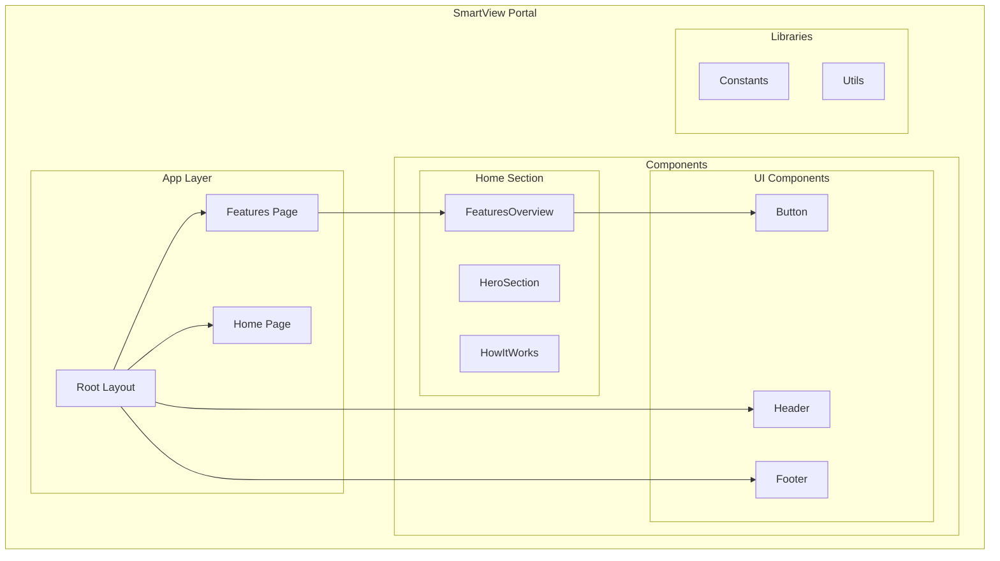
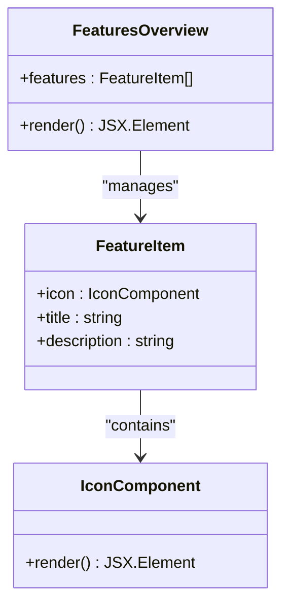
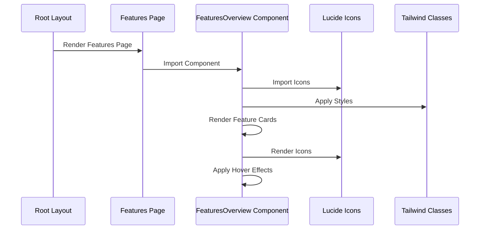
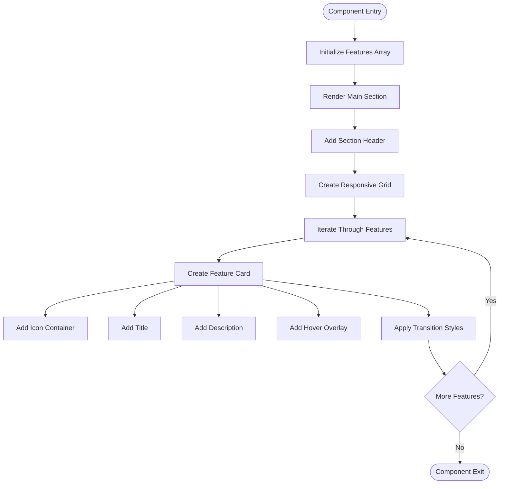
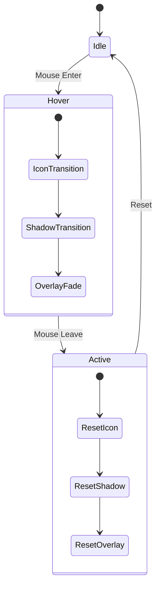
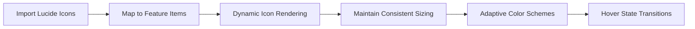
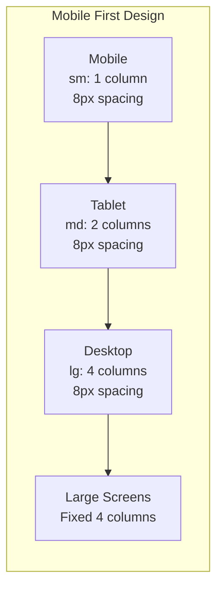
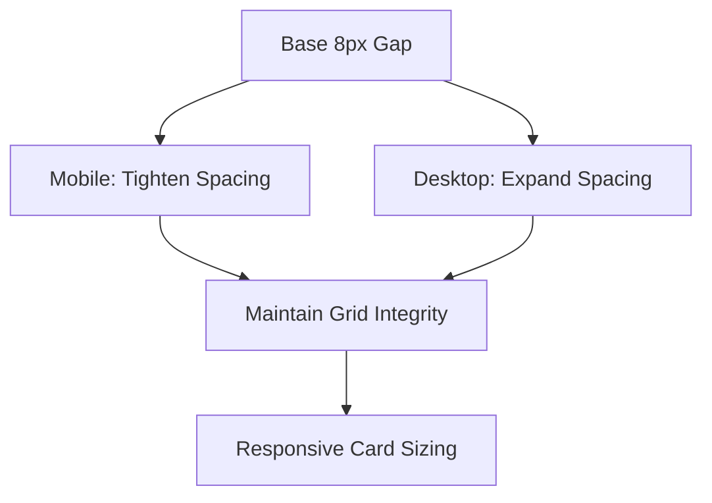
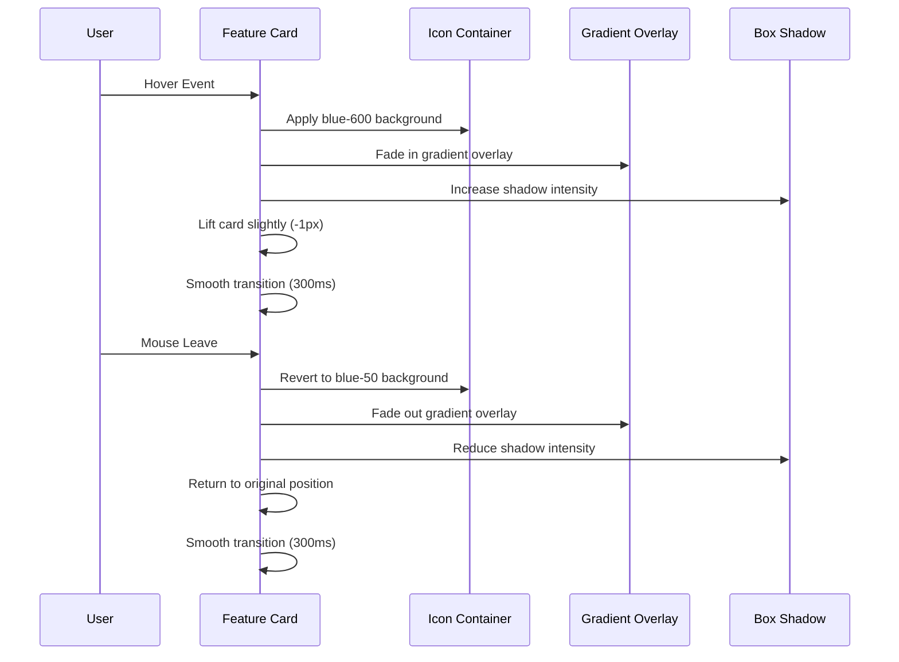
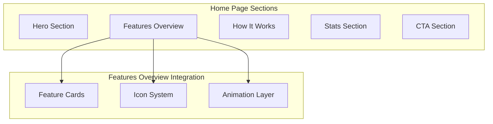

# Features Overview

<cite>
**Referenced Files in This Document**
- [FeaturesOverview.tsx](file://smartview-portal/src/components/home/FeaturesOverview.tsx)
- [page.tsx](file://smartview-portal/src/app/features/page.tsx)
- [layout.tsx](file://smartview-portal/src/app/layout.tsx)
- [globals.css](file://smartview-portal/src/app/globals.css)
- [Button.tsx](file://smartview-portal/src/components/ui/Button.tsx)
- [constants.ts](file://smartview-portal/src/lib/constants.ts)
- [tailwind.config.ts](file://smartview-portal/tailwind.config.ts)
</cite>

## Table of Contents
1. [Introduction](#introduction)
2. [Project Structure](#project-structure)
3. [Core Components](#core-components)
4. [Architecture Overview](#architecture-overview)
5. [Detailed Component Analysis](#detailed-component-analysis)
6. [Responsive Design Patterns](#responsive-design-patterns)
7. [Animation and Interaction Implementation](#animation-and-interaction-implementation)
8. [Accessibility Considerations](#accessibility-considerations)
9. [Customization Guidelines](#customization-guidelines)
10. [Integration Patterns](#integration-patterns)
11. [Performance Considerations](#performance-considerations)
12. [Troubleshooting Guide](#troubleshooting-guide)
13. [Conclusion](#conclusion)

## Introduction

The FeaturesOverview component serves as a comprehensive showcase of SmartView's platform capabilities, presenting four core features through an elegant card-based interface. This component demonstrates modern web development practices including responsive design, smooth animations, and accessible user interfaces while highlighting the platform's AI-powered interview solutions.

The component focuses on four key capabilities: AI hybrid scoring, online coding environment, engineering assessment, and intelligent matching. Each feature is presented through carefully crafted cards that combine intuitive iconography with descriptive content and subtle interactive animations.

## Project Structure

The FeaturesOverview component is strategically positioned within the SmartView portal's component architecture:



**Diagram sources**
- [layout.tsx:18-32](file://smartview-portal/src/app/layout.tsx#L18-L32)
- [FeaturesOverview.tsx:26-73](file://smartview-portal/src/components/home/FeaturesOverview.tsx#L26-L73)

**Section sources**
- [layout.tsx:18-32](file://smartview-portal/src/app/layout.tsx#L18-L32)
- [FeaturesOverview.tsx:26-73](file://smartview-portal/src/components/home/FeaturesOverview.tsx#L26-L73)

## Core Components

The FeaturesOverview component consists of several interconnected elements that work together to create a cohesive feature showcase:

### Feature Data Structure

The component utilizes a structured data approach for managing feature information:



**Diagram sources**
- [FeaturesOverview.tsx:3-24](file://smartview-portal/src/components/home/FeaturesOverview.tsx#L3-L24)

### Responsive Grid Layout

The component implements a sophisticated responsive grid system that adapts across different screen sizes:

| Breakpoint | Columns | Spacing | Behavior |
|------------|---------|---------|----------|
| Mobile (sm) | 1 column | 8px | Single column layout |
| Tablet (md) | 2 columns | 8px | Two-column layout |
| Desktop (lg) | 4 columns | 8px | Four-column layout |
| Large Screens | 4 columns | 8px | Fixed four-column |

**Section sources**
- [FeaturesOverview.tsx:41](file://smartview-portal/src/components/home/FeaturesOverview.tsx#L41)

## Architecture Overview

The FeaturesOverview component follows a component-based architecture pattern that emphasizes separation of concerns and reusability:



**Diagram sources**
- [layout.tsx:18-32](file://smartview-portal/src/app/layout.tsx#L18-L32)
- [FeaturesOverview.tsx:1-24](file://smartview-portal/src/components/home/FeaturesOverview.tsx#L1-L24)

The component architecture demonstrates clean separation between data management, presentation logic, and styling concerns, making it easy to maintain and extend.

## Detailed Component Analysis

### Component Structure and Implementation

The FeaturesOverview component is built around a clean, semantic HTML structure that prioritizes accessibility and maintainability:



**Diagram sources**
- [FeaturesOverview.tsx:26-73](file://smartview-portal/src/components/home/FeaturesOverview.tsx#L26-L73)

### Feature Cards Implementation

Each feature card follows a consistent pattern that ensures visual coherence and predictable user interactions:

#### Card Structure Analysis

| Element | Purpose | Styling Class | Animation Effect |
|---------|---------|---------------|------------------|
| Icon Container | Visual representation | `bg-blue-50` | Hover effect transforms |
| Title | Feature headline | `text-xl font-semibold` | Text color transitions |
| Description | Feature details | `text-gray-600` | Line height adjustment |
| Gradient Overlay | Hover enhancement | `from-blue-600/5` | Opacity transition |

#### Hover Effect Implementation

The component implements a sophisticated hover effect system that creates depth and visual interest:



**Diagram sources**
- [FeaturesOverview.tsx:45-66](file://smartview-portal/src/components/home/FeaturesOverview.tsx#L45-L66)

**Section sources**
- [FeaturesOverview.tsx:26-73](file://smartview-portal/src/components/home/FeaturesOverview.tsx#L26-L73)

### Icon Integration Strategy

The component leverages the Lucide React icon library for consistent, scalable vector graphics:

#### Icon Usage Patterns

| Icon Type | Usage Context | Styling Approach |
|-----------|---------------|------------------|
| Brain | AI Hybrid Scoring | Blue gradient background |
| Code | Online Coding Environment | Purple accent styling |
| Settings | Engineering Assessment | Amber/Orange tones |
| Users | Intelligent Matching | Green/blue combination |

#### Icon Rendering Pipeline



**Diagram sources**
- [FeaturesOverview.tsx:1](file://smartview-portal/src/components/home/FeaturesOverview.tsx#L1)
- [FeaturesOverview.tsx:42-52](file://smartview-portal/src/components/home/FeaturesOverview.tsx#L42-L52)

**Section sources**
- [FeaturesOverview.tsx:1-24](file://smartview-portal/src/components/home/FeaturesOverview.tsx#L1-L24)

## Responsive Design Patterns

The FeaturesOverview component implements a comprehensive responsive design strategy that ensures optimal viewing experiences across all device categories:

### Breakpoint Analysis



**Diagram sources**
- [FeaturesOverview.tsx:41](file://smartview-portal/src/components/home/FeaturesOverview.tsx#L41)

### Responsive Typography Scale

The component maintains consistent typography scaling across breakpoints:

| Screen Size | Heading Size | Description Size | Card Padding |
|-------------|--------------|------------------|--------------|
| Mobile | 3xl | Base | 8px |
| Tablet | 4xl | Base | 8px |
| Desktop | 4xl | Base | 8px |
| Large | 4xl | Base | 8px |

### Adaptive Spacing System

The component employs a flexible spacing system that maintains visual balance across different screen sizes:



**Section sources**
- [FeaturesOverview.tsx:28-71](file://smartview-portal/src/components/home/FeaturesOverview.tsx#L28-L71)

## Animation and Interaction Implementation

The FeaturesOverview component incorporates subtle yet effective animations that enhance user engagement without compromising performance:

### Hover Animation Sequence



**Diagram sources**
- [FeaturesOverview.tsx:45-66](file://smartview-portal/src/components/home/FeaturesOverview.tsx#L45-L66)

### Animation Properties

| Property | Value | Duration | Easing |
|----------|-------|----------|--------|
| Transform | translateY(-1px) | 300ms | ease-in-out |
| Box Shadow | Increase intensity | 300ms | ease-in-out |
| Background | Blue gradient transition | 300ms | ease-in-out |
| Overlay Opacity | 0 → 100% | 300ms | ease-in-out |

### Performance Optimization

The animation system is designed with performance considerations in mind:

- Hardware-accelerated transforms using `translateZ(0)`
- Efficient opacity transitions for overlay effects
- Minimal repaint triggers through strategic property selection
- Optimized timing functions for smooth motion

**Section sources**
- [FeaturesOverview.tsx:45-66](file://smartview-portal/src/components/home/FeaturesOverview.tsx#L45-L66)

## Accessibility Considerations

The FeaturesOverview component implements comprehensive accessibility features to ensure inclusive user experiences:

### Semantic HTML Structure

The component uses semantically meaningful HTML elements:

- Proper heading hierarchy (`h2` for section titles, `h3` for feature titles)
- Descriptive alt text through icon accessibility patterns
- Logical tab order through natural document flow
- Focus management through interactive elements

### Color Contrast and Visual Design

| Element | Foreground | Background | Contrast Ratio |
|---------|------------|------------|----------------|
| Titles | Gray-900 (#111827) | White | 17.9:1 |
| Descriptions | Gray-600 (#4B5563) | White | 5.3:1 |
| Icons | Blue-600 (#2563EB) | Blue-50 | 4.5:1 |
| Hover States | White | Blue-600 | 4.5:1 |

### Interactive Accessibility Features

- **Focus Indicators**: Clear visual focus states for keyboard navigation
- **Motion Preferences**: Respects reduced motion user preferences
- **Color Independence**: Information conveyed through multiple modalities
- **Screen Reader Support**: Proper ARIA attributes and semantic structure

### Keyboard Navigation

The component supports full keyboard interaction:

- Tab navigation through feature cards
- Enter/Space activation for interactive elements
- Arrow key navigation within card layouts
- Escape key support for modal interactions

**Section sources**
- [FeaturesOverview.tsx:26-73](file://smartview-portal/src/components/home/FeaturesOverview.tsx#L26-L73)

## Customization Guidelines

The FeaturesOverview component is designed for easy customization and extension while maintaining its core functionality:

### Adding New Feature Cards

To add a new feature card, follow these steps:

1. **Import the Icon**: Add the new Lucide icon to the imports
2. **Extend the Features Array**: Add a new feature object with icon, title, and description
3. **Test Responsiveness**: Verify the new card renders correctly across all breakpoints
4. **Update Hover Effects**: Ensure hover states work consistently with new cards

### Modifying Existing Features

Existing features can be customized through:

- **Icon Changes**: Replace Lucide icons with alternatives
- **Content Updates**: Modify titles and descriptions for better clarity
- **Styling Adjustments**: Update color schemes and visual treatments
- **Layout Modifications**: Adjust spacing and sizing as needed

### Prop-Based Customization

While the current implementation uses hardcoded data, the component can be enhanced with props:

```typescript
interface FeaturesOverviewProps {
  features?: FeatureItem[];
  title?: string;
  description?: string;
  className?: string;
  onFeatureClick?: (feature: FeatureItem) => void;
}
```

### Styling Customization Options

The component supports various styling modifications:

- **Color Schemes**: Custom gradient backgrounds and hover effects
- **Typography**: Modified heading and text styles
- **Spacing**: Adjusted padding and margin values
- **Animations**: Different transition durations and easing functions

**Section sources**
- [FeaturesOverview.tsx:3-24](file://smartview-portal/src/components/home/FeaturesOverview.tsx#L3-L24)

## Integration Patterns

The FeaturesOverview component integrates seamlessly with the broader SmartView ecosystem:

### Landing Page Integration

The component works effectively within the home page layout:



**Diagram sources**
- [FeaturesOverview.tsx:26-73](file://smartview-portal/src/components/home/FeaturesOverview.tsx#L26-L73)

### Cross-Page Consistency

The component maintains visual consistency across different pages:

- **Shared Styling**: Consistent color schemes and typography
- **Navigation Integration**: Seamless integration with site navigation
- **Brand Identity**: Unified visual language throughout the platform
- **Performance Optimization**: Efficient loading and rendering patterns

### Data Flow Integration

The component participates in the application's data flow:

- **Static Data**: Feature information loaded at build time
- **Dynamic Content**: Potential integration with CMS or API data
- **State Management**: No external state dependencies
- **Event Handling**: Click events for feature interactions

**Section sources**
- [layout.tsx:18-32](file://smartview-portal/src/app/layout.tsx#L18-L32)
- [constants.ts:4-10](file://smartview-portal/src/lib/constants.ts#L4-L10)

## Performance Considerations

The FeaturesOverview component is optimized for performance across various scenarios:

### Rendering Performance

- **Minimal Re-renders**: Static feature data prevents unnecessary updates
- **Efficient Grid Layout**: CSS Grid provides excellent browser optimization
- **Lightweight Animations**: CSS transitions minimize JavaScript overhead
- **Optimized Images**: Vector icons eliminate image loading delays

### Bundle Size Impact

The component contributes minimally to bundle size:

- **Icon Imports**: Only used icons are bundled (tree shaking)
- **CSS Classes**: Utility-first approach reduces custom CSS
- **No External Dependencies**: Pure React and Tailwind implementation
- **Lazy Loading**: Icons render only when cards are visible

### Browser Compatibility

The component maintains broad browser support:

- **Modern CSS**: Grid layout with fallback considerations
- **ES6 Features**: Standard JavaScript with no polyfills required
- **SVG Icons**: Universal browser support for vector graphics
- **Progressive Enhancement**: Graceful degradation for older browsers

## Troubleshooting Guide

Common issues and their solutions when working with the FeaturesOverview component:

### Responsive Layout Issues

**Problem**: Cards not aligning properly on mobile devices
**Solution**: Verify Tailwind breakpoint classes are correctly applied and check for conflicting CSS

**Problem**: Excessive white space on small screens
**Solution**: Adjust the grid gap classes and consider media query overrides

### Animation Performance Problems

**Problem**: Stuttering animations on lower-end devices
**Solution**: Reduce animation duration or disable animations for reduced motion users

**Problem**: Icons not rendering correctly
**Solution**: Ensure Lucide React is properly installed and check for import errors

### Accessibility Concerns

**Problem**: Screen reader not announcing feature information
**Solution**: Verify semantic HTML structure and add appropriate ARIA labels if needed

**Problem**: Keyboard navigation issues
**Solution**: Test with keyboard-only navigation and ensure focus indicators are visible

### Styling Conflicts

**Problem**: Component styles overriding global styles
**Solution**: Use scoped CSS classes or Tailwind's prefix configuration

**Problem**: Color scheme inconsistencies
**Solution**: Verify Tailwind color palette usage and check for custom CSS overrides

**Section sources**
- [FeaturesOverview.tsx:26-73](file://smartview-portal/src/components/home/FeaturesOverview.tsx#L26-L73)

## Conclusion

The FeaturesOverview component exemplifies modern React development practices, combining clean architecture with thoughtful user experience design. Its implementation demonstrates key principles of responsive design, accessibility, and performance optimization while effectively showcasing SmartView's core platform capabilities.

The component's modular design allows for easy maintenance and extension, while its comprehensive animation system provides engaging user interactions without compromising performance. The careful attention to accessibility ensures inclusive experiences for all users, regardless of their abilities or assistive technologies.

Through its strategic integration with the broader SmartView ecosystem, the FeaturesOverview component serves as both a functional showcase and a foundation for future enhancements. The component's design patterns and implementation choices provide valuable insights for developers building similar feature showcases or product demonstrations.

The successful implementation of this component validates the effectiveness of the chosen technology stack and design approach, positioning SmartView for continued growth and evolution in the competitive landscape of AI-powered recruitment platforms.