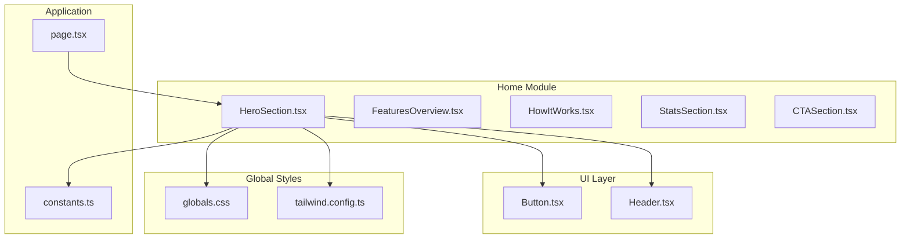
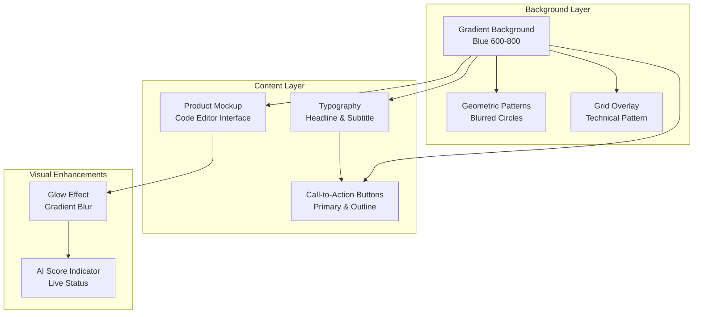
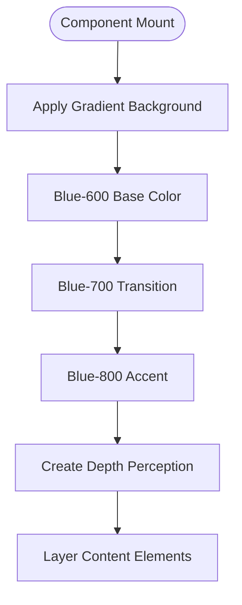
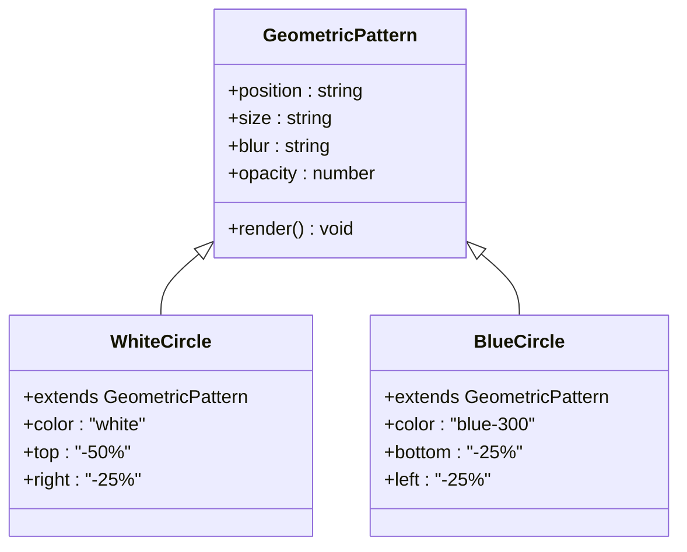
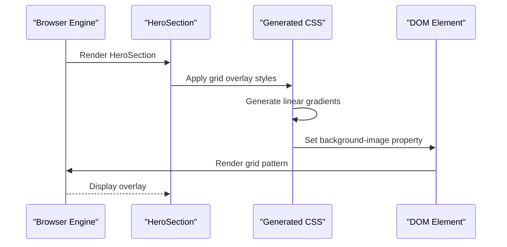
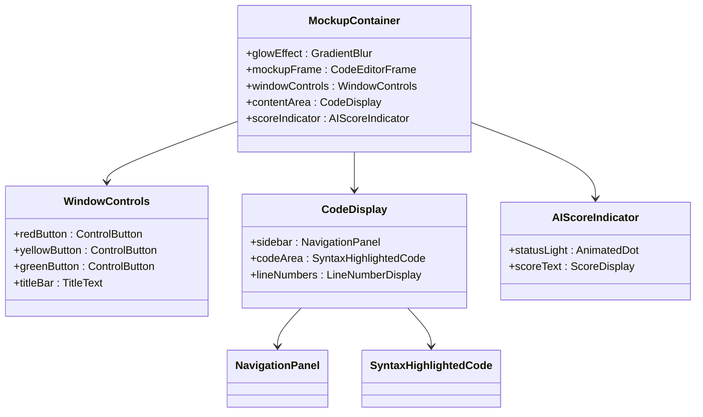
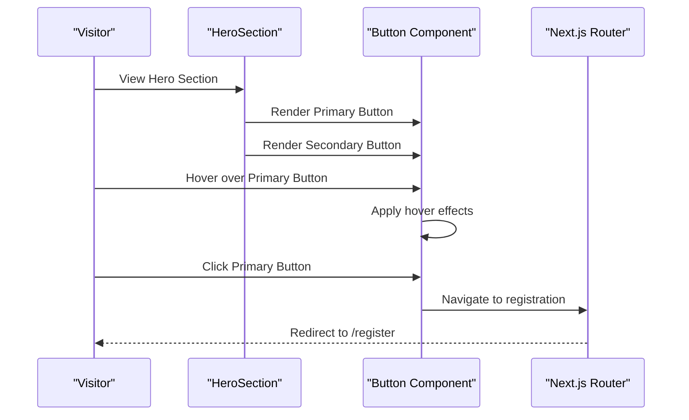
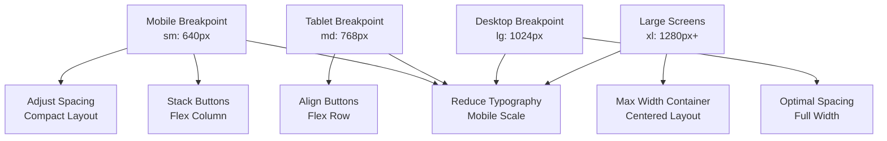
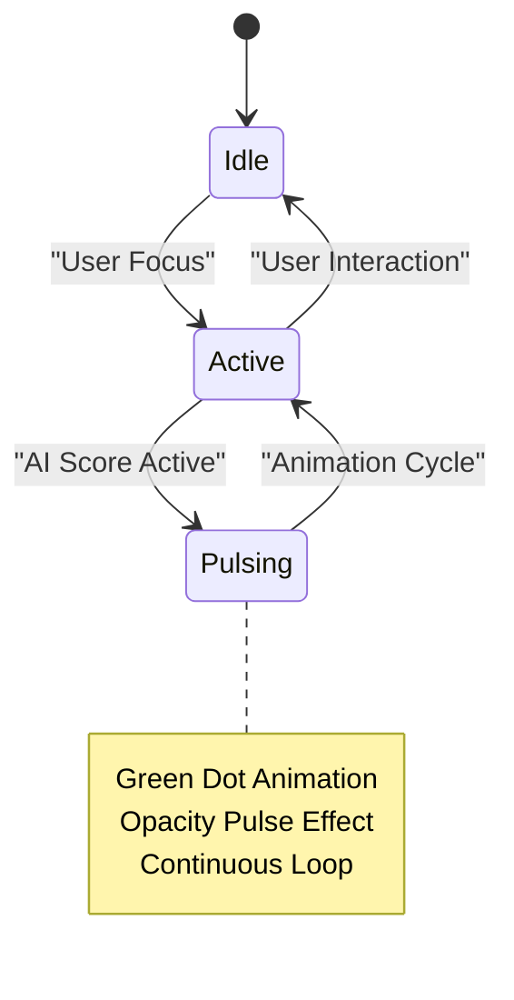
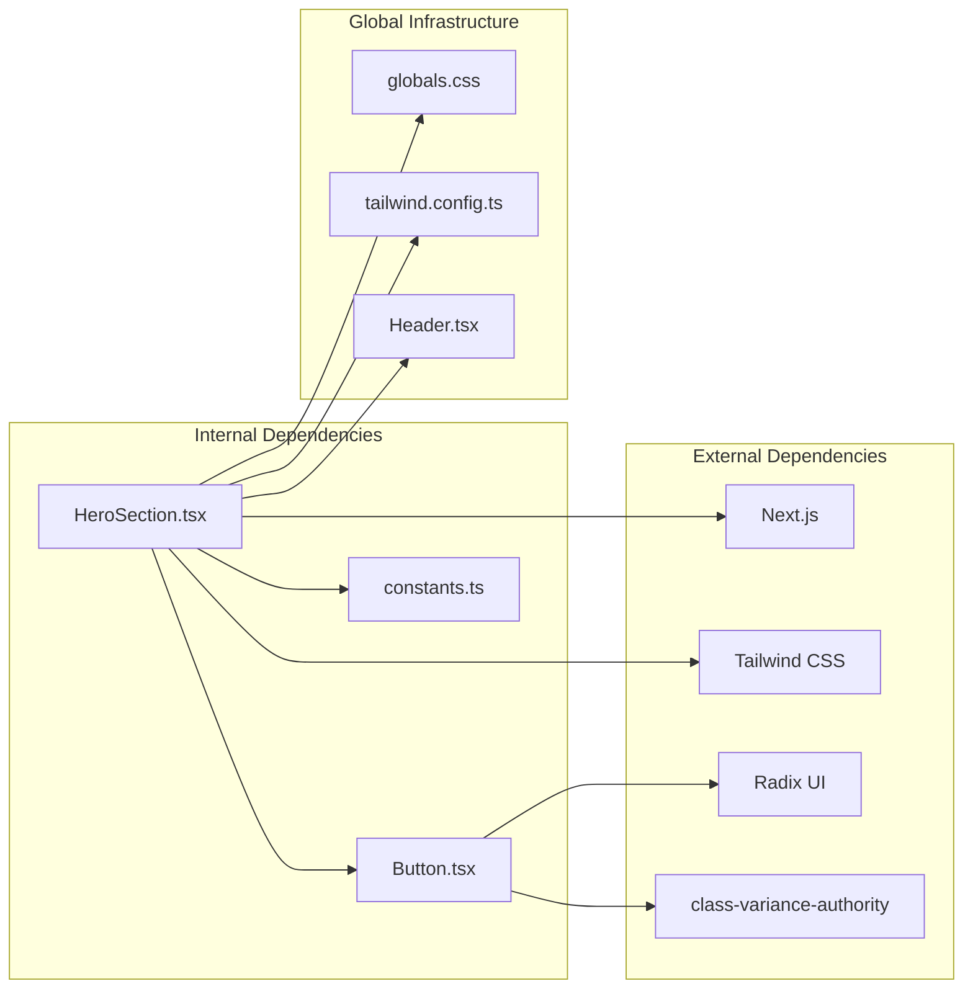

# Hero Section

<cite>
**Referenced Files in This Document**
- [HeroSection.tsx](file://smartview-portal/src/components/home/HeroSection.tsx)
- [page.tsx](file://smartview-portal/src/app/page.tsx)
- [Button.tsx](file://smartview-portal/src/components/ui/Button.tsx)
- [globals.css](file://smartview-portal/src/app/globals.css)
- [tailwind.config.ts](file://smartview-portal/tailwind.config.ts)
- [constants.ts](file://smartview-portal/src/lib/constants.ts)
- [Header.tsx](file://smartview-portal/src/components/layout/Header.tsx)
</cite>

## Table of Contents
1. [Introduction](#introduction)
2. [Project Structure](#project-structure)
3. [Core Components](#core-components)
4. [Architecture Overview](#architecture-overview)
5. [Detailed Component Analysis](#detailed-component-analysis)
6. [Dependency Analysis](#dependency-analysis)
7. [Performance Considerations](#performance-considerations)
8. [Troubleshooting Guide](#troubleshooting-guide)
9. [Conclusion](#conclusion)
10. [Appendices](#appendices)

## Introduction
The HeroSection component serves as the primary visual focal point of the landing page, establishing brand presence through sophisticated gradient backgrounds, abstract geometric patterns, and a modern product mockup. It combines marketing copy with interactive call-to-action elements while maintaining responsive design principles and accessibility standards. The component integrates seamlessly with the overall landing page experience by anchoring the visitor's attention and communicating the platform's value proposition through layered visual elements.

## Project Structure
The HeroSection component is organized within the home module alongside complementary sections that collectively form the landing page narrative. The component relies on shared UI primitives and global styling configurations to maintain consistency across the application.

**Diagram sources**
- [HeroSection.tsx:1-125](file://smartview-portal/src/components/home/HeroSection.tsx#L1-L125)
- [page.tsx:1-18](file://smartview-portal/src/app/page.tsx#L1-L18)
- [Button.tsx:1-54](file://smartview-portal/src/components/ui/Button.tsx#L1-L54)
- [globals.css:1-31](file://smartview-portal/src/app/globals.css#L1-L31)
- [tailwind.config.ts:1-20](file://smartview-portal/tailwind.config.ts#L1-L20)
- [constants.ts:1-11](file://smartview-portal/src/lib/constants.ts#L1-L11)
- [Header.tsx:1-131](file://smartview-portal/src/components/layout/Header.tsx#L1-L131)

**Section sources**
- [HeroSection.tsx:1-125](file://smartview-portal/src/components/home/HeroSection.tsx#L1-L125)
- [page.tsx:1-18](file://smartview-portal/src/app/page.tsx#L1-L18)

## Core Components
The HeroSection component consists of several interconnected elements that work together to create a cohesive visual experience:

### Gradient Background System
The component employs a sophisticated gradient background that transitions from blue-600 through blue-700 to blue-800, creating depth and visual interest. This gradient serves as the foundation for all subsequent visual layers.

### Abstract Geometric Patterns
Two blurred circular elements create abstract geometric patterns that enhance visual texture without overwhelming the content. These elements utilize opacity and blur effects to achieve a subtle, ethereal quality.

### Grid Overlay System
A CSS-generated grid pattern overlays the entire section, providing a technical aesthetic that aligns with the product's coding focus. The grid uses semi-transparent white lines on a 60px spacing pattern.

### Product Mockup Implementation
The mockup presents a realistic code editor interface with window controls, sidebar navigation, and live code display. An AI scoring indicator provides dynamic feedback visualization.

### Responsive Typography System
The component implements a responsive typography scale that adapts from mobile to large screens, ensuring optimal readability across all device sizes.

**Section sources**
- [HeroSection.tsx:4-125](file://smartview-portal/src/components/home/HeroSection.tsx#L4-L125)

## Architecture Overview
The HeroSection component follows a layered architecture pattern where each visual element serves a specific purpose in the overall composition. The component maintains clear separation between background elements, content layers, and interactive components.

**Diagram sources**
- [HeroSection.tsx:6-125](file://smartview-portal/src/components/home/HeroSection.tsx#L6-L125)

## Detailed Component Analysis

### Gradient Background Effects
The gradient background creates a sense of depth and movement through strategic color transitions. The blue color palette establishes trust and professionalism while the gradient direction draws the eye downward, guiding attention to the content.

**Diagram sources**
- [HeroSection.tsx:6](file://smartview-portal/src/components/home/HeroSection.tsx#L6)

### Abstract Geometric Patterns
The geometric pattern system utilizes two blurred circles positioned strategically to create visual balance. The positioning and sizing create a dynamic composition that complements the linear gradient background.

**Diagram sources**
- [HeroSection.tsx:8-11](file://smartview-portal/src/components/home/HeroSection.tsx#L8-L11)

### Grid Overlay Styling
The grid overlay system demonstrates advanced CSS techniques for creating technical aesthetics. The implementation uses multiple linear gradients to simulate a grid pattern with precise control over line thickness and spacing.

**Diagram sources**
- [HeroSection.tsx:14-20](file://smartview-portal/src/components/home/HeroSection.tsx#L14-L20)

### Product Mockup Implementation
The product mockup represents a sophisticated code editor interface with multiple functional components:

**Diagram sources**
- [HeroSection.tsx:50-120](file://smartview-portal/src/components/home/HeroSection.tsx#L50-L120)

### Call-to-Action Button System
The component implements a dual-button strategy with primary and secondary actions, utilizing the shared Button component with specific styling variants.

**Diagram sources**
- [HeroSection.tsx:35-46](file://smartview-portal/src/components/home/HeroSection.tsx#L35-L46)
- [Button.tsx:39-50](file://smartview-portal/src/components/ui/Button.tsx#L39-L50)

### Responsive Design Patterns
The component implements a comprehensive responsive design system that adapts to various screen sizes:

**Diagram sources**
- [HeroSection.tsx:35](file://smartview-portal/src/components/home/HeroSection.tsx#L35)
- [HeroSection.tsx:25-32](file://smartview-portal/src/components/home/HeroSection.tsx#L25-L32)

### Animation Implementations
The component incorporates subtle animations that enhance user experience without being distracting:

**Diagram sources**
- [HeroSection.tsx:113-116](file://smartview-portal/src/components/home/HeroSection.tsx#L113-L116)

### Accessibility Features
The component implements several accessibility best practices:

- **Focus Management**: Proper keyboard navigation through interactive elements
- **Color Contrast**: Sufficient contrast ratios between text and background
- **Screen Reader Support**: Semantic HTML structure with meaningful labels
- **Motion Preferences**: Respect for reduced motion user preferences

**Section sources**
- [HeroSection.tsx:1-125](file://smartview-portal/src/components/home/HeroSection.tsx#L1-L125)
- [Button.tsx:6-8](file://smartview-portal/src/components/ui/Button.tsx#L6-L8)

## Dependency Analysis
The HeroSection component maintains loose coupling with external dependencies while leveraging shared infrastructure:

**Diagram sources**
- [HeroSection.tsx:1-2](file://smartview-portal/src/components/home/HeroSection.tsx#L1-L2)
- [Button.tsx:1-4](file://smartview-portal/src/components/ui/Button.tsx#L1-L4)
- [globals.css:1-31](file://smartview-portal/src/app/globals.css#L1-L31)
- [tailwind.config.ts:1-20](file://smartview-portal/tailwind.config.ts#L1-L20)

**Section sources**
- [HeroSection.tsx:1-3](file://smartview-portal/src/components/home/HeroSection.tsx#L1-L3)
- [Button.tsx:1-54](file://smartview-portal/src/components/ui/Button.tsx#L1-L54)

## Performance Considerations
The HeroSection component implements several performance optimization strategies:

### Rendering Optimization
- **CSS-Only Animations**: Uses hardware-accelerated CSS properties for smooth animations
- **Efficient Gradients**: Leverages GPU-accelerated gradient rendering
- **Minimal JavaScript**: Relies on declarative UI patterns with minimal interactivity

### Memory Management
- **Component Isolation**: Self-contained component prevents unnecessary re-renders
- **Static Content**: Most content is static, reducing computational overhead
- **Lazy Loading**: Interactive elements load only when needed

### Asset Efficiency
- **Inline SVG**: No external asset dependencies for basic UI elements
- **CSS Variables**: Centralized styling reduces CSS bundle size
- **Utility Classes**: Tailwind's purgeable CSS ensures minimal unused styles

## Troubleshooting Guide

### Common Issues and Solutions

#### Gradient Background Problems
**Issue**: Gradient appears incorrect or inconsistent
**Solution**: Verify Tailwind configuration includes the blue color palette and gradient utilities are properly loaded

#### Grid Overlay Not Visible
**Issue**: Grid pattern fails to render
**Solution**: Check CSS specificity and ensure the overlay element has proper z-index positioning

#### Button Styling Inconsistencies
**Issue**: Buttons don't match expected appearance
**Solution**: Verify Button component variants and ensure proper import paths

#### Responsive Layout Breakage
**Issue**: Layout breaks at specific breakpoints
**Solution**: Review Tailwind breakpoint configuration and adjust responsive utilities accordingly

**Section sources**
- [HeroSection.tsx:6-20](file://smartview-portal/src/components/home/HeroSection.tsx#L6-L20)
- [Button.tsx:33-54](file://smartview-portal/src/components/ui/Button.tsx#L33-L54)

## Conclusion
The HeroSection component exemplifies modern React development practices through its layered architecture, responsive design implementation, and attention to accessibility. The component successfully balances visual sophistication with performance efficiency while maintaining flexibility for future enhancements. Its integration with the broader application ecosystem demonstrates effective component composition and shared design system utilization.

## Appendices

### Customization Guidelines

#### Color Customization
To modify the gradient colors, update the background utility classes in the main section element. The current implementation uses blue-600, blue-700, and blue-800 variants that can be replaced with any Tailwind color palette.

#### Typography Modifications
The responsive typography system can be adjusted by modifying the text utility classes. Adjust the base text size and line height to accommodate different content requirements while maintaining readability.

#### Layout Adjustments
The component's layout can be customized through container width utilities and spacing modifiers. The current implementation uses max-w-7xl for desktop layouts with responsive padding adjustments.

#### Animation Customization
The AI score indicator animation can be modified by adjusting the pulse animation duration and opacity timing. The glow effect around the mockup can be tuned by adjusting blur radius and opacity values.

### Example Customization Scenarios

#### Modifying Hero Content
To change the headline text, update the h1 element content while maintaining the responsive text utility classes. For subtitle modifications, adjust the paragraph content and ensure appropriate text color utilities.

#### Adding New Call-to-Action Buttons
To add additional CTAs, duplicate the existing button structure within the flex container. Ensure proper responsive behavior by applying appropriate flex utilities for different screen sizes.

#### Customizing Visual Appearance
The geometric patterns can be customized by adjusting the circle positions, sizes, and blur radii. The grid overlay parameters can be modified to create different technical aesthetic patterns.

**Section sources**
- [HeroSection.tsx:25-46](file://smartview-portal/src/components/home/HeroSection.tsx#L25-L46)
- [HeroSection.tsx:113-116](file://smartview-portal/src/components/home/HeroSection.tsx#L113-L116)