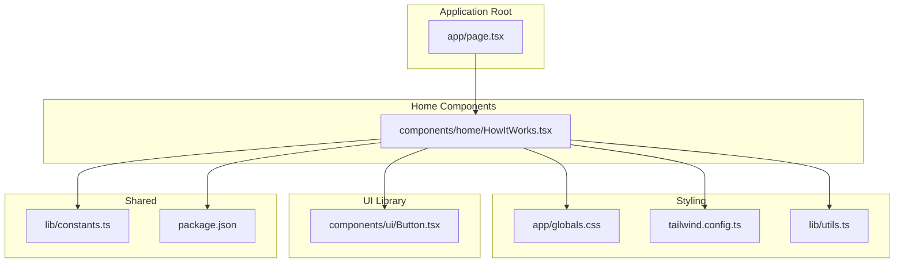
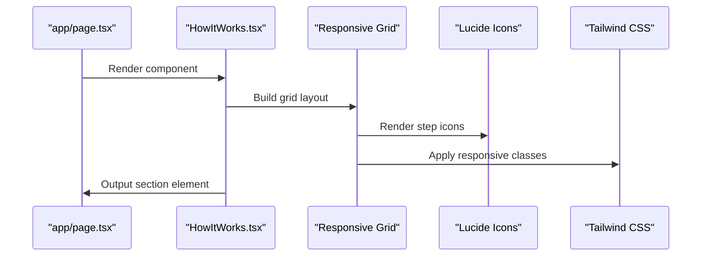
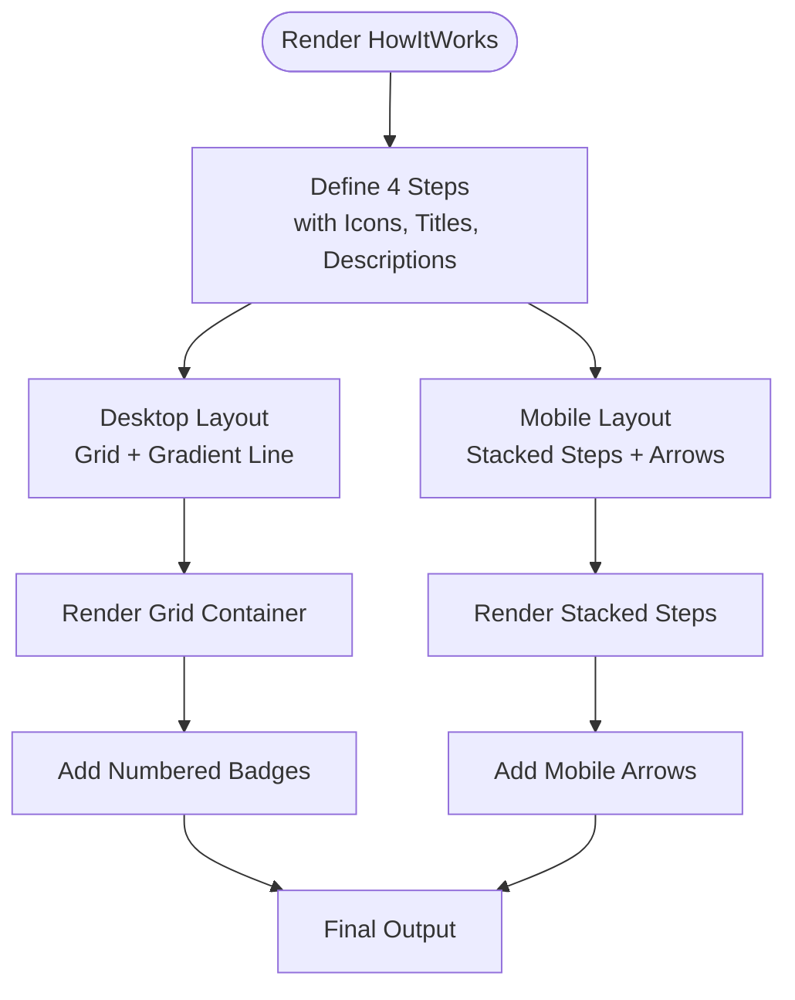
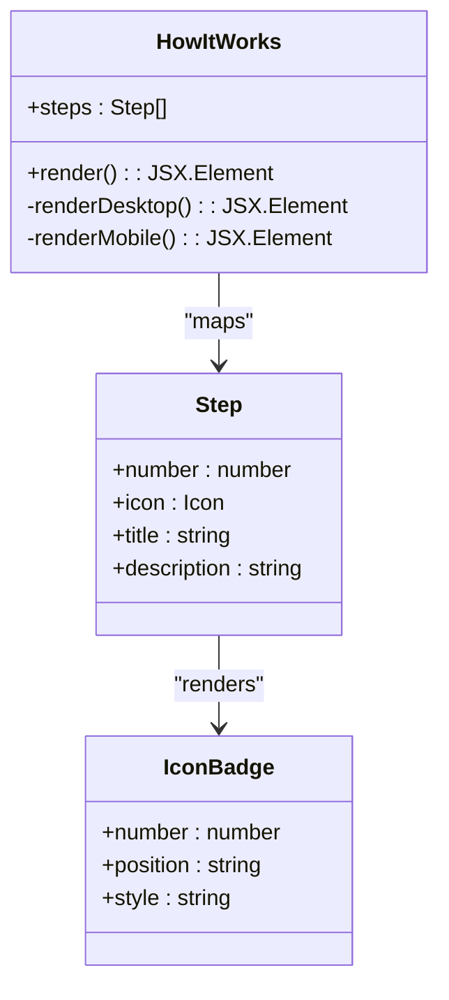
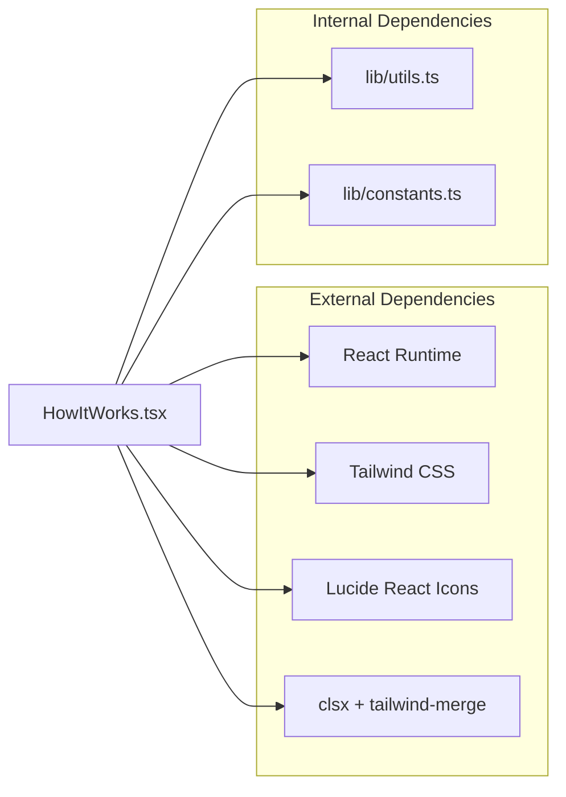

# How It Works

<cite>
**Referenced Files in This Document**
- [HowItWorks.tsx](file://smartview-portal/src/components/home/HowItWorks.tsx)
- [page.tsx](file://smartview-portal/src/app/page.tsx)
- [globals.css](file://smartview-portal/src/app/globals.css)
- [tailwind.config.ts](file://smartview-portal/tailwind.config.ts)
- [Button.tsx](file://smartview-portal/src/components/ui/Button.tsx)
- [constants.ts](file://smartview-portal/src/lib/constants.ts)
- [utils.ts](file://smartview-portal/src/lib/utils.ts)
- [package.json](file://smartview-portal/package.json)
</cite>

## Table of Contents
1. [Introduction](#introduction)
2. [Project Structure](#project-structure)
3. [Core Components](#core-components)
4. [Architecture Overview](#architecture-overview)
5. [Detailed Component Analysis](#detailed-component-analysis)
6. [Dependency Analysis](#dependency-analysis)
7. [Performance Considerations](#performance-considerations)
8. [Troubleshooting Guide](#troubleshooting-guide)
9. [Conclusion](#conclusion)
10. [Appendices](#appendices)

## Introduction
The HowItWorks component presents a four-step workflow visualization for the SmartView interview platform. It showcases the intelligent interview process: job posting, online coding assessment, AI-powered scoring, and collaborative decision-making. The component emphasizes a mobile-responsive design with a clear numbered progression system and visual indicators that adapt across device sizes.

## Project Structure
The HowItWorks component resides within the home section of the Next.js application and is integrated into the landing page layout. It leverages Tailwind CSS for responsive styling and Lucide React icons for visual elements.



**Diagram sources**
- [page.tsx:7-17](file://smartview-portal/src/app/page.tsx#L7-L17)
- [HowItWorks.tsx:30-92](file://smartview-portal/src/components/home/HowItWorks.tsx#L30-L92)
- [globals.css:1-31](file://smartview-portal/src/app/globals.css#L1-L31)
- [tailwind.config.ts:3-19](file://smartview-portal/tailwind.config.ts#L3-L19)
- [Button.tsx:39-50](file://smartview-portal/src/components/ui/Button.tsx#L39-L50)
- [constants.ts:1-11](file://smartview-portal/src/lib/constants.ts#L1-L11)
- [utils.ts:4-6](file://smartview-portal/src/lib/utils.ts#L4-L6)
- [package.json:11-20](file://smartview-portal/package.json#L11-L20)

**Section sources**
- [page.tsx:7-17](file://smartview-portal/src/app/page.tsx#L7-L17)
- [HowItWorks.tsx:30-92](file://smartview-portal/src/components/home/HowItWorks.tsx#L30-L92)
- [globals.css:1-31](file://smartview-portal/src/app/globals.css#L1-L31)
- [tailwind.config.ts:3-19](file://smartview-portal/tailwind.config.ts#L3-L19)
- [Button.tsx:39-50](file://smartview-portal/src/components/ui/Button.tsx#L39-L50)
- [constants.ts:1-11](file://smartview-portal/src/lib/constants.ts#L1-L11)
- [utils.ts:4-6](file://smartview-portal/src/lib/utils.ts#L4-L6)
- [package.json:11-20](file://smartview-portal/package.json#L11-L20)

## Core Components
The HowItWorks component is a self-contained React functional component that renders a responsive four-step workflow. It defines the step data locally and renders each step with a numbered badge, an icon, title, and description. The component includes a desktop-only connecting line and mobile-specific arrows between steps.

Key characteristics:
- Local step data definition with number, icon, title, and description
- Responsive grid layout with column counts adapting to screen size
- Desktop-only gradient connecting line spanning the workflow
- Mobile-specific vertical arrows between steps
- Center-aligned content with consistent spacing

**Section sources**
- [HowItWorks.tsx:3-28](file://smartview-portal/src/components/home/HowItWorks.tsx#L3-L28)
- [HowItWorks.tsx:45-87](file://smartview-portal/src/components/home/HowItWorks.tsx#L45-L87)

## Architecture Overview
The HowItWorks component follows a straightforward presentation architecture:
- Data layer: Local step array with icon references
- Rendering layer: Grid-based layout with responsive breakpoints
- Styling layer: Tailwind utility classes with gradient and shadow effects
- Integration layer: Included within the main landing page composition



**Diagram sources**
- [page.tsx:7-17](file://smartview-portal/src/app/page.tsx#L7-L17)
- [HowItWorks.tsx:30-92](file://smartview-portal/src/components/home/HowItWorks.tsx#L30-L92)

## Detailed Component Analysis

### Step-by-Step Workflow Visualization
The component implements a four-step process with clear visual progression:
1. Job Posting: HR publishes technical positions
2. Online Coding Test: Candidates complete challenges in realistic environments
3. AI Automatic Scoring: Multi-dimensional analysis of code quality
4. Collaborative Decision Making: Interviewers combine AI reports for scientific decisions

Each step includes:
- Numbered badge positioned absolutely on the icon circle
- Centralized icon with blue-themed styling
- Title and description text
- Mobile arrow indicator between steps



**Diagram sources**
- [HowItWorks.tsx:3-28](file://smartview-portal/src/components/home/HowItWorks.tsx#L3-L28)
- [HowItWorks.tsx:45-87](file://smartview-portal/src/components/home/HowItWorks.tsx#L45-L87)

**Section sources**
- [HowItWorks.tsx:3-28](file://smartview-portal/src/components/home/HowItWorks.tsx#L3-L28)
- [HowItWorks.tsx:45-87](file://smartview-portal/src/components/home/HowItWorks.tsx#L45-L87)

### Responsive Design Patterns
The component employs a tiered responsive strategy:
- Mobile-first approach with stacked single-column layout
- Tablet breakpoint increases to two columns
- Desktop breakpoint expands to four columns
- Desktop-only gradient connecting line
- Mobile-specific vertical arrows between steps

Breakpoint behavior:
- Base: 1 column (mobile)
- md: 2 columns (tablet)
- lg: 4 columns (desktop)
- Desktop-specific: Hidden gradient line for larger gaps

**Section sources**
- [HowItWorks.tsx:45-87](file://smartview-portal/src/components/home/HowItWorks.tsx#L45-L87)
- [globals.css:1-31](file://smartview-portal/src/app/globals.css#L1-L31)

### Visual Progression Indicators
The component uses several visual cues to indicate workflow progression:
- Numbered badges positioned absolutely on step circles
- Blue color scheme with gradient accents
- Shadow effects for depth perception
- Desktop gradient line connecting all steps
- Mobile arrows indicating direction between steps



**Diagram sources**
- [HowItWorks.tsx:3-28](file://smartview-portal/src/components/home/HowItWorks.tsx#L3-L28)
- [HowItWorks.tsx:58-66](file://smartview-portal/src/components/home/HowItWorks.tsx#L58-L66)

**Section sources**
- [HowItWorks.tsx:58-66](file://smartview-portal/src/components/home/HowItWorks.tsx#L58-L66)
- [HowItWorks.tsx:47](file://smartview-portal/src/components/home/HowItWorks.tsx#L47)

### Integration with Landing Page
The component integrates seamlessly into the main landing page through direct import and rendering. It appears between FeaturesOverview and StatsSection in the page composition, maintaining consistent spacing and styling.

Integration points:
- Direct import in app/page.tsx
- Standard section wrapper with padding
- Consistent typography and spacing
- Background color integration with page sections

**Section sources**
- [page.tsx:7-17](file://smartview-portal/src/app/page.tsx#L7-L17)

## Dependency Analysis
The HowItWorks component has minimal external dependencies, relying primarily on React and Tailwind CSS utilities.



**Diagram sources**
- [HowItWorks.tsx:1](file://smartview-portal/src/components/home/HowItWorks.tsx#L1)
- [utils.ts:4-6](file://smartview-portal/src/lib/utils.ts#L4-L6)
- [constants.ts:1-11](file://smartview-portal/src/lib/constants.ts#L1-L11)
- [package.json:11-20](file://smartview-portal/package.json#L11-L20)

**Section sources**
- [HowItWorks.tsx:1](file://smartview-portal/src/components/home/HowItWorks.tsx#L1)
- [utils.ts:4-6](file://smartview-portal/src/lib/utils.ts#L4-L6)
- [constants.ts:1-11](file://smartview-portal/src/lib/constants.ts#L1-L11)
- [package.json:11-20](file://smartview-portal/package.json#L11-L20)

## Performance Considerations
The component is lightweight with no heavy computations or external API calls. Performance characteristics:
- Minimal DOM nodes (constant 4 steps × ~10 elements each)
- No state management or lifecycle hooks
- Pure functional component with no re-renders
- Efficient grid layout with Tailwind utilities
- SVG icons rendered as inline elements

Optimization opportunities:
- Consider memoization if props were introduced
- Lazy loading could be beneficial if the component moved to a separate route
- Icon optimization through sprite sheets if many instances appear

## Troubleshooting Guide
Common issues and resolutions:
- Icons not rendering: Verify lucide-react installation and import paths
- Styling inconsistencies: Check Tailwind configuration and utility class names
- Responsive layout breaks: Inspect grid column classes and breakpoint utilities
- Color mismatches: Confirm Tailwind color configuration and CSS variables

Debugging steps:
1. Verify component import in app/page.tsx
2. Check browser console for missing dependencies
3. Inspect computed styles in developer tools
4. Validate Tailwind CSS compilation

**Section sources**
- [HowItWorks.tsx:30-92](file://smartview-portal/src/components/home/HowItWorks.tsx#L30-L92)
- [package.json:11-20](file://smartview-portal/package.json#L11-L20)

## Conclusion
The HowItWorks component provides an elegant, responsive visualization of the SmartView interview workflow. Its clean implementation demonstrates effective use of Tailwind CSS for responsive design, Lucide React icons for visual communication, and a straightforward data-driven approach to step rendering. The component serves as both a standalone feature and an integral part of the landing page experience.

## Appendices

### Prop Interfaces and Customization Options
Current implementation uses local step data. For extensibility, consider adding props:

```typescript
interface StepData {
  number: number;
  icon: React.ComponentType<{ className?: string }>;
  title: string;
  description: string;
}

interface HowItWorksProps {
  steps?: StepData[];
  className?: string;
  title?: string;
  subtitle?: string;
}
```

Customization options:
- Modify step count and content through props
- Adjust colors via className overrides
- Change typography through inherited classes
- Customize spacing with margin/padding utilities

### Guidelines for Modifying Workflow Steps
To add or modify steps:
1. Update the steps array with new step objects
2. Ensure each step has number, icon, title, and description
3. Verify icon availability in lucide-react
4. Test responsive behavior across breakpoints
5. Update mobile arrow logic if step count changes

### Adding New Process Stages
Steps to incorporate additional stages:
1. Extend the steps array with new step objects
2. Add corresponding Lucide React icons
3. Update responsive grid classes if needed
4. Test desktop gradient line positioning
5. Verify mobile arrow placement logic

### Visual Representation Customization
Customization approaches:
- Modify color scheme through Tailwind color utilities
- Adjust sizing with width/height utilities
- Change spacing with margin/padding utilities
- Update typography with text utilities
- Modify shadows and borders for depth effects