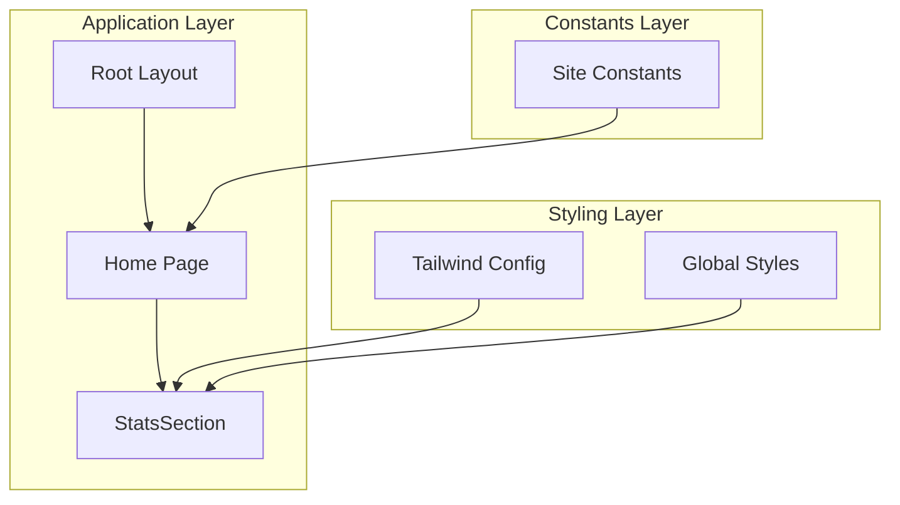
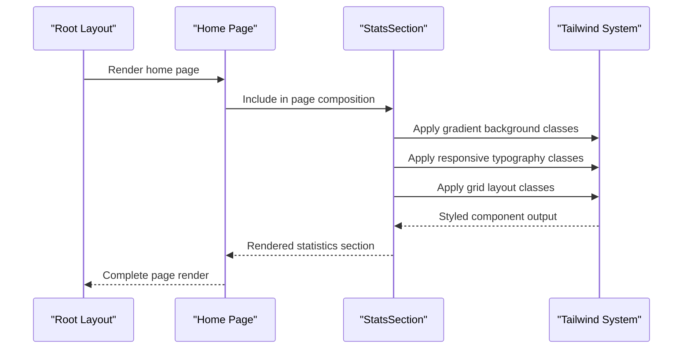
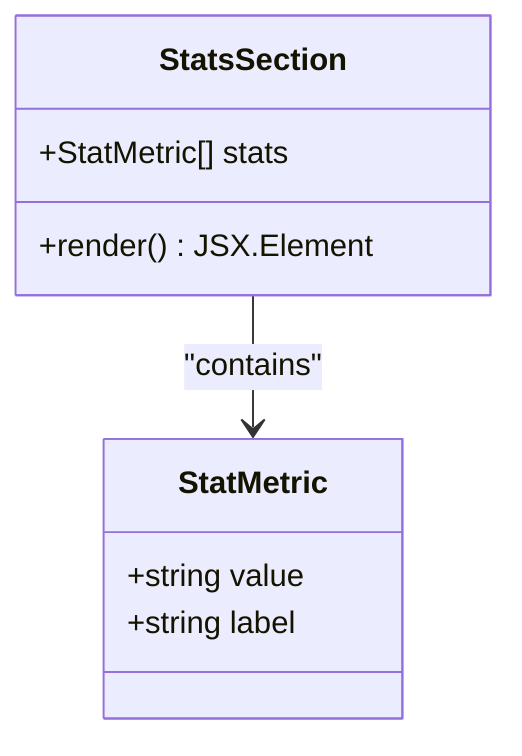
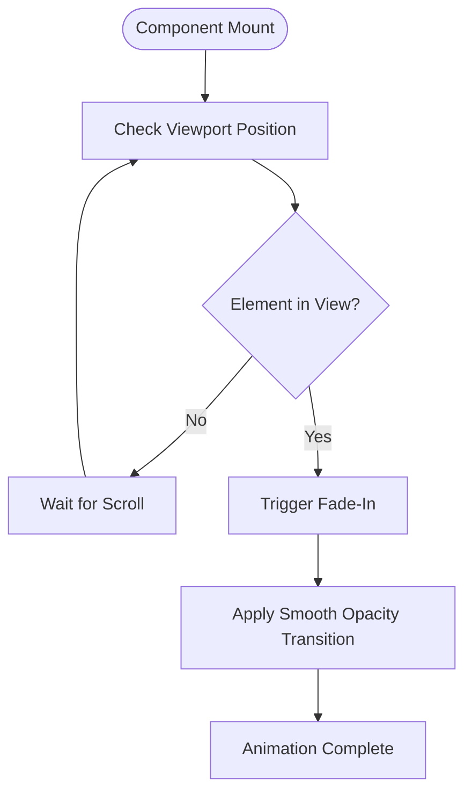
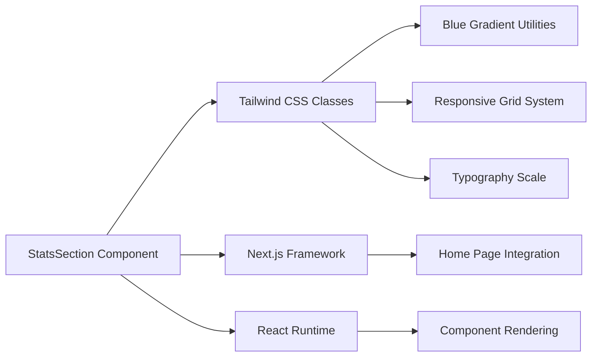

# Stats Section

<cite>
**Referenced Files in This Document**
- [StatsSection.tsx](file://smartview-portal/src/components/home/StatsSection.tsx)
- [page.tsx](file://smartview-portal/src/app/page.tsx)
- [layout.tsx](file://smartview-portal/src/app/layout.tsx)
- [globals.css](file://smartview-portal/src/app/globals.css)
- [tailwind.config.ts](file://smartview-portal/tailwind.config.ts)
- [constants.ts](file://smartview-portal/src/lib/constants.ts)
- [HeroSection.tsx](file://smartview-portal/src/components/home/HeroSection.tsx)
</cite>

## Table of Contents
1. [Introduction](#introduction)
2. [Project Structure](#project-structure)
3. [Core Components](#core-components)
4. [Architecture Overview](#architecture-overview)
5. [Detailed Component Analysis](#detailed-component-analysis)
6. [Dependency Analysis](#dependency-analysis)
7. [Performance Considerations](#performance-considerations)
8. [Troubleshooting Guide](#troubleshooting-guide)
9. [Conclusion](#conclusion)

## Introduction
The StatsSection component presents key performance metrics in an engaging visual format on the landing page. It showcases four primary metrics: scoring accuracy rate, recruitment efficiency improvement, candidate satisfaction rating, and concurrent testing capacity. The component employs a blue gradient background, responsive typography scales, and a centered grid layout to deliver a visually appealing presentation of quantitative data.

## Project Structure
The StatsSection is integrated into the main landing page as part of the home page composition. It follows Next.js conventions with TypeScript and Tailwind CSS styling.

**Diagram sources**
- [layout.tsx:18-32](file://smartview-portal/src/app/layout.tsx#L18-L32)
- [page.tsx:7-17](file://smartview-portal/src/app/page.tsx#L7-L17)
- [StatsSection.tsx:20-39](file://smartview-portal/src/components/home/StatsSection.tsx#L20-L39)

**Section sources**
- [layout.tsx:18-32](file://smartview-portal/src/app/layout.tsx#L18-L32)
- [page.tsx:7-17](file://smartview-portal/src/app/page.tsx#L7-L17)

## Core Components
The StatsSection component consists of a data array containing four metric objects and a rendering function that maps these metrics to visual cards. Each metric includes a value display and a descriptive label.

Key implementation characteristics:
- Static data array with four predefined metrics
- Responsive grid layout (2 columns on mobile, 4 columns on large screens)
- Blue gradient background spanning from blue-600 to blue-800
- White numeric values with light blue labels
- Progressive typography scaling from text-4xl to text-6xl

**Section sources**
- [StatsSection.tsx:1-18](file://smartview-portal/src/components/home/StatsSection.tsx#L1-L18)
- [StatsSection.tsx:20-39](file://smartview-portal/src/components/home/StatsSection.tsx#L20-L39)

## Architecture Overview
The StatsSection participates in the landing page's visual hierarchy, positioned between feature highlights and call-to-action sections. It leverages the global styling system while maintaining its own distinct visual identity.

**Diagram sources**
- [layout.tsx:23-31](file://smartview-portal/src/app/layout.tsx#L23-L31)
- [page.tsx:9-15](file://smartview-portal/src/app/page.tsx#L9-L15)
- [StatsSection.tsx:22-37](file://smartview-portal/src/components/home/StatsSection.tsx#L22-L37)

## Detailed Component Analysis

### Data Structure and Metric Presentation
The component uses a straightforward array structure to define metrics, each containing value and label properties. This design enables easy modification and extension of the displayed statistics.

**Diagram sources**
- [StatsSection.tsx:1-18](file://smartview-portal/src/components/home/StatsSection.tsx#L1-L18)

### Responsive Typography Implementation
The component implements a progressive typography scale that adapts to different screen sizes:

- Mobile: text-4xl for values, base text size for labels
- Tablet: text-5xl for values, base text size for labels  
- Desktop: text-6xl for values, lg text size for labels

This creates a visual hierarchy that emphasizes larger numbers on desktop while maintaining readability across devices.

### Gradient Background Design
The component utilizes Tailwind's gradient utilities to create a blue-themed gradient background. The gradient transitions from blue-600 through blue-700 to blue-800, providing depth and visual interest without overwhelming the content.

### Grid Layout and Spacing
The layout employs a responsive grid system:
- Mobile: 2-column grid with reduced spacing
- Large screens: 4-column grid with increased spacing
- Consistent padding and margin patterns throughout

**Section sources**
- [StatsSection.tsx:24-35](file://smartview-portal/src/components/home/StatsSection.tsx#L24-L35)

### Animation and Interaction Patterns
While the StatsSection itself does not implement complex animations, it follows established patterns for subtle visual enhancements:

**Diagram sources**
- [StatsSection.tsx:20-39](file://smartview-portal/src/components/home/StatsSection.tsx#L20-L39)

### Accessibility Considerations
The component incorporates several accessibility best practices:
- High contrast color scheme (white text on blue backgrounds)
- Sufficient color contrast ratios for text elements
- Semantic HTML structure with proper heading hierarchy
- Responsive font sizing for readability across devices
- Focus-friendly interactive elements

## Dependency Analysis
The StatsSection has minimal external dependencies, relying primarily on Tailwind CSS for styling and Next.js for framework integration.

**Diagram sources**
- [StatsSection.tsx:22-37](file://smartview-portal/src/components/home/StatsSection.tsx#L22-L37)
- [page.tsx:4-13](file://smartview-portal/src/app/page.tsx#L4-L13)

**Section sources**
- [StatsSection.tsx:22-37](file://smartview-portal/src/components/home/StatsSection.tsx#L22-L37)
- [page.tsx:4-13](file://smartview-portal/src/app/page.tsx#L4-L13)

## Performance Considerations
The component demonstrates efficient implementation patterns:
- Minimal DOM structure with direct mapping of data to elements
- No unnecessary re-renders due to static data
- Lightweight styling using utility classes
- Optimized grid layout with built-in responsive behavior

Potential optimization opportunities:
- Consider implementing intersection observer for viewport-triggered animations
- Add lazy loading for metric animations to improve initial load performance
- Implement memoization for the stats array if dynamic updates become necessary

## Troubleshooting Guide
Common implementation issues and solutions:

### Styling Issues
- **Problem**: Gradient not appearing correctly
  - **Solution**: Verify Tailwind configuration includes the gradient utilities and color palette
  - **Reference**: [tailwind.config.ts:10-15](file://smartview-portal/tailwind.config.ts#L10-L15)

### Responsive Behavior Problems
- **Problem**: Grid layout not adapting to screen sizes
  - **Solution**: Ensure responsive breakpoint classes are properly configured
  - **Reference**: [StatsSection.tsx:24](file://smartview-portal/src/components/home/StatsSection.tsx#L24)

### Content Display Issues
- **Problem**: Text overlapping or misaligned
  - **Solution**: Check spacing utilities and ensure proper container constraints
  - **Reference**: [StatsSection.tsx:26-33](file://smartview-portal/src/components/home/StatsSection.tsx#L26-L33)

**Section sources**
- [tailwind.config.ts:10-15](file://smartview-portal/tailwind.config.ts#L10-L15)
- [StatsSection.tsx:24-33](file://smartview-portal/src/components/home/StatsSection.tsx#L24-L33)

## Conclusion
The StatsSection component successfully delivers quantitative data in an engaging, accessible format. Its clean implementation leverages modern web development practices including responsive design, semantic markup, and performance-conscious coding. The component serves as an effective visual anchor in the landing page experience, communicating key value propositions through clear, well-structured metrics presentation.

The component's modular design allows for easy maintenance and future enhancements while maintaining consistency with the overall application aesthetic and accessibility standards.