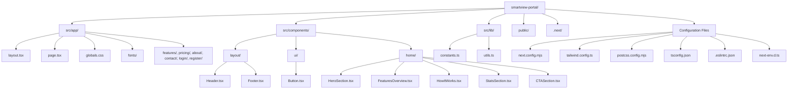
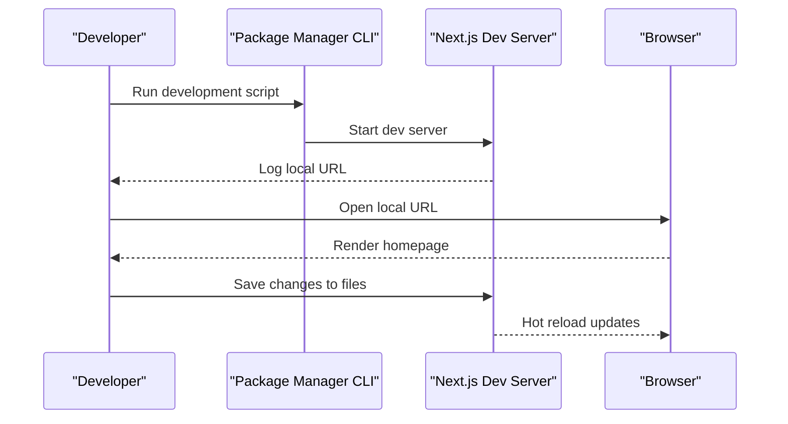
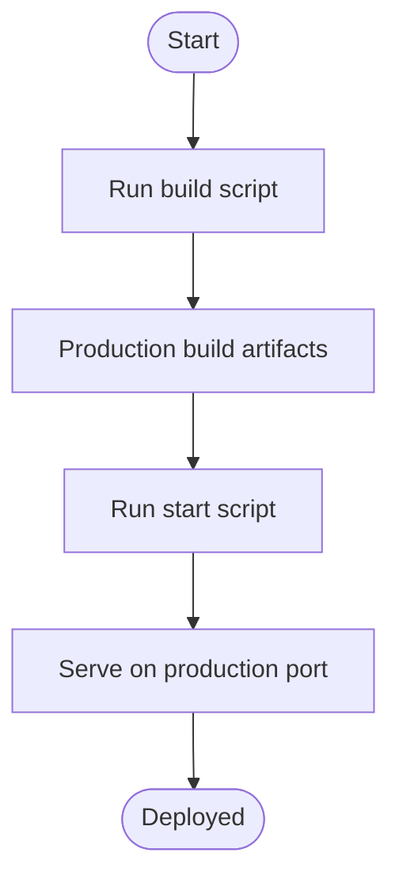

# Getting Started

<cite>
**Referenced Files in This Document**
- [package.json](file://smartview-portal/package.json)
- [README.md](file://smartview-portal/README.md)
- [next.config.mjs](file://smartview-portal/next.config.mjs)
- [tailwind.config.ts](file://smartview-portal/tailwind.config.ts)
- [postcss.config.mjs](file://smartview-portal/postcss.config.mjs)
- [.eslintrc.json](file://smartview-portal/.eslintrc.json)
- [tsconfig.json](file://smartview-portal/tsconfig.json)
- [next-env.d.ts](file://smartview-portal/next-env.d.ts)
- [src/app/layout.tsx](file://smartview-portal/src/app/layout.tsx)
- [src/app/page.tsx](file://smartview-portal/src/app/page.tsx)
- [src/app/globals.css](file://smartview-portal/src/app/globals.css)
- [src/lib/constants.ts](file://smartview-portal/src/lib/constants.ts)
- [src/lib/utils.ts](file://smartview-portal/src/lib/utils.ts)
- [src/components/layout/Header.tsx](file://smartview-portal/src/components/layout/Header.tsx)
- [src/components/ui/Button.tsx](file://smartview-portal/src/components/ui/Button.tsx)
- [src/components/home/HeroSection.tsx](file://smartview-portal/src/components/home/HeroSection.tsx)
- [src/components/home/FeaturesOverview.tsx](file://smartview-portal/src/components/home/FeaturesOverview.tsx)
</cite>

## Table of Contents
1. [Introduction](#introduction)
2. [Prerequisites](#prerequisites)
3. [Installation](#installation)
4. [Development Workflow](#development-workflow)
5. [Project Structure](#project-structure)
6. [Key Configuration Files](#key-configuration-files)
7. [Essential Commands](#essential-commands)
8. [Local Development Walkthrough](#local-development-walkthrough)
9. [Build and Deployment](#build-and-deployment)
10. [Troubleshooting](#troubleshooting)
11. [Verification Checklist](#verification-checklist)
12. [Conclusion](#conclusion)

## Introduction
SmartView Portal is a modern web application built with Next.js App Router. It serves as a showcase for an AI-powered interview platform, featuring responsive layouts, a cohesive design system, and reusable UI components. This guide helps you set up the development environment, run the application locally, explore the project structure, and prepare for building or deploying the application.

## Prerequisites
- Node.js: The project targets a specific Next.js version compatible with React 18. Ensure your environment uses a Node.js version that supports the included dependencies. The project’s dependency specification indicates compatibility with Next.js 14.x and React 18.x.
- Package manager: You can use npm, yarn, pnpm, or bun as per your preference.
- Operating system: macOS, Linux, or Windows with a terminal or command prompt.

**Section sources**
- [package.json:11-20](file://smartview-portal/package.json#L11-L20)
- [package.json:16](file://smartview-portal/package.json#L16)
- [README.md:5-15](file://smartview-portal/README.md#L5-L15)

## Installation
Follow these steps to install dependencies and prepare your environment:

1. Open a terminal in the repository root.
2. Navigate to the SmartView Portal directory.
3. Install dependencies using your preferred package manager:
   - npm: npm ci or npm install
   - yarn: yarn install
   - pnpm: pnpm install
   - bun: bun install

After installation completes, you can proceed to run the development server.

**Section sources**
- [package.json:5-10](file://smartview-portal/package.json#L5-L10)
- [README.md:5-15](file://smartview-portal/README.md#L5-L15)

## Development Workflow
- Start the development server:
  - Run the script defined for development.
  - Visit the local URL shown in the terminal after the server starts.
- Edit pages:
  - Modify the main page component to change the homepage content.
  - Explore the components directory to customize UI elements.
- Auto-refresh:
  - The development server hot-reloads when you save changes to files.

**Section sources**
- [package.json:6](file://smartview-portal/package.json#L6)
- [README.md:5-17](file://smartview-portal/README.md#L5-L17)

## Project Structure
SmartView Portal follows Next.js conventions with an App Router-based structure. Key areas include:
- Application shell and routing under src/app
- Reusable components under src/components
- Shared utilities and constants under src/lib
- Global styles and Tailwind configuration
- TypeScript and ESLint configurations

**Diagram sources**
- [src/app/layout.tsx](file://smartview-portal/src/app/layout.tsx)
- [src/app/page.tsx](file://smartview-portal/src/app/page.tsx)
- [src/app/globals.css](file://smartview-portal/src/app/globals.css)
- [src/components/layout/Header.tsx](file://smartview-portal/src/components/layout/Header.tsx)
- [src/components/ui/Button.tsx](file://smartview-portal/src/components/ui/Button.tsx)
- [src/components/home/HeroSection.tsx](file://smartview-portal/src/components/home/HeroSection.tsx)
- [src/components/home/FeaturesOverview.tsx](file://smartview-portal/src/components/home/FeaturesOverview.tsx)
- [src/lib/constants.ts](file://smartview-portal/src/lib/constants.ts)
- [src/lib/utils.ts](file://smartview-portal/src/lib/utils.ts)
- [next.config.mjs](file://smartview-portal/next.config.mjs)
- [tailwind.config.ts](file://smartview-portal/tailwind.config.ts)
- [postcss.config.mjs](file://smartview-portal/postcss.config.mjs)
- [tsconfig.json](file://smartview-portal/tsconfig.json)
- [.eslintrc.json](file://smartview-portal/.eslintrc.json)
- [next-env.d.ts](file://smartview-portal/next-env.d.ts)

**Section sources**
- [src/app/layout.tsx:1-33](file://smartview-portal/src/app/layout.tsx#L1-L33)
- [src/app/page.tsx:1-18](file://smartview-portal/src/app/page.tsx#L1-L18)
- [src/app/globals.css:1-31](file://smartview-portal/src/app/globals.css#L1-L31)
- [src/components/layout/Header.tsx:1-131](file://smartview-portal/src/components/layout/Header.tsx#L1-L131)
- [src/components/ui/Button.tsx:1-54](file://smartview-portal/src/components/ui/Button.tsx#L1-L54)
- [src/components/home/HeroSection.tsx:1-125](file://smartview-portal/src/components/home/HeroSection.tsx#L1-L125)
- [src/components/home/FeaturesOverview.tsx:1-74](file://smartview-portal/src/components/home/FeaturesOverview.tsx#L1-L74)
- [src/lib/constants.ts:1-11](file://smartview-portal/src/lib/constants.ts#L1-L11)
- [src/lib/utils.ts:1-7](file://smartview-portal/src/lib/utils.ts#L1-L7)

## Key Configuration Files
- next.config.mjs: Next.js configuration file. The current setup is minimal and inherits defaults suitable for this project.
- tailwind.config.ts: Tailwind CSS configuration specifying content paths and theme extensions for design tokens.
- postcss.config.mjs: PostCSS configuration enabling Tailwind CSS processing.
- tsconfig.json: TypeScript compiler options optimized for Next.js App Router and bundler resolution.
- .eslintrc.json: ESLint configuration extending Next.js core web vitals and TypeScript rules.
- next-env.d.ts: Type declaration for Next.js environment types.

**Section sources**
- [next.config.mjs:1-5](file://smartview-portal/next.config.mjs#L1-L5)
- [tailwind.config.ts:1-20](file://smartview-portal/tailwind.config.ts#L1-L20)
- [postcss.config.mjs:1-9](file://smartview-portal/postcss.config.mjs#L1-L9)
- [tsconfig.json:1-27](file://smartview-portal/tsconfig.json#L1-L27)
- [.eslintrc.json:1-4](file://smartview-portal/.eslintrc.json#L1-L4)
- [next-env.d.ts:1-6](file://smartview-portal/next-env.d.ts#L1-L6)

## Essential Commands
- Development server: Start the Next.js dev server using the configured script.
- Build: Produce an optimized production build.
- Start: Serve the production build locally.
- Lint: Run ESLint checks for code quality.

These commands are defined in the project scripts and can be executed with your chosen package manager.

**Section sources**
- [package.json:5-10](file://smartview-portal/package.json#L5-L10)

## Local Development Walkthrough
1. Launch the development server using the script defined in the project configuration.
2. Open the local URL provided by the development server in your browser.
3. Explore the homepage and navigation:
   - The root page composes several marketing sections.
   - The layout integrates a shared header and footer.
4. Customize content:
   - Modify the root page component to adjust homepage content.
   - Update constants and navigation links via shared constants.
5. Iterate on components:
   - Adjust UI components under the components directory.
   - Use the shared Button component and utility functions for consistent styling.

**Diagram sources**
- [package.json:6](file://smartview-portal/package.json#L6)
- [README.md:5-17](file://smartview-portal/README.md#L5-L17)

**Section sources**
- [README.md:5-17](file://smartview-portal/README.md#L5-L17)
- [src/app/page.tsx:1-18](file://smartview-portal/src/app/page.tsx#L1-L18)
- [src/app/layout.tsx:1-33](file://smartview-portal/src/app/layout.tsx#L1-L33)
- [src/lib/constants.ts:1-11](file://smartview-portal/src/lib/constants.ts#L1-L11)

## Build and Deployment
- Build the project:
  - Use the build script to compile assets and pages for production.
- Start the production server:
  - Use the start script to serve the built application.
- Deployment:
  - The project includes guidance for deploying on Vercel, including links to official Next.js deployment documentation.

**Diagram sources**
- [package.json:7-8](file://smartview-portal/package.json#L7-L8)
- [README.md:32-37](file://smartview-portal/README.md#L32-L37)

**Section sources**
- [package.json:7-8](file://smartview-portal/package.json#L7-L8)
- [README.md:32-37](file://smartview-portal/README.md#L32-L37)

## Troubleshooting
- Port conflicts:
  - If the default port is unavailable, Next.js typically selects another port. Check the terminal output for the active URL.
- Missing dependencies:
  - Reinstall dependencies using your package manager if you encounter module resolution errors.
- TypeScript or ESLint errors:
  - Review lint output and fix reported issues. The project extends Next.js core web vitals and TypeScript rules.
- Tailwind CSS not applying:
  - Ensure Tailwind content paths match your component locations and rebuild the project after changes.

**Section sources**
- [README.md:5-17](file://smartview-portal/README.md#L5-L17)
- [.eslintrc.json:1-4](file://smartview-portal/.eslintrc.json#L1-L4)
- [tailwind.config.ts:4-8](file://smartview-portal/tailwind.config.ts#L4-L8)

## Verification Checklist
- Dependencies installed successfully.
- Development server starts without errors and opens the local URL.
- Homepage renders with expected sections and navigation.
- Global styles and design tokens apply correctly.
- ESLint passes without critical issues.
- Production build succeeds and start script runs without errors.

**Section sources**
- [README.md:5-17](file://smartview-portal/README.md#L5-L17)
- [src/app/globals.css:1-31](file://smartview-portal/src/app/globals.css#L1-L31)
- [.eslintrc.json:1-4](file://smartview-portal/.eslintrc.json#L1-L4)
- [package.json:7-8](file://smartview-portal/package.json#L7-L8)

## Conclusion
You now have the essentials to set up, run, and iterate on SmartView Portal. Explore the components, customize content, and prepare for further enhancements or deployment. Refer to the linked Next.js documentation for deeper insights into features and best practices.