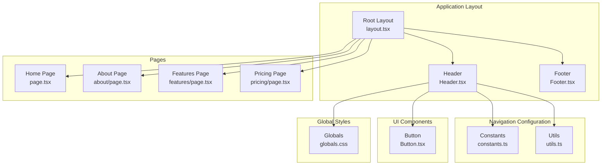
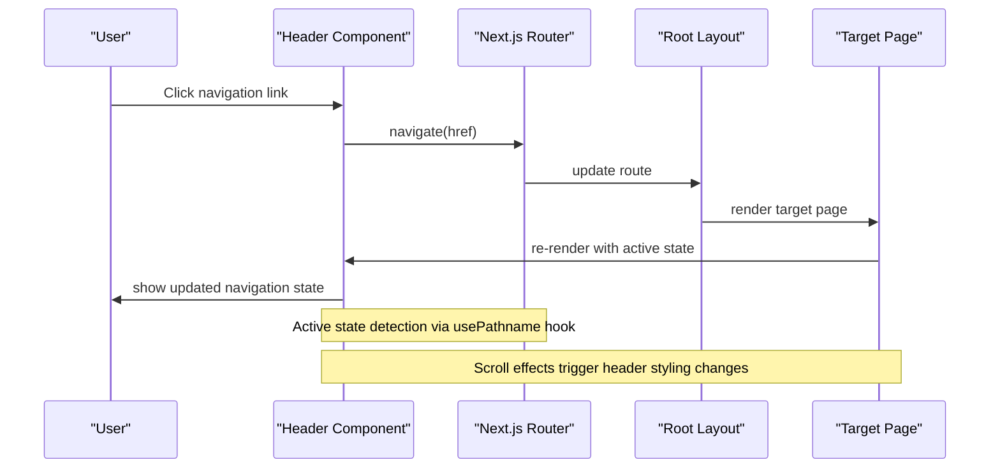
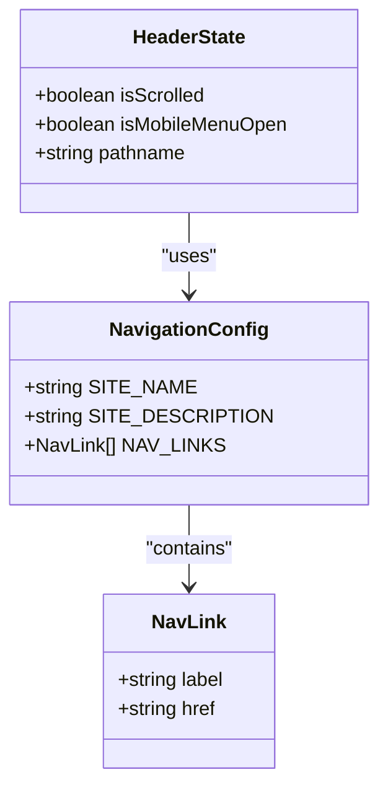
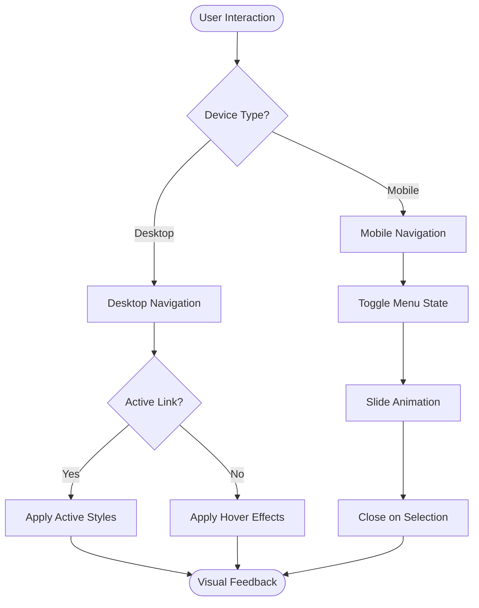
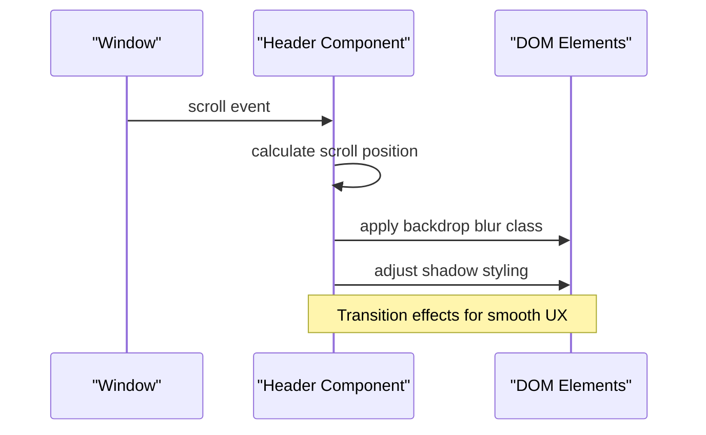
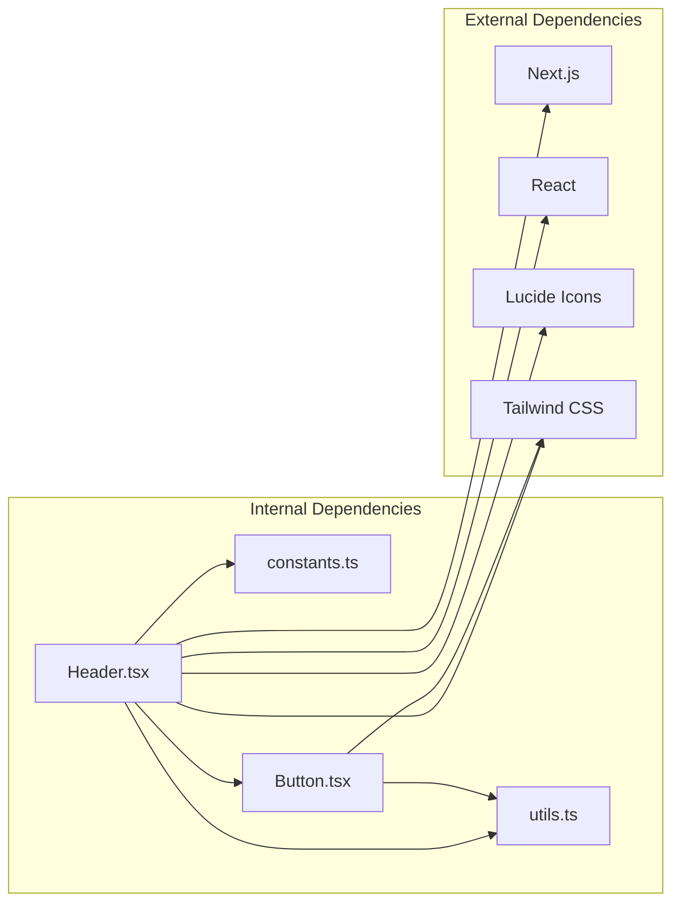

# Navigation System

<cite>
**Referenced Files in This Document**
- [constants.ts](file://smartview-portal/src/lib/constants.ts)
- [Header.tsx](file://smartview-portal/src/components/layout/Header.tsx)
- [layout.tsx](file://smartview-portal/src/app/layout.tsx)
- [Button.tsx](file://smartview-portal/src/components/ui/Button.tsx)
- [utils.ts](file://smartview-portal/src/lib/utils.ts)
- [globals.css](file://smartview-portal/src/app/globals.css)
- [package.json](file://smartview-portal/package.json)
- [tailwind.config.ts](file://smartview-portal/tailwind.config.ts)
- [page.tsx](file://smartview-portal/src/app/page.tsx)
- [about/page.tsx](file://smartview-portal/src/app/about/page.tsx)
- [features/page.tsx](file://smartview-portal/src/app/features/page.tsx)
- [pricing/page.tsx](file://smartview-portal/src/app/pricing/page.tsx)
</cite>

## Table of Contents
1. [Introduction](#introduction)
2. [Project Structure](#project-structure)
3. [Core Components](#core-components)
4. [Architecture Overview](#architecture-overview)
5. [Detailed Component Analysis](#detailed-component-analysis)
6. [Dependency Analysis](#dependency-analysis)
7. [Performance Considerations](#performance-considerations)
8. [Troubleshooting Guide](#troubleshooting-guide)
9. [Conclusion](#conclusion)

## Introduction
This document provides comprehensive documentation for the SmartView Portal navigation system. It focuses on the centralized navigation configuration using constants.ts for route management and active state handling, the responsive navigation implementation in Header.tsx including desktop and mobile menu systems, and the integration with Next.js routing, scroll effects, and visual feedback mechanisms. The documentation also covers customization options for adding new navigation items, modifying existing links, and implementing custom navigation behaviors, while addressing accessibility considerations and mobile responsiveness.

## Project Structure
The navigation system is built around a centralized configuration and a reusable header component that integrates with Next.js routing. The key files involved are:

- constants.ts: Centralized navigation configuration and site metadata
- Header.tsx: Responsive navigation implementation with desktop and mobile menus
- layout.tsx: Application layout that includes the Header component
- Button.tsx: Reusable button component used in navigation
- utils.ts: Utility functions for class merging
- globals.css: Global styles including smooth scrolling behavior
- Page components: Individual pages that demonstrate navigation integration

**Diagram sources**
- [layout.tsx:18-32](file://smartview-portal/src/app/layout.tsx#L18-L32)
- [Header.tsx:11-131](file://smartview-portal/src/components/layout/Header.tsx#L11-L131)
- [constants.ts:1-11](file://smartview-portal/src/lib/constants.ts#L1-L11)
- [Button.tsx:1-54](file://smartview-portal/src/components/ui/Button.tsx#L1-L54)
- [utils.ts:1-7](file://smartview-portal/src/lib/utils.ts#L1-L7)
- [globals.css:1-31](file://smartview-portal/src/app/globals.css#L1-L31)

**Section sources**
- [layout.tsx:18-32](file://smartview-portal/src/app/layout.tsx#L18-L32)
- [Header.tsx:11-131](file://smartview-portal/src/components/layout/Header.tsx#L11-L131)
- [constants.ts:1-11](file://smartview-portal/src/lib/constants.ts#L1-L11)

## Core Components
The navigation system consists of several core components that work together to provide a seamless user experience:

### Centralized Navigation Configuration
The constants.ts file defines the navigation structure and site metadata:
- SITE_NAME: Brand name displayed in the header
- SITE_DESCRIPTION: Meta description for SEO
- NAV_LINKS: Array of navigation items with label and href properties

### Header Component
The Header.tsx component implements the responsive navigation system:
- Uses Next.js usePathname hook for active state detection
- Implements scroll-aware header styling with backdrop blur effect
- Provides desktop navigation with hover states and active indicators
- Implements mobile-responsive menu with slide-in animation
- Integrates with the Button component for call-to-action buttons

### Button Component
The Button.tsx component provides consistent styling for navigation actions:
- Supports multiple variants (primary, secondary, outline, ghost)
- Responsive sizing options
- asChild prop for semantic link integration

**Section sources**
- [constants.ts:1-11](file://smartview-portal/src/lib/constants.ts#L1-L11)
- [Header.tsx:11-131](file://smartview-portal/src/components/layout/Header.tsx#L11-L131)
- [Button.tsx:1-54](file://smartview-portal/src/components/ui/Button.tsx#L1-L54)

## Architecture Overview
The navigation system follows a modular architecture with clear separation of concerns:

**Diagram sources**
- [Header.tsx:14-23](file://smartview-portal/src/components/layout/Header.tsx#L14-L23)
- [layout.tsx:18-32](file://smartview-portal/src/app/layout.tsx#L18-L32)

The architecture ensures:
- Centralized configuration management
- Responsive design patterns
- Accessibility compliance
- Performance optimization through efficient state management

## Detailed Component Analysis

### Navigation Data Structure
The navigation system uses a structured data approach for managing links:

**Diagram sources**
- [constants.ts:4-10](file://smartview-portal/src/lib/constants.ts#L4-L10)
- [Header.tsx:12-14](file://smartview-portal/src/components/layout/Header.tsx#L12-L14)

The NAV_LINKS array provides:
- Type-safe navigation item structure
- Consistent labeling across the application
- Easy maintenance and modification capabilities

### Responsive Navigation Implementation
The Header.tsx component implements a sophisticated responsive navigation system:

#### Desktop Navigation Pattern
Desktop navigation uses Next.js Link components with dynamic styling:
- Active state detection via pathname comparison
- Hover effects with color transitions
- Consistent spacing and typography
- Backdrop blur effect on scroll

#### Mobile Navigation Pattern
Mobile navigation implements a slide-in menu system:
- State-driven visibility control
- Smooth transition animations
- Touch-friendly button sizes
- Integrated call-to-action buttons

**Diagram sources**
- [Header.tsx:44-60](file://smartview-portal/src/components/layout/Header.tsx#L44-L60)
- [Header.tsx:87-127](file://smartview-portal/src/components/layout/Header.tsx#L87-L127)

### State Management Patterns
The navigation system employs React hooks for efficient state management:

#### Scroll Effect Implementation

**Diagram sources**
- [Header.tsx:16-23](file://smartview-portal/src/components/layout/Header.tsx#L16-L23)

#### Mobile Menu State Management
The mobile menu uses controlled state with:
- Boolean flag for visibility
- Animation state transitions
- Accessibility attributes (aria-label)
- Event handlers for opening/closing

**Section sources**
- [Header.tsx:11-131](file://smartview-portal/src/components/layout/Header.tsx#L11-L131)

### Integration with Next.js Routing
The navigation system integrates seamlessly with Next.js routing:

#### Active State Detection
The usePathname hook provides real-time route information:
- Automatic updates on navigation
- Efficient re-rendering only when route changes
- Consistent active state across all navigation instances

#### Link Component Usage
Next.js Link components provide:
- Client-side navigation without full page reloads
- Prefetching for improved performance
- Semantic HTML structure for accessibility

**Section sources**
- [Header.tsx:3-8](file://smartview-portal/src/components/layout/Header.tsx#L3-L8)

### Visual Feedback Mechanisms
The navigation system provides comprehensive visual feedback:

#### Color Scheme and Typography
- Blue accent color for active states and highlights
- Gray color palette for neutral states
- Consistent typography hierarchy
- Responsive font sizing

#### Animation and Transitions
- Smooth backdrop blur transitions on scroll
- Slide animations for mobile menu
- Hover effects with color transitions
- Duration-based animations for perceived performance

**Section sources**
- [Header.tsx:25-32](file://smartview-portal/src/components/layout/Header.tsx#L25-L32)
- [Header.tsx:88-92](file://smartview-portal/src/components/layout/Header.tsx#L88-L92)

## Dependency Analysis
The navigation system has minimal external dependencies, focusing on core Next.js functionality:

**Diagram sources**
- [Header.tsx:3-9](file://smartview-portal/src/components/layout/Header.tsx#L3-L9)
- [Button.tsx:1-5](file://smartview-portal/src/components/ui/Button.tsx#L1-L5)
- [package.json:11-20](file://smartview-portal/package.json#L11-L20)

Key dependency relationships:
- Header depends on constants for navigation data
- Button component uses utility functions for class merging
- All components rely on Next.js for routing and React for state management
- Tailwind CSS provides styling utilities
- Lucide icons provide consistent iconography

**Section sources**
- [package.json:11-20](file://smartview-portal/package.json#L11-L20)
- [Header.tsx:3-9](file://smartview-portal/src/components/layout/Header.tsx#L3-L9)

## Performance Considerations
The navigation system is designed with performance optimization in mind:

### Efficient State Management
- Minimal state updates through targeted useEffect hooks
- Cleanup functions to prevent memory leaks
- Optimized re-rendering through selective state updates

### Bundle Size Optimization
- Tree-shaking compatible imports
- Utility functions for efficient class merging
- Minimal external dependencies

### Rendering Performance
- CSS transitions for smooth animations
- Backdrop blur using hardware acceleration
- Efficient DOM manipulation through class toggling

## Troubleshooting Guide
Common issues and their solutions:

### Navigation Links Not Working
- Verify href values match existing page routes
- Check for typos in navigation configuration
- Ensure Next.js pages exist for all configured links

### Active State Not Highlighting
- Confirm usePathname hook is returning expected values
- Check for trailing slashes in href vs pathname
- Verify route structure matches Next.js convention

### Mobile Menu Issues
- Ensure state cleanup in useEffect return function
- Check for conflicting CSS classes
- Verify touch event handlers are properly attached

### Scroll Effects Not Working
- Confirm scroll event listeners are properly cleaned up
- Check for CSS conflicts with backdrop blur
- Verify z-index values for proper stacking context

**Section sources**
- [Header.tsx:16-23](file://smartview-portal/src/components/layout/Header.tsx#L16-L23)
- [Header.tsx:73-83](file://smartview-portal/src/components/layout/Header.tsx#L73-L83)

## Conclusion
The SmartView Portal navigation system demonstrates a well-architected, responsive, and accessible navigation solution. By centralizing configuration in constants.ts and implementing a robust Header component with Next.js integration, the system provides:

- Consistent navigation experience across all pages
- Responsive design patterns for both desktop and mobile
- Efficient state management with minimal performance impact
- Comprehensive accessibility support
- Easy customization and extension capabilities

The modular architecture allows for straightforward modifications to navigation items, styling, and behavior while maintaining consistency across the entire application. The integration with Next.js routing ensures optimal performance and user experience, making this navigation system a solid foundation for the SmartView Portal.