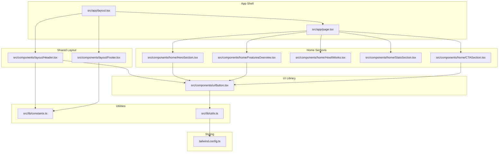
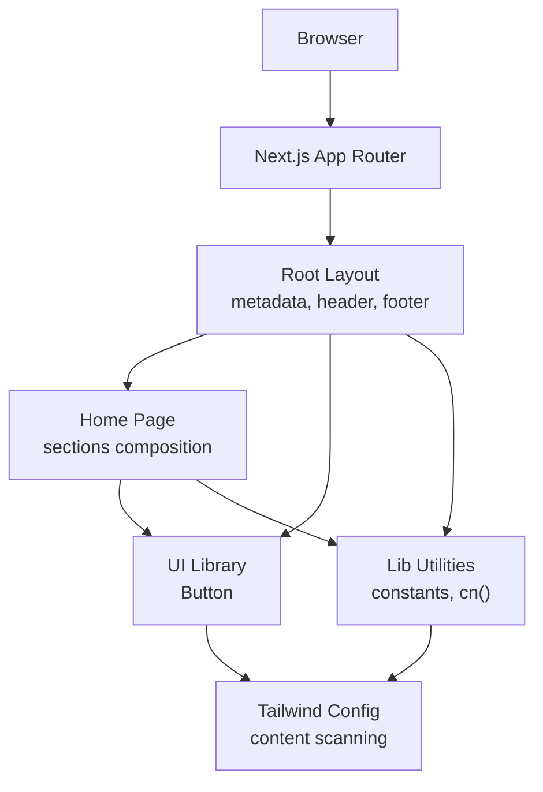
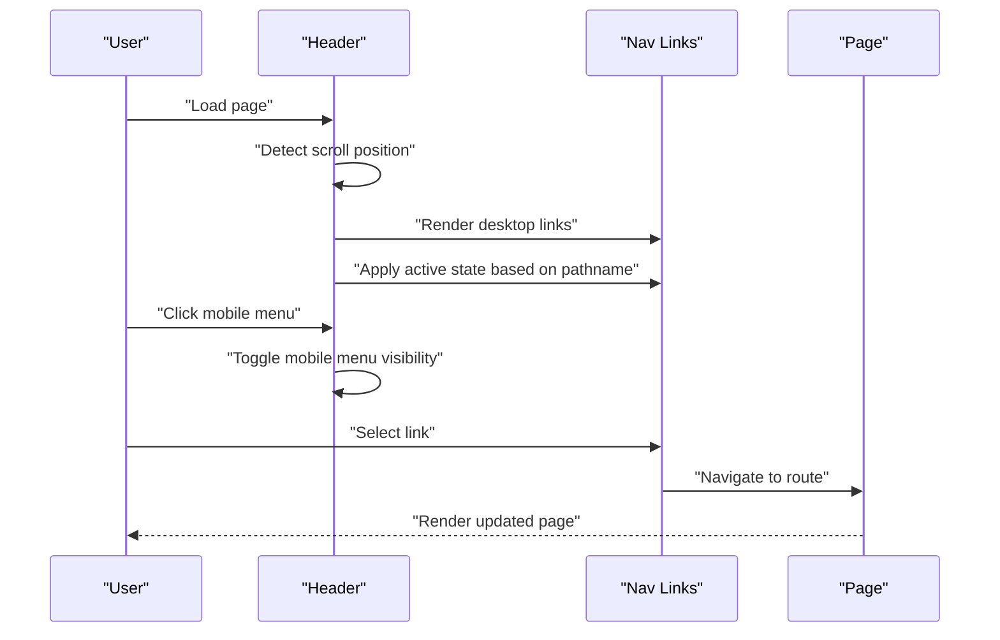
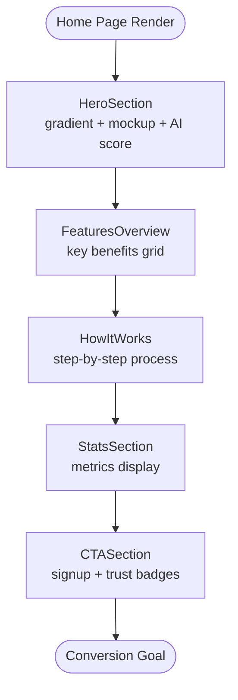
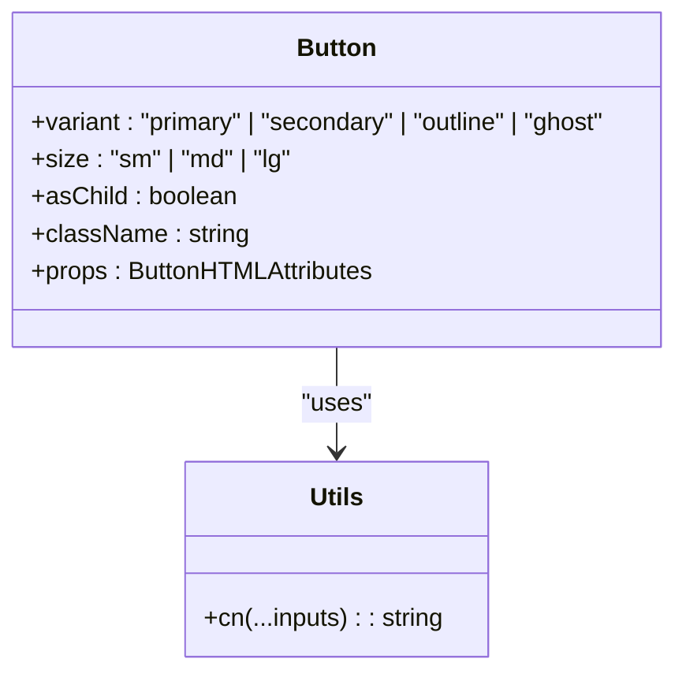
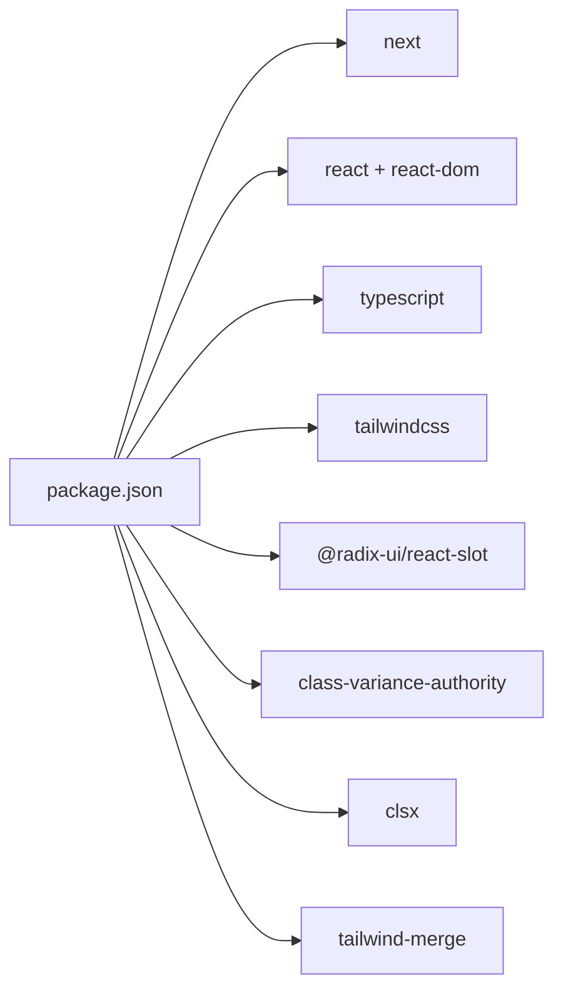

# Project Overview

<cite>
**Referenced Files in This Document**
- [package.json](file://smartview-portal/package.json)
- [README.md](file://smartview-portal/README.md)
- [layout.tsx](file://smartview-portal/src/app/layout.tsx)
- [page.tsx](file://smartview-portal/src/app/page.tsx)
- [constants.ts](file://smartview-portal/src/lib/constants.ts)
- [utils.ts](file://smartview-portal/src/lib/utils.ts)
- [tailwind.config.ts](file://smartview-portal/tailwind.config.ts)
- [Button.tsx](file://smartview-portal/src/components/ui/Button.tsx)
- [Header.tsx](file://smartview-portal/src/components/layout/Header.tsx)
- [Footer.tsx](file://smartview-portal/src/components/layout/Footer.tsx)
- [HeroSection.tsx](file://smartview-portal/src/components/home/HeroSection.tsx)
- [FeaturesOverview.tsx](file://smartview-portal/src/components/home/FeaturesOverview.tsx)
- [HowItWorks.tsx](file://smartview-portal/src/components/home/HowItWorks.tsx)
- [StatsSection.tsx](file://smartview-portal/src/components/home/StatsSection.tsx)
- [CTASection.tsx](file://smartview-portal/src/components/home/CTASection.tsx)
</cite>

## Table of Contents
1. [Introduction](#introduction)
2. [Project Structure](#project-structure)
3. [Core Components](#core-components)
4. [Architecture Overview](#architecture-overview)
5. [Detailed Component Analysis](#detailed-component-analysis)
6. [Dependency Analysis](#dependency-analysis)
7. [Performance Considerations](#performance-considerations)
8. [Troubleshooting Guide](#troubleshooting-guide)
9. [Conclusion](#conclusion)

## Introduction
SmartView Portal is an AI-powered interview platform designed to modernize technical recruitment. Its purpose is to deliver an efficient, intelligent, and fair assessment experience by combining AI-driven evaluation with human expertise. The platform targets enterprises seeking scalable solutions for online assessments, AI scoring, intelligent matching, and question bank management.

Key objectives:
- Provide a seamless landing page experience that communicates value and drives conversions
- Deliver a responsive navigation system with clear entry points for product discovery and engagement
- Establish a reusable component library for consistent UI and UX across pages
- Demonstrate AI capabilities through compelling visuals and interactive elements

Target audience:
- Hiring teams and HR professionals evaluating technical candidates
- Engineering managers and interviewers relying on objective insights
- Decision makers seeking measurable improvements in accuracy, efficiency, and candidate satisfaction

## Project Structure
The project follows Next.js App Router conventions with a clear separation of concerns:
- Application shell and global styles live under src/app
- Shared UI components are organized under src/components
- Utility modules and constants reside under src/lib
- Styling is configured via Tailwind CSS with a content-based scanning strategy

**Diagram sources**
- [layout.tsx:1-33](file://smartview-portal/src/app/layout.tsx#L1-L33)
- [page.tsx:1-18](file://smartview-portal/src/app/page.tsx#L1-L18)
- [Header.tsx:1-131](file://smartview-portal/src/components/layout/Header.tsx#L1-L131)
- [Footer.tsx:1-127](file://smartview-portal/src/components/layout/Footer.tsx#L1-L127)
- [HeroSection.tsx:1-125](file://smartview-portal/src/components/home/HeroSection.tsx#L1-L125)
- [FeaturesOverview.tsx:1-74](file://smartview-portal/src/components/home/FeaturesOverview.tsx#L1-L74)
- [HowItWorks.tsx:1-93](file://smartview-portal/src/components/home/HowItWorks.tsx#L1-L93)
- [StatsSection.tsx:1-40](file://smartview-portal/src/components/home/StatsSection.tsx#L1-L40)
- [CTASection.tsx:1-54](file://smartview-portal/src/components/home/CTASection.tsx#L1-L54)
- [Button.tsx:1-54](file://smartview-portal/src/components/ui/Button.tsx#L1-L54)
- [constants.ts:1-11](file://smartview-portal/src/lib/constants.ts#L1-L11)
- [utils.ts:1-7](file://smartview-portal/src/lib/utils.ts#L1-L7)
- [tailwind.config.ts:1-20](file://smartview-portal/tailwind.config.ts#L1-L20)

**Section sources**
- [layout.tsx:1-33](file://smartview-portal/src/app/layout.tsx#L1-L33)
- [page.tsx:1-18](file://smartview-portal/src/app/page.tsx#L1-L18)
- [constants.ts:1-11](file://smartview-portal/src/lib/constants.ts#L1-L11)
- [utils.ts:1-7](file://smartview-portal/src/lib/utils.ts#L1-L7)
- [tailwind.config.ts:1-20](file://smartview-portal/tailwind.config.ts#L1-L20)

## Core Components
This section documents the foundational building blocks that define the platform’s look, feel, and behavior.

- Global layout and metadata
  - Defines site metadata and wraps pages with shared header and footer
  - Ensures consistent typography and spacing across the application

- Navigation system
  - Fixed header with logo, desktop links, and mobile menu
  - Path-aware active states and responsive behavior
  - Ghost and primary call-to-action buttons for login and registration

- Component library
  - Button component with variant and size variants, supporting slot composition
  - Utility class merging for robust CSS composition

- Home page sections
  - Hero section with gradient background, product mockup, and AI score indicator
  - Features overview highlighting AI hybrid scoring, online coding environment, engineering mindset assessment, and intelligent matching
  - How It Works process steps with icons and numbered badges
  - Statistics section showcasing accuracy, efficiency, satisfaction, and concurrent capacity
  - Call-to-action section with trust indicators and prominent signup flow

Practical examples:
- Landing page conversion: The hero section’s gradient background, mockup, and “AI Score 92/100” indicator communicate real-time AI evaluation to capture attention and drive trial sign-ups
- Product education: The “How It Works” section visually breaks down the four-step process to reduce friction and clarify value
- Social proof: The statistics section reinforces claims with quantifiable metrics to build trust

**Section sources**
- [layout.tsx:12-32](file://smartview-portal/src/app/layout.tsx#L12-L32)
- [Header.tsx:11-131](file://smartview-portal/src/components/layout/Header.tsx#L11-L131)
- [Button.tsx:6-54](file://smartview-portal/src/components/ui/Button.tsx#L6-L54)
- [HeroSection.tsx:4-125](file://smartview-portal/src/components/home/HeroSection.tsx#L4-L125)
- [FeaturesOverview.tsx:26-74](file://smartview-portal/src/components/home/FeaturesOverview.tsx#L26-L74)
- [HowItWorks.tsx:30-93](file://smartview-portal/src/components/home/HowItWorks.tsx#L30-L93)
- [StatsSection.tsx:20-40](file://smartview-portal/src/components/home/StatsSection.tsx#L20-L40)
- [CTASection.tsx:5-54](file://smartview-portal/src/components/home/CTASection.tsx#L5-L54)

## Architecture Overview
The platform leverages Next.js App Router to structure pages and layouts, with a modular component hierarchy. Styling is centralized via Tailwind CSS, and a shared Button component ensures consistent interaction patterns.

**Diagram sources**
- [layout.tsx:12-32](file://smartview-portal/src/app/layout.tsx#L12-L32)
- [page.tsx:7-17](file://smartview-portal/src/app/page.tsx#L7-L17)
- [constants.ts:1-11](file://smartview-portal/src/lib/constants.ts#L1-L11)
- [utils.ts:4-6](file://smartview-portal/src/lib/utils.ts#L4-L6)
- [Button.tsx:39-50](file://smartview-portal/src/components/ui/Button.tsx#L39-L50)
- [tailwind.config.ts:4-8](file://smartview-portal/tailwind.config.ts#L4-L8)

## Detailed Component Analysis

### Navigation System
The header integrates branding, navigation, and actions while adapting to scroll and viewport changes. It dynamically highlights active links and provides a mobile-first menu experience.

**Diagram sources**
- [Header.tsx:11-131](file://smartview-portal/src/components/layout/Header.tsx#L11-L131)
- [constants.ts:4-10](file://smartview-portal/src/lib/constants.ts#L4-L10)

**Section sources**
- [Header.tsx:11-131](file://smartview-portal/src/components/layout/Header.tsx#L11-L131)
- [constants.ts:4-10](file://smartview-portal/src/lib/constants.ts#L4-L10)

### Home Page Composition
The home page composes multiple focused sections to present value, process, and outcomes.

**Diagram sources**
- [page.tsx:7-17](file://smartview-portal/src/app/page.tsx#L7-L17)
- [HeroSection.tsx:4-125](file://smartview-portal/src/components/home/HeroSection.tsx#L4-L125)
- [FeaturesOverview.tsx:26-74](file://smartview-portal/src/components/home/FeaturesOverview.tsx#L26-L74)
- [HowItWorks.tsx:30-93](file://smartview-portal/src/components/home/HowItWorks.tsx#L30-L93)
- [StatsSection.tsx:20-40](file://smartview-portal/src/components/home/StatsSection.tsx#L20-L40)
- [CTASection.tsx:5-54](file://smartview-portal/src/components/home/CTASection.tsx#L5-L54)

**Section sources**
- [page.tsx:7-17](file://smartview-portal/src/app/page.tsx#L7-L17)
- [HeroSection.tsx:4-125](file://smartview-portal/src/components/home/HeroSection.tsx#L4-L125)
- [FeaturesOverview.tsx:26-74](file://smartview-portal/src/components/home/FeaturesOverview.tsx#L26-L74)
- [HowItWorks.tsx:30-93](file://smartview-portal/src/components/home/HowItWorks.tsx#L30-L93)
- [StatsSection.tsx:20-40](file://smartview-portal/src/components/home/StatsSection.tsx#L20-L40)
- [CTASection.tsx:5-54](file://smartview-portal/src/components/home/CTASection.tsx#L5-L54)

### Component Library: Button
The Button component encapsulates variant and size logic with slot composition for semantic flexibility.

**Diagram sources**
- [Button.tsx:33-50](file://smartview-portal/src/components/ui/Button.tsx#L33-L50)
- [utils.ts:4-6](file://smartview-portal/src/lib/utils.ts#L4-L6)

**Section sources**
- [Button.tsx:6-54](file://smartview-portal/src/components/ui/Button.tsx#L6-L54)
- [utils.ts:4-6](file://smartview-portal/src/lib/utils.ts#L4-L6)

## Dependency Analysis
Technology stack and module relationships:
- Next.js 14 powers routing, SSR, and static generation
- React 18 provides concurrent features and hooks
- TypeScript enforces type safety across components and utilities
- Tailwind CSS enables utility-first styling with content scanning
- Radix UI Slot and class variance authority support flexible component composition and variants
- clsx and tailwind-merge streamline conditional class handling

**Diagram sources**
- [package.json:11-30](file://smartview-portal/package.json#L11-L30)

**Section sources**
- [package.json:11-30](file://smartview-portal/package.json#L11-L30)

## Performance Considerations
- Prefer static generation and server-side rendering via Next.js App Router to minimize client-side work
- Leverage Tailwind’s content scanning to purge unused styles and reduce bundle size
- Use the shared Button component to avoid duplication and maintain consistent interaction patterns
- Keep component props minimal and encapsulated to reduce re-renders
- Optimize images and assets through Next.js image optimization features

## Troubleshooting Guide
Common areas to inspect:
- Layout metadata and global styles: Verify metadata and font loading in the root layout
- Navigation responsiveness: Confirm mobile menu toggle and active link states
- Styling coverage: Ensure Tailwind content globs include all component paths
- Component variants: Validate variant and size combinations in the Button component
- Utility class merging: Confirm cn() usage prevents conflicting classes

**Section sources**
- [layout.tsx:12-32](file://smartview-portal/src/app/layout.tsx#L12-L32)
- [Header.tsx:11-131](file://smartview-portal/src/components/layout/Header.tsx#L11-L131)
- [tailwind.config.ts:4-8](file://smartview-portal/tailwind.config.ts#L4-L8)
- [Button.tsx:6-54](file://smartview-portal/src/components/ui/Button.tsx#L6-L54)
- [utils.ts:4-6](file://smartview-portal/src/lib/utils.ts#L4-L6)

## Conclusion
SmartView Portal presents a cohesive, scalable foundation for an AI-powered interview platform. Its Next.js 14 + React 18 + TypeScript + Tailwind stack, combined with a modular component library and a clear navigation system, enables rapid iteration and consistent user experiences. The home page composition effectively communicates value, educates users on the process, and drives conversions through social proof and clear CTAs.