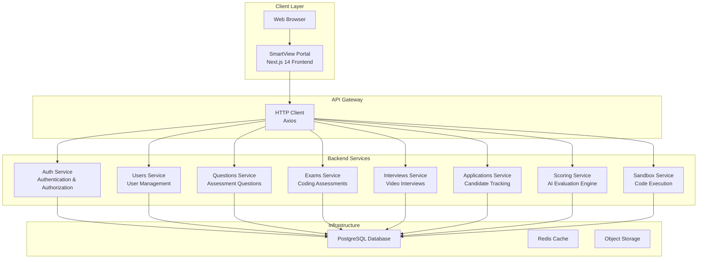
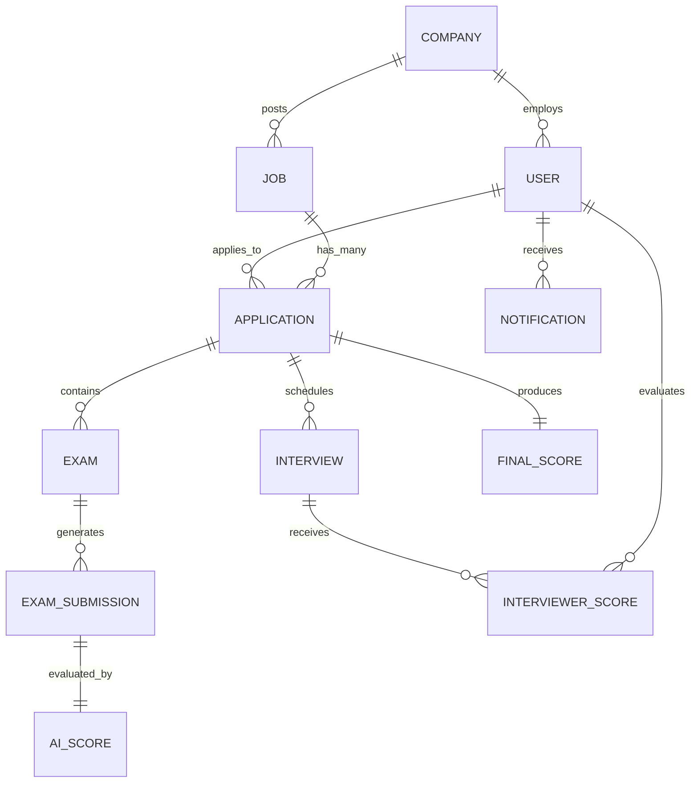

# Project Overview

<cite>
**Referenced Files in This Document**
- [package.json](file://smartview-portal/package.json)
- [README.md](file://smartview-portal/README.md)
- [layout.tsx](file://smartview-portal/src/app/layout.tsx)
- [page.tsx](file://smartview-portal/src/app/page.tsx)
- [constants.ts](file://smartview-portal/src/lib/constants.ts)
- [utils.ts](file://smartview-portal/src/lib/utils.ts)
- [tailwind.config.ts](file://smartview-portal/tailwind.config.ts)
- [Button.tsx](file://smartview-portal/src/components/ui/Button.tsx)
- [Header.tsx](file://smartview-portal/src/components/layout/Header.tsx)
- [Footer.tsx](file://smartview-portal/src/components/layout/Footer.tsx)
- [HeroSection.tsx](file://smartview-portal/src/components/home/HeroSection.tsx)
- [FeaturesOverview.tsx](file://smartview-portal/src/components/home/FeaturesOverview.tsx)
- [HowItWorks.tsx](file://smartview-portal/src/components/home/HowItWorks.tsx)
- [StatsSection.tsx](file://smartview-portal/src/components/home/StatsSection.tsx)
- [CTASection.tsx](file://smartview-portal/src/components/home/CTASection.tsx)
- [api.ts](file://smartview-portal/src/lib/api.ts)
- [AuthContext.tsx](file://smartview-portal/src/contexts/AuthContext.tsx)
- [main.ts](file://smartview-server/src/main.ts)
- [app.module.ts](file://smartview-server/src/app.module.ts)
- [auth.module.ts](file://smartview-server/src/auth/auth.module.ts)
- [questions.module.ts](file://smartview-server/src/questions/questions.module.ts)
- [schema.prisma](file://smartview-server/prisma/schema.prisma)
- [package.json](file://smartview-server/package.json)
- [README.md](file://smartview-server/README.md)
</cite>

## Update Summary
**Changes Made**
- Updated architecture overview to reflect microservices structure with Next.js 14 frontend and NestJS backend
- Added comprehensive backend service documentation covering authentication, user management, and interview workflows
- Enhanced API documentation with detailed endpoints and data models
- Updated technology stack to include NestJS, Prisma, and PostgreSQL
- Added database schema documentation and entity relationships
- Expanded feature documentation to include AI scoring capabilities and interview management

## Table of Contents
1. [Introduction](#introduction)
2. [Microservices Architecture](#microservices-architecture)
3. [Frontend Application](#frontend-application)
4. [Backend Services](#backend-services)
5. [Database Design](#database-design)
6. [API Documentation](#api-documentation)
7. [Core Components](#core-components)
8. [Technology Stack](#technology-stack)
9. [Deployment Architecture](#deployment-architecture)
10. [Development Workflow](#development-workflow)
11. [Troubleshooting Guide](#troubleshooting-guide)
12. [Conclusion](#conclusion)

## Introduction
SmartView Portal is a modern AI-powered interview platform that has undergone a complete architectural transformation from a monolithic structure to a sophisticated microservices architecture. The platform combines Next.js 14+ frontend with a NestJS backend to deliver an enterprise-grade solution for technical recruitment assessment.

The platform serves as a comprehensive interview management system that integrates AI-driven evaluation with human expertise. It provides automated coding assessments, intelligent scoring, video interviewing capabilities, and streamlined candidate evaluation processes for organizations of all sizes.

**Key Objectives:**
- Deliver a scalable microservices architecture for enterprise deployment
- Provide seamless AI-assisted technical interview experiences
- Enable real-time collaboration between candidates, interviewers, and hiring teams
- Support comprehensive assessment workflows from initial screening to final decision-making
- Ensure security, scalability, and performance for high-volume interview operations

**Target Audience:**
- Enterprise HR teams and recruitment specialists
- Engineering managers and technical interviewers
- Hiring managers seeking data-driven candidate evaluation
- Technical recruiters implementing standardized assessment processes

## Microservices Architecture
The platform has evolved from a traditional monolithic application to a modern microservices architecture, separating concerns into distinct frontend and backend services.

**Diagram sources**
- [main.ts:8-36](file://smartview-server/src/main.ts#L8-L36)
- [app.module.ts:15-33](file://smartview-server/src/app.module.ts#L15-L33)

**Section sources**
- [main.ts:8-36](file://smartview-server/src/main.ts#L8-L36)
- [app.module.ts:15-33](file://smartview-server/src/app.module.ts#L15-L33)

## Frontend Application
The frontend application is built with Next.js 14 using the App Router architecture, providing a modern React-based user interface with comprehensive interview management capabilities.

### Core Features
- **Authentication & Authorization**: Role-based access control with JWT tokens
- **Candidate Dashboard**: Personalized interface for coding assessments and progress tracking
- **Interviewer Dashboard**: Tools for scheduling, conducting, and evaluating interviews
- **Admin Interface**: Comprehensive management of questions, users, and system configuration
- **Real-time Collaboration**: Live updates and notifications for interview coordination

### Technology Stack
- **Framework**: Next.js 14 with App Router
- **Runtime**: React 18 with concurrent features
- **Styling**: Tailwind CSS with custom configuration
- **State Management**: Context API with custom hooks
- **API Communication**: Axios with automatic token refresh
- **Code Editor**: Monaco Editor integration for coding assessments

**Section sources**
- [package.json:11-22](file://smartview-portal/package.json#L11-L22)
- [layout.tsx:13-35](file://smartview-portal/src/app/layout.tsx#L13-L35)
- [AuthContext.tsx:52-206](file://smartview-portal/src/contexts/AuthContext.tsx#L52-L206)

## Backend Services
The backend is implemented as a NestJS microservices architecture with clear separation of concerns across specialized modules.

### Authentication Service
Handles user authentication, authorization, and session management with JWT-based security.

### User Management Service
Manages user profiles, roles, and permissions across different organizational hierarchies.

### Question Management Service
Provides CRUD operations for assessment questions with support for multiple programming languages and difficulty levels.

### Exam Management Service
Coordinates coding assessments, manages submission tracking, and integrates with the sandbox service for code execution.

### Interview Management Service
Handles video interview scheduling, coordination, and scoring integration with AI evaluation systems.

### Application Management Service
Tracks candidate applications through the entire hiring pipeline from initial screening to final decisions.

### Scoring Service
Integrates AI-powered evaluation with human scoring to provide comprehensive candidate assessment.

### Sandbox Service
Provides secure code execution environments for real-time coding assessments.

**Section sources**
- [auth.module.ts:10-29](file://smartview-server/src/auth/auth.module.ts#L10-L29)
- [questions.module.ts:1-13](file://smartview-server/src/questions/questions.module.ts#L1-L13)
- [app.module.ts:15-33](file://smartview-server/src/app.module.ts#L15-L33)

## Database Design
The platform uses PostgreSQL as the primary database with Prisma ORM for type-safe database operations and relationship management.

### Core Entities
- **Users**: Candidate, interviewer, HR, and admin user accounts
- **Companies**: Organizational hierarchy and team structures
- **Jobs**: Position listings with requirements and application tracking
- **Questions**: Assessment items with multiple programming language support
- **Applications**: Candidate job applications through the hiring pipeline
- **Exams**: Coding assessments with submission tracking
- **Interviews**: Video interview scheduling and evaluation
- **Scores**: AI and human evaluation results

### Entity Relationships

**Diagram sources**
- [schema.prisma:77-334](file://smartview-server/prisma/schema.prisma#L77-L334)

**Section sources**
- [schema.prisma:12-74](file://smartview-server/prisma/schema.prisma#L12-L74)
- [schema.prisma:77-334](file://smartview-server/prisma/schema.prisma#L77-L334)

## API Documentation
The backend exposes a comprehensive RESTful API with clear endpoint organization and standardized response formats.

### Authentication Endpoints
- `POST /api/auth/login` - User authentication
- `POST /api/auth/register` - User registration
- `POST /api/auth/refresh` - Token refresh
- `GET /api/auth/me` - Current user profile

### User Management Endpoints
- `GET /api/users` - List all users
- `GET /api/users/:id` - Get user by ID
- `PUT /api/users/profile` - Update user profile

### Question Management Endpoints
- `GET /api/questions` - List questions with filtering
- `GET /api/questions/:id` - Get question by ID
- `POST /api/questions` - Create new question
- `PUT /api/questions/:id` - Update question
- `DELETE /api/questions/:id` - Delete question

### Exam Management Endpoints
- `GET /api/exams/:id` - Get exam details
- `POST /api/exams/:id/start` - Start exam
- `POST /api/exams/:id/submit` - Submit exam
- `PUT /api/exams/:id/submissions/:questionId` - Save submission
- `POST /api/exams/:id/submissions/:questionId/run` - Run code

### Interview Management Endpoints
- `GET /api/interviews` - List interviews
- `GET /api/interviews/:id` - Get interview details
- `POST /api/interviews/:id/score` - Submit interviewer score
- `GET /api/interviews/:id/scores` - Get all scores

### Application Management Endpoints
- `GET /api/applications/:id` - Get application details
- `GET /api/applications/:id/report` - Get AI evaluation report
- `POST /api/applications/:id/finalize` - Finalize application
- `PUT /api/applications/:id/decision` - Update hiring decision

### Scoring Endpoints
- `GET /api/scoring/:submissionId` - Get AI evaluation
- `GET /api/scoring/exam/:examId` - Get exam scoring results

**Section sources**
- [api.ts:131-409](file://smartview-portal/src/lib/api.ts#L131-L409)

## Core Components
The platform's architecture is built around several core components that work together to provide a seamless interview experience.

### Authentication & Authorization
The system implements role-based access control with JWT tokens for secure API communication. The authentication system supports multiple user roles including candidates, interviewers, HR personnel, and administrators.

### Real-time Communication
WebSocket connections enable real-time updates for interview scheduling, status changes, and collaborative features. The system maintains persistent connections for critical interview operations.

### Code Execution Environment
The sandbox service provides isolated, secure execution environments for candidate code submissions. It supports multiple programming languages with resource limits and security restrictions.

### AI Evaluation Engine
Advanced AI algorithms analyze candidate code submissions, providing objective scoring and detailed feedback. The system evaluates coding ability, engineering mindset, problem-solving approaches, and code quality.

### Document Management
Secure file storage for resumes, code samples, and interview recordings. The system integrates with object storage solutions for scalable media handling.

**Section sources**
- [AuthContext.tsx:98-176](file://smartview-portal/src/contexts/AuthContext.tsx#L98-L176)
- [api.ts:402-407](file://smartview-portal/src/lib/api.ts#L402-L407)

## Technology Stack
The platform leverages cutting-edge technologies to ensure scalability, performance, and maintainability.

### Frontend Technologies
- **Next.js 14**: Modern React framework with App Router and server-side rendering
- **React 18**: Latest React features including concurrent rendering and automatic batching
- **TypeScript**: Type-safe development for better code reliability
- **Tailwind CSS**: Utility-first styling with custom design system
- **Monaco Editor**: Full-featured code editor for coding assessments
- **Axios**: HTTP client with automatic token refresh and error handling

### Backend Technologies
- **NestJS**: Enterprise Node.js framework with dependency injection
- **TypeScript**: Type-safe backend development
- **Prisma**: Next-generation ORM with type-safe database queries
- **PostgreSQL**: Reliable relational database with advanced features
- **Redis**: High-performance caching and session storage
- **Passport.js**: Authentication middleware and strategies

### Infrastructure Technologies
- **Docker**: Containerization for consistent deployments
- **Nginx**: Reverse proxy and load balancing
- **PM2**: Process management for production deployments
- **Jest**: Testing framework with comprehensive coverage
- **ESLint/Prettier**: Code quality and formatting standards

**Section sources**
- [package.json:11-32](file://smartview-portal/package.json#L11-L32)
- [package.json:22-40](file://smartview-server/package.json#L22-L40)

## Deployment Architecture
The platform supports multiple deployment strategies from development to enterprise production environments.

### Development Environment
- Local development with hot reloading
- Docker containers for consistent local setups
- Separate frontend and backend development servers
- Mock services for external dependencies

### Staging Environment
- Preview deployments for feature validation
- Automated testing pipelines
- Performance monitoring and logging
- Security scanning and vulnerability assessment

### Production Environment
- Kubernetes orchestration for container management
- Load balancers for traffic distribution
- Database clustering for high availability
- CDN integration for static asset delivery
- Automated backup and disaster recovery

### CI/CD Pipeline
- Automated testing on every commit
- Security scanning and code quality checks
- Automated deployment to staging environments
- Blue-green deployment strategy for zero-downtime releases

## Development Workflow
The development process follows modern agile practices with emphasis on code quality and maintainability.

### Code Organization
- Feature-based module organization
- Clear separation of concerns between frontend and backend
- Shared interfaces and DTOs between services
- Comprehensive type definitions for type safety

### Testing Strategy
- Unit tests for individual components and services
- Integration tests for service interactions
- End-to-end tests for critical user flows
- Performance testing for scalability validation

### Code Quality
- ESLint for JavaScript/TypeScript linting
- Prettier for code formatting consistency
- Git hooks for pre-commit validation
- Pull request reviews with automated checks

### Documentation
- Inline code documentation with JSDoc
- API documentation with Swagger/OpenAPI
- Architecture decision records (ADRs)
- Developer onboarding guides

## Troubleshooting Guide
Common issues and their solutions across the microservices architecture.

### Frontend Issues
- **Authentication failures**: Check JWT token storage and refresh mechanisms
- **API connectivity**: Verify CORS configuration and base URL settings
- **Component rendering**: Review Next.js App Router configuration and dynamic imports
- **Styling issues**: Confirm Tailwind CSS configuration and content paths

### Backend Issues
- **Database connection**: Verify PostgreSQL connection strings and Prisma configuration
- **Service communication**: Check NestJS module imports and dependency injection
- **Authentication errors**: Validate JWT secrets and passport strategies
- **Performance bottlenecks**: Monitor Redis cache and database query performance

### Microservices Issues
- **Service discovery**: Verify service registration and health checks
- **Message queuing**: Check queue configurations and worker processes
- **Load balancing**: Review load balancer configuration and service scaling
- **Circuit breakers**: Monitor service resilience and fallback mechanisms

### Database Issues
- **Migration failures**: Check Prisma migration status and database permissions
- **Connection pooling**: Verify pool size and connection timeouts
- **Query performance**: Analyze slow query logs and index usage
- **Data integrity**: Validate foreign key constraints and referential integrity

**Section sources**
- [main.ts:12-36](file://smartview-server/src/main.ts#L12-L36)
- [auth.module.ts:13-22](file://smartview-server/src/auth/auth.module.ts#L13-L22)

## Conclusion
SmartView Portal represents a comprehensive evolution from a traditional monolithic application to a modern microservices architecture. The platform successfully combines Next.js 14 frontend excellence with NestJS backend scalability to deliver a robust AI-powered interview solution.

The microservices architecture provides clear separation of concerns, enabling independent development, testing, and deployment of specialized services. The comprehensive API documentation, type-safe development practices, and modern infrastructure ensure maintainability and scalability for enterprise deployments.

Key strengths of the current architecture include:
- **Scalable Microservices**: Independent service development and deployment
- **AI Integration**: Advanced evaluation capabilities with real-time feedback
- **Comprehensive Assessment**: Multi-modal evaluation including coding, video interviews, and AI scoring
- **Enterprise Ready**: Secure authentication, role-based access control, and audit trails
- **Developer Experience**: Modern tooling, comprehensive testing, and clear documentation

The platform is well-positioned to support growing organizational needs while maintaining high performance, security, and developer productivity standards.