# Styling and Design System

<cite>
**Referenced Files in This Document**
- [tailwind.config.ts](file://smartview-portal/tailwind.config.ts)
- [postcss.config.mjs](file://smartview-portal/postcss.config.mjs)
- [globals.css](file://smartview-portal/src/app/globals.css)
- [layout.tsx](file://smartview-portal/src/app/layout.tsx)
- [page.tsx](file://smartview-portal/src/app/page.tsx)
- [Button.tsx](file://smartview-portal/src/components/ui/Button.tsx)
- [Header.tsx](file://smartview-portal/src/components/layout/Header.tsx)
- [Footer.tsx](file://smartview-portal/src/components/layout/Footer.tsx)
- [HeroSection.tsx](file://smartview-portal/src/components/home/HeroSection.tsx)
- [FeaturesOverview.tsx](file://smartview-portal/src/components/home/FeaturesOverview.tsx)
- [constants.ts](file://smartview-portal/src/lib/constants.ts)
- [utils.ts](file://smartview-portal/src/lib/utils.ts)
- [package.json](file://smartview-portal/package.json)
</cite>

## Table of Contents
1. [Introduction](#introduction)
2. [Project Structure](#project-structure)
3. [Core Components](#core-components)
4. [Architecture Overview](#architecture-overview)
5. [Detailed Component Analysis](#detailed-component-analysis)
6. [Dependency Analysis](#dependency-analysis)
7. [Performance Considerations](#performance-considerations)
8. [Troubleshooting Guide](#troubleshooting-guide)
9. [Conclusion](#conclusion)
10. [Appendices](#appendices)

## Introduction
This document describes the SmartView Portal styling and design system. It covers Tailwind CSS configuration, PostCSS setup, global styling, component-specific patterns, responsive design, color system, typography, spacing, animations, accessibility, cross-browser compatibility, and extension guidelines. The design system emphasizes a cohesive, themeable foundation built on CSS custom properties and Tailwind's utility-first approach.

## Project Structure
The styling system spans configuration, global styles, and component-level implementations:
- Tailwind configuration defines content scanning and theme extensions
- PostCSS orchestrates Tailwind processing
- Global CSS establishes design tokens and base styles
- Components implement UI primitives and page sections with consistent spacing and typography
- Utility helpers merge and conditionally apply classes

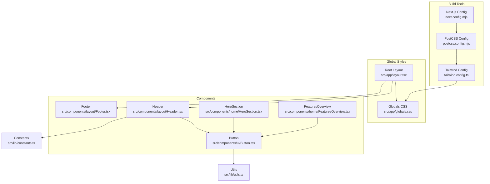

**Diagram sources**
- [postcss.config.mjs:1-9](file://smartview-portal/postcss.config.mjs#L1-L9)
- [tailwind.config.ts:1-20](file://smartview-portal/tailwind.config.ts#L1-L20)
- [globals.css:1-31](file://smartview-portal/src/app/globals.css#L1-L31)
- [layout.tsx:1-33](file://smartview-portal/src/app/layout.tsx#L1-L33)
- [Button.tsx:1-54](file://smartview-portal/src/components/ui/Button.tsx#L1-L54)
- [Header.tsx:1-131](file://smartview-portal/src/components/layout/Header.tsx#L1-L131)
- [Footer.tsx:1-127](file://smartview-portal/src/components/layout/Footer.tsx#L1-L127)
- [HeroSection.tsx:1-125](file://smartview-portal/src/components/home/HeroSection.tsx#L1-L125)
- [FeaturesOverview.tsx:1-74](file://smartview-portal/src/components/home/FeaturesOverview.tsx#L1-L74)
- [utils.ts:1-7](file://smartview-portal/src/lib/utils.ts#L1-L7)
- [constants.ts:1-11](file://smartview-portal/src/lib/constants.ts#L1-L11)

**Section sources**
- [tailwind.config.ts:1-20](file://smartview-portal/tailwind.config.ts#L1-L20)
- [postcss.config.mjs:1-9](file://smartview-portal/postcss.config.mjs#L1-L9)
- [globals.css:1-31](file://smartview-portal/src/app/globals.css#L1-L31)
- [layout.tsx:1-33](file://smartview-portal/src/app/layout.tsx#L1-L33)

## Core Components
This section documents the foundational styling elements and design tokens.

- Design Tokens via CSS Custom Properties
  - Root-level tokens define background and foreground colors
  - Dark mode preference updates tokens automatically
  - Body inherits tokens for color and background
  - Additional utility token is defined under a utilities layer

- Typography Foundation
  - Inter font loaded with a CSS variable for consistent usage across components
  - Antialiasing applied globally for improved readability

- Color System
  - Semantic tokens mapped to CSS variables for light/dark modes
  - Component variants use semantic color names (e.g., blue, gray) consistently
  - Gradient backgrounds and overlays leverage semantic colors

- Spacing Scale
  - Consistent use of Tailwind spacing utilities (e.g., px, py, gap)
  - Responsive padding scales across breakpoints (sm, lg)

- Animation Utilities
  - Smooth scroll behavior configured at html level
  - Pulse animation used for live indicators
  - Hover transitions and transforms across interactive elements

- Accessibility and Cross-Browser Compatibility
  - Focus-visible ring utilities for keyboard navigation
  - Disabled states with reduced opacity
  - Semantic icons and ARIA labels in interactive components

**Section sources**
- [globals.css:5-30](file://smartview-portal/src/app/globals.css#L5-L30)
- [layout.tsx:7-10](file://smartview-portal/src/app/layout.tsx#L7-L10)
- [layout.tsx:25](file://smartview-portal/src/app/layout.tsx#L25)
- [Button.tsx:6-31](file://smartview-portal/src/components/ui/Button.tsx#L6-L31)
- [HeroSection.tsx:6-20](file://smartview-portal/src/components/home/HeroSection.tsx#L6-L20)
- [Header.tsx:27-32](file://smartview-portal/src/components/layout/Header.tsx#L27-L32)
- [Footer.tsx:21-124](file://smartview-portal/src/components/layout/Footer.tsx#L21-L124)

## Architecture Overview
The styling architecture integrates Tailwind CSS with PostCSS and Next.js, using CSS custom properties for theme tokens and component-level variants for UI primitives.

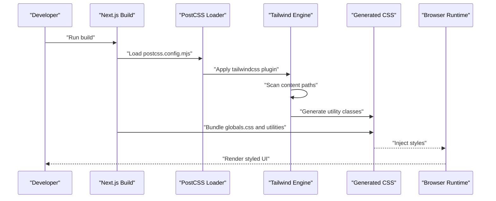

**Diagram sources**
- [postcss.config.mjs:1-9](file://smartview-portal/postcss.config.mjs#L1-L9)
- [tailwind.config.ts:3-8](file://smartview-portal/tailwind.config.ts#L3-L8)
- [globals.css:1-3](file://smartview-portal/src/app/globals.css#L1-L3)

## Detailed Component Analysis

### Tailwind Configuration
- Content scanning includes pages, components, and app directories
- Theme extension maps semantic color tokens to CSS variables
- Plugins array is empty, allowing pure utility-driven styling

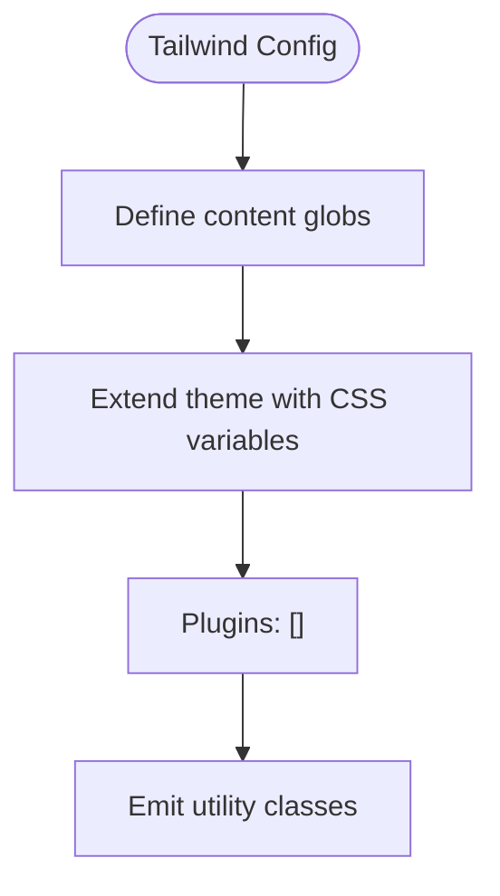

**Diagram sources**
- [tailwind.config.ts:3-17](file://smartview-portal/tailwind.config.ts#L3-L17)

**Section sources**
- [tailwind.config.ts:1-20](file://smartview-portal/tailwind.config.ts#L1-L20)

### PostCSS Configuration
- Minimal PostCSS setup with Tailwind CSS plugin
- No additional transform plugins configured

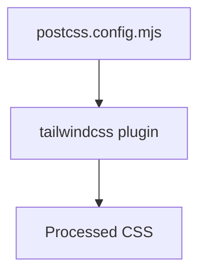

**Diagram sources**
- [postcss.config.mjs:1-9](file://smartview-portal/postcss.config.mjs#L1-L9)

**Section sources**
- [postcss.config.mjs:1-9](file://smartview-portal/postcss.config.mjs#L1-L9)

### Global Styles and Design Tokens
- Root-level CSS custom properties define background and foreground
- Dark mode media query updates tokens automatically
- Base layer directives enable utilities across the app
- Utility token for balanced text wrapping
- Smooth scrolling behavior configured at html level

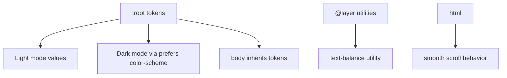

**Diagram sources**
- [globals.css:5-24](file://smartview-portal/src/app/globals.css#L5-L24)
- [globals.css:26-30](file://smartview-portal/src/app/globals.css#L26-L30)
- [globals.css:17-19](file://smartview-portal/src/app/globals.css#L17-L19)

**Section sources**
- [globals.css:1-31](file://smartview-portal/src/app/globals.css#L1-L31)

### Typography and Font System
- Inter font loaded with a CSS variable for consistent usage
- Antialiasing applied globally for improved text rendering
- Font variable used in root layout body class

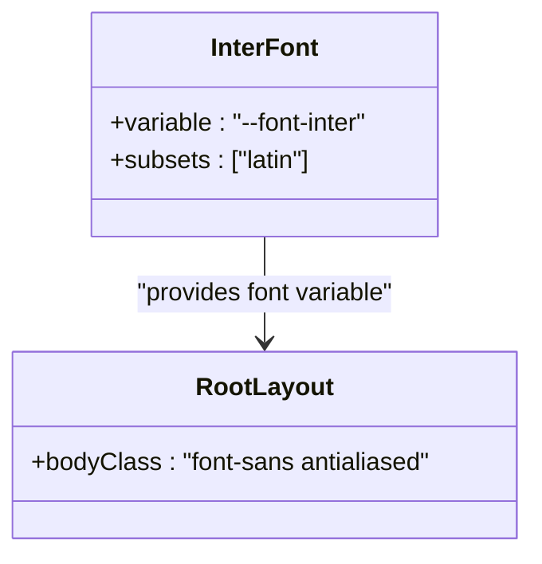

**Diagram sources**
- [layout.tsx:7-10](file://smartview-portal/src/app/layout.tsx#L7-L10)
- [layout.tsx:25](file://smartview-portal/src/app/layout.tsx#L25)

**Section sources**
- [layout.tsx:7-10](file://smartview-portal/src/app/layout.tsx#L7-L10)
- [layout.tsx:25](file://smartview-portal/src/app/layout.tsx#L25)

### Button Component Variants
- Uses class variance authority (CVA) to define variants and sizes
- Focus-visible ring utilities for accessibility
- Conditional slot rendering for composition with links
- Merging utility ensures clean class combinations

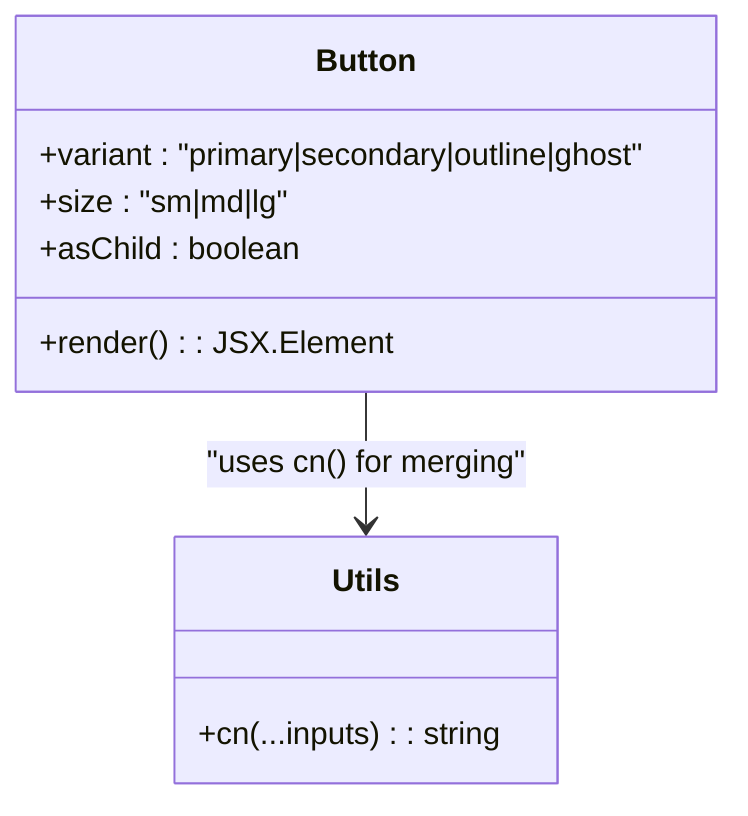

**Diagram sources**
- [Button.tsx:6-31](file://smartview-portal/src/components/ui/Button.tsx#L6-L31)
- [Button.tsx:39-50](file://smartview-portal/src/components/ui/Button.tsx#L39-L50)
- [utils.ts:4-6](file://smartview-portal/src/lib/utils.ts#L4-L6)

**Section sources**
- [Button.tsx:1-54](file://smartview-portal/src/components/ui/Button.tsx#L1-L54)
- [utils.ts:1-7](file://smartview-portal/src/lib/utils.ts#L1-L7)

### Header Component Styling Patterns
- Sticky header with backdrop blur and dynamic background on scroll
- Responsive navigation with desktop and mobile menu states
- Button variants used for CTA actions
- Navigation highlights based on current path

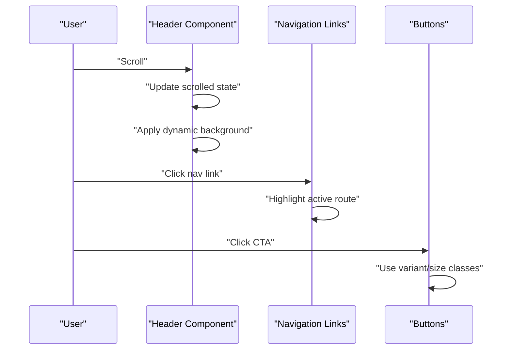

**Diagram sources**
- [Header.tsx:16-23](file://smartview-portal/src/components/layout/Header.tsx#L16-L23)
- [Header.tsx:44-60](file://smartview-portal/src/components/layout/Header.tsx#L44-L60)
- [Header.tsx:63-70](file://smartview-portal/src/components/layout/Header.tsx#L63-L70)
- [Header.tsx:111-125](file://smartview-portal/src/components/layout/Header.tsx#L111-L125)

**Section sources**
- [Header.tsx:1-131](file://smartview-portal/src/components/layout/Header.tsx#L1-L131)

### Footer Component Styling Patterns
- Multi-column layout with responsive grid
- Consistent typography and spacing
- Iconography with color and sizing
- Social and legal links with hover states

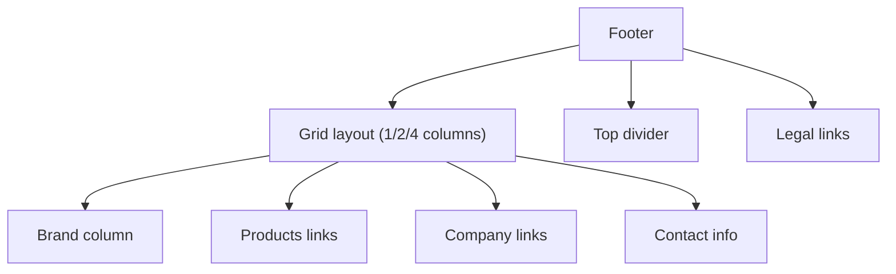

**Diagram sources**
- [Footer.tsx:24-99](file://smartview-portal/src/components/layout/Footer.tsx#L24-L99)
- [Footer.tsx:102-122](file://smartview-portal/src/components/layout/Footer.tsx#L102-L122)

**Section sources**
- [Footer.tsx:1-127](file://smartview-portal/src/components/layout/Footer.tsx#L1-L127)

### Hero Section Styling Patterns
- Full-width hero with gradient background and abstract shapes
- Grid overlay pattern for visual texture
- Centered content with responsive typography
- Interactive buttons with custom overrides
- Product mockup with glow effects and window controls

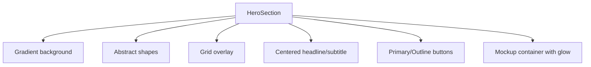

**Diagram sources**
- [HeroSection.tsx:6-20](file://smartview-portal/src/components/home/HeroSection.tsx#L6-L20)
- [HeroSection.tsx:25-46](file://smartview-portal/src/components/home/HeroSection.tsx#L25-L46)
- [HeroSection.tsx:56-118](file://smartview-portal/src/components/home/HeroSection.tsx#L56-L118)

**Section sources**
- [HeroSection.tsx:1-125](file://smartview-portal/src/components/home/HeroSection.tsx#L1-L125)

### Features Overview Styling Patterns
- Responsive card grid with hover effects
- Icon containers with color transitions
- Hover gradients and subtle elevation
- Consistent spacing and typography

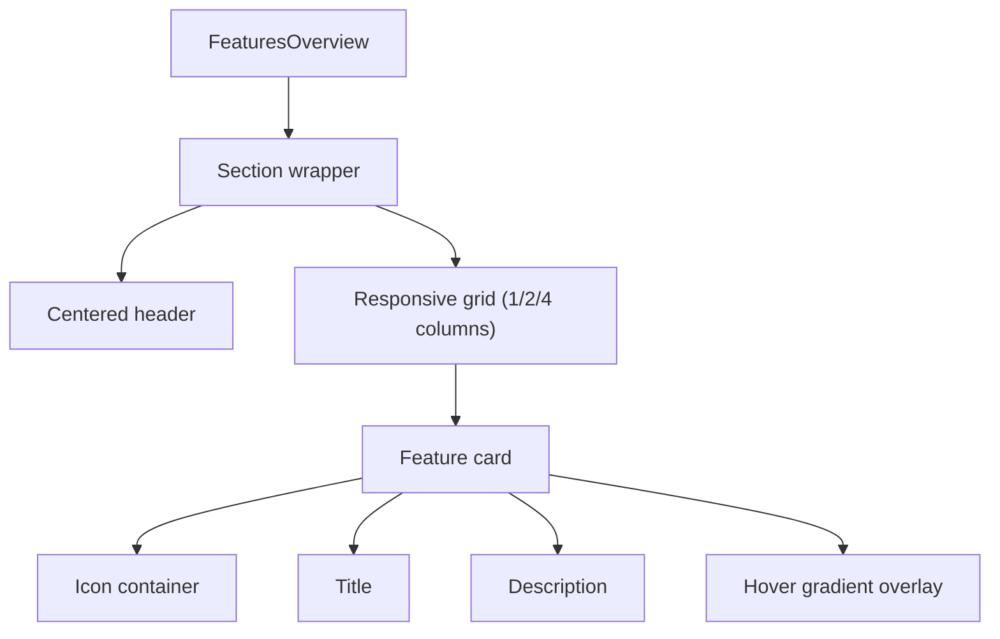

**Diagram sources**
- [FeaturesOverview.tsx:28-71](file://smartview-portal/src/components/home/FeaturesOverview.tsx#L28-L71)
- [FeaturesOverview.tsx:41-69](file://smartview-portal/src/components/home/FeaturesOverview.tsx#L41-L69)

**Section sources**
- [FeaturesOverview.tsx:1-74](file://smartview-portal/src/components/home/FeaturesOverview.tsx#L1-L74)

### Home Page Composition
- Aggregates hero, features, process, stats, and CTA sections
- Maintains consistent spacing and responsive behavior

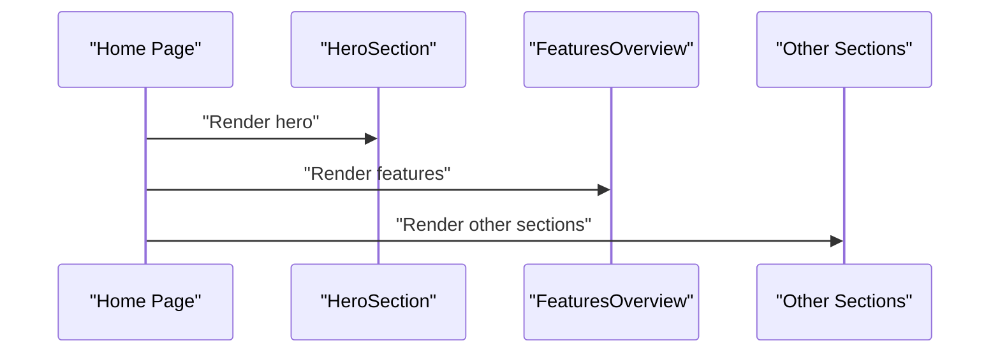

**Diagram sources**
- [page.tsx:7-16](file://smartview-portal/src/app/page.tsx#L7-L16)

**Section sources**
- [page.tsx:1-18](file://smartview-portal/src/app/page.tsx#L1-L18)

## Dependency Analysis
External libraries supporting the design system:
- class-variance-authority: Defines component variants and defaults
- clsx: Conditionally joins class names
- tailwind-merge: Merges Tailwind classes deterministically
- lucide-react: Provides SVG icons for UI elements
- radix-ui/react-slot: Enables composition patterns for links/buttons

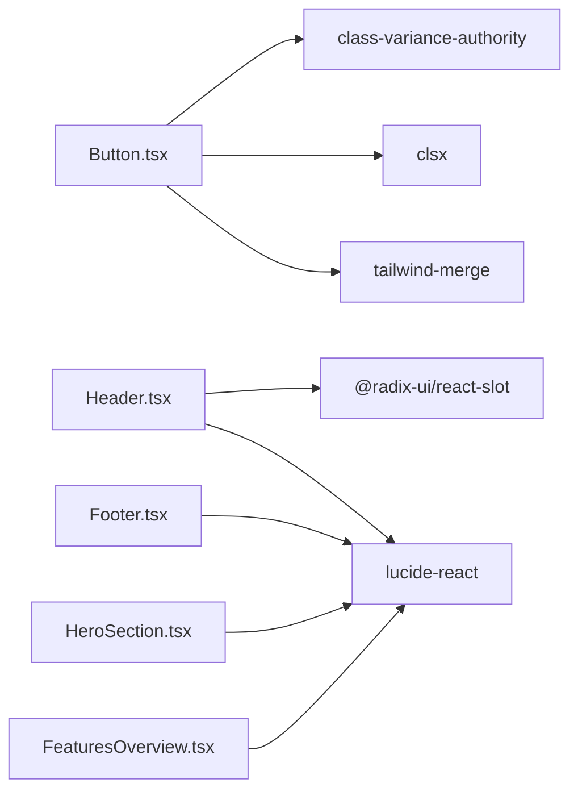

**Diagram sources**
- [Button.tsx:2-4](file://smartview-portal/src/components/ui/Button.tsx#L2-L4)
- [Header.tsx:6-9](file://smartview-portal/src/components/layout/Header.tsx#L6-L9)
- [Footer.tsx:2](file://smartview-portal/src/components/layout/Footer.tsx#L2)
- [HeroSection.tsx:1](file://smartview-portal/src/components/home/HeroSection.tsx#L1)
- [FeaturesOverview.tsx:1](file://smartview-portal/src/components/home/FeaturesOverview.tsx#L1)

**Section sources**
- [package.json:11-30](file://smartview-portal/package.json#L11-L30)

## Performance Considerations
- Tailwind content scanning is scoped to specific directories to minimize CSS size
- CSS custom properties reduce duplication and enable efficient theme switching
- Utility-first approach avoids writing bespoke CSS, reducing maintenance overhead
- Minimal PostCSS configuration reduces build complexity
- Ensure to keep font subsets minimal and avoid unused utilities in production builds

[No sources needed since this section provides general guidance]

## Troubleshooting Guide
- Theme tokens not updating in dark mode
  - Verify prefers-color-scheme media query and root token assignments
  - Confirm body inherits tokens correctly

- Button variants not applying
  - Check variant and size props passed to Button
  - Ensure cn() merges classes correctly

- Layout shifts or inconsistent spacing
  - Verify responsive padding and margin utilities
  - Confirm max-width and container classes are applied consistently

- Accessibility issues with focus states
  - Ensure focus-visible ring utilities are present on interactive elements
  - Test keyboard navigation and screen reader compatibility

**Section sources**
- [globals.css:10-15](file://smartview-portal/src/app/globals.css#L10-L15)
- [Button.tsx:7](file://smartview-portal/src/components/ui/Button.tsx#L7)
- [utils.ts:4-6](file://smartview-portal/src/lib/utils.ts#L4-L6)

## Conclusion
The SmartView Portal employs a robust, themeable design system centered on CSS custom properties, Tailwind utilities, and component-level variants. The architecture balances simplicity and scalability, enabling consistent styling across components while supporting easy customization and future enhancements.

[No sources needed since this section summarizes without analyzing specific files]

## Appendices

### Extending the Design System
- Add new semantic tokens in globals.css under :root and dark mode media query
- Extend Tailwind theme colors in tailwind.config.ts to expose new tokens
- Define new component variants using class-variance-authority
- Introduce new utility classes under @layer utilities when needed
- Keep font subsets and icon usage consistent across components

**Section sources**
- [globals.css:5-15](file://smartview-portal/src/app/globals.css#L5-L15)
- [tailwind.config.ts:9-16](file://smartview-portal/tailwind.config.ts#L9-L16)
- [Button.tsx:6-31](file://smartview-portal/src/components/ui/Button.tsx#L6-L31)

### Implementing Custom Themes
- Override CSS custom properties in :root for brand-specific colors
- Extend dark mode tokens to match brand palette
- Update component variants to align with new semantic names
- Test across devices and browsers to ensure consistent rendering

**Section sources**
- [globals.css:5-15](file://smartview-portal/src/app/globals.css#L5-L15)
- [Button.tsx:10-19](file://smartview-portal/src/components/ui/Button.tsx#L10-L19)

### Accessibility and Cross-Browser Compatibility
- Use focus-visible ring utilities for keyboard navigation
- Provide ARIA labels for interactive elements
- Ensure sufficient color contrast for text and backgrounds
- Test with assistive technologies and various browser engines

**Section sources**
- [Button.tsx:7](file://smartview-portal/src/components/ui/Button.tsx#L7)
- [Header.tsx:76-77](file://smartview-portal/src/components/layout/Header.tsx#L76-L77)