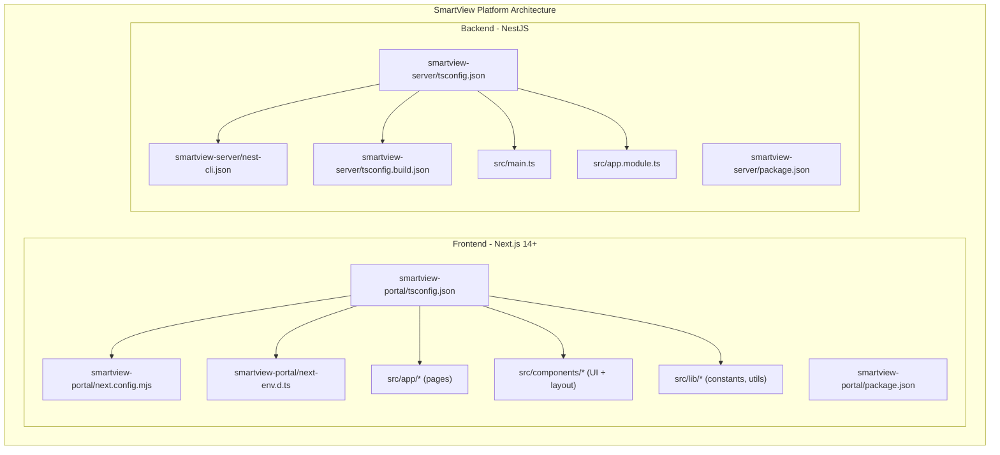
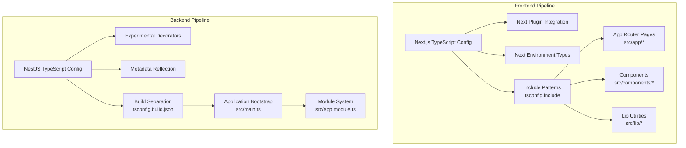
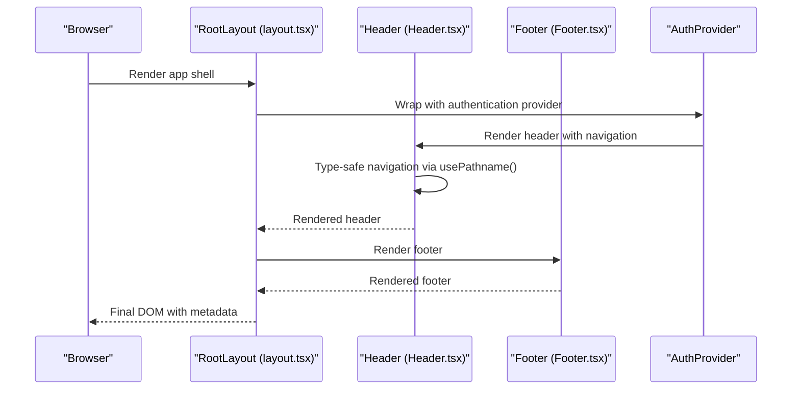
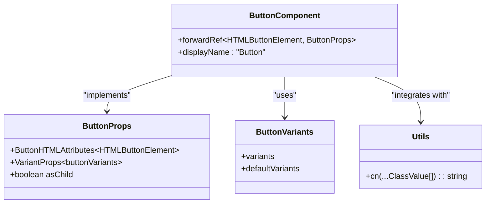
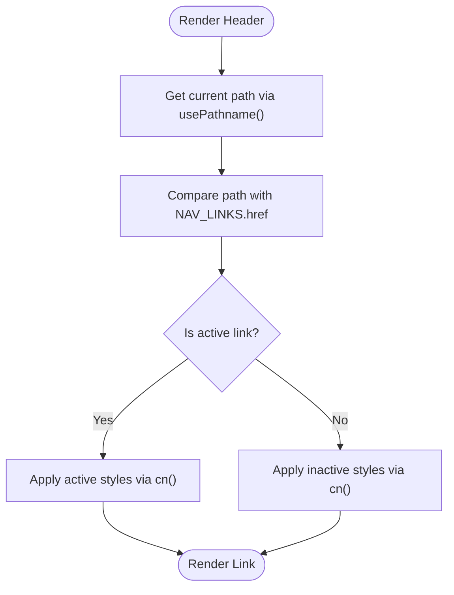
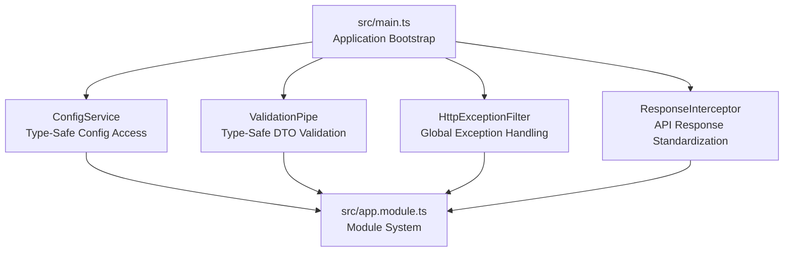
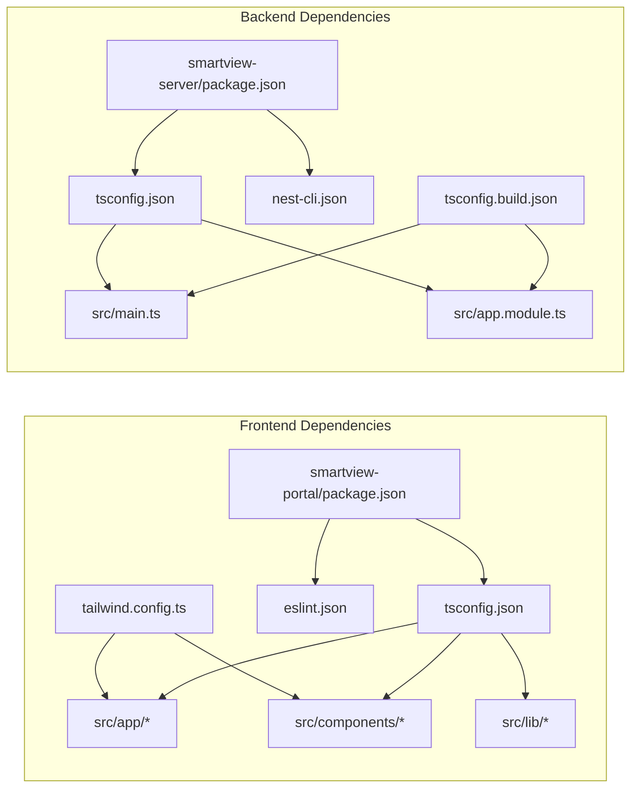

# TypeScript Configuration

<cite>
**Referenced Files in This Document**
- [tsconfig.json](file://smartview-portal/tsconfig.json)
- [tsconfig.json](file://smartview-server/tsconfig.json)
- [tsconfig.build.json](file://smartview-server/tsconfig.build.json)
- [nest-cli.json](file://smartview-server/nest-cli.json)
- [next.config.mjs](file://smartview-portal/next.config.mjs)
- [next-env.d.ts](file://smartview-portal/next-env.d.ts)
- [package.json](file://smartview-portal/package.json)
- [package.json](file://smartview-server/package.json)
- [tailwind.config.ts](file://smartview-portal/tailwind.config.ts)
- [.eslintrc.json](file://smartview-portal/.eslintrc.json)
- [src/app/layout.tsx](file://smartview-portal/src/app/layout.tsx)
- [src/app/page.tsx](file://smartview-portal/src/app/page.tsx)
- [src/app/about/page.tsx](file://smartview-portal/src/app/about/page.tsx)
- [src/app/features/page.tsx](file://smartview-portal/src/app/features/page.tsx)
- [src/components/ui/Button.tsx](file://smartview-portal/src/components/ui/Button.tsx)
- [src/components/layout/Header.tsx](file://smartview-portal/src/components/layout/Header.tsx)
- [src/components/layout/Footer.tsx](file://smartview-portal/src/components/layout/Footer.tsx)
- [src/lib/utils.ts](file://smartview-portal/src/lib/utils.ts)
- [src/lib/constants.ts](file://smartview-portal/src/lib/constants.ts)
- [src/main.ts](file://smartview-server/src/main.ts)
- [src/app.module.ts](file://smartview-server/src/app.module.ts)
</cite>

## Update Summary
**Changes Made**
- Added comprehensive NestJS TypeScript configuration documentation
- Updated Next.js 14+ integration patterns and modern TS setup
- Documented dual-platform architecture with portal and server TypeScript configurations
- Enhanced type safety patterns for both frontend and backend applications
- Added NestJS dependency injection and module system type patterns

## Table of Contents
1. [Introduction](#introduction)
2. [Project Structure](#project-structure)
3. [Core Components](#core-components)
4. [Architecture Overview](#architecture-overview)
5. [Detailed Component Analysis](#detailed-component-analysis)
6. [NestJS Backend TypeScript Configuration](#nestjs-backend-typescript-configuration)
7. [Dependency Analysis](#dependency-analysis)
8. [Performance Considerations](#performance-considerations)
9. [Troubleshooting Guide](#troubleshooting-guide)
10. [Conclusion](#conclusion)
11. [Appendices](#appendices)

## Introduction
This document explains the TypeScript configuration and type system used in the SmartView Platform, a modern full-stack application featuring Next.js 14+ frontend and NestJS backend. The platform demonstrates contemporary TypeScript practices with strict type checking, modern module resolution, and seamless integration between frontend and backend services. It covers compiler options, path mapping, strictness settings, and integration with Next.js App Router and NestJS dependency injection system. The documentation also details component typing patterns, prop interfaces, generic type usage, and the unique type safety considerations for both client-side and server-side development.

## Project Structure
The SmartView Platform consists of two distinct TypeScript projects: a Next.js 14+ frontend (smartview-portal) and a NestJS backend (smartview-server). Each project maintains its own TypeScript configuration optimized for its specific runtime environment. The frontend uses modern App Router patterns with strict type checking, while the backend leverages NestJS's dependency injection and modular architecture with comprehensive type safety.

**Diagram sources**
- [tsconfig.json:1-27](file://smartview-portal/tsconfig.json#L1-L27)
- [tsconfig.json:1-26](file://smartview-server/tsconfig.json#L1-L26)
- [tsconfig.build.json:1-5](file://smartview-server/tsconfig.build.json#L1-L5)
- [nest-cli.json:1-9](file://smartview-server/nest-cli.json#L1-L9)
- [next.config.mjs:1-14](file://smartview-portal/next.config.mjs#L1-L14)
- [next-env.d.ts:1-6](file://smartview-portal/next-env.d.ts#L1-L6)

**Section sources**
- [tsconfig.json:1-27](file://smartview-portal/tsconfig.json#L1-L27)
- [tsconfig.json:1-26](file://smartview-server/tsconfig.json#L1-L26)
- [tsconfig.build.json:1-5](file://smartview-server/tsconfig.build.json#L1-L5)
- [nest-cli.json:1-9](file://smartview-server/nest-cli.json#L1-L9)
- [next.config.mjs:1-14](file://smartview-portal/next.config.mjs#L1-L14)
- [next-env.d.ts:1-6](file://smartview-portal/next-env.d.ts#L1-L6)

## Core Components
This section focuses on TypeScript configuration and type-related patterns used across both the SmartView Portal and SmartView Server applications.

### Frontend TypeScript Configuration (Next.js 14+)
- **Compiler options and strictness**: Strict mode enabled with modern ESNext features, no emit for Next.js compilation pipeline, bundler module resolution for optimal performance.
- **Path mapping**: Workspace alias @/* mapped to ./src/* for consistent imports across app, components, and lib directories.
- **Type generation**: next-env.d.ts declares Next.js ambient types, .next/types integration for route type safety.
- **Toolchain alignment**: TypeScript 5.x with Next 14.2.35, ESLint with Next.js presets for web vitals compliance.

### Backend TypeScript Configuration (NestJS)
- **Modern Node.js targeting**: ES2023 target with experimental decorators and metadata for NestJS features.
- **Strict null checking**: Comprehensive null safety with strictNullChecks enabled.
- **Build separation**: Distinct tsconfig.build.json for production builds excluding tests and development files.
- **Module system**: nodenext module resolution optimized for NestJS dependency injection patterns.

**Section sources**
- [tsconfig.json:1-27](file://smartview-portal/tsconfig.json#L1-L27)
- [tsconfig.json:1-26](file://smartview-server/tsconfig.json#L1-L26)
- [tsconfig.build.json:1-5](file://smartview-server/tsconfig.build.json#L1-L5)
- [package.json:11-34](file://smartview-portal/package.json#L11-L34)
- [package.json:22-70](file://smartview-server/package.json#L22-L70)

## Architecture Overview
The SmartView Platform demonstrates a sophisticated dual-environment TypeScript architecture. The frontend leverages Next.js App Router with strict type checking and modern JSX handling, while the backend utilizes NestJS's modular architecture with comprehensive dependency injection type safety. Both environments benefit from shared TypeScript patterns including path aliases, strict mode, and incremental compilation for optimal developer experience.

**Diagram sources**
- [tsconfig.json:1-27](file://smartview-portal/tsconfig.json#L1-L27)
- [tsconfig.json:1-26](file://smartview-server/tsconfig.json#L1-L26)
- [tsconfig.build.json:1-5](file://smartview-server/tsconfig.build.json#L1-L5)
- [src/main.ts:1-38](file://smartview-server/src/main.ts#L1-L38)
- [src/app.module.ts:1-34](file://smartview-server/src/app.module.ts#L1-L34)

**Section sources**
- [tsconfig.json:1-27](file://smartview-portal/tsconfig.json#L1-L27)
- [tsconfig.json:1-26](file://smartview-server/tsconfig.json#L1-L26)
- [tsconfig.build.json:1-5](file://smartview-server/tsconfig.build.json#L1-L5)
- [src/main.ts:1-38](file://smartview-server/src/main.ts#L1-L38)
- [src/app.module.ts:1-34](file://smartview-server/src/app.module.ts#L1-L34)

## Detailed Component Analysis

### TypeScript Configuration and Path Mapping
**Frontend Configuration (Next.js 14+)**
- **Strictness and emit control**: strict: true enables exhaustive type checks, noEmit: true prevents manual compilation as Next handles type generation.
- **Modern module resolution**: module: esnext with moduleResolution: bundler for optimal tree-shaking and modern bundler compatibility.
- **JSX handling**: jsx: preserve aligns with Next's App Router compilation pipeline for optimal performance.
- **Path mapping**: @/* alias to ./src/* simplifies imports across the entire application structure.

**Backend Configuration (NestJS)**
- **Node.js targeting**: ES2023 target with experimental decorators for advanced NestJS features.
- **Metadata reflection**: emitDecoratorMetadata and experimentalDecorators enabled for dependency injection and validation pipes.
- **Strict null checking**: Comprehensive null safety with strictNullChecks for reliable server-side type safety.

**Section sources**
- [tsconfig.json:1-27](file://smartview-portal/tsconfig.json#L1-L27)
- [tsconfig.json:1-26](file://smartview-server/tsconfig.json#L1-L26)

### Next.js Integration and Type-Safe Routing
The frontend implements modern Next.js 14+ patterns with comprehensive type safety:

- **Root layout metadata**: Uses Metadata type from next for SEO optimization and Open Graph properties.
- **Font optimization**: Inter font with CSS variable support for consistent typography.
- **Context integration**: AuthProvider wraps the application shell for global state management.
- **Type-safe navigation**: Next's Link component and usePathname hook provide strongly-typed routing primitives.

**Diagram sources**
- [src/app/layout.tsx:1-36](file://smartview-portal/src/app/layout.tsx#L1-L36)
- [src/components/layout/Header.tsx:1-131](file://smartview-portal/src/components/layout/Header.tsx#L1-L131)
- [src/components/layout/Footer.tsx:1-127](file://smartview-portal/src/components/layout/Footer.tsx#L1-L127)

**Section sources**
- [src/app/layout.tsx:1-36](file://smartview-portal/src/app/layout.tsx#L1-L36)
- [src/components/layout/Header.tsx:1-131](file://smartview-portal/src/components/layout/Header.tsx#L1-L131)
- [src/components/layout/Footer.tsx:1-127](file://smartview-portal/src/components/layout/Footer.tsx#L1-L127)

### Component Typing Patterns and Prop Interfaces
The Button component exemplifies modern React TypeScript patterns with comprehensive type safety:

- **ForwardRef implementation**: Uses React.forwardRef with explicit HTMLButtonElement target for proper ref handling.
- **Variant composition**: Integrates with class-variance-authority for type-safe variant and size props.
- **Composition patterns**: Supports asChild pattern via @radix-ui/react-slot for semantic HTML composition.
- **Utility integration**: cn function from utils.ts provides type-safe class merging with clsx and twMerge.

**Diagram sources**
- [src/components/ui/Button.tsx:33-54](file://smartview-portal/src/components/ui/Button.tsx#L33-L54)
- [src/lib/utils.ts:1-7](file://smartview-portal/src/lib/utils.ts#L1-L7)

**Section sources**
- [src/components/ui/Button.tsx:1-54](file://smartview-portal/src/components/ui/Button.tsx#L1-L54)
- [src/lib/utils.ts:1-7](file://smartview-portal/src/lib/utils.ts#L1-L7)

### Generic Type Usage and Composition
The platform demonstrates sophisticated generic type patterns:

- **Variadic class merging**: cn function accepts ClassValue... parameters for flexible class composition.
- **Variant composition**: buttonVariants creates type-safe variant systems with automatic prop inference.
- **Generic utilities**: Type-safe composition patterns enable reusable, configurable UI components.

**Section sources**
- [src/lib/utils.ts:1-7](file://smartview-portal/src/lib/utils.ts#L1-L7)
- [src/components/ui/Button.tsx:1-54](file://smartview-portal/src/components/ui/Button.tsx#L1-L54)

### Type-Safe Routing and Navigation
Navigation components implement comprehensive type safety:

- **Metadata typing**: RootLayout uses Metadata from next for SEO optimization.
- **Navigation typing**: usePathname returns string type; equality checks ensure type-safe active states.
- **Shared constants**: NAV_LINKS provides strongly-typed navigation entries for consistent navigation behavior.

**Diagram sources**
- [src/components/layout/Header.tsx:1-131](file://smartview-portal/src/components/layout/Header.tsx#L1-L131)
- [src/lib/constants.ts:1-11](file://smartview-portal/src/lib/constants.ts#L1-L11)
- [src/lib/utils.ts:1-7](file://smartview-portal/src/lib/utils.ts#L1-L7)

**Section sources**
- [src/app/layout.tsx:1-36](file://smartview-portal/src/app/layout.tsx#L1-L36)
- [src/components/layout/Header.tsx:1-131](file://smartview-portal/src/components/layout/Header.tsx#L1-L131)
- [src/lib/constants.ts:1-11](file://smartview-portal/src/lib/constants.ts#L1-L11)

## NestJS Backend TypeScript Configuration
The SmartView Server demonstrates enterprise-grade TypeScript configuration for NestJS applications:

### Core TypeScript Settings
- **Target and module system**: ES2023 target with nodenext module resolution for modern Node.js features.
- **Decorator support**: Experimental decorators and emitDecoratorMetadata enabled for NestJS dependency injection.
- **Strict type checking**: Comprehensive strictNullChecks for reliable server-side type safety.
- **Build optimization**: Separate tsconfig.build.json excludes test files and development dependencies.

### Application Bootstrap and Type Safety
The main application entry point showcases advanced TypeScript patterns:

- **Dependency injection**: NestFactory.create with proper type inference for AppModule.
- **Global configuration**: ConfigService integration with type-safe environment variable access.
- **Validation pipeline**: ValidationPipe with whitelist, transform, and forbidNonWhitelisted options.
- **Middleware integration**: Global exception filters and response interceptors with proper TypeScript signatures.

### Module System and Type Safety
The AppModule demonstrates NestJS's modular architecture with comprehensive type safety:

- **Import organization**: Centralized module imports with proper type inference.
- **Configuration management**: ConfigModule.forRoot with global configuration access.
- **Feature modularity**: Domain-specific modules (AuthModule, UsersModule, QuestionsModule) with clear boundaries.

**Diagram sources**
- [src/main.ts:1-38](file://smartview-server/src/main.ts#L1-L38)
- [src/app.module.ts:1-34](file://smartview-server/src/app.module.ts#L1-L34)

**Section sources**
- [src/main.ts:1-38](file://smartview-server/src/main.ts#L1-L38)
- [src/app.module.ts:1-34](file://smartview-server/src/app.module.ts#L1-L34)

**Section sources**
- [tsconfig.json:1-26](file://smartview-server/tsconfig.json#L1-L26)
- [tsconfig.build.json:1-5](file://smartview-server/tsconfig.build.json#L1-L5)
- [nest-cli.json:1-9](file://smartview-server/nest-cli.json#L1-L9)
- [package.json:22-70](file://smartview-server/package.json#L22-L70)

## Dependency Analysis
The TypeScript configuration depends on Next.js and NestJS ecosystem tooling. The platform maintains separate configurations for optimal performance in each environment while sharing common TypeScript patterns.

**Diagram sources**
- [package.json:1-34](file://smartview-portal/package.json#L1-L34)
- [package.json:1-92](file://smartview-server/package.json#L1-L92)
- [tsconfig.json:1-27](file://smartview-portal/tsconfig.json#L1-L27)
- [tsconfig.json:1-26](file://smartview-server/tsconfig.json#L1-L26)
- [tsconfig.build.json:1-5](file://smartview-server/tsconfig.build.json#L1-L5)
- [nest-cli.json:1-9](file://smartview-server/nest-cli.json#L1-L9)

**Section sources**
- [package.json:1-34](file://smartview-portal/package.json#L1-L34)
- [package.json:1-92](file://smartview-server/package.json#L1-L92)
- [tsconfig.json:1-27](file://smartview-portal/tsconfig.json#L1-L27)
- [tsconfig.json:1-26](file://smartview-server/tsconfig.json#L1-L26)
- [tsconfig.build.json:1-5](file://smartview-server/tsconfig.build.json#L1-L5)
- [nest-cli.json:1-9](file://smartview-server/nest-cli.json#L1-L9)

## Performance Considerations
**Frontend Performance**
- Keep strict: true enabled for early error detection during development.
- Use path aliases (@/*) to reduce deep-relative imports and improve TypeScript server performance.
- Enable incremental builds to accelerate repeated compilations in Next.js.
- Leverage Next.js's built-in type generation to avoid manual compilation overhead.

**Backend Performance**
- Configure separate build configurations for development and production.
- Use experimental decorators judiciously as they add runtime overhead.
- Enable strictNullChecks for comprehensive error detection without performance penalty.
- Utilize NestJS's dependency injection container for efficient service lifecycle management.

## Troubleshooting Guide
**Frontend TypeScript Issues**
- **Missing Next.js types**: Ensure next-env.d.ts is present and included in tsconfig.include.
- **Path alias resolution**: Verify @/* mapping matches actual src directory structure.
- **JSX transform conflicts**: Keep jsx: preserve in tsconfig.json for Next.js compatibility.
- **Tailwind IntelliSense**: Ensure tailwind.config.ts content globs include all directories using Tailwind classes.

**Backend TypeScript Issues**
- **Decorator compilation**: Ensure experimentalDecorators and emitDecoratorMetadata are enabled.
- **Module resolution**: Use nodenext module resolution for NestJS compatibility.
- **Build configuration**: Verify tsconfig.build.json excludes test files and development dependencies.
- **Dependency injection**: Check that all injected services have proper type annotations.

**Cross-Platform Issues**
- **Version compatibility**: Ensure TypeScript versions match Next.js and NestJS requirements.
- **Environment variables**: Configure ConfigService properly for both development and production.
- **API communication**: Verify Next.js rewrites are correctly configured for frontend-backend communication.

**Section sources**
- [next-env.d.ts:1-6](file://smartview-portal/next-env.d.ts#L1-L6)
- [tsconfig.json:1-27](file://smartview-portal/tsconfig.json#L1-L27)
- [tsconfig.json:1-26](file://smartview-server/tsconfig.json#L1-L26)
- [tsconfig.build.json:1-5](file://smartview-server/tsconfig.build.json#L1-L5)
- [next.config.mjs:1-14](file://smartview-portal/next.config.mjs#L1-L14)

## Conclusion
The SmartView Platform demonstrates a sophisticated dual-environment TypeScript architecture that leverages modern Next.js 14+ and NestJS patterns for comprehensive type safety. The frontend emphasizes strict type checking, modern module resolution, and seamless App Router integration, while the backend showcases enterprise-grade TypeScript configuration with dependency injection, decorator support, and modular architecture. Both environments benefit from shared patterns including path aliases, strict mode, and incremental compilation, creating a maintainable and scalable foundation for the SmartView platform.

## Appendices

### Maintaining Type Safety Checklist
**Frontend Checklist**
- Keep strict: true enabled in Next.js configuration.
- Use path aliases (@/*) consistently across the application.
- Leverage forwardRef and explicit DOM element targets for component refs.
- Use VariantProps for variant-based components with class-variance-authority.
- Implement cn function for safe class merging and avoid raw string concatenation.
- Keep tsconfig.include aligned with Next.js generated types (.next/types/**).

**Backend Checklist**
- Enable experimentalDecorators and emitDecoratorMetadata for NestJS features.
- Use strictNullChecks for comprehensive null safety.
- Configure separate build configurations for development and production.
- Leverage NestJS dependency injection with proper type annotations.
- Use ValidationPipe for automatic DTO validation with type safety.

### Extending Type Definitions
**Frontend Extensions**
- Add ambient declarations in next-env.d.ts for Next.js-specific types only.
- Define new utility types in lib/types if needed, preferring built-in utility types.
- Extend interfaces incrementally to avoid widening types unintentionally.

**Backend Extensions**
- Create custom decorators with proper type annotations for NestJS features.
- Define DTO interfaces with class-validator decorators for input validation.
- Extend NestJS base classes with proper generic type parameters.

### Example Reference Paths
**Frontend Examples**
- Root layout metadata typing: [src/app/layout.tsx:13-17](file://smartview-portal/src/app/layout.tsx#L13-L17)
- Button prop interface: [src/components/ui/Button.tsx:33-37](file://smartview-portal/src/components/ui/Button.tsx#L33-L37)
- Variants and composition: [src/components/ui/Button.tsx:6-31](file://smartview-portal/src/components/ui/Button.tsx#L6-L31)
- Class merging utility: [src/lib/utils.ts:4-6](file://smartview-portal/src/lib/utils.ts#L4-L6)

**Backend Examples**
- Application bootstrap: [src/main.ts:8-36](file://smartview-server/src/main.ts#L8-L36)
- Module configuration: [src/app.module.ts:15-33](file://smartview-server/src/app.module.ts#L15-L33)
- Validation pipe setup: [src/main.ts:19-25](file://smartview-server/src/main.ts#L19-L25)
- Config service integration: [src/main.ts:9-11](file://smartview-server/src/main.ts#L9-L11)