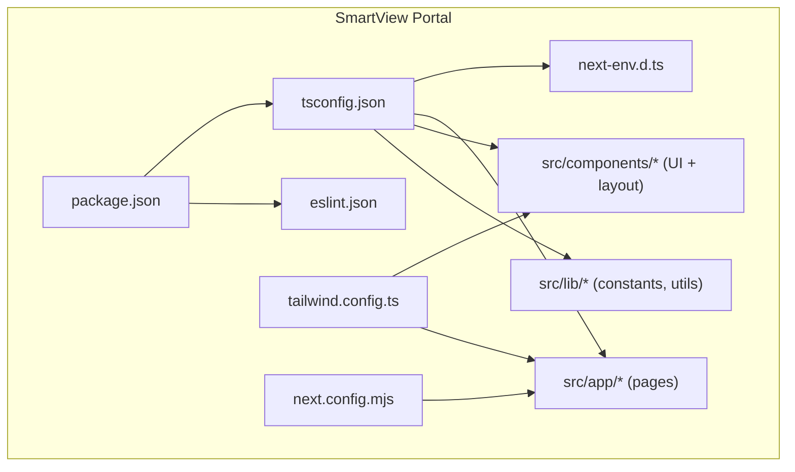
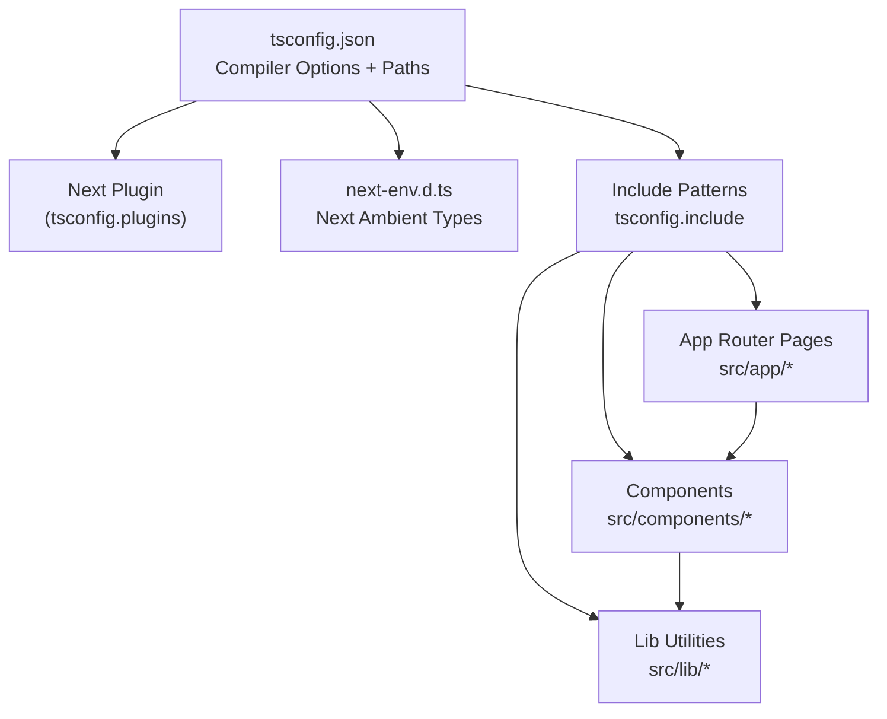
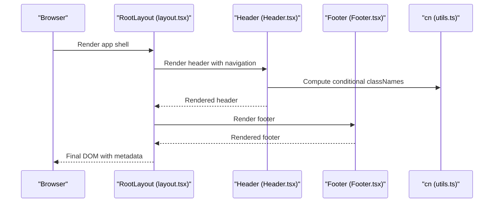
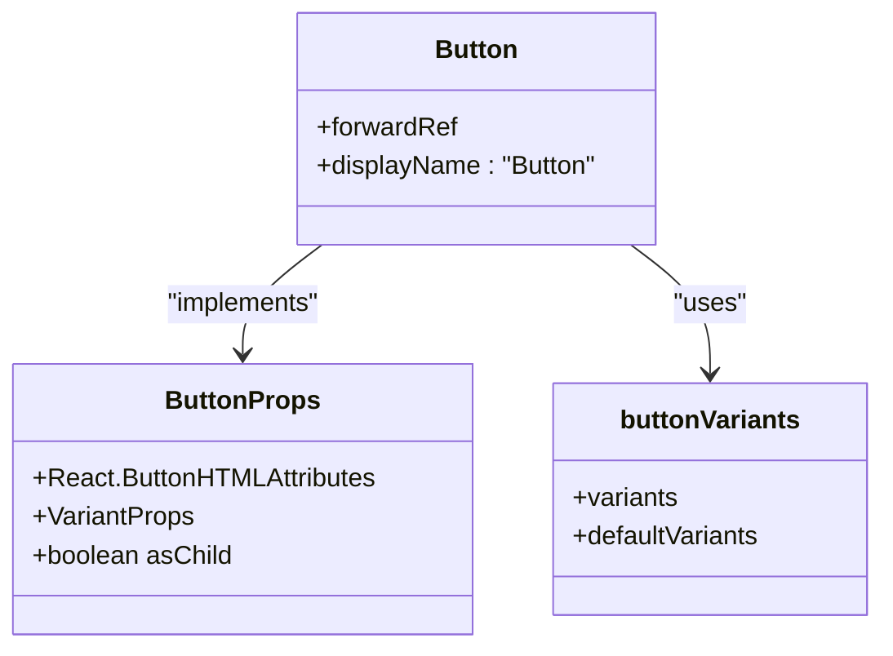
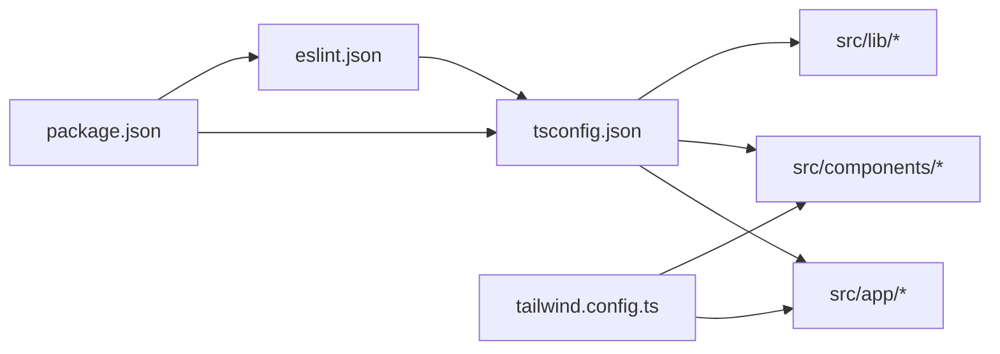

# TypeScript Configuration

<cite>
**Referenced Files in This Document**
- [tsconfig.json](file://smartview-portal/tsconfig.json)
- [next.config.mjs](file://smartview-portal/next.config.mjs)
- [next-env.d.ts](file://smartview-portal/next-env.d.ts)
- [package.json](file://smartview-portal/package.json)
- [tailwind.config.ts](file://smartview-portal/tailwind.config.ts)
- [.eslintrc.json](file://smartview-portal/.eslintrc.json)
- [src/app/layout.tsx](file://smartview-portal/src/app/layout.tsx)
- [src/app/page.tsx](file://smartview-portal/src/app/page.tsx)
- [src/app/about/page.tsx](file://smartview-portal/src/app/about/page.tsx)
- [src/app/features/page.tsx](file://smartview-portal/src/app/features/page.tsx)
- [src/components/ui/Button.tsx](file://smartview-portal/src/components/ui/Button.tsx)
- [src/components/layout/Header.tsx](file://smartview-portal/src/components/layout/Header.tsx)
- [src/components/layout/Footer.tsx](file://smartview-portal/src/components/layout/Footer.tsx)
- [src/lib/utils.ts](file://smartview-portal/src/lib/utils.ts)
- [src/lib/constants.ts](file://smartview-portal/src/lib/constants.ts)
</cite>

## Table of Contents
1. [Introduction](#introduction)
2. [Project Structure](#project-structure)
3. [Core Components](#core-components)
4. [Architecture Overview](#architecture-overview)
5. [Detailed Component Analysis](#detailed-component-analysis)
6. [Dependency Analysis](#dependency-analysis)
7. [Performance Considerations](#performance-considerations)
8. [Troubleshooting Guide](#troubleshooting-guide)
9. [Conclusion](#conclusion)
10. [Appendices](#appendices)

## Introduction
This document explains the TypeScript configuration and type system used in the SmartView Portal Next.js application. It covers compiler options, path mapping, strictness settings, and integration with Next.js App Router. It also documents component typing patterns, prop interfaces, and generic type usage across the codebase. Finally, it provides practical guidelines for maintaining type safety, extending type definitions, and resolving common TypeScript issues within this project’s development workflow.

## Project Structure
The SmartView Portal follows a Next.js App Router project layout with a dedicated src directory. TypeScript configuration is centralized in tsconfig.json, while Next.js runtime types are declared via next-env.d.ts. Tailwind CSS integrates with TypeScript through typed configuration, and ESLint enforces TypeScript-aware linting rules.

**Diagram sources**
- [tsconfig.json:1-27](file://smartview-portal/tsconfig.json#L1-L27)
- [next-env.d.ts:1-6](file://smartview-portal/next-env.d.ts#L1-L6)
- [next.config.mjs:1-5](file://smartview-portal/next.config.mjs#L1-L5)
- [package.json:1-32](file://smartview-portal/package.json#L1-L32)
- [tailwind.config.ts:1-20](file://smartview-portal/tailwind.config.ts#L1-L20)
- [.eslintrc.json:1-4](file://smartview-portal/.eslintrc.json#L1-L4)

**Section sources**
- [tsconfig.json:1-27](file://smartview-portal/tsconfig.json#L1-L27)
- [next-env.d.ts:1-6](file://smartview-portal/next-env.d.ts#L1-L6)
- [next.config.mjs:1-5](file://smartview-portal/next.config.mjs#L1-L5)
- [package.json:1-32](file://smartview-portal/package.json#L1-L32)
- [tailwind.config.ts:1-20](file://smartview-portal/tailwind.config.ts#L1-L20)
- [.eslintrc.json:1-4](file://smartview-portal/.eslintrc.json#L1-L4)

## Core Components
This section focuses on TypeScript configuration and type-related patterns used across the application.

- Compiler options and strictness
  - Strict mode enabled for robust type checking.
  - No emit to rely on Next.js type generation and bundling.
  - Bundler module resolution and isolated modules for modern builds.
  - JSX preservation aligns with Next.js App Router compilation pipeline.
  - Incremental builds improve developer experience.
  - Plugin support for Next.js TypeScript integration.

- Path mapping
  - Workspace alias @/* mapped to ./src/* for concise imports across app, components, and lib.

- Type generation and environment
  - next-env.d.ts declares Next.js ambient types for app and image types.
  - .next/types is included to consume Next.js-generated route and app types.

- Toolchain alignment
  - TypeScript version pinned to ^5 in devDependencies.
  - ESLint extends Next’s TypeScript and web vitals presets.

**Section sources**
- [tsconfig.json:1-27](file://smartview-portal/tsconfig.json#L1-L27)
- [next-env.d.ts:1-6](file://smartview-portal/next-env.d.ts#L1-L6)
- [package.json:21-30](file://smartview-portal/package.json#L21-L30)
- [.eslintrc.json:1-4](file://smartview-portal/.eslintrc.json#L1-L4)

## Architecture Overview
The TypeScript configuration integrates tightly with Next.js App Router and Tailwind CSS. The build pipeline leverages Next’s type generation and plugin support, while path aliases simplify imports across the codebase.

**Diagram sources**
- [tsconfig.json:1-27](file://smartview-portal/tsconfig.json#L1-L27)
- [next-env.d.ts:1-6](file://smartview-portal/next-env.d.ts#L1-L6)

**Section sources**
- [tsconfig.json:1-27](file://smartview-portal/tsconfig.json#L1-L27)
- [next-env.d.ts:1-6](file://smartview-portal/next-env.d.ts#L1-L6)

## Detailed Component Analysis

### TypeScript Configuration and Path Mapping
- Strictness and emit control
  - strict: true enables exhaustive type checks.
  - noEmit: true prevents manual compilation; Next handles emit.
- Module and resolution
  - module: esnext and moduleResolution: bundler align with modern bundlers.
  - isolatedModules: true ensures single-file compilation safety.
- JSX and incremental builds
  - jsx: preserve aligns with Next’s JSX handling.
  - incremental: true accelerates rebuilds.
- Plugins and path mapping
  - plugins include Next plugin for enhanced DX.
  - paths map @/* to ./src/* for consistent imports.

**Section sources**
- [tsconfig.json:1-27](file://smartview-portal/tsconfig.json#L1-L27)

### Next.js Integration and Type-Safe Routing
- App Router pages
  - Root layout defines Metadata type and children prop typing.
  - Page components import shared UI and constants using path aliases.
- Type-safe navigation
  - Next’s Link and usePathname provide strongly-typed routing primitives.
  - Constants define nav links with labeled hrefs for safer linking.

**Diagram sources**
- [src/app/layout.tsx:1-33](file://smartview-portal/src/app/layout.tsx#L1-L33)
- [src/components/layout/Header.tsx:1-131](file://smartview-portal/src/components/layout/Header.tsx#L1-L131)
- [src/components/layout/Footer.tsx:1-127](file://smartview-portal/src/components/layout/Footer.tsx#L1-L127)
- [src/lib/utils.ts:1-7](file://smartview-portal/src/lib/utils.ts#L1-L7)

**Section sources**
- [src/app/layout.tsx:1-33](file://smartview-portal/src/app/layout.tsx#L1-L33)
- [src/components/layout/Header.tsx:1-131](file://smartview-portal/src/components/layout/Header.tsx#L1-L131)
- [src/components/layout/Footer.tsx:1-127](file://smartview-portal/src/components/layout/Footer.tsx#L1-L127)
- [src/lib/utils.ts:1-7](file://smartview-portal/src/lib/utils.ts#L1-L7)

### Component Typing Patterns and Prop Interfaces
- Button component
  - Uses forwardRef with explicit HTMLButtonElement target.
  - Prop interface extends button attributes and variant props from class-variance-authority.
  - Supports asChild pattern via @radix-ui/react-slot for composition.
  - Utility function cn merges Tailwind classes safely.

**Diagram sources**
- [src/components/ui/Button.tsx:33-54](file://smartview-portal/src/components/ui/Button.tsx#L33-L54)

**Section sources**
- [src/components/ui/Button.tsx:1-54](file://smartview-portal/src/components/ui/Button.tsx#L1-L54)
- [src/lib/utils.ts:1-7](file://smartview-portal/src/lib/utils.ts#L1-L7)

### Generic Type Usage and Composition
- Variadic class merging
  - cn accepts ClassValue... and merges classes via clsx and twMerge.
- Variant composition
  - buttonVariants composes variant and size props; ButtonProps picks those variants via VariantProps.
- Utility-driven composition
  - asChild allows Button to render either a button element or a Slot wrapper, enabling semantic composition with Link.

**Section sources**
- [src/lib/utils.ts:1-7](file://smartview-portal/src/lib/utils.ts#L1-L7)
- [src/components/ui/Button.tsx:1-54](file://smartview-portal/src/components/ui/Button.tsx#L1-L54)

### Type-Safe Routing and Navigation
- Metadata typing
  - RootLayout uses Metadata from next to type page metadata.
- Navigation typing
  - usePathname returns string; equality checks against nav hrefs ensure type-safe active states.
- Shared constants
  - NAV_LINKS provides strongly-typed navigation entries for reuse across components.

**Diagram sources**
- [src/components/layout/Header.tsx:1-131](file://smartview-portal/src/components/layout/Header.tsx#L1-L131)
- [src/lib/constants.ts:1-11](file://smartview-portal/src/lib/constants.ts#L1-L11)
- [src/lib/utils.ts:1-7](file://smartview-portal/src/lib/utils.ts#L1-L7)

**Section sources**
- [src/app/layout.tsx:1-33](file://smartview-portal/src/app/layout.tsx#L1-L33)
- [src/components/layout/Header.tsx:1-131](file://smartview-portal/src/components/layout/Header.tsx#L1-L131)
- [src/lib/constants.ts:1-11](file://smartview-portal/src/lib/constants.ts#L1-L11)

## Dependency Analysis
The TypeScript configuration depends on Next.js and related tooling. Tailwind CSS content globs include app, components, and pages directories. ESLint extends Next’s TypeScript preset for consistent linting.

**Diagram sources**
- [package.json:1-32](file://smartview-portal/package.json#L1-L32)
- [tsconfig.json:1-27](file://smartview-portal/tsconfig.json#L1-L27)
- [tailwind.config.ts:1-20](file://smartview-portal/tailwind.config.ts#L1-L20)
- [.eslintrc.json:1-4](file://smartview-portal/.eslintrc.json#L1-L4)

**Section sources**
- [package.json:1-32](file://smartview-portal/package.json#L1-L32)
- [tsconfig.json:1-27](file://smartview-portal/tsconfig.json#L1-L27)
- [tailwind.config.ts:1-20](file://smartview-portal/tailwind.config.ts#L1-L20)
- [.eslintrc.json:1-4](file://smartview-portal/.eslintrc.json#L1-L4)

## Performance Considerations
- Keep strict: true enabled to catch issues early during development.
- Prefer path aliases (@/*) to reduce deep-relative imports and improve DX.
- Use incremental builds to speed up repeated compilations.
- Avoid unnecessary dynamic imports or excessive runtime type assertions to maintain fast type-checking.

## Troubleshooting Guide
Common TypeScript issues and resolutions in this project:

- Missing Next.js types
  - Ensure next-env.d.ts is present and referenced by tsconfig.include.
  - Verify Next.js version compatibility with TypeScript version.

- Path alias resolution errors
  - Confirm @/* mapping in tsconfig.json matches actual src directory structure.
  - Restart TypeScript server or reload editor to pick up path changes.

- JSX transform conflicts
  - Keep jsx: preserve in tsconfig.json to align with Next’s JSX handling.
  - Avoid conflicting JSX configs in other files.

- Tailwind IntelliSense and type errors
  - Ensure tailwind.config.ts content globs include all directories where Tailwind classes are used.
  - Run Next build to regenerate types if .next/types are missing.

- ESLint and TypeScript mismatch
  - Extend eslint-config-next in .eslintrc.json to enable TypeScript-aware linting.
  - Align TypeScript and ESLint versions with Next’s pinned versions.

**Section sources**
- [next-env.d.ts:1-6](file://smartview-portal/next-env.d.ts#L1-L6)
- [tsconfig.json:1-27](file://smartview-portal/tsconfig.json#L1-L27)
- [tailwind.config.ts:1-20](file://smartview-portal/tailwind.config.ts#L1-L20)
- [.eslintrc.json:1-4](file://smartview-portal/.eslintrc.json#L1-L4)

## Conclusion
The SmartView Portal’s TypeScript configuration emphasizes strictness, modern module resolution, and seamless Next.js integration. Path aliases and utility-driven composition keep the codebase maintainable and type-safe. By following the guidelines and patterns outlined here, contributors can extend the type system confidently while preserving a smooth development workflow.

## Appendices

### Maintaining Type Safety Checklist
- Keep strict: true enabled.
- Use path aliases (@/*) consistently.
- Leverage forwardRef and explicit DOM element targets for component refs.
- Prefer VariantProps for variant-based components.
- Use cn for safe class merging and avoid raw string concatenation.
- Keep tsconfig.include aligned with generated types (.next/types/**).

### Extending Type Definitions
- Add ambient declarations in next-env.d.ts only for Next.js-specific types.
- Define new utility types in lib/types if needed, but prefer built-in utility types from libraries.
- Extend interfaces incrementally; avoid widening types unintentionally.

### Example Reference Paths
- Root layout metadata typing: [src/app/layout.tsx:12-16](file://smartview-portal/src/app/layout.tsx#L12-L16)
- Button prop interface: [src/components/ui/Button.tsx:33-37](file://smartview-portal/src/components/ui/Button.tsx#L33-L37)
- Variants and composition: [src/components/ui/Button.tsx:6-31](file://smartview-portal/src/components/ui/Button.tsx#L6-L31)
- Class merging utility: [src/lib/utils.ts:4-6](file://smartview-portal/src/lib/utils.ts#L4-L6)
- Navigation constants: [src/lib/constants.ts:4-10](file://smartview-portal/src/lib/constants.ts#L4-L10)