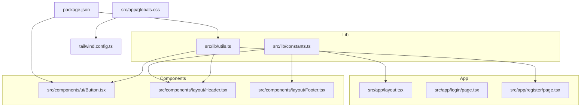
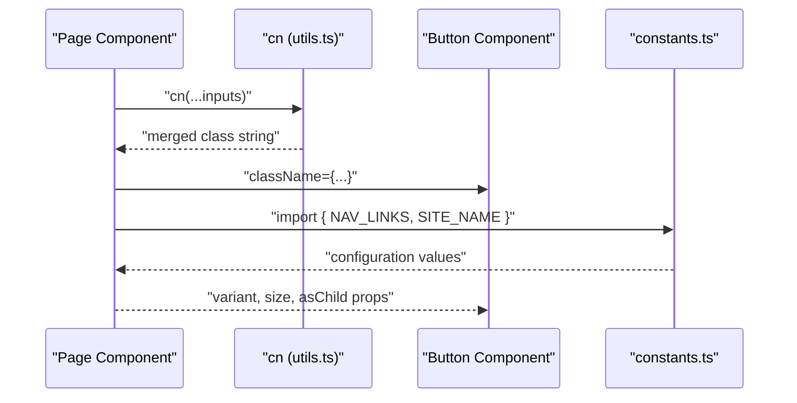
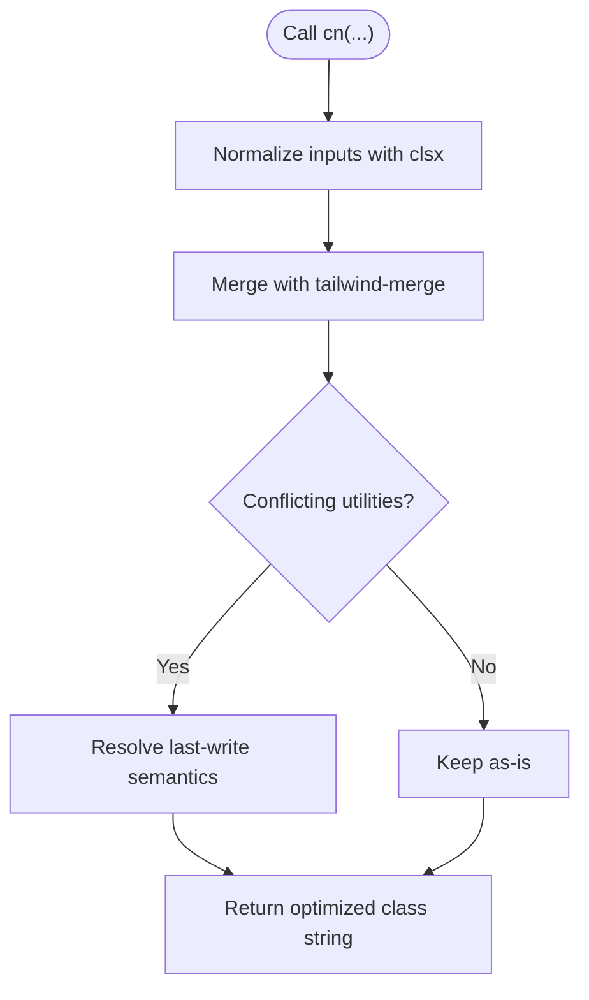
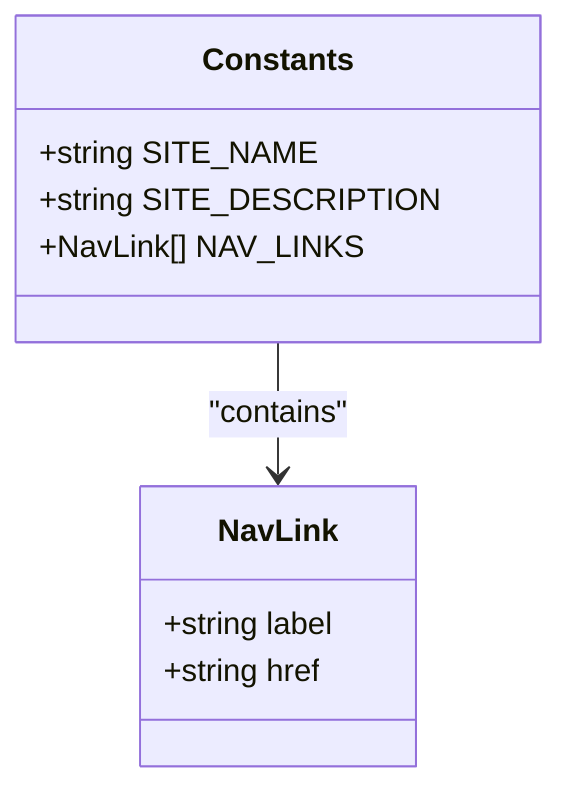
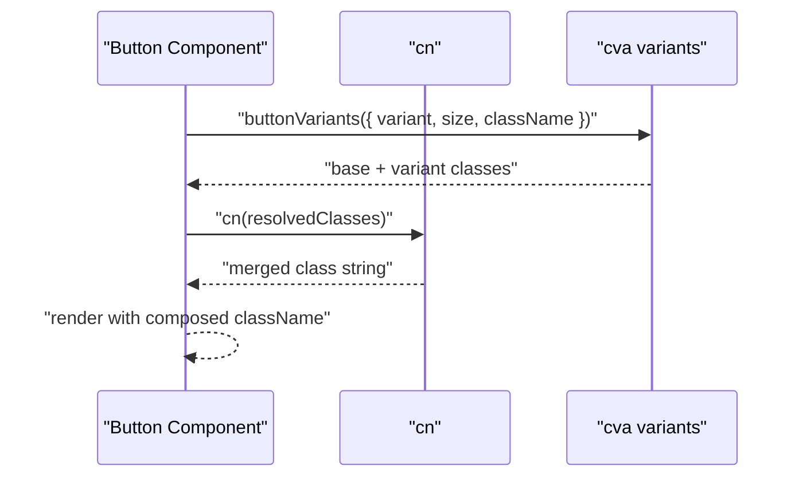
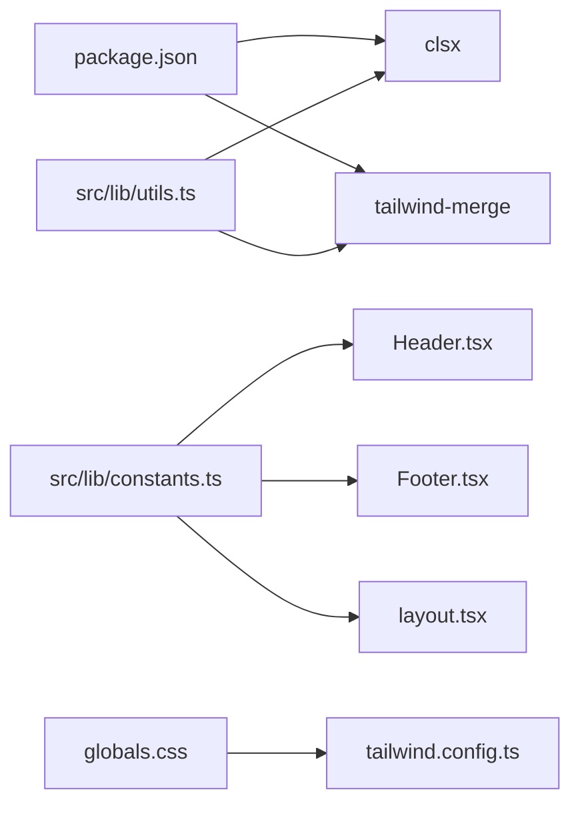

# Utilities and Helpers

<cite>
**Referenced Files in This Document**
- [utils.ts](file://src/lib/utils.ts)
- [constants.ts](file://src/lib/constants.ts)
- [Button.tsx](file://src/components/ui/Button.tsx)
- [Header.tsx](file://src/components/layout/Header.tsx)
- [Footer.tsx](file://src/components/layout/Footer.tsx)
- [layout.tsx](file://src/app/layout.tsx)
- [globals.css](file://src/app/globals.css)
- [package.json](file://package.json)
- [tailwind.config.ts](file://tailwind.config.ts)
- [login/page.tsx](file://src/app/login/page.tsx)
- [register/page.tsx](file://src/app/register/page.tsx)
</cite>

## Table of Contents
1. [Introduction](#introduction)
2. [Project Structure](#project-structure)
3. [Core Components](#core-components)
4. [Architecture Overview](#architecture-overview)
5. [Detailed Component Analysis](#detailed-component-analysis)
6. [Dependency Analysis](#dependency-analysis)
7. [Performance Considerations](#performance-considerations)
8. [Troubleshooting Guide](#troubleshooting-guide)
9. [Conclusion](#conclusion)

## Introduction
This document explains the SmartView Portal’s utility and helper modules, focusing on:
- CSS class merging utilities powered by clsx and tailwind-merge for robust, conflict-free dynamic styling.
- Centralized configuration via constants for site identity and navigation data.
- Utility function patterns, type safety, and performance optimization techniques.
- Practical usage examples, integration patterns with components, and best practices for extending the utility library.
- The relationship between utilities and the overall component architecture.

## Project Structure
The utility layer resides under src/lib and is consumed by components and pages across the app. The styling pipeline leverages Tailwind CSS with a content configuration that scans pages, components, and app directories.

**Diagram sources**
- [utils.ts:1-7](file://src/lib/utils.ts#L1-L7)
- [constants.ts:1-11](file://src/lib/constants.ts#L1-L11)
- [Button.tsx:1-54](file://src/components/ui/Button.tsx#L1-L54)
- [Header.tsx:1-131](file://src/components/layout/Header.tsx#L1-L131)
- [Footer.tsx:1-127](file://src/components/layout/Footer.tsx#L1-L127)
- [layout.tsx:1-33](file://src/app/layout.tsx#L1-L33)
- [globals.css:1-31](file://src/app/globals.css#L1-L31)
- [package.json:1-32](file://package.json#L1-L32)
- [tailwind.config.ts:1-20](file://tailwind.config.ts#L1-L20)
- [login/page.tsx:1-190](file://src/app/login/page.tsx#L1-L190)
- [register/page.tsx:1-382](file://src/app/register/page.tsx#L1-L382)

**Section sources**
- [utils.ts:1-7](file://src/lib/utils.ts#L1-L7)
- [constants.ts:1-11](file://src/lib/constants.ts#L1-L11)
- [globals.css:1-31](file://src/app/globals.css#L1-L31)
- [tailwind.config.ts:1-20](file://tailwind.config.ts#L1-L20)
- [package.json:1-32](file://package.json#L1-L32)

## Core Components
- CSS class merging utility cn:
  - Purpose: Merge Tailwind classes safely, resolving conflicts deterministically.
  - Implementation: Wraps clsx(inputs) with tailwind-merge to prevent duplicate or conflicting utilities.
  - Usage pattern: Accepts a spread of ClassValue inputs and returns a single optimized class string.
- Constants module:
  - Purpose: Centralizes site-wide configuration values and navigation data.
  - Exports: Site name, site description, and a structured NAV_LINKS array for navigation.

Key characteristics:
- Type safety: Uses ClassValue from clsx for strict typing of class inputs.
- Performance: tailwind-merge deduplicates and merges classes efficiently, minimizing CSS payload.
- Maintainability: Centralized constants reduce duplication and simplify updates.

**Section sources**
- [utils.ts:1-7](file://src/lib/utils.ts#L1-L7)
- [constants.ts:1-11](file://src/lib/constants.ts#L1-L11)

## Architecture Overview
The utility layer integrates with components and pages to provide consistent styling and configuration. The cn function is used broadly for conditional and variant-driven class composition, while constants are imported to render branding and navigation consistently across the app.

**Diagram sources**
- [utils.ts:4-6](file://src/lib/utils.ts#L4-L6)
- [Button.tsx:39-51](file://src/components/ui/Button.tsx#L39-L51)
- [Header.tsx:8-9](file://src/components/layout/Header.tsx#L8-L9)
- [Footer.tsx](file://src/components/layout/Footer.tsx#L3)

## Detailed Component Analysis

### CSS Class Merging Utility (cn)
- Function signature and behavior:
  - Accepts a spread of ClassValue inputs.
  - Returns a merged class string after applying clsx and tailwind-merge.
- Typical usage patterns:
  - Conditional classes based on state or props.
  - Composition of variant classes from component libraries.
  - Dynamic class toggles in responsive or interactive contexts.
- Integration examples:
  - Button component composes variant classes with additional className.
  - Header applies cn for responsive header styles and mobile menu transitions.
  - Registration page uses cn for role selection and strength indicator styling.

**Diagram sources**
- [utils.ts:4-6](file://src/lib/utils.ts#L4-L6)
- [Button.tsx:40-48](file://src/components/ui/Button.tsx#L40-L48)
- [Header.tsx:26-32](file://src/components/layout/Header.tsx#L26-L32)
- [register/page.tsx:109-123](file://src/app/register/page.tsx#L109-L123)

**Section sources**
- [utils.ts:1-7](file://src/lib/utils.ts#L1-L7)
- [Button.tsx:39-51](file://src/components/ui/Button.tsx#L39-L51)
- [Header.tsx:26-32](file://src/components/layout/Header.tsx#L26-L32)
- [register/page.tsx:109-123](file://src/app/register/page.tsx#L109-L123)

### Constants Module (Centralized Configuration)
- Exports:
  - Site identity: name and description.
  - Navigation links: structured array of label and href pairs.
- Usage patterns:
  - Rendering site branding and descriptions.
  - Generating navigation lists and highlighting active routes.
- Integration examples:
  - Header renders logo and navigation using constants.
  - Footer displays site description and links.

**Diagram sources**
- [constants.ts:1-11](file://src/lib/constants.ts#L1-L11)
- [Header.tsx:37-41](file://src/components/layout/Header.tsx#L37-L41)
- [Footer.tsx:26-35](file://src/components/layout/Footer.tsx#L26-L35)

**Section sources**
- [constants.ts:1-11](file://src/lib/constants.ts#L1-L11)
- [Header.tsx:37-41](file://src/components/layout/Header.tsx#L37-L41)
- [Footer.tsx:26-35](file://src/components/layout/Footer.tsx#L26-L35)

### Component Integration Patterns
- Button component:
  - Uses cva for variant and size definitions.
  - Composes className with cn(buttonVariants({ variant, size, className })).
  - Supports asChild for semantic composition with Next.js Link.
- Header component:
  - Imports cn for dynamic header and mobile menu classes.
  - Uses constants for branding and navigation.
  - Implements scroll-aware styling and responsive behavior.
- Login and Register pages:
  - Import cn for custom layouts and interactive elements.
  - Use constants for branding and navigation cues.

**Diagram sources**
- [Button.tsx:6-31](file://src/components/ui/Button.tsx#L6-L31)
- [Button.tsx:39-51](file://src/components/ui/Button.tsx#L39-L51)
- [utils.ts:4-6](file://src/lib/utils.ts#L4-L6)

**Section sources**
- [Button.tsx:1-54](file://src/components/ui/Button.tsx#L1-L54)
- [Header.tsx:1-131](file://src/components/layout/Header.tsx#L1-L131)
- [login/page.tsx:1-190](file://src/app/login/page.tsx#L1-L190)
- [register/page.tsx:1-382](file://src/app/register/page.tsx#L1-L382)

## Dependency Analysis
- External dependencies:
  - clsx: Provides ClassValue typing and class normalization.
  - tailwind-merge: Ensures deterministic merging and conflict resolution.
- Internal dependencies:
  - utils.ts is a singleton utility used by components and pages.
  - constants.ts is a shared configuration module imported across layout and page components.
- Tailwind integration:
  - Tailwind is configured to scan app, components, and pages directories.
  - CSS variables from globals.css integrate with Tailwind theme.

**Diagram sources**
- [package.json:11-19](file://package.json#L11-L19)
- [utils.ts:1-2](file://src/lib/utils.ts#L1-L2)
- [constants.ts:1-11](file://src/lib/constants.ts#L1-L11)
- [Header.tsx:8-9](file://src/components/layout/Header.tsx#L8-L9)
- [Footer.tsx](file://src/components/layout/Footer.tsx#L3)
- [layout.tsx:12-16](file://src/app/layout.tsx#L12-L16)
- [globals.css:1-31](file://src/app/globals.css#L1-L31)
- [tailwind.config.ts:4-8](file://tailwind.config.ts#L4-L8)

**Section sources**
- [package.json:11-19](file://package.json#L11-L19)
- [utils.ts:1-7](file://src/lib/utils.ts#L1-L7)
- [constants.ts:1-11](file://src/lib/constants.ts#L1-L11)
- [tailwind.config.ts:1-20](file://tailwind.config.ts#L1-L20)

## Performance Considerations
- Prefer cn for dynamic class composition to avoid redundant or conflicting Tailwind utilities.
- Keep variant sets concise and reuse cva definitions to minimize runtime class computation.
- Use className composition thoughtfully; pass minimal, focused inputs to cn to reduce merge overhead.
- Centralize configuration in constants to avoid repeated string literals and improve caching of rendered markup.

## Troubleshooting Guide
- Unexpected class overrides:
  - Ensure tailwind-merge is applied after clsx normalization.
  - Verify that later arguments in cn(...) override earlier ones as intended.
- Missing or incorrect styles:
  - Confirm Tailwind content paths include the relevant directories.
  - Check that CSS variables in globals.css align with Tailwind theme configuration.
- Navigation inconsistencies:
  - Validate NAV_LINKS entries and ensure hrefs match routing expectations.
  - Confirm active-state logic compares against current path correctly.

**Section sources**
- [utils.ts:4-6](file://src/lib/utils.ts#L4-L6)
- [globals.css:26-30](file://src/app/globals.css#L26-L30)
- [tailwind.config.ts:4-8](file://tailwind.config.ts#L4-L8)
- [Header.tsx:46-59](file://src/components/layout/Header.tsx#L46-L59)

## Conclusion
The SmartView Portal’s utilities and helpers provide a robust, type-safe foundation for dynamic styling and centralized configuration. The cn function ensures clean, conflict-free class merging, while the constants module simplifies branding and navigation maintenance. By following the documented patterns and best practices, developers can extend the utility library confidently and maintain consistent, performant UI components across the application.