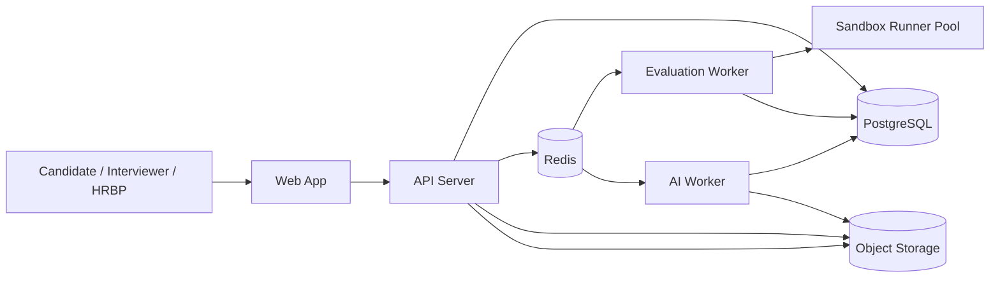

# AI 开放式面试评估平台技术方案 v1.0（阶段 A）

## 0. 文档信息

- 对应产品文档：`PRD.md`
- 文档目标：指导研发团队在 0-8 周内完成 MVP 技术落地
- 适用范围：研发招聘（前端/后端/测试/DevOps）
- 文档类型：架构设计 + 数据设计 + 接口设计 + 交付计划

## 1. 设计目标与约束

### 1.0 核心设计理念

**评估工具使用能力，而非限制工具使用**

本系统的核心理念是：现代软件开发工作本质上是"人+工具"的协作，面试评估应该反映这一现实。

**技术实现原则**：
- **不做反作弊系统**：不限制候选人使用 AI、搜索引擎、文档等任何工具
- **过程数据采集**：系统重点记录候选人如何使用工具解决问题的完整过程
- **多维度评估**：评估不仅看结果（代码正确性），更看过程（问题理解、方案权衡、迭代调试、工具协作）
- **证据可追溯**：所有评分必须有可定位的证据支撑（提交版本、行为轨迹、思考记录）

**架构影响**：
- 提交系统需要记录版本演进、改动理由、工具使用轨迹
- AI 评估需要分析过程质量，而非仅结果质量
- 面试官复核台需要提供完整的过程回放能力

### 1.1 设计目标

1. 跑通"出题-作答-评估-复核-报告"全链路。
2. 确保评分可解释、可回放、可审计。
3. 在 8 周内以可控复杂度上线 MVP，优先稳定与可维护。
4. 支持后续扩展到数据/算法和非研发岗位。

### 1.2 非目标

1. 阶段 A 不做多模态（语音/白板）实时分析。
2. 阶段 A 不做复杂微服务拆分与多区域部署。
3. 阶段 A 不引入完全自动决策，保留面试官最终裁决。

### 1.3 关键技术约束

- 安全：候选人代码执行必须与业务系统隔离。
- 合规：授权、访问、调分和导出行为全量留痕。
- 性能：题包生成、评测、报告输出需满足 P95 指标。
- 可追责：每个分数都要能映射到规则、证据和操作者。

## 2. 总体技术架构

### 2.1 架构策略（阶段 A）

采用“模块化单体 + 独立评测 Worker + 沙箱执行器”的架构：

- 平台核心能力（岗位建模、题库、会话、复核、报告、审计）集中在一个后端服务，降低早期协作和运维复杂度。
- 自动评测与 AI 质评通过异步任务执行，避免阻塞在线交互。
- 候选人代码在独立沙箱节点执行，和核心服务网络隔离。

该方案能在 8 周内快速上线，同时为后续按域拆分服务预留边界。

### 2.2 逻辑组件

1. `web-app`：候选人工作台、面试官复核台、运营与管理后台。
2. `api-server`：统一 API、权限鉴权、业务编排、数据访问。
3. `evaluation-worker`：客观评测任务消费与结果汇总。
4. `ai-worker`：结构化 AI 质评、置信度计算、报告草稿生成。
5. `sandbox-runner`：容器沙箱执行代码，返回测试与资源数据。
6. `postgres`：业务主库（事务、审计、配置、评分结果）。
7. `redis`：队列、限流、短期缓存、幂等键。
8. `object-storage`：提交快照、运行日志、导出报告归档。

### 2.3 技术选型

| 层级 | 技术 | 选型理由 |
|---|---|---|
| 前端 | Next.js + TypeScript | 支持多角色工作台、SSR/CSR 混合、工程成熟 |
| 后端 | NestJS + TypeScript | 模块化强、适合 DDD 分层、团队上手快 |
| 数据库 | PostgreSQL | 强事务、JSONB 灵活、审计场景友好 |
| 队列 | Redis + BullMQ | 接入简单，满足 MVP 异步任务需求 |
| 沙箱 | Docker + cgroup + seccomp | MVP 快速落地；后续可升级 gVisor/Firecracker |
| 对象存储 | MinIO/S3 | 存放提交快照、日志、导出文件 |
| 可观测 | OpenTelemetry + Prometheus + Grafana | 链路追踪、指标告警、容量分析 |

### 2.4 部署拓扑（生产）



## 3. 领域模块设计

`api-server` 按领域拆分模块，统一走应用层编排：

1. `auth`：登录、SSO、RBAC、会话管理。
2. `position-modeling`：岗位模板、能力项、评分权重版本。
3. `question-bank`：锚点题、个性化模板、验收标准。
4. `question-package`：按 70/30 规则生成题包。
5. `interview-session`：候选人面试会话、状态机与时间线。
6. `submission`：文本/代码/Prompt 提交记录与版本快照。
7. `evaluation`：客观评测任务、结果聚合、硬门槛判定。
8. `ai-assessment`：五段式输出、低置信度标识、证据绑定。
9. `review`：面试官追问、调分、最终裁决。
10. `reporting`：候选人报告、岗位对比、导出。
11. `compliance-audit`：授权、访问日志、调分审计、生命周期治理。

## 4. 核心流程与状态机

### 4.1 面试会话主流程

1. 创建会话：生成题包并冻结评分版本。
2. 候选人授权：写入授权记录，未授权不可作答。
3. 开始作答：提交多个版本（方案/代码/Prompt）。
4. 自动评测：异步执行客观评测并出分。
5. AI 质评：输出 issue/evidence/fix/impact/confidence。
6. 面试官复核：回放证据、追问、调分并给裁决。
7. 生成报告：沉淀能力画像、风险项与岗位匹配建议。

### 4.2 会话状态机

`draft -> pending_consent -> in_progress -> evaluating -> reviewing -> decided -> archived`

异常状态：

- `evaluation_failed`：评测失败，可重试并保留轨迹。
- `manual_hold`：低置信度或争议样本进入双复核。

### 4.3 评分计算规则

```text
auto_score: 0-100
ai_score: 0-100
interviewer_score: 0-100

final_score = auto_score * 0.4 + ai_score * 0.2 + interviewer_score * 0.4

Gate 条件：
1) 关键功能缺失 = false
2) 隐藏用例通过率 >= 岗位阈值
3) 严重安全/稳定性错误 = false

建议结论：
pass_when = Gate=true AND final_score>=70 AND interviewer_score>=60
```

## 5. 数据模型设计（PostgreSQL）

### 5.1 核心实体

| 表名 | 说明 | 关键字段 |
|---|---|---|
| `users` | 用户与角色主体 | id, name, email, role, org_id |
| `positions` | 岗位定义 | id, title, level, stack, status |
| `competency_models` | 能力模型版本 | id, position_id, version, rubric_json |
| `questions` | 题库题目 | id, type(anchor/custom), difficulty, spec_json |
| `question_packages` | 题包 | id, position_id, candidate_id, composition_json |
| `interview_sessions` | 面试会话 | id, candidate_id, status, started_at, ended_at |
| `submissions` | 提交版本 | id, session_id, version_no, content_ref, thought_process, iteration_reason, ai_prompts_used, submitted_at |
| `evaluation_jobs` | 评测任务 | id, session_id, submission_id, status, retry_count |
| `evaluation_results` | 客观评测结果 | id, job_id, score, gate_flags_json, metrics_json |
| `ai_assessments` | AI 结构化评估 | id, session_id, model_version, items_json, process_quality_json, confidence |
| `reviews` | 面试官复核 | id, session_id, reviewer_id, score, decision |
| `score_adjustments` | 调分记录 | id, review_id, dimension, delta, reason, evidence |
| `final_decisions` | 最终结论 | id, session_id, owner_id, final_score, result |
| `consents` | 授权记录 | id, candidate_id, scope_json, consented_at |
| `audit_logs` | 审计日志 | id, actor_id, action, target_type, target_id, payload |

### 5.2 索引与约束（关键）

- `interview_sessions(candidate_id, status)` 复合索引。
- `submissions(session_id, version_no)` 唯一约束，保证版本单调递增。
- `evaluation_jobs(submission_id)` 唯一约束，防止重复评测。
- `audit_logs(created_at, actor_id)` 分区或时间索引，支持高频检索。
- `consents(candidate_id, consented_at)` 索引，用于授权审计。

### 5.3 数据保留策略

- `submissions`、`evaluation_results` 默认保留 180 天。
- `audit_logs` 默认保留 365 天（按合规要求可调）。
- 到期清理采用定时任务 + 删除审计记录双写。

### 5.4 submissions 表详细设计

支持工具使用行为记录的核心表结构：

```sql
CREATE TABLE submissions (
  id VARCHAR(64) PRIMARY KEY,
  session_id VARCHAR(64) NOT NULL REFERENCES interview_sessions(id),
  question_id VARCHAR(64) NOT NULL REFERENCES questions(id),
  version_no INTEGER NOT NULL,

  -- 代码内容
  content_type VARCHAR(32) NOT NULL, -- 'code', 'design', 'text'
  content_ref TEXT NOT NULL, -- 对象存储引用或直接内容
  language VARCHAR(32), -- 'typescript', 'python', 'java', etc.

  -- 过程记录（新增）
  thought_process TEXT, -- 本次提交的思考说明
  iteration_reason TEXT, -- 相比上一版本的改动理由
  ai_prompts_used JSONB, -- AI工具使用记录 [{prompt, timestamp}]

  -- 元数据
  notes TEXT,
  submitted_at TIMESTAMP NOT NULL DEFAULT NOW(),

  -- 约束
  UNIQUE(session_id, version_no),
  CHECK(version_no > 0)
);

CREATE INDEX idx_submissions_session ON submissions(session_id, version_no);
CREATE INDEX idx_submissions_timestamp ON submissions(submitted_at);
```

### 5.5 ai_assessments 表详细设计

支持工具使用能力评估的AI评估表：

```sql
CREATE TABLE ai_assessments (
  id VARCHAR(64) PRIMARY KEY,
  session_id VARCHAR(64) NOT NULL REFERENCES interview_sessions(id),
  question_id VARCHAR(64) NOT NULL REFERENCES questions(id),

  -- 模型信息
  model_provider VARCHAR(64) NOT NULL, -- 'anthropic', 'openai', etc.
  model_name VARCHAR(128) NOT NULL,
  model_version VARCHAR(64),
  prompt_version VARCHAR(32) NOT NULL,

  -- 五段式评估
  items_json JSONB NOT NULL, -- [{issue, evidence, fix, impact, confidence}]
  overall_confidence DECIMAL(3,2) NOT NULL CHECK(overall_confidence BETWEEN 0 AND 1),

  -- 过程质量评估（新增）
  process_quality_json JSONB, -- {problem_clarification, solution_tradeoffs, debugging_iteration, tool_collaboration}

  -- 元数据
  assessed_at TIMESTAMP NOT NULL DEFAULT NOW(),
  processing_time_ms INTEGER,

  UNIQUE(session_id, question_id)
);

CREATE INDEX idx_ai_assessments_session ON ai_assessments(session_id);
CREATE INDEX idx_ai_assessments_confidence ON ai_assessments(overall_confidence);
```

## 6. API 设计（REST v1）

### 6.1 通用约定

- 基础路径：`/api/v1`
- 鉴权：`Authorization: Bearer <token>`
- 幂等：写接口支持 `Idempotency-Key`
- 追踪：响应头包含 `X-Request-Id`
- 错误格式统一：`{ code, message, details, requestId }`

### 6.2 核心接口清单

### 岗位与能力模型

- `POST /positions`
- `GET /positions/{id}`
- `POST /positions/{id}/competency-models`
- `POST /positions/{id}/publish`

### 题库与题包

- `POST /questions`
- `POST /question-packages/generate`
- `GET /question-packages/{id}`

### 面试会话与提交

- `POST /sessions`
- `POST /sessions/{id}/consent`
- `POST /sessions/{id}/submissions`
- `GET /sessions/{id}/timeline`
- `GET /sessions/{id}/iteration-timeline` (新增：可视化迭代过程)

### 评测与 AI 质评

- `POST /sessions/{id}/evaluate`
- `GET /sessions/{id}/evaluation-result`
- `POST /sessions/{id}/ai-assess`
- `GET /sessions/{id}/ai-assessment`

### 复核与结论

- `POST /sessions/{id}/reviews`
- `POST /sessions/{id}/score-adjustments`
- `POST /sessions/{id}/final-decision`

### 报告与审计

- `GET /reports/candidates/{candidateId}`
- `GET /reports/positions/{positionId}`
- `GET /audit-logs?sessionId=...`

### 6.3 示例：提交后触发评测

```http
POST /api/v1/sessions/S123/submissions
Content-Type: application/json
Idempotency-Key: 7f0b1d7a-2c5d-47f8-a8bd-0f6f5b5f2901

{
  "type": "code",
  "language": "typescript",
  "content": "...",
  "thoughtProcess": "发现并发场景下可能出现库存超卖，需要引入乐观锁机制",
  "iterationReason": "v2版本在高并发测试中失败，本次增加version字段和CAS更新",
  "aiPromptsUsed": [
    {
      "prompt": "如何在TypeScript中实现乐观锁？",
      "timestamp": "2026-02-16T10:23:45Z"
    },
    {
      "prompt": "帮我review这段并发控制代码",
      "timestamp": "2026-02-16T10:28:12Z"
    }
  ],
  "notes": "v3 修复并发问题"
}
```

```json
{
  "submissionId": "SUB-003",
  "version": 3,
  "nextAction": "evaluation_queued",
  "requestId": "req_01J..."
}
```

### 6.4 示例：获取迭代时间线

```http
GET /api/v1/sessions/S123/iteration-timeline
```

```json
{
  "sessionId": "S123",
  "timeline": [
    {
      "version": 1,
      "submittedAt": "2026-02-16T10:15:30Z",
      "thoughtProcess": "实现基础的库存扣减逻辑",
      "testResults": {
        "passed": 5,
        "failed": 2,
        "failedCases": ["concurrent_update_1", "concurrent_update_2"]
      }
    },
    {
      "version": 2,
      "submittedAt": "2026-02-16T10:25:12Z",
      "thoughtProcess": "发现并发场景下可能出现库存超卖，需要引入乐观锁机制",
      "iterationReason": "v1在并发测试中失败，需要增加并发控制",
      "aiPromptsUsed": [
        {
          "prompt": "如何在TypeScript中实现乐观锁？",
          "timestamp": "2026-02-16T10:23:45Z"
        }
      ],
      "testResults": {
        "passed": 6,
        "failed": 1,
        "failedCases": ["high_concurrency_stress"]
      }
    },
    {
      "version": 3,
      "submittedAt": "2026-02-16T10:35:48Z",
      "thoughtProcess": "优化CAS更新逻辑，增加重试机制",
      "iterationReason": "v2版本在高并发测试中失败，本次增加version字段和CAS更新",
      "aiPromptsUsed": [
        {
          "prompt": "帮我review这段并发控制代码",
          "timestamp": "2026-02-16T10:28:12Z"
        }
      ],
      "testResults": {
        "passed": 7,
        "failed": 0
      }
    }
  ],
  "summary": {
    "totalVersions": 3,
    "totalDuration": "20m18s",
    "iterationPattern": "progressive_improvement",
    "keyInsights": [
      "候选人在v1失败后快速识别并发问题",
      "有效使用AI工具辅助理解乐观锁实现",
      "迭代路径清晰，每次改进都有明确目标"
    ]
  }
}
```

## 7. 自动评测引擎设计

### 7.1 评测任务结构

每个评测任务包含：

- 运行语言与版本（如 Node.js 20 / Python 3.11）
- 样例用例集合
- 隐藏用例集合
- 边界用例集合
- 复杂度与性能规则（时间、内存、响应阈值）

### 7.2 沙箱执行策略

1. 每次评测创建一次性容器，禁止复用。
2. 默认禁网（`--network=none`），限制 CPU/内存/进程数。
3. 只挂载只读题目资源和候选人提交目录。
4. 执行超时后强制终止，记录 `timeout` 原因码。
5. 收集 stdout/stderr、资源使用、用例通过详情。

### 7.3 工具使用行为记录

系统记录候选人使用工具的行为轨迹，用于评估工具协作能力：

- 记录每次提交的时间戳、版本号、改动说明。
- 记录测试执行次数与结果变化。
- 可选记录 AI 工具使用情况（prompt、迭代过程）。
- 生成可视化的迭代时间线，供面试官复核参考。

**设计理念**：不限制工具使用，而是评估候选人如何有效利用工具解决问题。

## 8. AI 结构化评估设计

### 8.1 评估输入

- 题目与验收标准
- 候选人多版本提交与变更摘要
- 自动评测结果与失败用例
- 追问记录（如有）
- 工具使用行为轨迹（prompt 历史、迭代时间线、思考记录）

### 8.2 输出协议

#### 8.2.1 核心评估（五段式）

严格使用五段式：`issue/evidence/fix/impact/confidence`。

- `evidence` 必须引用可定位证据（提交版本、行号、用例 ID）。
- `confidence` 小于 0.6 时，自动打上 `manual_hold` 标签。
- 输出必须通过 JSON Schema 校验后入库。

#### 8.2.2 工具使用能力评估（新增）

评估候选人如何使用工具解决问题，包含以下维度：

- **问题理解与澄清**：是否识别关键约束、拆解目标、提出有效问题
- **方案设计与权衡**：是否考虑多种方案、给出取舍理由、识别风险
- **迭代与调试能力**：遇到错误如何定位、如何收敛、是否能自我纠错
- **工具协作质量**：prompt 是否清晰、是否能让 AI 产出可控结果、是否能识别并纠正 AI 幻觉

每个维度输出 0-1 分数和证据引用（指向具体提交版本、时间点、行为记录）。

### 8.3 模型治理

- 记录 `model_provider`、`model_name`、`prompt_version`、`temperature`。
- 同一会话评估结果可重放（输入快照固定）。
- 模型调用失败触发降级：使用规则模板生成基础报告并提示人工复核。

## 9. 权限、安全与合规实现

### 9.1 RBAC 权限矩阵（摘要）

- 候选人：仅访问本人会话与授权页。
- 面试官：访问被分配候选人的评估与复核页面。
- 用人经理：可查看所属岗位全部候选人并做最终裁决。
- 合规角色：只读访问审计日志与授权记录。

### 9.2 安全控制

- 全链路 TLS；敏感字段（手机号、邮箱）加密存储。
- API 网关限流与 IP 风险策略。
- 登录支持企业 SSO，关键操作二次确认。
- 调分、导出、删除请求均写入不可变审计日志。

### 9.3 生命周期治理

- 到期清理任务每日执行，失败自动重试并告警。
- 删除申请采用双人审批（业务负责人 + 合规）。
- 合规导出提供脱敏选项并记录导出用途。

## 10. 可观测性与运维

### 10.1 指标体系

- 业务指标：会话完成率、评测成功率、AI 低置信度占比。
- 性能指标：接口 P95、评测队列等待时长、沙箱执行时长。
- 质量指标：Gate 触发率、人工调分率、评分偏差。

### 10.2 日志与追踪

- 每个请求生成 `request_id`，跨 API、Worker、Runner 透传。
- 关键业务事件写结构化日志（JSON）。
- 错误分级（P0/P1/P2）并配置告警策略。

### 10.3 备份与恢复

- PostgreSQL 每日全量备份 + 15 分钟增量 WAL 归档。
- 对象存储版本控制开启，保留 30 天。
- 恢复演练每月一次，RTO <= 2h，RPO <= 15min。

## 11. 测试与质量保障

### 11.1 测试分层

- 单元测试：领域服务、评分计算、Gate 规则。
- 集成测试：API + DB + Redis + Worker。
- 端到端测试：典型流程（创建会话到报告产出）。

### 11.2 AI 评估质量验证

- 构建基准样本集（每岗位至少 50 题 x 多档答案）。
- 校验五段式完整率、证据命中率、低置信度召回率。
- 每次模型或 Prompt 变更必须回归评估。

### 11.3 发布门禁

- 阶段 A 门禁：核心流程 E2E 全绿、P95 达标、审计链路可回放。
- 灰度发布：按岗位或业务线逐步放量。

## 12. 工程结构建议（Monorepo）

```text
apps/
  web-app/
  api-server/
  evaluation-worker/
  ai-worker/
  sandbox-runner/
packages/
  shared-types/
  scoring-engine/
  audit-sdk/
infra/
  docker/
  k8s/
  observability/
docs/
  PRD.md
  TECHNICAL_DESIGN.md
```

## 13. 8 周交付计划（阶段 A）

### 周 1-2：基础能力

- 完成权限、岗位模型、题库基础表结构与 API。
- 搭建会话状态机与提交留痕。
- 输出首批锚点题配置规范。

### 周 3-4：评测闭环

- 接入队列和评测 Worker。
- 完成沙箱执行器最小闭环与资源限制。
- 打通自动评测结果入库与 Gate 判定。

### 周 5-6：AI 质评与复核

- 上线五段式 AI 质评与 JSON Schema 校验。
- 完成面试官复核、调分、最终裁决流程。
- 实现报告中心候选人画像页。

### 周 7-8：合规与试跑

- 完成授权、审计、到期清理任务。
- 建立看板与告警，执行压测和故障演练。
- 在 1-2 个业务线灰度试跑并复盘。

## 14. 风险与缓解

| 风险 | 影响 | 缓解措施 |
|---|---|---|
| 沙箱逃逸或资源滥用 | 高 | 禁网执行、最小权限容器、独立节点隔离 |
| AI 输出不稳定 | 中高 | Schema 校验、低置信度强制复核、版本化回放 |
| 评分一致性不足 | 高 | 锚点题覆盖、校准看板、调分审计闭环 |
| MVP 范围膨胀 | 高 | 严格限定岗位与题型，需求变更走评审 |

## 15. 阶段 A 验收清单

1. 全链路可用：出题、作答、评测、复核、报告全部可跑通。
2. 评分可解释：任一结论可回放到具体证据与规则。
3. 合规可审计：授权、访问、调分、删除操作均可追溯。
4. 性能达标：PRD 约定的 P95 指标满足上线标准。
5. 可扩展：已预留岗位扩展和服务拆分边界。
